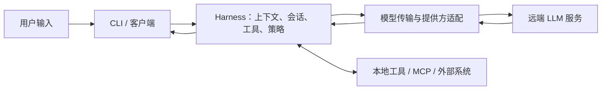

# 调研范围、版本与证据标准

本调研回答：用户在终端或集成入口提交内容后，Codex、Gemini CLI、Claude Code 怎样把输入变成模型请求，怎样把模型输出变成界面事件，怎样执行工具并继续下一次模型请求。调研日期为 **2026-09-23（Asia/Shanghai）**。

## 1. 比较的对象

这里的 agent 框架指三个产品中的 **agent harness（模型外围的执行系统）**，不是模型本身，也不是把 OpenAI Agents SDK、Google ADK、Anthropic Messages SDK 当作三个产品的实现。



考察重点是本地 CLI 与公开可验证的集成边界。Codex Desktop 的私有界面、各产品的托管云控制面、服务端提示词加工、模型训练、tokenizer 和 GPU 推理内核均不在源码验证范围内。图中的 LLM 是外部服务；不声称已经解释其内部如何生成 token。

## 2. 四种证据等级

| 标记 | 含义 | 可以得出的结论 |
|---|---|---|
| **[S]** | 实际阅读了固定 Git 提交的官方源码 | 文件、符号、调用顺序和分支条件在该快照中成立 |
| **[D]** | 官方产品或 API 文档描述 | 官方声明的行为或协议；不能反推未公开函数、线程或数据结构 |
| **[I]** | 基于证据的分析、抽象或建议 | 解释工程含义；不冒充产品原生术语或实现 |
| **[U]** | 当前证据无法确认 | 保留未知，尤其是 Claude Code 闭源核心和云端实现 |

每篇实现文档有证据表；源码链接使用完整提交 SHA 与行号，而不是会漂移的 `main`。图表是研究者对相关路径的抽象，不是产品官方架构图。Claude Code 图中特别画出公开 SDK 与不可见 CLI 核心的边界。

## 3. 版本口径

源码以抓取时的默认分支 HEAD 为研究快照，不宣称它就是所有用户安装的稳定版本。完整 SHA、提交时间、包内版本、抓取时间记录在 `sources/*.json` 和各实现文档中。应分别理解：

- **提交时间**：被研究源码最近一次提交的时间。
- **抓取时间**：本次取得快照的时间；UTC 日期可能比上海日期早一天。
- **包版本**：可能是 nightly 或占位版本，不一定编码 HEAD。
- **官网文档**：持续更新，不与这些源码 SHA 自动对应。尤其要区分 Claude Code 公开资料仓库、Agent SDK 版本和 SDK 所捆绑 CLI 版本。

本次没有调用付费模型做实测，没有跑三个产品的完整端到端测试，也没有从安装包逆向重建闭源核心。结论来自源码追踪与官方文档交叉核对。性能章节只能描述影响延迟、成本与吞吐的机制，不能据此排名模型质量或响应速度。

## 4. 沿数据与控制流阅读

统一追踪下列九个问题，而不是按照各仓库目录逐个介绍模块：

1. 输入在何处接收、分流；哪些命令不需要模型？
2. 文本、文件引用、图片、项目规则和技能如何进入上下文？
3. 谁拥有会话、历史与一次用户任务的循环？
4. 模型请求中的 instructions/messages/contents、工具定义在哪里构造？
5. 客户端与运行核心的传输、核心与 LLM 的传输各是什么？
6. 流式增量怎样变成稳定消息和可显示事件？
7. 工具何时可以执行，谁验证参数、做权限判断和实际调度？
8. 工具结果怎样回写，什么条件会启动下一次模型请求？
9. 如何取消、重试、压缩、持久化与恢复？

“工具调用”“一次模型响应”“一次用户任务”是三个不同的边界。用户请求修复测试，可能产生多次模型请求、多条文本消息和多次工具调用。不能看到文本、单次流结束或一个工具完成，就宣布任务结束。

## 5. 可复现性与交付物

`sources/` 保存版本和证据元数据，`diagrams/` 保存 Mermaid 原稿与渲染后的 SVG，`docs/` 保存中文说明。`index.html` 是可离线打开的完整阅读版，图形不依赖在线 Mermaid CDN。`.cache/` 是被 Git 忽略的官方仓库快照与构建依赖，不属于需要提交的报告正文。

重新获取源码时应检出 `sources/*.json` 所列 SHA，而不是重新使用 HEAD。可以使用以下模板；URL、目录和 SHA 从元数据中取值：

```bash
git clone --filter=blob:none REPOSITORY_URL TARGET_DIRECTORY
git -C TARGET_DIRECTORY checkout --detach FULL_COMMIT_SHA
```

交付前检查 Markdown 围栏、相对文件链接、固定源码路径和行号、Mermaid 语法，以及阅读版的页面和图形布局。网络文档链接仅证明调研时可访问；未来页面变化仍需重新核实。
