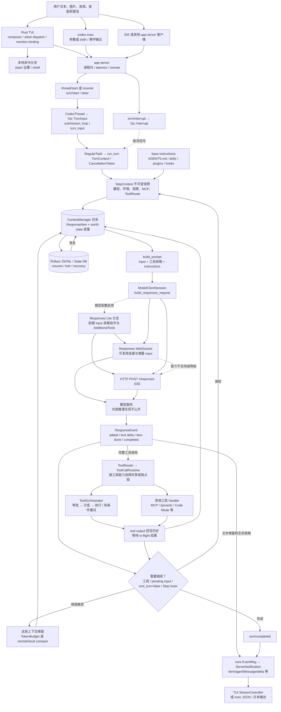
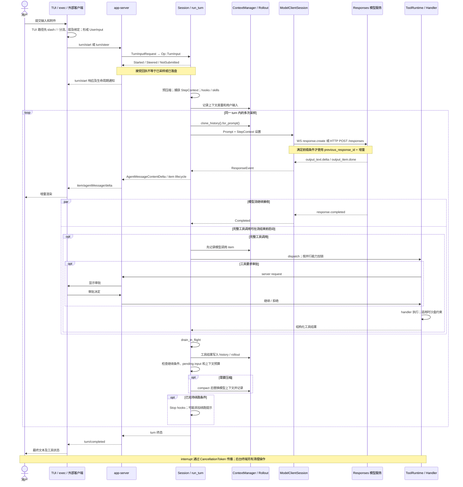

# OpenAI Codex：从用户输入到 LLM 输出的实现

> 研究基线：公开仓库 `openai/codex` 的 **`2c087a0cc2ef1d731086a1d0cb0081bdd792cc4d`**，提交时间 2026-09-22 16:16:15 UTC；抓取核对时间 2026-09-22 16:24:56 UTC（上海时间 2026-09-23）。本报告通过实际克隆和静态源码阅读形成，没有编译或性能测试。Cargo 的 `0.0.0`、npm wrapper 的 `0.0.0-dev` 是开发占位值，不能当作发行版号。
>
> 证据标记：**[S]** 当前固定提交源码；**[D]** 官方文档；**[I]** 基于已证实实现作出的分析；**[U]** 公开材料无法确认。完整机器可读索引见 [sources/codex.json](../sources/codex.json)。

## 1. 核心结论与研究边界

**[S] 当前 Codex 是围绕 app-server 协议统一前端、以 Rust core 执行有状态 agent loop 的系统。** 普通终端 TUI、非交互 `codex exec`、外部集成入口都能汇入 app-server，再由 core 管理线程、回合、上下文、模型采样与工具调用。不能照搬早期 TypeScript 实现，也不能把旧版“Rust TUI 直接提交 `Op::UserTurn` 到 `core/src/codex.rs`”当作本次实现：当前入口用 app-server-client，核心已拆到 `core/src/session/`，操作是 `Op::TurnInput`。[C01](https://github.com/openai/codex/blob/2c087a0cc2ef1d731086a1d0cb0081bdd792cc4d/codex-rs/cli/src/main.rs#L112-L173)、[C02](https://github.com/openai/codex/blob/2c087a0cc2ef1d731086a1d0cb0081bdd792cc4d/codex-rs/tui/src/lib.rs#L307-L340)、[C03](https://github.com/openai/codex/blob/2c087a0cc2ef1d731086a1d0cb0081bdd792cc4d/codex-rs/tui/src/lib.rs#L512-L568)、[C04](https://github.com/openai/codex/blob/2c087a0cc2ef1d731086a1d0cb0081bdd792cc4d/codex-rs/exec/src/lib.rs#L950-L980)、[C05](https://github.com/openai/codex/blob/2c087a0cc2ef1d731086a1d0cb0081bdd792cc4d/codex-rs/exec/src/lib.rs#L1134-L1288)、[C12](https://github.com/openai/codex/blob/2c087a0cc2ef1d731086a1d0cb0081bdd792cc4d/codex-rs/protocol/src/protocol.rs#L580-L645)

**[D]** 官方把 app-server 定义为供 IDE 等丰富客户端使用的接口；thread、turn、item 是其外部对象模型。**[S]** 本次源码还证明 TUI 与 exec 也使用该接口；这项结论来自实际调用，不能只靠文档产品定位推导。[官方 app-server 文档](https://learn.chatgpt.com/docs/app-server?translationFallback=zh-Hans)。

本报告覆盖“用户提交—本地编排—模型 API—流式回显—工具结果反馈—回合结束”的闭环。**[U]** 模型服务内部的分词、注意力计算、隐藏推理和服务端调度不在该开源仓库中；下图的模型服务因此保留为系统边界。也不把实验特性的存在等同于所有用户默认开启。

## 2. 实现架构图

可编辑图源：[codex-architecture.mmd](../diagrams/codex-architecture.mmd)。图是对源码的模块关系归纳 **[I]**；具体连线由下文证据支撑。图中的 app-server 与 Responses WebSocket 是两段不同的协议边界。



## 3. 输入并不是直接拼成一条 prompt

### 3.1 前端先判断输入的语义

**[S]** Rust CLI 无子命令进入交互入口；TUI 的 `AppServerTarget` 区分 Embedded、LocalDaemon、Remote。连接 daemon 失败时是否回落 embedded 由配置决定。Embedded 是进程内 app-server client，并不意味着一定启动额外子进程。exec 也显式创建 `InProcessAppServerClient`，再发送 `ClientRequest::TurnStart`。[C01](https://github.com/openai/codex/blob/2c087a0cc2ef1d731086a1d0cb0081bdd792cc4d/codex-rs/cli/src/main.rs#L112-L173)、[C02](https://github.com/openai/codex/blob/2c087a0cc2ef1d731086a1d0cb0081bdd792cc4d/codex-rs/tui/src/lib.rs#L307-L340)、[C03](https://github.com/openai/codex/blob/2c087a0cc2ef1d731086a1d0cb0081bdd792cc4d/codex-rs/tui/src/lib.rs#L512-L568)、[C04](https://github.com/openai/codex/blob/2c087a0cc2ef1d731086a1d0cb0081bdd792cc4d/codex-rs/exec/src/lib.rs#L950-L980)、[C05](https://github.com/openai/codex/blob/2c087a0cc2ef1d731086a1d0cb0081bdd792cc4d/codex-rs/exec/src/lib.rs#L1134-L1288)

**[S]** TUI 对 slash 命令先做分发：部分命令修改设置或触发 UI，有参数的命令也可能再进入普通提交链。允许 shell escape 时，`!cmd` 直接走用户 shell 命令操作。因此“每次按 Enter 都立即调用 LLM”并不成立。普通输入先形成 `UserMessage`，携带附件、文本元素和 mention bindings。[C07](https://github.com/openai/codex/blob/2c087a0cc2ef1d731086a1d0cb0081bdd792cc4d/codex-rs/tui/src/chatwidget/slash_dispatch.rs#L43-L84)、[C08](https://github.com/openai/codex/blob/2c087a0cc2ef1d731086a1d0cb0081bdd792cc4d/codex-rs/tui/src/chatwidget/input_submission.rs#L219-L249)

**[S]** 核心 `UserInput` 不是一个字符串，而是 `Text / Image / LocalImage / Audio / LocalAudio / Skill / Mention` 的带标签联合。Text 的 `text_elements` 保存 UTF-8 字节范围与显示占位符；本地图片和音频在请求序列化阶段转换。技能、插件和连接器提及会被绑定到确定路径或 `app://`、`plugin://` 标识，避免只凭自然语言名称猜目标。TUI 随后组装 `AppCommand::user_turn`。**[I]** 因而对 `@`、技能或附件的分析必须拆开“界面输入标记”和“模型实际收到的内容”，不能假定所有提及都等价于完整文件正文展开。[C06](https://github.com/openai/codex/blob/2c087a0cc2ef1d731086a1d0cb0081bdd792cc4d/codex-rs/protocol/src/user_input.rs#L12-L57)、[C09](https://github.com/openai/codex/blob/2c087a0cc2ef1d731086a1d0cb0081bdd792cc4d/codex-rs/tui/src/chatwidget/input_submission.rs#L286-L394)

### 3.2 请求接收与真正执行有不同完成点

**[S]** TUI 的 session 适配器发送 `turn/start` 或 `turn/steer`；app-server 将 V2 输入转换为 core 输入，并把 cwd、模型、推理设置、审批/沙盒、输出 schema 等整理为 `TurnInputRequest`。请求进入 `CodexThread.start_or_steer_turn`，最终经 `Op::TurnInput` 和提交队列送给 `turn_input::handle`。[C10](https://github.com/openai/codex/blob/2c087a0cc2ef1d731086a1d0cb0081bdd792cc4d/codex-rs/tui/src/app_server_session.rs#L1284-L1380)、[C11](https://github.com/openai/codex/blob/2c087a0cc2ef1d731086a1d0cb0081bdd792cc4d/codex-rs/app-server/src/request_processors/turn_processor.rs#L610-L683)、[C12](https://github.com/openai/codex/blob/2c087a0cc2ef1d731086a1d0cb0081bdd792cc4d/codex-rs/protocol/src/protocol.rs#L580-L645)、[C13](https://github.com/openai/codex/blob/2c087a0cc2ef1d731086a1d0cb0081bdd792cc4d/codex-rs/core/src/session/handlers.rs#L411-L493)

**[S]** core 返回 `Started / Steered / NotSubmitted` 时，尚不等待 user-prompt hooks、模型上下文更新、rollout 落盘或采样完成。运行中的用户新输入因此既可能 steer 当前 turn，也可能因状态或路由条件被拒绝。**[I]** app-server 的请求成功回执应该理解为输入路由已被接受，实际工作进展要继续消费事件流；它不是“LLM 已执行”的证明。[C14](https://github.com/openai/codex/blob/2c087a0cc2ef1d731086a1d0cb0081bdd792cc4d/codex-rs/core/src/session/turn_input.rs#L1-L12)

## 4. 上下文由多个有生命周期的对象共同生成

**[S]** Session 管理长期会话；TurnContext 表示本次回合；StepContext 则对每一次模型采样冻结模型设置、环境、可用能力、MCP 连接、ToolRouter 和 AGENTS.md。工具稍后真正执行时仍保留其被模型看到时的 StepContext。这样模型看到的工具列表与运行时派发目标来自同一快照，减少中途配置变化造成的不一致。[C18](https://github.com/openai/codex/blob/2c087a0cc2ef1d731086a1d0cb0081bdd792cc4d/codex-rs/core/src/session/step_context.rs#L26-L45)、[C21](https://github.com/openai/codex/blob/2c087a0cc2ef1d731086a1d0cb0081bdd792cc4d/codex-rs/core/src/session/turn.rs#L458-L563)、[C32](https://github.com/openai/codex/blob/2c087a0cc2ef1d731086a1d0cb0081bdd792cc4d/codex-rs/core/src/tools/parallel.rs#L124-L219)

**[S]** AGENTS.md 加载依据项目根标记向上找根，再按根到 cwd 的顺序读取。默认根标记是 `.git`；没有根标记时仅处理 cwd，空标记列表禁用父目录遍历。单目录优先 `AGENTS.override.md`，然后 `AGENTS.md`，再看配置的后备文件名。未信任项目不加载项目指令；读取受预算和环境文件系统约束。AGENTS 文本对应的上下文片段角色是 `user`，不是简单追加到 API 顶层 `instructions`。[C15](https://github.com/openai/codex/blob/2c087a0cc2ef1d731086a1d0cb0081bdd792cc4d/codex-rs/core/src/agents_md.rs#L1-L115)、[C16](https://github.com/openai/codex/blob/2c087a0cc2ef1d731086a1d0cb0081bdd792cc4d/codex-rs/core/src/agents_md.rs#L272-L293)、[C17](https://github.com/openai/codex/blob/2c087a0cc2ef1d731086a1d0cb0081bdd792cc4d/codex-rs/core/src/context/user_instructions.rs#L1-L35)

**[S]** `build_skills_and_plugins` 从当前技能快照解析显式技能提及，载入其 prompt，转成 `ResponseItem` 片段，并构建插件能力注入。需要的 MCP 服务先纳入本次步骤准备；hooks 的产物也可能进入上下文。不能据此声称所有 SKILL.md 正文都会无条件塞进首轮请求，源码明确存在显式选择和按需载入流程。[C19](https://github.com/openai/codex/blob/2c087a0cc2ef1d731086a1d0cb0081bdd792cc4d/codex-rs/core/src/session/turn.rs#L1004-L1097)、[C20](https://github.com/openai/codex/blob/2c087a0cc2ef1d731086a1d0cb0081bdd792cc4d/codex-rs/core/src/session/turn.rs#L163-L308)

**[S]** `run_turn` 在首轮及后续步骤记录 world-state 变化，再从 `clone_history().for_prompt(model.input_modalities)` 得到本次请求输入。Prompt 是请求级组合，包含历史、模型可见工具规格、base instructions、输出 schema 和 parallel 标记。**[I]** 用户原文只是其中一个来源；历史、开发者/环境上下文、工具结果、技能内容和策略共同影响下一次模型输出。[C21](https://github.com/openai/codex/blob/2c087a0cc2ef1d731086a1d0cb0081bdd792cc4d/codex-rs/core/src/session/turn.rs#L458-L563)、[C23](https://github.com/openai/codex/blob/2c087a0cc2ef1d731086a1d0cb0081bdd792cc4d/codex-rs/core/src/session/turn.rs#L1554-L1688)、[C46](https://github.com/openai/codex/blob/2c087a0cc2ef1d731086a1d0cb0081bdd792cc4d/codex-rs/core/src/context_manager/history.rs#L471-L507)、[C47](https://github.com/openai/codex/blob/2c087a0cc2ef1d731086a1d0cb0081bdd792cc4d/codex-rs/core/src/session/mod.rs#L3520-L3646)

## 5. Prompt 到 wire request：存在两种布局和两种传输

**[S]** 常规 `build_responses_request` 形成以下逻辑结构。该示意是字段说明，不是从用户任务抓取的真实网络包：

```json
{
  "model": "<resolved model>",
  "instructions": "<base instructions>",
  "input": ["<ResponseItem history and contextual items>"],
  "tools": ["<visible tool schemas>"],
  "tool_choice": "auto",
  "parallel_tool_calls": true,
  "reasoning": "<resolved effort and summary>",
  "store": false,
  "stream": true,
  "include": ["reasoning.encrypted_content"],
  "text": "<verbosity and optional output schema>",
  "prompt_cache_key": "<thread-scoped key>"
}
```

`parallel_tool_calls` 的实际值受 Prompt 和模型模式控制；verbosity、reasoning、service tier 也依据模型/供应商能力处理。**[S]** 如果模型启用 `use_responses_lite`，代码把 `AdditionalTools` 与 base instruction 片段前置到 `input`，顶层 instructions 为空、tools 缺省，且关闭该字段的 parallel tool 标记。因此一张把所有指令固定画成 system prompt 的图会遗漏现行分支。[C24](https://github.com/openai/codex/blob/2c087a0cc2ef1d731086a1d0cb0081bdd792cc4d/codex-rs/core/src/client.rs#L881-L1003)

**[S]** `ModelClientSession::stream` 对 Responses 优先使用供应商支持且尚未被禁用的 WebSocket，否则使用 HTTP POST `/responses`，响应接受 `text/event-stream`。WebSocket 请求可借助 `previous_response_id` 只发送增量，但前提是请求属性匹配，且“前次 input + 已收到的 response items”与新 input 的前缀一致；否则发送完整请求。连接缓存/认证变化等还会影响复用。不能把增量传输理解为客户端丢弃完整会话历史。[C25](https://github.com/openai/codex/blob/2c087a0cc2ef1d731086a1d0cb0081bdd792cc4d/codex-rs/core/src/client.rs#L1017-L1027)、[C26](https://github.com/openai/codex/blob/2c087a0cc2ef1d731086a1d0cb0081bdd792cc4d/codex-rs/core/src/client.rs#L1381-L1413)、[C27](https://github.com/openai/codex/blob/2c087a0cc2ef1d731086a1d0cb0081bdd792cc4d/codex-rs/core/src/client.rs#L2125-L2199)、[C28](https://github.com/openai/codex/blob/2c087a0cc2ef1d731086a1d0cb0081bdd792cc4d/codex-rs/codex-api/src/endpoint/responses.rs#L123-L157)、[C48](https://github.com/openai/codex/blob/2c087a0cc2ef1d731086a1d0cb0081bdd792cc4d/codex-rs/codex-api/src/common.rs#L284-L377)

**[I]** app-server 的客户端连接负责输入和 UI 事件；这里的 Responses WebSocket/SSE 负责模型采样。即使客户端使用进程内通道，模型连接仍可能是网络 WebSocket。这两层若混为一种“流式协议”，就无法解释离线前端、daemon、多客户端与 API 回落的差异。

## 6. 一次 turn 往往包含多次 LLM 采样

**[S]** `RegularTask` 进入 `run_turn` 后准备上下文；主循环再调用 `run_sampling_request`，后者有自己的响应重试循环。于是至少存在三个层级：用户回合、模型采样、单次网络尝试，不能拿 API 请求次数直接等同于用户轮数。[C20](https://github.com/openai/codex/blob/2c087a0cc2ef1d731086a1d0cb0081bdd792cc4d/codex-rs/core/src/session/turn.rs#L163-L308)、[C21](https://github.com/openai/codex/blob/2c087a0cc2ef1d731086a1d0cb0081bdd792cc4d/codex-rs/core/src/session/turn.rs#L458-L563)、[C23](https://github.com/openai/codex/blob/2c087a0cc2ef1d731086a1d0cb0081bdd792cc4d/codex-rs/core/src/session/turn.rs#L1554-L1688)、[C40](https://github.com/openai/codex/blob/2c087a0cc2ef1d731086a1d0cb0081bdd792cc4d/codex-rs/core/src/responses_retry.rs#L48-L145)

**[S]** 网络层将 `response.output_item.done`、`response.output_text.delta`、`response.completed` 等事件归一为 `ResponseEvent`。文本 delta 经过 assistant 文本解析，转成 core 事件；完整 tool-call item 则先记录历史，再通过 ToolRouter 构造调用、交给 ToolCallRuntime。工具启动可与模型流的后续接收重叠，但本轮采样退出前会 drain in-flight futures，并将结果纳入后续上下文。[C29](https://github.com/openai/codex/blob/2c087a0cc2ef1d731086a1d0cb0081bdd792cc4d/codex-rs/codex-api/src/sse/responses.rs#L350-L383)、[C30](https://github.com/openai/codex/blob/2c087a0cc2ef1d731086a1d0cb0081bdd792cc4d/codex-rs/core/src/session/turn.rs#L2827-L2895)、[C31](https://github.com/openai/codex/blob/2c087a0cc2ef1d731086a1d0cb0081bdd792cc4d/codex-rs/core/src/stream_events_utils.rs#L310-L345)、[C35](https://github.com/openai/codex/blob/2c087a0cc2ef1d731086a1d0cb0081bdd792cc4d/codex-rs/core/src/session/turn.rs#L3026-L3054)、[C45](https://github.com/openai/codex/blob/2c087a0cc2ef1d731086a1d0cb0081bdd792cc4d/codex-rs/core/src/tools/router.rs#L244-L295)

**[S]** 外层是否继续不仅看“有没有工具调用”：条件包括模型处理结果的 `needs_follow_up`、排队输入；Responses 的 `end_turn=false` 也能要求后续采样。达到完成候选状态后仍运行 Stop hooks；hook 可添加续跑提示再次循环。**[I]** 最终文本到达与 turn 真正结束是不同事件，前端应以生命周期终态管理忙碌状态。[C22](https://github.com/openai/codex/blob/2c087a0cc2ef1d731086a1d0cb0081bdd792cc4d/codex-rs/core/src/session/turn.rs#L598-L676)、[C30](https://github.com/openai/codex/blob/2c087a0cc2ef1d731086a1d0cb0081bdd792cc4d/codex-rs/core/src/session/turn.rs#L2827-L2895)

## 7. 工具执行：schema、派发、授权和并发相互独立

**[S]** ToolRouter 将 FunctionCall/CustomToolCall 解码为带 name、arguments 或 input、call_id 的 ToolCall，再寻找注册 handler。工具的 schema 只是给模型的调用说明；参数处理、环境约束和执行逻辑位于 handler/runtime，不由模型说一句“批准”就改变。[C45](https://github.com/openai/codex/blob/2c087a0cc2ef1d731086a1d0cb0081bdd792cc4d/codex-rs/core/src/tools/router.rs#L244-L295)、[C32](https://github.com/openai/codex/blob/2c087a0cc2ef1d731086a1d0cb0081bdd792cc4d/codex-rs/core/src/tools/parallel.rs#L124-L219)

**[S]** ToolCallRuntime 使用 `RwLock` 控制并发：支持并行的调用持读锁，不支持的持写锁。模型请求允许并行不等于全部工具同时运行。结果收集使用有序 futures；“执行重叠”与“历史归档顺序”是两回事。[C32](https://github.com/openai/codex/blob/2c087a0cc2ef1d731086a1d0cb0081bdd792cc4d/codex-rs/core/src/tools/parallel.rs#L124-L219)、[C35](https://github.com/openai/codex/blob/2c087a0cc2ef1d731086a1d0cb0081bdd792cc4d/codex-rs/core/src/session/turn.rs#L3026-L3054)

**[S]** 对使用 ToolOrchestrator 的工具，通用路径是检查审批需求、结合权限与执行环境选沙盒、执行，并在特定沙盒拒绝条件下评估重试或升级。审批可能来自配置允许、用户或其他已配置审核路径；`Forbidden` 直接拒绝。网络代理/授权还具有独立约束。MCP、动态工具和 Code Mode 等 handler 不应都画成直接穿过同一个本地 shell 沙盒；架构图单列它们。[C33](https://github.com/openai/codex/blob/2c087a0cc2ef1d731086a1d0cb0081bdd792cc4d/codex-rs/core/src/tools/orchestrator.rs#L122-L224)、[C34](https://github.com/openai/codex/blob/2c087a0cc2ef1d731086a1d0cb0081bdd792cc4d/codex-rs/core/src/tools/orchestrator.rs#L227-L435)、[C23](https://github.com/openai/codex/blob/2c087a0cc2ef1d731086a1d0cb0081bdd792cc4d/codex-rs/core/src/session/turn.rs#L1554-L1688)

## 8. 从 token delta 到用户真正看见的内容

**[S]** core 的 `AgentMessageContentDelta` 映射为 app-server 的 `AgentMessageDeltaNotification`，包含 thread_id、turn_id、item_id 与 delta。TUI 的 `chatwidget/protocol.rs` 再将其交给 `on_agent_message_delta`，StreamController 缓冲并推动渲染。计划、reasoning summary、工具进度、item 完成、turn 完成都是独立事件，而不是一个拼接字符串。[C36](https://github.com/openai/codex/blob/2c087a0cc2ef1d731086a1d0cb0081bdd792cc4d/codex-rs/app-server-protocol/src/protocol/event_mapping.rs#L362-L385)、[C37](https://github.com/openai/codex/blob/2c087a0cc2ef1d731086a1d0cb0081bdd792cc4d/codex-rs/tui/src/chatwidget/protocol.rs#L87-L118)、[C38](https://github.com/openai/codex/blob/2c087a0cc2ef1d731086a1d0cb0081bdd792cc4d/codex-rs/tui/src/chatwidget/streaming.rs#L570-L614)

**[I]** 用户观察到的“逐字输出”已经经历 provider 事件解析、item 归属、文本解析、协议映射和 UI 缓冲，不能据 UI 速度直接推断模型每 token 的生成时间。exec 则消费 app-server 通知并交由事件处理器生成适合脚本的输出，前端呈现方式不同，模型核心循环共用。[C05](https://github.com/openai/codex/blob/2c087a0cc2ef1d731086a1d0cb0081bdd792cc4d/codex-rs/exec/src/lib.rs#L1134-L1288)

## 9. 历史、压缩、取消与恢复

**[S]** 模型历史通过 ContextManager 生成请求投影，同时 canonical rollout 交给异步 writer。RolloutRecorder 用队列接受 AddItems，persist/flush 带确认回复；写入带时间戳与可选 ordinal 的 JSONL。Create 元数据包含 base instructions、动态工具、history mode 等，Resume 从已有路径恢复。源码还支持压缩存储变体；UI 的显示文本不能替代这些恢复状态。[C41](https://github.com/openai/codex/blob/2c087a0cc2ef1d731086a1d0cb0081bdd792cc4d/codex-rs/rollout/src/recorder.rs#L1035-L1087)、[C42](https://github.com/openai/codex/blob/2c087a0cc2ef1d731086a1d0cb0081bdd792cc4d/codex-rs/rollout/src/recorder.rs#L2061-L2095)、[C43](https://github.com/openai/codex/blob/2c087a0cc2ef1d731086a1d0cb0081bdd792cc4d/codex-rs/rollout/src/recorder.rs#L86-L138)、[C47](https://github.com/openai/codex/blob/2c087a0cc2ef1d731086a1d0cb0081bdd792cc4d/codex-rs/core/src/session/mod.rs#L3520-L3646)

**[S]** 上下文压缩发生于首轮采样前或 turn 内阈值达到后。具体分支包括 TokenBudget 模式的新窗口、供应商 remote compaction v2、unsupported 情况的本地编排压缩。这里“本地”指由客户端负责流程，不能据名称推断完全无需模型调用。压缩产物进入后续历史，不是只在 UI 上折叠旧消息。[C20](https://github.com/openai/codex/blob/2c087a0cc2ef1d731086a1d0cb0081bdd792cc4d/codex-rs/core/src/session/turn.rs#L163-L308)、[C22](https://github.com/openai/codex/blob/2c087a0cc2ef1d731086a1d0cb0081bdd792cc4d/codex-rs/core/src/session/turn.rs#L598-L676)、[C39](https://github.com/openai/codex/blob/2c087a0cc2ef1d731086a1d0cb0081bdd792cc4d/codex-rs/core/src/session/turn.rs#L1443-L1500)

**[S]** `Op::Interrupt` 取消当前工作；CancellationToken 传播到网络采样和工具调用，采样结束前还有显式取消检查。协议另外提供 `CleanBackgroundTerminals`，说明“中断 turn”不保证所有长驻后台终端都被销毁。网络错误按可重试性和供应商预算处理；部分连接错误有特性控制的持续重连，WebSocket 重试耗尽后可降级 HTTPS，并在本会话中保持回落状态。[C12](https://github.com/openai/codex/blob/2c087a0cc2ef1d731086a1d0cb0081bdd792cc4d/codex-rs/protocol/src/protocol.rs#L580-L645)、[C35](https://github.com/openai/codex/blob/2c087a0cc2ef1d731086a1d0cb0081bdd792cc4d/codex-rs/core/src/session/turn.rs#L3026-L3054)、[C40](https://github.com/openai/codex/blob/2c087a0cc2ef1d731086a1d0cb0081bdd792cc4d/codex-rs/core/src/responses_retry.rs#L48-L145)、[C27](https://github.com/openai/codex/blob/2c087a0cc2ef1d731086a1d0cb0081bdd792cc4d/codex-rs/core/src/client.rs#L2125-L2199)

**[I]** 可恢复性来自输入、上下文、工具调用与结果的显式状态管理，而不是“把最终答案存成聊天记录”。**[U]** 本次没有故障注入测试，不能把已有取消、回执和持久化机制升级成所有工具具有 exactly-once 执行保证，也不能声称断网时绝不会重复外部副作用。

## 10. 端到端时序图

可编辑图源：[codex-sequence.mmd](../diagrams/codex-sequence.mmd)。这是正常路径与关键条件分支的抽象 **[I]**；审批、压缩和工具调用并非每轮必经。



## 11. 对三框架横向比较的含义

| 比较维度 | Codex 当前源码能确认的实现 | 分析意义 |
|---|---|---|
| 前端与执行核心 | TUI、exec 均经 app-server；core 执行状态机 | [I] 应比较协议边界和生命周期，而不只比 prompt 模板 |
| 输入单位 | 多模态 UserInput、Skill、Mention | [I] 提及解析与上下文读取是不同阶段 |
| 请求构建 | ResponseItem 历史、StepContext、标准/lite 两种布局 | [I] 静态“system + user”描述不足 |
| 工具循环 | 流内识别工具、受控并发、结果回写、再次采样 | [I] 既有循环调度也有运行时授权 |
| 终止条件 | follow-up、pending input、end_turn、Stop hook 共同作用 | [I] assistant 文本完成不等于 turn 完成 |
| 会话连续性 | rollout、上下文压缩、恢复、steering、传输重试 | [I] 研究“输入到输出”必须纳入长期状态 |

以上是结构差异的比较基准，**没有进行三个框架同模型、同工具、同任务的性能对照**，因此不据此给出速度或答案质量排名。

## 12. 源码证据索引

以下均为 [S]，链接固定到本次完整 commit，便于重复核查。Markdown 图源与正文图代码一致。

| 编号 | 核查内容 | 固定源码 |
|---|---|---|
| C01 | CLI 将无子命令入口与 exec/app-server 区分 | [codex-rs/cli/src/main.rs:112–173](https://github.com/openai/codex/blob/2c087a0cc2ef1d731086a1d0cb0081bdd792cc4d/codex-rs/cli/src/main.rs#L112-L173) |
| C02 | TUI 支持 embedded / daemon / remote app-server | [codex-rs/tui/src/lib.rs:307–340](https://github.com/openai/codex/blob/2c087a0cc2ef1d731086a1d0cb0081bdd792cc4d/codex-rs/tui/src/lib.rs#L307-L340) |
| C03 | TUI 连接或启动进程内 app-server | [codex-rs/tui/src/lib.rs:512–568](https://github.com/openai/codex/blob/2c087a0cc2ef1d731086a1d0cb0081bdd792cc4d/codex-rs/tui/src/lib.rs#L512-L568) |
| C04 | exec 启动 InProcessAppServerClient | [codex-rs/exec/src/lib.rs:950–980](https://github.com/openai/codex/blob/2c087a0cc2ef1d731086a1d0cb0081bdd792cc4d/codex-rs/exec/src/lib.rs#L950-L980) |
| C05 | exec 发出 TurnStartParams | [codex-rs/exec/src/lib.rs:1134–1288](https://github.com/openai/codex/blob/2c087a0cc2ef1d731086a1d0cb0081bdd792cc4d/codex-rs/exec/src/lib.rs#L1134-L1288) |
| C06 | 输入多态和 rich text 标记 | [codex-rs/protocol/src/user_input.rs:12–57](https://github.com/openai/codex/blob/2c087a0cc2ef1d731086a1d0cb0081bdd792cc4d/codex-rs/protocol/src/user_input.rs#L12-L57) |
| C07 | slash 在 TUI 分发 | [codex-rs/tui/src/chatwidget/slash_dispatch.rs:43–84](https://github.com/openai/codex/blob/2c087a0cc2ef1d731086a1d0cb0081bdd792cc4d/codex-rs/tui/src/chatwidget/slash_dispatch.rs#L43-L84) |
| C08 | !shell 输入绕过模型提示提交 | [codex-rs/tui/src/chatwidget/input_submission.rs:219–249](https://github.com/openai/codex/blob/2c087a0cc2ef1d731086a1d0cb0081bdd792cc4d/codex-rs/tui/src/chatwidget/input_submission.rs#L219-L249) |
| C09 | 技能、插件、连接器提及变成结构化 UserInput | [codex-rs/tui/src/chatwidget/input_submission.rs:286–394](https://github.com/openai/codex/blob/2c087a0cc2ef1d731086a1d0cb0081bdd792cc4d/codex-rs/tui/src/chatwidget/input_submission.rs#L286-L394) |
| C10 | TUI app-server turn/start 与 steer 请求 | [codex-rs/tui/src/app_server_session.rs:1284–1380](https://github.com/openai/codex/blob/2c087a0cc2ef1d731086a1d0cb0081bdd792cc4d/codex-rs/tui/src/app_server_session.rs#L1284-L1380) |
| C11 | app-server 转换输入并 start_or_steer_turn | [codex-rs/app-server/src/request_processors/turn_processor.rs:610–683](https://github.com/openai/codex/blob/2c087a0cc2ef1d731086a1d0cb0081bdd792cc4d/codex-rs/app-server/src/request_processors/turn_processor.rs#L610-L683) |
| C12 | 当前 Op::TurnInput 与 Interrupt 协议 | [codex-rs/protocol/src/protocol.rs:580–645](https://github.com/openai/codex/blob/2c087a0cc2ef1d731086a1d0cb0081bdd792cc4d/codex-rs/protocol/src/protocol.rs#L580-L645) |
| C13 | submission_loop 消费操作 | [codex-rs/core/src/session/handlers.rs:411–493](https://github.com/openai/codex/blob/2c087a0cc2ef1d731086a1d0cb0081bdd792cc4d/codex-rs/core/src/session/handlers.rs#L411-L493) |
| C14 | turn-input 回执与采样/落盘解耦 | [codex-rs/core/src/session/turn_input.rs:1–12](https://github.com/openai/codex/blob/2c087a0cc2ef1d731086a1d0cb0081bdd792cc4d/codex-rs/core/src/session/turn_input.rs#L1-L12) |
| C15 | AGENTS.md 层级发现、信任与预算 | [codex-rs/core/src/agents_md.rs:1–115](https://github.com/openai/codex/blob/2c087a0cc2ef1d731086a1d0cb0081bdd792cc4d/codex-rs/core/src/agents_md.rs#L1-L115) |
| C16 | AGENTS.override.md 优先候选 | [codex-rs/core/src/agents_md.rs:272–293](https://github.com/openai/codex/blob/2c087a0cc2ef1d731086a1d0cb0081bdd792cc4d/codex-rs/core/src/agents_md.rs#L272-L293) |
| C17 | AGENTS 指令作为 user 角色上下文片段 | [codex-rs/core/src/context/user_instructions.rs:1–35](https://github.com/openai/codex/blob/2c087a0cc2ef1d731086a1d0cb0081bdd792cc4d/codex-rs/core/src/context/user_instructions.rs#L1-L35) |
| C18 | StepContext 固定设置、MCP、工具与 AGENTS 快照 | [codex-rs/core/src/session/step_context.rs:26–45](https://github.com/openai/codex/blob/2c087a0cc2ef1d731086a1d0cb0081bdd792cc4d/codex-rs/core/src/session/step_context.rs#L26-L45) |
| C19 | 显式技能载入并形成注入片段 | [codex-rs/core/src/session/turn.rs:1004–1097](https://github.com/openai/codex/blob/2c087a0cc2ef1d731086a1d0cb0081bdd792cc4d/codex-rs/core/src/session/turn.rs#L1004-L1097) |
| C20 | 主循环前置压缩及上下文捕获 | [codex-rs/core/src/session/turn.rs:163–308](https://github.com/openai/codex/blob/2c087a0cc2ef1d731086a1d0cb0081bdd792cc4d/codex-rs/core/src/session/turn.rs#L163-L308) |
| C21 | 历史变成请求并进入下一次采样 | [codex-rs/core/src/session/turn.rs:458–563](https://github.com/openai/codex/blob/2c087a0cc2ef1d731086a1d0cb0081bdd792cc4d/codex-rs/core/src/session/turn.rs#L458-L563) |
| C22 | 自动压缩与 Stop hooks 可延续 turn | [codex-rs/core/src/session/turn.rs:598–676](https://github.com/openai/codex/blob/2c087a0cc2ef1d731086a1d0cb0081bdd792cc4d/codex-rs/core/src/session/turn.rs#L598-L676) |
| C23 | 构建 Prompt、工具运行时及请求重试 | [codex-rs/core/src/session/turn.rs:1554–1688](https://github.com/openai/codex/blob/2c087a0cc2ef1d731086a1d0cb0081bdd792cc4d/codex-rs/core/src/session/turn.rs#L1554-L1688) |
| C24 | 标准 Responses 与 Responses Lite 请求组装 | [codex-rs/core/src/client.rs:881–1003](https://github.com/openai/codex/blob/2c087a0cc2ef1d731086a1d0cb0081bdd792cc4d/codex-rs/core/src/client.rs#L881-L1003) |
| C25 | WebSocket 能力开关 | [codex-rs/core/src/client.rs:1017–1027](https://github.com/openai/codex/blob/2c087a0cc2ef1d731086a1d0cb0081bdd792cc4d/codex-rs/core/src/client.rs#L1017-L1027) |
| C26 | WebSocket 增量复用前提 | [codex-rs/core/src/client.rs:1381–1413](https://github.com/openai/codex/blob/2c087a0cc2ef1d731086a1d0cb0081bdd792cc4d/codex-rs/core/src/client.rs#L1381-L1413) |
| C27 | 优先 WebSocket 与 HTTP 回落 | [codex-rs/core/src/client.rs:2125–2199](https://github.com/openai/codex/blob/2c087a0cc2ef1d731086a1d0cb0081bdd792cc4d/codex-rs/core/src/client.rs#L2125-L2199) |
| C28 | HTTP /responses 的 SSE 请求 | [codex-rs/codex-api/src/endpoint/responses.rs:123–157](https://github.com/openai/codex/blob/2c087a0cc2ef1d731086a1d0cb0081bdd792cc4d/codex-rs/codex-api/src/endpoint/responses.rs#L123-L157) |
| C29 | SSE 输出 item 与文本 delta 解析 | [codex-rs/codex-api/src/sse/responses.rs:350–383](https://github.com/openai/codex/blob/2c087a0cc2ef1d731086a1d0cb0081bdd792cc4d/codex-rs/codex-api/src/sse/responses.rs#L350-L383) |
| C30 | 响应完成与 end_turn=false、delta 发出 | [codex-rs/core/src/session/turn.rs:2827–2895](https://github.com/openai/codex/blob/2c087a0cc2ef1d731086a1d0cb0081bdd792cc4d/codex-rs/core/src/session/turn.rs#L2827-L2895) |
| C31 | 完整工具调用先记历史再执行 | [codex-rs/core/src/stream_events_utils.rs:310–345](https://github.com/openai/codex/blob/2c087a0cc2ef1d731086a1d0cb0081bdd792cc4d/codex-rs/core/src/stream_events_utils.rs#L310-L345) |
| C32 | 工具并行共享锁与独占锁 | [codex-rs/core/src/tools/parallel.rs:124–219](https://github.com/openai/codex/blob/2c087a0cc2ef1d731086a1d0cb0081bdd792cc4d/codex-rs/core/src/tools/parallel.rs#L124-L219) |
| C33 | 审批决策与沙盒执行 | [codex-rs/core/src/tools/orchestrator.rs:122–224](https://github.com/openai/codex/blob/2c087a0cc2ef1d731086a1d0cb0081bdd792cc4d/codex-rs/core/src/tools/orchestrator.rs#L122-L224) |
| C34 | 沙盒选择与初次执行 | [codex-rs/core/src/tools/orchestrator.rs:227–435](https://github.com/openai/codex/blob/2c087a0cc2ef1d731086a1d0cb0081bdd792cc4d/codex-rs/core/src/tools/orchestrator.rs#L227-L435) |
| C35 | 完成后收集工具 futures、取消检查 | [codex-rs/core/src/session/turn.rs:3026–3054](https://github.com/openai/codex/blob/2c087a0cc2ef1d731086a1d0cb0081bdd792cc4d/codex-rs/core/src/session/turn.rs#L3026-L3054) |
| C36 | core 文本事件转换 app-server 通知 | [codex-rs/app-server-protocol/src/protocol/event_mapping.rs:362–385](https://github.com/openai/codex/blob/2c087a0cc2ef1d731086a1d0cb0081bdd792cc4d/codex-rs/app-server-protocol/src/protocol/event_mapping.rs#L362-L385) |
| C37 | TUI 处理通知与 delta | [codex-rs/tui/src/chatwidget/protocol.rs:87–118](https://github.com/openai/codex/blob/2c087a0cc2ef1d731086a1d0cb0081bdd792cc4d/codex-rs/tui/src/chatwidget/protocol.rs#L87-L118) |
| C38 | TUI StreamController 增量缓冲 | [codex-rs/tui/src/chatwidget/streaming.rs:570–614](https://github.com/openai/codex/blob/2c087a0cc2ef1d731086a1d0cb0081bdd792cc4d/codex-rs/tui/src/chatwidget/streaming.rs#L570-L614) |
| C39 | 压缩的 TokenBudget、remote v2、本地分支 | [codex-rs/core/src/session/turn.rs:1443–1500](https://github.com/openai/codex/blob/2c087a0cc2ef1d731086a1d0cb0081bdd792cc4d/codex-rs/core/src/session/turn.rs#L1443-L1500) |
| C40 | 网络重试策略及传输回退 | [codex-rs/core/src/responses_retry.rs:48–145](https://github.com/openai/codex/blob/2c087a0cc2ef1d731086a1d0cb0081bdd792cc4d/codex-rs/core/src/responses_retry.rs#L48-L145) |
| C41 | Rollout 异步记录与持久化确认 | [codex-rs/rollout/src/recorder.rs:1035–1087](https://github.com/openai/codex/blob/2c087a0cc2ef1d731086a1d0cb0081bdd792cc4d/codex-rs/rollout/src/recorder.rs#L1035-L1087) |
| C42 | JSONL 时间戳与逐行写入 | [codex-rs/rollout/src/recorder.rs:2061–2095](https://github.com/openai/codex/blob/2c087a0cc2ef1d731086a1d0cb0081bdd792cc4d/codex-rs/rollout/src/recorder.rs#L2061-L2095) |
| C43 | Rollout Create/Resume 与历史元信息 | [codex-rs/rollout/src/recorder.rs:86–138](https://github.com/openai/codex/blob/2c087a0cc2ef1d731086a1d0cb0081bdd792cc4d/codex-rs/rollout/src/recorder.rs#L86-L138) |
| C44 | 当前源码版本占位值 | [codex-rs/Cargo.toml:153–160](https://github.com/openai/codex/blob/2c087a0cc2ef1d731086a1d0cb0081bdd792cc4d/codex-rs/Cargo.toml#L153-L160) |
| C45 | 工具调用 FunctionCall / CustomToolCall 解码 | [codex-rs/core/src/tools/router.rs:244–295](https://github.com/openai/codex/blob/2c087a0cc2ef1d731086a1d0cb0081bdd792cc4d/codex-rs/core/src/tools/router.rs#L244-L295) |
| C46 | history 转为模型模态兼容 prompt | [codex-rs/core/src/context_manager/history.rs:471–507](https://github.com/openai/codex/blob/2c087a0cc2ef1d731086a1d0cb0081bdd792cc4d/codex-rs/core/src/context_manager/history.rs#L471-L507) |
| C47 | 会话内存和 rollout 同步记录入口 | [codex-rs/core/src/session/mod.rs:3520–3646](https://github.com/openai/codex/blob/2c087a0cc2ef1d731086a1d0cb0081bdd792cc4d/codex-rs/core/src/session/mod.rs#L3520-L3646) |
| C48 | WS request 的 previous_response_id 与 response.create | [codex-rs/codex-api/src/common.rs:284–377](https://github.com/openai/codex/blob/2c087a0cc2ef1d731086a1d0cb0081bdd792cc4d/codex-rs/codex-api/src/common.rs#L284-L377) |
