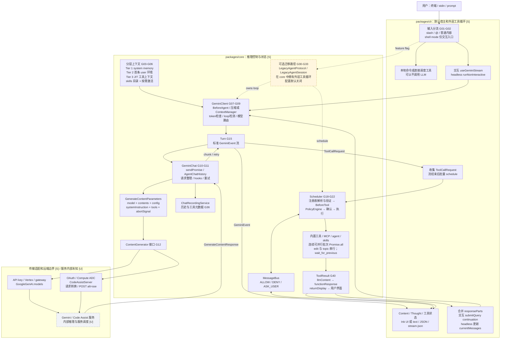
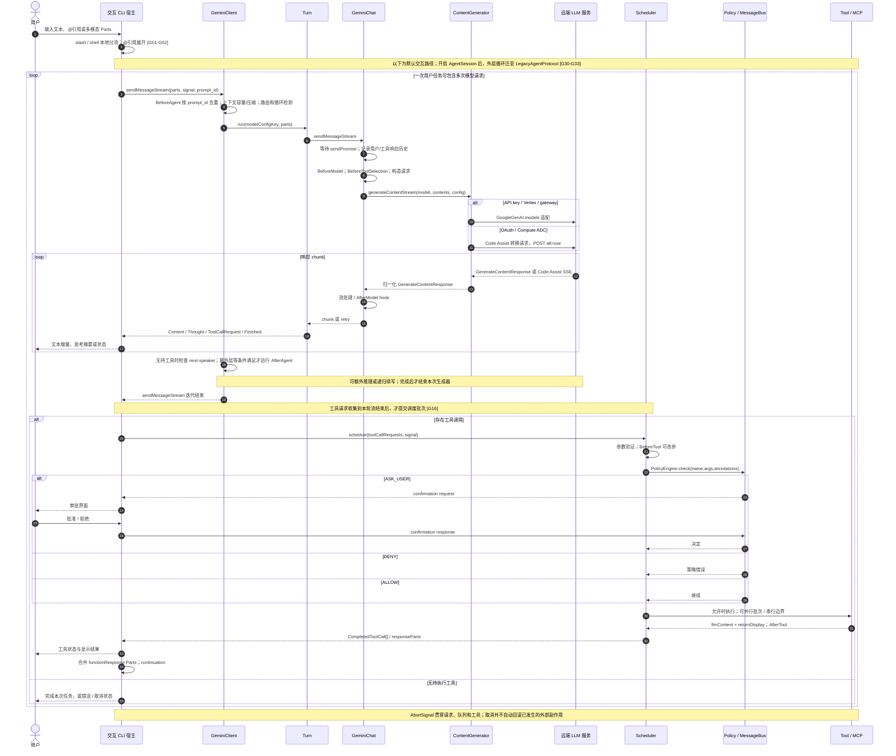

# Gemini CLI：从用户输入到模型输出的实现链路

研究快照：`google-gemini/gemini-cli` 的 `main`，提交 `d5b3e3accb26000d273abf16e0f1dd83aa5428a9`，提交时间 **2026-09-21 20:36:40 UTC**；抓取时间 **2026-09-22 16:22:27 UTC / 2026-09-23 00:22:27 上海**。根目录及 CLI 的 `package.json` 写的是 `0.62.0-nightly.20260918.g9450ade79`；这是源码内版本字段，不能将其中短 SHA 当成本次 HEAD，也不能据此声称研究的是 npm stable。

证据标签：**[S]** 已读固定提交源码；**[D]** 官方文档；**[I]** 根据已证实调用关系作出的解释；**[U]** 公开证据无法确认。本文为静态追踪，未运行真实模型调用。完整可机读证据见 [sources/gemini.json](../sources/gemini.json)。

## 1. 最重要的架构判断

**[S] 默认路径的外层工具循环仍由 CLI 宿主驱动。** 用户输入进入 `useGeminiStream`，调用 core 的 `GeminiClient → Turn → GeminiChat → ContentGenerator`；模型产生工具请求后，CLI 在流结束时将请求交给 core `Scheduler`，等结果返回，再次调用 `submitQuery`。所以“核心包负责推理和工具执行”成立，但“GeminiClient 独自包办完整工具循环”不准确。[G16](https://github.com/google-gemini/gemini-cli/blob/d5b3e3accb26000d273abf16e0f1dd83aa5428a9/packages/cli/src/ui/hooks/useGeminiStream.ts#L1533-L1658)[G17](https://github.com/google-gemini/gemini-cli/blob/d5b3e3accb26000d273abf16e0f1dd83aa5428a9/packages/cli/src/ui/hooks/useGeminiStream.ts#L2149-L2195)

**[S] 同一快照存在迁移架构。** 交互模式可选 `useAgentStream + LegacyAgentProtocol`，headless 可选 `LegacyAgentSession`；它们将外层循环移入 core。相关配置默认 `false`，环境变量 `GEMINI_CLI_EXP_AGENT=true` 也可启用。这是运行路径差异，不能把目录中新类的存在视为默认架构已经替换。[G30](https://github.com/google-gemini/gemini-cli/blob/d5b3e3accb26000d273abf16e0f1dd83aa5428a9/packages/core/src/config/config.ts#L1375-L1380)[G31](https://github.com/google-gemini/gemini-cli/blob/d5b3e3accb26000d273abf16e0f1dd83aa5428a9/packages/cli/src/ui/AppContainer.tsx#L1175-L1203)[G32](https://github.com/google-gemini/gemini-cli/blob/d5b3e3accb26000d273abf16e0f1dd83aa5428a9/packages/core/src/agent/legacy-agent-session.ts#L181-L271)[G33](https://github.com/google-gemini/gemini-cli/blob/d5b3e3accb26000d273abf16e0f1dd83aa5428a9/packages/core/src/config/config.ts#L3869-L3880)[G39](https://github.com/google-gemini/gemini-cli/blob/d5b3e3accb26000d273abf16e0f1dd83aa5428a9/packages/cli/src/nonInteractiveCli.ts#L72-L81)

## 2. 总体架构图

实线表示默认调用或数据流；虚线表示可选迁移路径。节点上的 G 编号可在文末跳到固定源码。远端服务内部标为 [U]，不能从客户端源码推导服务端真正如何调度 GPU、执行模型或缓存 KV。



可编辑图源：[gemini-architecture.mmd](../diagrams/gemini-architecture.mmd)。

## 3. 输入不是直接拼接成一条 prompt

**[S] 第一层是宿主解释。** `prepareQueryForGemini` 拒绝空输入或已取消输入，先处理 slash command，再处理 shell mode，再展开 `@` 引用。slash 结果可以是 `handled`、`submit_prompt` 或 `schedule_tool`：有的操作只改 UI，有的生成真正的模型输入，有的直接调工具后决定是否附加 prompt。shell mode 的命令也可能完全不发给模型。[G01](https://github.com/google-gemini/gemini-cli/blob/d5b3e3accb26000d273abf16e0f1dd83aa5428a9/packages/cli/src/ui/hooks/useGeminiStream.ts#L960-L1079)

**[S] `@` 并不只表示文件。** 当前处理器还识别 agent 名称和 MCP resource URI；文件由本地读取路径展开，资源内容及文件内容作为附加 `Part`，agent mention 则生成提示。因此屏幕上的原始文本、实际发给模型的内容和恢复会话中的 display content可以不同。多模态输入走 `PartListUnion`，不是强制压成字符串。[G02](https://github.com/google-gemini/gemini-cli/blob/d5b3e3accb26000d273abf16e0f1dd83aa5428a9/packages/cli/src/ui/hooks/atCommandProcessor.ts#L660-L763)[G10](https://github.com/google-gemini/gemini-cli/blob/d5b3e3accb26000d273abf16e0f1dd83aa5428a9/packages/core/src/core/geminiChat.ts#L480-L675)

**[S] 第二层是分层上下文。** 当前实现已不能简化为“全部 GEMINI.md 拼入 system prompt”：

| 上下文 | 进入模型请求的位置 | 更新时机 |
|---|---|---|
| 全局个人记忆、私有项目记忆索引 | `config.systemInstruction` | 建会话及系统指令刷新 |
| extension / 项目 GEMINI.md | 第一条 user `session_context` | 初始历史构造或上下文刷新 |
| 子目录 GEMINI.md | 相关工具返回内容，JIT 加载 | 访问文件时 |
| 技能名、描述、位置 | 系统提示词技能目录 | 技能发现之后 |
| 激活技能的正文与资源列表 | `activate_skill` 的工具结果 | 按需激活 |

分层前两项由 `getSystemInstructionMemory / getSessionMemory` 明确实现；环境消息另带日期、操作系统、临时目录及可选目录树。读取文件后会调用 JIT 上下文发现。技能不是启动时把所有 SKILL.md 正文塞满上下文，而是先呈现目录，再返回选中技能正文。[G03](https://github.com/google-gemini/gemini-cli/blob/d5b3e3accb26000d273abf16e0f1dd83aa5428a9/packages/core/src/config/config.ts#L2570-L2614)[G04](https://github.com/google-gemini/gemini-cli/blob/d5b3e3accb26000d273abf16e0f1dd83aa5428a9/packages/core/src/utils/environmentContext.ts#L50-L110)[G05](https://github.com/google-gemini/gemini-cli/blob/d5b3e3accb26000d273abf16e0f1dd83aa5428a9/packages/core/src/prompts/snippets.ts#L314-L333)[G06](https://github.com/google-gemini/gemini-cli/blob/d5b3e3accb26000d273abf16e0f1dd83aa5428a9/packages/core/src/tools/activate-skill.ts#L111-L153)[G34](https://github.com/google-gemini/gemini-cli/blob/d5b3e3accb26000d273abf16e0f1dd83aa5428a9/packages/core/src/tools/read-file.ts#L194-L201)

## 4. Core 中四层职责怎样分开

**[S] `GeminiClient` 管一次逻辑任务的推理控制。** 建立会话时从 ToolRegistry 导出 `functionDeclarations`，构造系统指令和初始历史。每次 `sendMessageStream` 处理 BeforeAgent、上下文容量、压缩、IDE上下文、循环检测、模型路由及模型可用性；同一调用序列使用 `currentSequenceModel` 保持模型选择。它也可能在没有工具调用时执行 next-speaker 检查，并发起 `Please continue.` 续写。因此“一次用户输入”不等于“一次 LLM HTTP 请求”。[G07](https://github.com/google-gemini/gemini-cli/blob/d5b3e3accb26000d273abf16e0f1dd83aa5428a9/packages/core/src/core/client.ts#L380-L417)[G08](https://github.com/google-gemini/gemini-cli/blob/d5b3e3accb26000d273abf16e0f1dd83aa5428a9/packages/core/src/core/client.ts#L614-L807)[G09](https://github.com/google-gemini/gemini-cli/blob/d5b3e3accb26000d273abf16e0f1dd83aa5428a9/packages/core/src/core/client.ts#L875-L1033)

**[S] `Turn` 是单次模型轮次的事件转换器。** 它调用 `GeminiChat.sendMessageStream`，把 provider 返回的数据映射为 `Content`、`Thought`、`ToolCallRequest`、`Citation`、`Finished`、`Retry`、错误和取消事件，并维护 `pendingToolCalls`。`Finished` 表示某次生成的 finish reason，不能单凭它认定用户任务已经结束：当前轮可能还要求工具或续写。[G15](https://github.com/google-gemini/gemini-cli/blob/d5b3e3accb26000d273abf16e0f1dd83aa5428a9/packages/core/src/core/turn.ts#L269-L414)

**[S] `GeminiChat` 管消息序列和实际模型请求。** `sendPromise` 防止同一 chat 同时发送造成历史冲突；`AgentChatHistory` 保存模型与用户 Content，`ChatRecordingService` 提供持久记录。工具结果被记录为 user 角色的 `functionResponse`；必要时还为二进制结果增加独立内容。发送前会清理历史、合并连续角色并处理工具 ID / thought signature 等 API 兼容细节。[G10](https://github.com/google-gemini/gemini-cli/blob/d5b3e3accb26000d273abf16e0f1dd83aa5428a9/packages/core/src/core/geminiChat.ts#L480-L675)[G36](https://github.com/google-gemini/gemini-cli/blob/d5b3e3accb26000d273abf16e0f1dd83aa5428a9/packages/core/src/core/geminiChat.ts#L434-L443)

**[S] 请求最终是原生 Gemini 数据结构。** 概念示例如下，省略了模型特定生成参数；它是解释用草图，不是真实抓包。

```json
{
  "model": "<resolved model>",
  "contents": [
    {"role":"user", "parts":[
      {"text":"<environment + project memory>"},
      {"text":"<expanded user request>"}
    ]},
    {"role":"model", "parts":[{"functionCall":{"name":"read_file","args":{"file_path":"src/a.ts"}}}]},
    {"role":"user", "parts":[{"functionResponse":{"name":"read_file","response":{"output":"<file content>"}}}]}
  ],
  "config": {
    "systemInstruction": "<core prompt + global/private memory + skill index>",
    "tools": [{"functionDeclarations": ["<tool schemas>"]}]
  }
}
```

实际参数还携带不序列化成普通 JSON 的 `abortSignal`。`BeforeModel` 可以修改模型、config 和 contents，或阻止请求；`BeforeToolSelection` 可以调整工具集合与 toolConfig。`AfterModel` 在该实现的 chunk 处理路径调用，不能画成仅在最终完整回答后触发一次。[G11](https://github.com/google-gemini/gemini-cli/blob/d5b3e3accb26000d273abf16e0f1dd83aa5428a9/packages/core/src/core/geminiChat.ts#L955-L1090)[G35](https://github.com/google-gemini/gemini-cli/blob/d5b3e3accb26000d273abf16e0f1dd83aa5428a9/packages/core/src/core/geminiChat.ts#L1464-L1487)

## 5. 同一 ContentGenerator 接口背后的两条传输路径

**[S] API key / Vertex AI / gateway** 经 `GoogleGenAI(...).models`，由 `@google/genai` SDK 承担相应服务适配。CLI 可以配置 base URL、认证、headers 和代理，再用 `LoggingContentGenerator` 包裹。**Google OAuth / Compute ADC** 则经 `ModelMappingContentGenerator → CodeAssistServer`；该路径把统一请求转换成含 project、user prompt id、嵌套 request、session id 等信息的 Code Assist 请求，向 `streamGenerateContent` 发出 `POST`，带 `alt=sse`，解析 `data:` 行并转换回 `GenerateContentResponse`。[G12](https://github.com/google-gemini/gemini-cli/blob/d5b3e3accb26000d273abf16e0f1dd83aa5428a9/packages/core/src/core/contentGenerator.ts#L292-L410)[G13](https://github.com/google-gemini/gemini-cli/blob/d5b3e3accb26000d273abf16e0f1dd83aa5428a9/packages/core/src/code_assist/server.ts#L93-L152)[G14](https://github.com/google-gemini/gemini-cli/blob/d5b3e3accb26000d273abf16e0f1dd83aa5428a9/packages/core/src/code_assist/server.ts#L470-L521)[G38](https://github.com/google-gemini/gemini-cli/blob/d5b3e3accb26000d273abf16e0f1dd83aa5428a9/packages/core/src/code_assist/converter.ts#L33-L75)

**[I] 这层抽象让上层基本不依赖具体认证入口，但不是任意 LLM 厂商的通用协议。** 上层历史、工具调用和流事件仍围绕 Gemini 的 `Content / Part / functionCall / functionResponse` 建模。gateway 入口提供传输可配置性，不能据此声称仓库已原生支持每一种其他厂商协议。

## 6. 输出、工具执行和再推理

**[S] 文本边到边显示，工具在本轮流结束后调度。** UI 在 `for await` 中更新文本缓冲和思考显示，同时仅收集工具请求；退出流循环后才调用 `scheduleToolCalls`。工具执行结果有两条面向不同对象的数据：`llmContent` 转为模型的 `responseParts`，`returnDisplay` 成为界面摘要、diff 或其他显示结构。批次完成后宿主汇总 `functionResponse`，携带同一个 prompt id 作为 continuation 再发给模型。[G16](https://github.com/google-gemini/gemini-cli/blob/d5b3e3accb26000d273abf16e0f1dd83aa5428a9/packages/cli/src/ui/hooks/useGeminiStream.ts#L1533-L1658)[G17](https://github.com/google-gemini/gemini-cli/blob/d5b3e3accb26000d273abf16e0f1dd83aa5428a9/packages/cli/src/ui/hooks/useGeminiStream.ts#L2149-L2195)[G40](https://github.com/google-gemini/gemini-cli/blob/d5b3e3accb26000d273abf16e0f1dd83aa5428a9/packages/core/src/scheduler/tool-executor.ts#L369-L400)

**[S] Scheduler 是独立状态机。** 它解析注册表并验证参数，先运行 BeforeTool（可改参），再按修改后的参数进入 PolicyEngine。决策为 ALLOW、DENY 或 ASK_USER；确认通过 MessageBus 与界面协调。允许才执行 invocation，执行包装器负责 AfterTool 等 hooks，最后产生 success / error / cancelled 等终态及响应。[G18](https://github.com/google-gemini/gemini-cli/blob/d5b3e3accb26000d273abf16e0f1dd83aa5428a9/packages/core/src/scheduler/scheduler.ts#L303-L348)[G20](https://github.com/google-gemini/gemini-cli/blob/d5b3e3accb26000d273abf16e0f1dd83aa5428a9/packages/core/src/scheduler/scheduler.ts#L612-L718)[G21](https://github.com/google-gemini/gemini-cli/blob/d5b3e3accb26000d273abf16e0f1dd83aa5428a9/packages/core/src/scheduler/tool-executor.ts#L114-L163)

**[S] 当前并行规则不是“只读工具才并行”。** `update_topic` 先被排序到批首；topic 和 edit 类工具强制串行。其他调用默认可并行，参数 `wait_for_previous=true` 建立串行边界。Scheduler 取连续可并行调用作为一批，先并行校验，待全部 ready 后再 `Promise.all` 执行；这不意味着所有工具、所有批次都任意并发，也不保证外部副作用按模型文本顺序完成。[G18](https://github.com/google-gemini/gemini-cli/blob/d5b3e3accb26000d273abf16e0f1dd83aa5428a9/packages/core/src/scheduler/scheduler.ts#L303-L348)[G19](https://github.com/google-gemini/gemini-cli/blob/d5b3e3accb26000d273abf16e0f1dd83aa5428a9/packages/core/src/scheduler/scheduler.ts#L472-L577)

**[S] Headless 仍有完整工具循环。** `nonInteractiveCli.ts` 自己 `while(true)` 请求模型、输出事件、调用 scheduler、收集结果。输出模式包含 text、JSON、stream-json；其结构化流不是 provider SSE 的原样转发。当策略需要人工确认而没有交互界面时，`checkPolicy` 抛错，不会凭空得到批准。[G28](https://github.com/google-gemini/gemini-cli/blob/d5b3e3accb26000d273abf16e0f1dd83aa5428a9/packages/cli/src/nonInteractiveCli.ts#L311-L355)[G29](https://github.com/google-gemini/gemini-cli/blob/d5b3e3accb26000d273abf16e0f1dd83aa5428a9/packages/cli/src/nonInteractiveCli.ts#L482-L539)[G22](https://github.com/google-gemini/gemini-cli/blob/d5b3e3accb26000d273abf16e0f1dd83aa5428a9/packages/core/src/scheduler/policy.ts#L53-L107)

## 7. 完整时序图



可编辑图源：[gemini-sequence.mmd](../diagrams/gemini-sequence.mmd)。图中主循环是默认宿主路径；next-speaker、AfterAgent 的判断由 core 在对应生成器控制点完成，不是 UI 调用的独立 API。

## 8. 长对话、失败、取消和恢复

**[S] 历史压缩是额外的模型工作。** 默认 `contextManagement.enabled=false` 时，Client 尝试 `ChatCompressionService`。其默认触发阈值为模型上下文容量的 50%，可被配置覆盖；历史切分通过 JSON 字符长度近似估算，目标保留约后 30%，并避开拆断工具调用配对的边界。工具响应另有 50,000 token 预算。当前压缩不只生成一次摘要：先生成 state snapshot，再发起第二次 probe 校验，失败后可能仅截断而不重复总结。启用新 ContextManager 后走 `renderHistory / apiHistoryOverride` 分支，不能与上述默认分支混为一谈。[G08](https://github.com/google-gemini/gemini-cli/blob/d5b3e3accb26000d273abf16e0f1dd83aa5428a9/packages/core/src/core/client.ts#L614-L807)[G23](https://github.com/google-gemini/gemini-cli/blob/d5b3e3accb26000d273abf16e0f1dd83aa5428a9/packages/core/src/context/chatCompressionService.ts#L38-L99)[G24](https://github.com/google-gemini/gemini-cli/blob/d5b3e3accb26000d273abf16e0f1dd83aa5428a9/packages/core/src/context/chatCompressionService.ts#L267-L410)[G37](https://github.com/google-gemini/gemini-cli/blob/d5b3e3accb26000d273abf16e0f1dd83aa5428a9/packages/core/src/config/config.ts#L1198-L1212)

**[S] 重试分两层。** 建立模型请求使用 `retryWithBackoff`，持久 429 可触发 fallback；上层流消费还可因无效流重试，并在相应错误情形附加尾部 nudge。配置和可用性逻辑控制次数，没有“所有失败永远自动重试”的保证。AbortSignal 贯穿发送和工具调度；取消事件使宿主停下，已经执行的文件或外部副作用不会由 signal 自动撤销。[G10](https://github.com/google-gemini/gemini-cli/blob/d5b3e3accb26000d273abf16e0f1dd83aa5428a9/packages/core/src/core/geminiChat.ts#L480-L675)[G25](https://github.com/google-gemini/gemini-cli/blob/d5b3e3accb26000d273abf16e0f1dd83aa5428a9/packages/core/src/core/geminiChat.ts#L1093-L1146)[G15](https://github.com/google-gemini/gemini-cli/blob/d5b3e3accb26000d273abf16e0f1dd83aa5428a9/packages/core/src/core/turn.ts#L269-L414)[G20](https://github.com/google-gemini/gemini-cli/blob/d5b3e3accb26000d273abf16e0f1dd83aa5428a9/packages/core/src/scheduler/scheduler.ts#L612-L718)

**[S]/[D] 会话记录与文件 checkpoint 是两种恢复能力。** 前者保存消息和工具元数据；后者还需要 Git snapshot。官方说明 checkpoint 默认关闭，保存 shadow Git 快照、对话和工具调用，并允许 `/restore` 恢复。当前默认 UI 的实际触发条件更具体：开启 checkpoint 后，仅筛选 edit 工具处于 `AwaitingApproval` 的调用。不能推广为“每次任意写文件之前都有快照”，也不能把文档描述的完整快照承诺当作每条新运行路径已逐项验证。[G36](https://github.com/google-gemini/gemini-cli/blob/d5b3e3accb26000d273abf16e0f1dd83aa5428a9/packages/core/src/core/geminiChat.ts#L434-L443)[G26](https://github.com/google-gemini/gemini-cli/blob/d5b3e3accb26000d273abf16e0f1dd83aa5428a9/packages/cli/src/ui/hooks/useGeminiStream.ts#L2221-L2264)[G27](https://github.com/google-gemini/gemini-cli/blob/d5b3e3accb26000d273abf16e0f1dd83aa5428a9/docs/cli/checkpointing.md#L8-L40)

## 9. 用一个任务串起各层，并定位排障位置

假设用户输入“阅读 `@src/a.ts`，修改错误并运行测试”。**[I]** 按前述调用关系，首先发生的是宿主读取引用文件并组装 Parts，而不是模型先收到裸路径再自行猜测内容。随后模型请求携带技能目录、全局规则、项目环境和该次输入。若模型返回“需要查看另一个文件”及 `read_file` 调用，文本可先显示，但实际读取要等该轮流处理结束、批次提交和策略检查。读取结果的显示摘要可能只有若干行说明，实际送回模型的 `functionResponse` 可以包含正文与刚发现的子目录规则。模型下一轮才据此选择编辑动作。[G01](https://github.com/google-gemini/gemini-cli/blob/d5b3e3accb26000d273abf16e0f1dd83aa5428a9/packages/cli/src/ui/hooks/useGeminiStream.ts#L960-L1079)[G02](https://github.com/google-gemini/gemini-cli/blob/d5b3e3accb26000d273abf16e0f1dd83aa5428a9/packages/cli/src/ui/hooks/atCommandProcessor.ts#L660-L763)[G16](https://github.com/google-gemini/gemini-cli/blob/d5b3e3accb26000d273abf16e0f1dd83aa5428a9/packages/cli/src/ui/hooks/useGeminiStream.ts#L1533-L1658)[G34](https://github.com/google-gemini/gemini-cli/blob/d5b3e3accb26000d273abf16e0f1dd83aa5428a9/packages/core/src/tools/read-file.ts#L194-L201)[G40](https://github.com/google-gemini/gemini-cli/blob/d5b3e3accb26000d273abf16e0f1dd83aa5428a9/packages/core/src/scheduler/tool-executor.ts#L369-L400)

**[I]** 若同一轮请求读取两个互不依赖的文件，当前调度规则允许它们在一个连续批次执行；若随后有 edit，则形成串行边界。测试 shell 是否与其他调用并行取决于工具类型与 `wait_for_previous`，不能因为“测试通常有副作用”便假设框架一定串行。若编辑需要确认，UI 的工具状态与 token 流是两条不同的更新通道：用户正在看确认界面时，不代表 LLM 仍在持续生成同一个响应。审批结束得到的工具结果又会构成后续模型输入。[G19](https://github.com/google-gemini/gemini-cli/blob/d5b3e3accb26000d273abf16e0f1dd83aa5428a9/packages/core/src/scheduler/scheduler.ts#L472-L577)[G20](https://github.com/google-gemini/gemini-cli/blob/d5b3e3accb26000d273abf16e0f1dd83aa5428a9/packages/core/src/scheduler/scheduler.ts#L612-L718)

这使几个常见问题能够定位到明确边界：

| 现象 | 首先检查的实现层 | 原因 |
|---|---|---|
| 用户提交后完全没有模型请求 | 输入分流、BeforeAgent、BeforeModel | 命令可能本地处理，hook 也可中止 |
| 显示了一些文字却还没有工具输出 | UI 的流收集与 Scheduler 状态 | 文本显示早于流结束后的工具执行 |
| 工具显示内容与模型回答引用内容不同 | `returnDisplay` 和 `llmContent` | 两者面向不同消费者 |
| 运行时间长但主回答 token 很少 | 压缩、路由、next-speaker 等辅助调用 | 一次任务并不限于一次主模型调用 |
| 无界面脚本在工具步骤失败 | PolicyEngine 的 ASK_USER 分支 | headless 无法完成要求人工确认的路径 |
| 重启后对话存在但文件并未回退 | ChatRecording 与 checkpoint 配置 | 对话持久化不等于文件系统事务 |

上表是 **[I] 排障顺序**，不是对特定失败的已验证诊断。分层证据分别来自输入处理、hooks、流消费、输出结构、辅助调用和恢复代码。[G01](https://github.com/google-gemini/gemini-cli/blob/d5b3e3accb26000d273abf16e0f1dd83aa5428a9/packages/cli/src/ui/hooks/useGeminiStream.ts#L960-L1079)[G09](https://github.com/google-gemini/gemini-cli/blob/d5b3e3accb26000d273abf16e0f1dd83aa5428a9/packages/core/src/core/client.ts#L875-L1033)[G11](https://github.com/google-gemini/gemini-cli/blob/d5b3e3accb26000d273abf16e0f1dd83aa5428a9/packages/core/src/core/geminiChat.ts#L955-L1090)[G16](https://github.com/google-gemini/gemini-cli/blob/d5b3e3accb26000d273abf16e0f1dd83aa5428a9/packages/cli/src/ui/hooks/useGeminiStream.ts#L1533-L1658)[G22](https://github.com/google-gemini/gemini-cli/blob/d5b3e3accb26000d273abf16e0f1dd83aa5428a9/packages/core/src/scheduler/policy.ts#L53-L107)[G24](https://github.com/google-gemini/gemini-cli/blob/d5b3e3accb26000d273abf16e0f1dd83aa5428a9/packages/core/src/context/chatCompressionService.ts#L267-L410)[G26](https://github.com/google-gemini/gemini-cli/blob/d5b3e3accb26000d273abf16e0f1dd83aa5428a9/packages/cli/src/ui/hooks/useGeminiStream.ts#L2221-L2264)[G36](https://github.com/google-gemini/gemini-cli/blob/d5b3e3accb26000d273abf16e0f1dd83aa5428a9/packages/core/src/core/geminiChat.ts#L434-L443)[G40](https://github.com/google-gemini/gemini-cli/blob/d5b3e3accb26000d273abf16e0f1dd83aa5428a9/packages/core/src/scheduler/tool-executor.ts#L369-L400)

**[S] Hooks 的位置也影响可观察行为。** BeforeAgent 面向用户任务，BeforeModel 面向一次具体模型请求，BeforeToolSelection 面向请求中的工具配置，BeforeTool 面向将要执行的具体调用，AfterModel 在流 chunk 上处理响应。**[I]** 因而“记录一次 hook 就等于记录一个用户 turn”并不成立；构建日志关联时应同时看 prompt id、工具 call id、模型轮次和实际事件类型。工具循环、自动续写和重试会在同一任务下产生多次这些事件，单靠最终屏幕文本无法还原完整请求序列。[G09](https://github.com/google-gemini/gemini-cli/blob/d5b3e3accb26000d273abf16e0f1dd83aa5428a9/packages/core/src/core/client.ts#L875-L1033)[G11](https://github.com/google-gemini/gemini-cli/blob/d5b3e3accb26000d273abf16e0f1dd83aa5428a9/packages/core/src/core/geminiChat.ts#L955-L1090)[G15](https://github.com/google-gemini/gemini-cli/blob/d5b3e3accb26000d273abf16e0f1dd83aa5428a9/packages/core/src/core/turn.ts#L269-L414)[G20](https://github.com/google-gemini/gemini-cli/blob/d5b3e3accb26000d273abf16e0f1dd83aa5428a9/packages/core/src/scheduler/scheduler.ts#L612-L718)[G35](https://github.com/google-gemini/gemini-cli/blob/d5b3e3accb26000d273abf16e0f1dd83aa5428a9/packages/core/src/core/geminiChat.ts#L1464-L1487)

## 10. 与其他 agent 比较时应抓住的差异

**[I] Gemini CLI 的辨识点是分层、协议和迁移状态一起构成的。** 它把 UI 宿主、推理控制、provider 请求、策略调度拆成不同边界；默认外层 loop 在 CLI，可选协议层把它迁入 core。提示词不是一个字符串拼装点，而是 system memory、首条环境消息、JIT 工具上下文和技能激活分层进入。模型输出先变成 GeminiEvent，再变成显示事件；工具输出则明确区分给人的显示内容和给模型的 Parts。比较 Codex 或 Claude Code 时，应逐项对照这些所有权、数据结构和时序，不能只比较“都支持工具调用”。

**[U] 本文不能确认**远端模型系统提示、服务端缓存命中、真实线上延迟、具体账号所选实验配置，也没有用 API 抓包验证每一种认证路径。以上结论只覆盖固定客户端提交可直接看到的实现；性能优劣需要相同任务、模型与网络条件下的实测。

## 11. 固定源码证据索引

编号对应本文与图中证据，链接固定到本次提交。默认值和 feature flag 的判断均来自代码，而非根据类名推断。

- **G01 [S]** [输入分流：slash、本地 shell、@ 引用、普通 prompt](https://github.com/google-gemini/gemini-cli/blob/d5b3e3accb26000d273abf16e0f1dd83aa5428a9/packages/cli/src/ui/hooks/useGeminiStream.ts#L960-L1079) — `packages/cli/src/ui/hooks/useGeminiStream.ts:960-1079`。
- **G02 [S]** [@ 引用区分 agent、MCP resource、文件并构造 PartListUnion](https://github.com/google-gemini/gemini-cli/blob/d5b3e3accb26000d273abf16e0f1dd83aa5428a9/packages/cli/src/ui/hooks/atCommandProcessor.ts#L660-L763) — `packages/cli/src/ui/hooks/atCommandProcessor.ts:660-763`。
- **G03 [S]** [systemInstruction memory 与首条 user session memory 分层](https://github.com/google-gemini/gemini-cli/blob/d5b3e3accb26000d273abf16e0f1dd83aa5428a9/packages/core/src/config/config.ts#L2570-L2614) — `packages/core/src/config/config.ts:2570-2614`。
- **G04 [S]** [环境上下文和第一条 user Content](https://github.com/google-gemini/gemini-cli/blob/d5b3e3accb26000d273abf16e0f1dd83aa5428a9/packages/core/src/utils/environmentContext.ts#L50-L110) — `packages/core/src/utils/environmentContext.ts:50-110`。
- **G05 [S]** [skills 描述目录进入 system prompt](https://github.com/google-gemini/gemini-cli/blob/d5b3e3accb26000d273abf16e0f1dd83aa5428a9/packages/core/src/prompts/snippets.ts#L314-L333) — `packages/core/src/prompts/snippets.ts:314-333`。
- **G06 [S]** [activate_skill 返回技能正文和资源目录](https://github.com/google-gemini/gemini-cli/blob/d5b3e3accb26000d273abf16e0f1dd83aa5428a9/packages/core/src/tools/activate-skill.ts#L111-L153) — `packages/core/src/tools/activate-skill.ts:111-153`。
- **G07 [S]** [startChat 创建 systemInstruction、工具声明和 GeminiChat](https://github.com/google-gemini/gemini-cli/blob/d5b3e3accb26000d273abf16e0f1dd83aa5428a9/packages/core/src/core/client.ts#L380-L417) — `packages/core/src/core/client.ts:380-417`。
- **G08 [S]** [processTurn 上下文管理、容量检查、循环检测和模型路由](https://github.com/google-gemini/gemini-cli/blob/d5b3e3accb26000d273abf16e0f1dd83aa5428a9/packages/core/src/core/client.ts#L614-L807) — `packages/core/src/core/client.ts:614-807`。
- **G09 [S]** [next-speaker continuation 与 BeforeAgent/AfterAgent hooks](https://github.com/google-gemini/gemini-cli/blob/d5b3e3accb26000d273abf16e0f1dd83aa5428a9/packages/core/src/core/client.ts#L875-L1033) — `packages/core/src/core/client.ts:875-1033`。
- **G10 [S]** [发送互斥、用户与工具响应记录、流重试入口](https://github.com/google-gemini/gemini-cli/blob/d5b3e3accb26000d273abf16e0f1dd83aa5428a9/packages/core/src/core/geminiChat.ts#L480-L675) — `packages/core/src/core/geminiChat.ts:480-675`。
- **G11 [S]** [请求组装和 BeforeModel/BeforeToolSelection hooks](https://github.com/google-gemini/gemini-cli/blob/d5b3e3accb26000d273abf16e0f1dd83aa5428a9/packages/core/src/core/geminiChat.ts#L955-L1090) — `packages/core/src/core/geminiChat.ts:955-1090`。
- **G12 [S]** [OAuth/ADC 到 Code Assist；API key/Vertex/gateway 到 GoogleGenAI](https://github.com/google-gemini/gemini-cli/blob/d5b3e3accb26000d273abf16e0f1dd83aa5428a9/packages/core/src/core/contentGenerator.ts#L292-L410) — `packages/core/src/core/contentGenerator.ts:292-410`。
- **G13 [S]** [Code Assist 请求转换和响应归一化](https://github.com/google-gemini/gemini-cli/blob/d5b3e3accb26000d273abf16e0f1dd83aa5428a9/packages/core/src/code_assist/server.ts#L93-L152) — `packages/core/src/code_assist/server.ts:93-152`。
- **G14 [S]** [POST alt=sse 与 data 行 JSON 解析](https://github.com/google-gemini/gemini-cli/blob/d5b3e3accb26000d273abf16e0f1dd83aa5428a9/packages/core/src/code_assist/server.ts#L470-L521) — `packages/core/src/code_assist/server.ts:470-521`。
- **G15 [S]** [SDK 响应映射为 Thought、Content、ToolCallRequest、Finished](https://github.com/google-gemini/gemini-cli/blob/d5b3e3accb26000d273abf16e0f1dd83aa5428a9/packages/core/src/core/turn.ts#L269-L414) — `packages/core/src/core/turn.ts:269-414`。
- **G16 [S]** [UI 消费事件；整个流结束后调度工具](https://github.com/google-gemini/gemini-cli/blob/d5b3e3accb26000d273abf16e0f1dd83aa5428a9/packages/cli/src/ui/hooks/useGeminiStream.ts#L1533-L1658) — `packages/cli/src/ui/hooks/useGeminiStream.ts:1533-1658`。
- **G17 [S]** [工具 responseParts 汇总并以 continuation 重新提交](https://github.com/google-gemini/gemini-cli/blob/d5b3e3accb26000d273abf16e0f1dd83aa5428a9/packages/cli/src/ui/hooks/useGeminiStream.ts#L2149-L2195) — `packages/cli/src/ui/hooks/useGeminiStream.ts:2149-2195`。
- **G18 [S]** [批次入口、update_topic 排序、ToolRegistry 参数验证](https://github.com/google-gemini/gemini-cli/blob/d5b3e3accb26000d273abf16e0f1dd83aa5428a9/packages/core/src/scheduler/scheduler.ts#L303-L348) — `packages/core/src/scheduler/scheduler.ts:303-348`。
- **G19 [S]** [连续可并行批次、Promise.all、edit/topic 串行与 wait_for_previous](https://github.com/google-gemini/gemini-cli/blob/d5b3e3accb26000d273abf16e0f1dd83aa5428a9/packages/core/src/scheduler/scheduler.ts#L472-L577) — `packages/core/src/scheduler/scheduler.ts:472-577`。
- **G20 [S]** [BeforeTool、Policy、MessageBus confirmation、取消](https://github.com/google-gemini/gemini-cli/blob/d5b3e3accb26000d273abf16e0f1dd83aa5428a9/packages/core/src/scheduler/scheduler.ts#L612-L718) — `packages/core/src/scheduler/scheduler.ts:612-718`。
- **G21 [S]** [executeToolWithHooks 执行和模型/显示结果分流](https://github.com/google-gemini/gemini-cli/blob/d5b3e3accb26000d273abf16e0f1dd83aa5428a9/packages/core/src/scheduler/tool-executor.ts#L114-L163) — `packages/core/src/scheduler/tool-executor.ts:114-163`。
- **G22 [S]** [PolicyEngine 与非交互 ASK_USER 错误](https://github.com/google-gemini/gemini-cli/blob/d5b3e3accb26000d273abf16e0f1dd83aa5428a9/packages/core/src/scheduler/policy.ts#L53-L107) — `packages/core/src/scheduler/policy.ts:53-107`。
- **G23 [S]** [默认压缩阈值及按字符估算的保留切分](https://github.com/google-gemini/gemini-cli/blob/d5b3e3accb26000d273abf16e0f1dd83aa5428a9/packages/core/src/context/chatCompressionService.ts#L38-L99) — `packages/core/src/context/chatCompressionService.ts:38-99`。
- **G24 [S]** [工具输出预算截断、摘要生成和第二次 probe 验证](https://github.com/google-gemini/gemini-cli/blob/d5b3e3accb26000d273abf16e0f1dd83aa5428a9/packages/core/src/context/chatCompressionService.ts#L267-L410) — `packages/core/src/context/chatCompressionService.ts:267-410`。
- **G25 [S]** [retryWithBackoff、持久 429 fallback](https://github.com/google-gemini/gemini-cli/blob/d5b3e3accb26000d273abf16e0f1dd83aa5428a9/packages/core/src/core/geminiChat.ts#L1093-L1146) — `packages/core/src/core/geminiChat.ts:1093-1146`。
- **G26 [S]** [实际 checkpoint 在 edit AwaitingApproval 触发](https://github.com/google-gemini/gemini-cli/blob/d5b3e3accb26000d273abf16e0f1dd83aa5428a9/packages/cli/src/ui/hooks/useGeminiStream.ts#L2221-L2264) — `packages/cli/src/ui/hooks/useGeminiStream.ts:2221-2264`。
- **G27 [D]** [checkpoint 官方语义及默认关闭](https://github.com/google-gemini/gemini-cli/blob/d5b3e3accb26000d273abf16e0f1dd83aa5428a9/docs/cli/checkpointing.md#L8-L40) — `docs/cli/checkpointing.md:8-40`。
- **G28 [S]** [默认 headless 拥有外层 loop 和文本/JSON 输出](https://github.com/google-gemini/gemini-cli/blob/d5b3e3accb26000d273abf16e0f1dd83aa5428a9/packages/cli/src/nonInteractiveCli.ts#L311-L355) — `packages/cli/src/nonInteractiveCli.ts:311-355`。
- **G29 [S]** [headless 调度批次并记录工具输出](https://github.com/google-gemini/gemini-cli/blob/d5b3e3accb26000d273abf16e0f1dd83aa5428a9/packages/cli/src/nonInteractiveCli.ts#L482-L539) — `packages/cli/src/nonInteractiveCli.ts:482-539`。
- **G30 [S]** [AgentSession 配置默认 false](https://github.com/google-gemini/gemini-cli/blob/d5b3e3accb26000d273abf16e0f1dd83aa5428a9/packages/core/src/config/config.ts#L1375-L1380) — `packages/core/src/config/config.ts:1375-1380`。
- **G31 [S]** [交互模式 feature flag 选择 LegacyAgentProtocol 或 useGeminiStream](https://github.com/google-gemini/gemini-cli/blob/d5b3e3accb26000d273abf16e0f1dd83aa5428a9/packages/cli/src/ui/AppContainer.tsx#L1175-L1203) — `packages/cli/src/ui/AppContainer.tsx:1175-1203`。
- **G32 [S]** [可选 Core-owned agent loop](https://github.com/google-gemini/gemini-cli/blob/d5b3e3accb26000d273abf16e0f1dd83aa5428a9/packages/core/src/agent/legacy-agent-session.ts#L181-L271) — `packages/core/src/agent/legacy-agent-session.ts:181-271`。
- **G33 [S]** [GEMINI_CLI_EXP_AGENT 环境开关](https://github.com/google-gemini/gemini-cli/blob/d5b3e3accb26000d273abf16e0f1dd83aa5428a9/packages/core/src/config/config.ts#L3869-L3880) — `packages/core/src/config/config.ts:3869-3880`。
- **G34 [S]** [工具输出附加 JIT 子目录上下文](https://github.com/google-gemini/gemini-cli/blob/d5b3e3accb26000d273abf16e0f1dd83aa5428a9/packages/core/src/tools/read-file.ts#L194-L201) — `packages/core/src/tools/read-file.ts:194-201`。
- **G35 [S]** [AfterModel 在 stream chunk 路径触发](https://github.com/google-gemini/gemini-cli/blob/d5b3e3accb26000d273abf16e0f1dd83aa5428a9/packages/core/src/core/geminiChat.ts#L1464-L1487) — `packages/core/src/core/geminiChat.ts:1464-1487`。
- **G36 [S]** [ChatRecordingService 初始化和历史持久化](https://github.com/google-gemini/gemini-cli/blob/d5b3e3accb26000d273abf16e0f1dd83aa5428a9/packages/core/src/core/geminiChat.ts#L434-L443) — `packages/core/src/core/geminiChat.ts:434-443`。
- **G37 [S]** [contextManagement 默认关闭](https://github.com/google-gemini/gemini-cli/blob/d5b3e3accb26000d273abf16e0f1dd83aa5428a9/packages/core/src/config/config.ts#L1198-L1212) — `packages/core/src/config/config.ts:1198-1212`。
- **G38 [S]** [Code Assist 外层项目、prompt id 与嵌套 request 数据结构](https://github.com/google-gemini/gemini-cli/blob/d5b3e3accb26000d273abf16e0f1dd83aa5428a9/packages/core/src/code_assist/converter.ts#L33-L75) — `packages/core/src/code_assist/converter.ts:33-75`。
- **G39 [S]** [headless 的 AgentSession 选择入口](https://github.com/google-gemini/gemini-cli/blob/d5b3e3accb26000d273abf16e0f1dd83aa5428a9/packages/cli/src/nonInteractiveCli.ts#L72-L81) — `packages/cli/src/nonInteractiveCli.ts:72-81`。
- **G40 [S]** [tool llmContent 转 responseParts 与 returnDisplay 分离](https://github.com/google-gemini/gemini-cli/blob/d5b3e3accb26000d273abf16e0f1dd83aa5428a9/packages/core/src/scheduler/tool-executor.ts#L369-L400) — `packages/core/src/scheduler/tool-executor.ts:369-400`。
