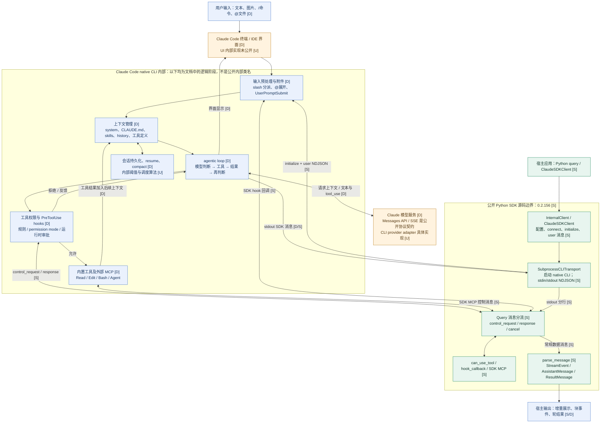
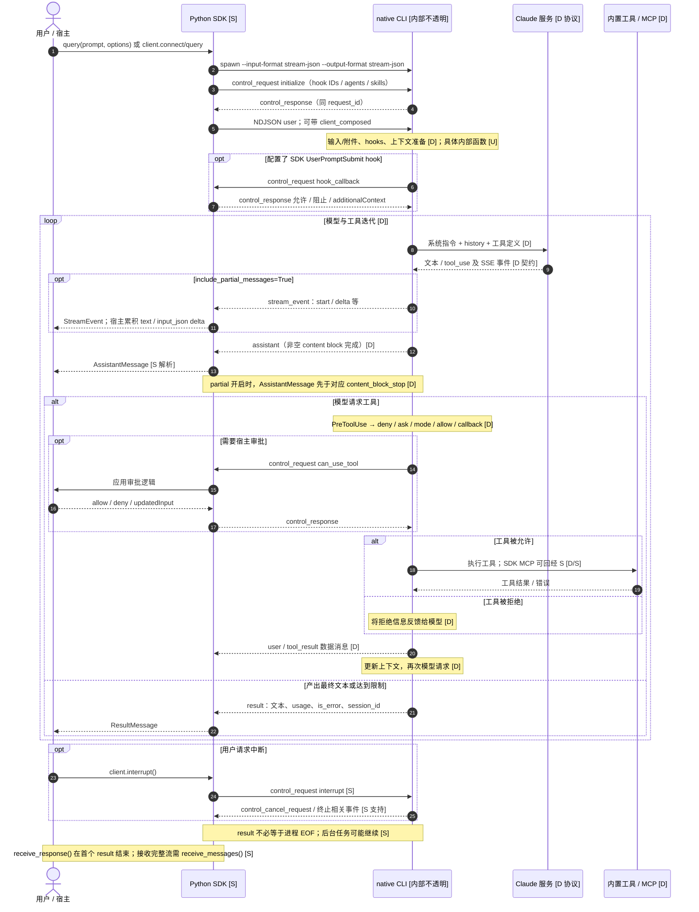

# Claude Code：从用户输入到模型输出的实现边界与消息链路

本文以 **2026-09-23（Asia/Shanghai）**取得的官方材料为准。`[S]` 是固定提交的公开源码；`[D]` 是官方文档契约；`[I]` 是据此作出的推断；`[U]` 是目前无法从公开材料验证的内部实现。源码与滚动文档不是同一版本快照，不能相互冒充。

## 1. 能看到的源码到底是什么

**Claude Code 的核心 agent loop 在本次核验的官方仓库中没有公开实现。** `anthropics/claude-code` 包含发行说明、示例、插件和辅助脚本，不能用它声称已逐函数追踪终端输入到网络请求。其许可证为保留所有权利、按商业条款使用。[S][仓库说明](https://github.com/anthropics/claude-code/blob/b486776a2eef0d3f39abaebaa3c03e378c7480b8/README.md#L1-L55)、[许可证](https://github.com/anthropics/claude-code/blob/b486776a2eef0d3f39abaebaa3c03e378c7480b8/LICENSE.md#L1)

可审计的实现是 **MIT 许可的 Python Agent SDK 包装层**。它启动 Claude Code 子进程、交换 JSON 消息、接入审批与 hooks，并不在 Python 内重写 Claude Code 的模型循环。[S][SDK README](https://github.com/anthropics/claude-agent-sdk-python/blob/f7547d7233527739ece8b12ed28c57be96c966b5/README.md#L1-L23)

| 研究对象 | 固定版本 | 解释 |
|---|---|---|
| Claude Code 官方资料仓库 | `b486776a2eef0d3f39abaebaa3c03e378c7480b8`，提交时间 2026-09-21T15:23:27-07:00 | CHANGELOG 顶部 `2.1.278`，不是 CLI 核心源码 |
| Python Agent SDK | `f7547d7233527739ece8b12ed28c57be96c966b5`，2026-09-20T02:48:23-04:00 | `pyproject.toml` 为 `0.2.156` |
| SDK 声明捆绑的 CLI | `_cli_version.py` 为 `2.1.278` | 同提交 CHANGELOG 的 `0.2.156` 条目仍写 `2.1.276`，二者不一致；本报告保留这一差异 |

未安装或执行下载的 CLI，因此这里的版本是**仓库声明值**，不是实测二进制版本。[S][版本常量](https://github.com/anthropics/claude-agent-sdk-python/blob/f7547d7233527739ece8b12ed28c57be96c966b5/src/claude_agent_sdk/_cli_version.py#L1-L3)、[SDK CHANGELOG](https://github.com/anthropics/claude-agent-sdk-python/blob/f7547d7233527739ece8b12ed28c57be96c966b5/CHANGELOG.md#L1-L7)

## 2. 架构图与时序图

详细图在 [架构 Mermaid](../diagrams/claude-architecture.mmd) 与 [时序 Mermaid](../diagrams/claude-sequence.mmd)。图中绿色部分具有公开 SDK 实现；CLI 内部蓝色节点只是官方文档描述的**逻辑职责**，不是虚构的内部类或文件；橙色边界标明不可见实现。

独立查看：[SVG](../diagrams/claude-architecture.svg)。

独立查看：[SVG](../diagrams/claude-sequence.svg)。

## 3. 输入不是一段直接送给模型的字符串

终端路径首先处理用户交互。开头的 `/` 可以分派内置命令或 skill；`@` 支持文件引用；开头的 `!` 运行 shell 并把输出加入会话。因此某些输入只触发本地操作，某些输入扩展上下文后才触发模型。不同命令的精确路由实现不可见。[D/U][交互模式](https://code.claude.com/docs/en/interactive-mode#quick-commands)

`@path` 的文件内容可以在构造 prompt 时加入，**没有发生模型 Read 工具调用**，所以不能用 `PreToolUse(Read)` 观察全部文件进入上下文的路径。官方文档要求用 Read deny 规则限制这类引用。[D][Hooks：PreToolUse](https://code.claude.com/docs/en/hooks#pretooluse)

SDK 有一个直接影响输入语义的开关：`verbatim_prompts=True`。公开函数 `stamp_user_message()` 把 `client_composed=True` 写入用户消息；类型说明注明 CLI 跳过 `@path` 展开和 slash 分派，还会跳过该轮开始时的附件补充，包括部分 nested CLAUDE.md、rules、skill/tool listings；工具之间的补充阶段不受影响。这不是单纯的字符串转义，也不是全局关闭项目上下文。[S][标记函数](https://github.com/anthropics/claude-agent-sdk-python/blob/f7547d7233527739ece8b12ed28c57be96c966b5/src/claude_agent_sdk/_internal/query.py#L102-L113)、[配置语义与最低 CLI 2.1.248](https://github.com/anthropics/claude-agent-sdk-python/blob/f7547d7233527739ece8b12ed28c57be96c966b5/src/claude_agent_sdk/types.py#L2195-L2222)

上下文来源要按加载时机理解，而非认为“启动就读取整个仓库”：

| 来源 | 生效时机与作用 | 证据 |
|---|---|---|
| CLAUDE.md / rules | 上级目录指令启动加载；子目录指令随相关文件读取按需加载；压缩后会重新加载适用规则 | [D][Memory](https://code.claude.com/docs/en/memory#how-claude-md-files-load) |
| Skills | 常规情况下先暴露描述，调用时加入完整内容；`disable-model-invocation` 改变发现方式；动态命令可先执行再代入内容 | [D][Skills](https://code.claude.com/docs/en/skills#control-who-invokes-a-skill) |
| UserPromptSubmit hook | 在处理 prompt 前运行，可阻断请求或补充 `additionalContext` | [D][Hook 契约](https://code.claude.com/docs/en/hooks#userpromptsubmit) |
| 历史、工具结果、system、工具定义 | 决定模型本轮可用信息；MCP schema 可延迟发现，不能默认全部前置注入 | [D][上下文组成](https://code.claude.com/docs/en/agent-sdk/agent-loop#the-context-window) |

SDK 默认值也随版本变化。本次 `setting_sources=None` 表示沿用 CLI 默认、加载所有来源；`[]` 才禁用文件系统设置。`skills` 参数还会自动添加 Skill 允许规则，并在来源未配置时设置 `['user','project']`。`system_prompt=None` 则被构造成 `--system-prompt ''`，不能假定与交互终端默认 system prompt 相同。[S][设置定义](https://github.com/anthropics/claude-agent-sdk-python/blob/f7547d7233527739ece8b12ed28c57be96c966b5/src/claude_agent_sdk/types.py#L2273-L2298)、[参数构造](https://github.com/anthropics/claude-agent-sdk-python/blob/f7547d7233527739ece8b12ed28c57be96c966b5/src/claude_agent_sdk/_internal/transport/subprocess_cli.py#L539-L585)

## 4. 可逐函数追踪的 Python SDK 链路

1. `query()` 创建 `InternalClient` 并迭代 `process_query()`；需要动态追加输入和显式中断时使用 `ClaudeSDKClient`。[S][入口](https://github.com/anthropics/claude-agent-sdk-python/blob/f7547d7233527739ece8b12ed28c57be96c966b5/src/claude_agent_sdk/query.py#L11-L42)、[委托实现](https://github.com/anthropics/claude-agent-sdk-python/blob/f7547d7233527739ece8b12ed28c57be96c966b5/src/claude_agent_sdk/query.py#L118-L126)
2. 默认创建 `SubprocessCLITransport`；允许注入自定义 transport。CLI 搜索优先捆绑版本，然后 PATH 等位置；`connect()` 用 `anyio.open_process()` 建立 stdin/stdout 管道，传递 cwd 和环境。[S][选择 transport](https://github.com/anthropics/claude-agent-sdk-python/blob/f7547d7233527739ece8b12ed28c57be96c966b5/src/claude_agent_sdk/_internal/client.py#L80-L98)、[启动进程](https://github.com/anthropics/claude-agent-sdk-python/blob/f7547d7233527739ece8b12ed28c57be96c966b5/src/claude_agent_sdk/_internal/transport/subprocess_cli.py#L793-L883)
3. **即使 prompt 是普通字符串，内部也始终采用 stream-json 输入。** 先启动读取任务，再发送 `initialize`；握手携带 hook callback IDs、agents、skills 等配置，之后才写用户 NDJSON。不能沿用早期实现“字符串放 argv、只在迭代输入时才双向通信”的描述。[S][调用顺序](https://github.com/anthropics/claude-agent-sdk-python/blob/f7547d7233527739ece8b12ed28c57be96c966b5/src/claude_agent_sdk/_internal/client.py#L137-L206)、[initialize](https://github.com/anthropics/claude-agent-sdk-python/blob/f7547d7233527739ece8b12ed28c57be96c966b5/src/claude_agent_sdk/_internal/query.py#L254-L308)
4. 输出格式为 `--output-format stream-json --verbose`。stdout 的 NDJSON 按行组帧并解析；带锁写 stdin，避免与关闭竞争；超长单条消息触发缓冲限制，非零退出转为 `ProcessError`。这是**本地进程协议**，不是 HTTP SSE。[S][CLI 参数](https://github.com/anthropics/claude-agent-sdk-python/blob/f7547d7233527739ece8b12ed28c57be96c966b5/src/claude_agent_sdk/_internal/transport/subprocess_cli.py#L566-L575)、[输入格式](https://github.com/anthropics/claude-agent-sdk-python/blob/f7547d7233527739ece8b12ed28c57be96c966b5/src/claude_agent_sdk/_internal/transport/subprocess_cli.py#L787-L791)、[读写实现](https://github.com/anthropics/claude-agent-sdk-python/blob/f7547d7233527739ece8b12ed28c57be96c966b5/src/claude_agent_sdk/_internal/transport/subprocess_cli.py#L1049-L1148)
5. `Query._read_messages()` 按 `type` 分流。`control_response` 唤醒同 ID 等待者；`control_request` 触发独立处理任务；`control_cancel_request` 取消对应任务；其余数据进入消息队列再经 `parse_message()` 返回宿主。[S][分流代码](https://github.com/anthropics/claude-agent-sdk-python/blob/f7547d7233527739ece8b12ed28c57be96c966b5/src/claude_agent_sdk/_internal/query.py#L333-L424)

这意味着 SDK 应用可以在同一条管道上持续接收生成内容，同时处理 CLI 发来的审批、hook 或 MCP 请求；输出消费者不用亲自编写“发现 tool call → 执行内置 Bash → 再请求模型”的完整循环。[I：由以上进程与控制协议实现得出]

## 5. 工具循环、权限与执行位置

官方描述的 loop 为：模型收到上下文，生成文字或工具调用，运行工具，把结果纳入后续请求，重复直至完成或触及限制。这套循环由 Claude Code runtime 提供。Python 文件中的 `Query` 主要管理控制协议，不能把它等同为网络模型调用循环。[D][Agent loop](https://code.claude.com/docs/en/agent-sdk/agent-loop#the-loop-at-a-glance)

权限不是 `allowed_tools` 简单白名单过滤。官方顺序为 hooks → deny → ask → permission mode → allow → `canUseTool`，含需交互工具等例外。`allowed_tools=['Read']` 代表自动批准 Read，其他工具仍可能存在；裸名称 deny 可以移除工具定义，带参数模式的 deny 在调用时检查。[D][Permissions](https://code.claude.com/docs/en/agent-sdk/permissions#how-permissions-are-evaluated)

公开 SDK 能确认权限回调如何跨进程：CLI 发来 `can_use_tool`，Python 回调接收工具名、输入和关联 ID，返回 `PermissionResultAllow/Deny`；允许结果可以改写输入。hooks 通过 callback ID 分派；进程内 SDK MCP 工具的 JSON-RPC 包在 `mcp_message` 控制消息中转发。内置工具和普通外部 MCP 的执行由 CLI 管理；不能声称所有工具都在 Python 进程执行。[S][审批回调](https://github.com/anthropics/claude-agent-sdk-python/blob/f7547d7233527739ece8b12ed28c57be96c966b5/src/claude_agent_sdk/_internal/query.py#L494-L555)、[hooks 与 MCP](https://github.com/anthropics/claude-agent-sdk-python/blob/f7547d7233527739ece8b12ed28c57be96c966b5/src/claude_agent_sdk/_internal/query.py#L557-L605)

## 6. 模型流、SDK 流、最终结果是三种边界

**API 契约层 [D]：** Messages API 支持 SSE：`message_start`，若干 `content_block_start/delta/stop`，再到 `message_delta` 与 `message_stop`。工具输入用 JSON 增量承载；`tool_use` 带 ID/name/input，客户端执行后在 `role=user` 的 `tool_result` 中用 `tool_use_id` 关联。`message_stop` 只结束一次模型响应，模型仍可能在等待工具结果。[Streaming](https://platform.claude.com/docs/en/build-with-claude/streaming)、[Tool calls](https://platform.claude.com/docs/en/agents-and-tools/tool-use/handle-tool-calls)

**SDK 契约层 [D]：** 默认每个非空 content block 完成就发一个 `AssistantMessage`；同次响应的多个块共享 message ID，并不等到整轮结束。开启 `include_partial_messages` 会额外收到 `StreamEvent`；完整块消息在相应 `content_block_stop` 前到达。增量仅覆盖主会话，子代理逐 token 流不转发。[流输出说明](https://code.claude.com/docs/en/agent-sdk/streaming-output#message-flow)

**公开实现层 [S]：** SDK 仅把 CLI `stream_event.event` 封装为 `StreamEvent`，把 `assistant` 内容映射为类型对象，把 `result` 转为含 usage、cost、is_error、terminal_reason 等字段的 `ResultMessage`。宿主若已累积 delta，再无条件追加完整块会造成重复展示。[解析器](https://github.com/anthropics/claude-agent-sdk-python/blob/f7547d7233527739ece8b12ed28c57be96c966b5/src/claude_agent_sdk/_internal/message_parser.py#L150-L220)、[result/stream_event](https://github.com/anthropics/claude-agent-sdk-python/blob/f7547d7233527739ece8b12ed28c57be96c966b5/src/claude_agent_sdk/_internal/message_parser.py#L308-L356)

SDK 流保留 API 事件不等于公开了 CLI 的 HTTP 客户端。provider adapter、精确请求序列化、内部提示词与流重试状态机仍为 [U]。图中到模型服务的箭头描述外部契约，不证明所有后端使用相同网络端点。

### 同一输入的完整例子

假设用户输入“读取 `@src/auth.ts`，修复登录错误并运行测试”，且应用没有开启 verbatim。下表是前述契约支持的**示意轨迹**，不是运行日志；模型是否选择这些工具不具确定性。[I]

| 步骤 | 信息如何变换 | 宿主能观测什么 |
|---|---|---|
| 输入到达 | SDK 把原始字符串装进用户消息；CLI 可以先展开文件引用 | 用户输入对象、hook 请求；不保证出现 Read 工具事件 |
| 首次推理 | prompt、已有附件、指令、工具说明和会话历史构成本次上下文 | 初始化消息与模型块消息；无法从包装层还原全部真实 system 文本 |
| 请求编辑 | 模型输出包含 Edit 的工具块，参数随内容流逐步到达 | 增量参数用于展示；完整工具块用于关联 ID，不能把每段 JSON 当独立调用 |
| 执行前决策 | CLI 进行权限检查，必要时跨进程调用宿主 | hooks 或 can_use_tool；未收到审批回调不表示没有做权限检查 |
| 工具完成 | 文件修改结果或失败信息进入工具结果 | 用户消息中的工具结果，而不是人类又输入了一句新话 |
| 后续推理 | 模型基于结果选择 Bash 测试，可能再次编辑 | 新一轮模型内容和工具事件，重复上述过程 |
| 收敛输出 | 模型给出解释，runtime 提交本轮 result | 最后文字块以及费用、状态、会话标识；仍须关注后台任务 |

例子体现三个计数单位的区别：**一次人类提交**可以引发多次模型请求；**一次模型响应**可以包含多个非空内容块；**一个工具任务**又可能跨越前台轮的结束继续运行。把这些都记录成“message”会导致统计和界面设计出错。应在业务指标中明确“用户提交”“模型响应”“内容块”“本轮结果”的单位。[I：基于公开消息类型与后台任务处理]

### 数据通道与控制通道为什么要分开理解

它们共享 stdin/stdout，却不是同一种内容。用户消息和模型结果属于会话数据；initialize、审批、中断、hook 回调是控制消息。`request_id` 解决的是控制请求应答对应关系；`tool_use_id` 解决的是工具调用结果对应关系；`message_id` 把同次模型响应的块关联起来；`session_id` 标识会话；这些标识不应互换。[S/I][控制请求结构](https://github.com/anthropics/claude-agent-sdk-python/blob/f7547d7233527739ece8b12ed28c57be96c966b5/src/claude_agent_sdk/_internal/query.py#L633-L654)、[结果和块字段](https://github.com/anthropics/claude-agent-sdk-python/blob/f7547d7233527739ece8b12ed28c57be96c966b5/src/claude_agent_sdk/types.py#L1340-L1387)

`Query` 对控制消息使用独立处理任务，让长时间等待审批不必阻塞对所有 stdout 帧的识别。反过来，消费端也不能把 `control_request` 原样当成模型文字显示，或在收到一段最终样式的文字后直接杀掉子进程：这可能打断尚未完成的回调。源码中的任务追踪和有锁写入说明，进程通信本身就是这个包装层的重要职责，而非几行 `subprocess.run()` 的简单调用。[S/I][任务与路由](https://github.com/anthropics/claude-agent-sdk-python/blob/f7547d7233527739ece8b12ed28c57be96c966b5/src/claude_agent_sdk/_internal/query.py#L310-L371)

## 7. 长会话、压缩、错误与取消

会话内容保存为本地 JSONL；resume 延续会话 ID，fork 创建新 ID。接近上下文限制时先清旧工具输出，再按需压缩历史；压缩不是删除磁盘上的整个原始记录。SDK 可见 `compact_boundary`，内部触发阈值、摘要算法与重试细节未公开。[D/U][工作原理](https://code.claude.com/docs/en/how-claude-code-works#work-with-sessions)

SDK 将 `continue_conversation`、`resume`、`fork_session` 转为 CLI flags；可选 SessionStore 的 `transcript_mirror` 帧由 Query 截取，在 result 前 flush，而不交给普通消息消费者。[S][resume 参数](https://github.com/anthropics/claude-agent-sdk-python/blob/f7547d7233527739ece8b12ed28c57be96c966b5/src/claude_agent_sdk/_internal/transport/subprocess_cli.py#L632-L651)、[镜像与轮结果](https://github.com/anthropics/claude-agent-sdk-python/blob/f7547d7233527739ece8b12ed28c57be96c966b5/src/claude_agent_sdk/_internal/query.py#L373-L408)

`ResultMessage` **不等于 stdout EOF，也不一定表示全部后台任务结束**。`ClaudeSDKClient.receive_response()` 遇第一个 result 返回；底层 Query 若还有后台任务，会保持 stdin 以服务其 hooks/MCP。源码还明确承认：多消息 `AsyncIterable` 输入可能在首个没有后台任务的 result 后关闭 stdin，后面排队轮次的控制请求可能发现输入已关闭。这是所研究版本声明的限制，不是本次实测故障。[S][receive_response](https://github.com/anthropics/claude-agent-sdk-python/blob/f7547d7233527739ece8b12ed28c57be96c966b5/src/claude_agent_sdk/client.py#L552-L591)、[关闭条件与已知限制](https://github.com/anthropics/claude-agent-sdk-python/blob/f7547d7233527739ece8b12ed28c57be96c966b5/src/claude_agent_sdk/_internal/query.py#L855-L886)

取消通过 `interrupt` 控制请求发送；收到 `control_cancel_request` 会取消对应回调任务。但 `ToolPermissionContext.signal` 和 hook 的 signal 在当前包装层仍为 `None`，不能宣传成完整的跨进程 AbortSignal。读取失败会唤醒未完成控制请求；若 CLI 已返回错误 result 后非零退出，SDK 转为信息更完整的 `ResultError`。[S][interrupt](https://github.com/anthropics/claude-agent-sdk-python/blob/f7547d7233527739ece8b12ed28c57be96c966b5/src/claude_agent_sdk/_internal/query.py#L709-L711)、[取消及错误传播](https://github.com/anthropics/claude-agent-sdk-python/blob/f7547d7233527739ece8b12ed28c57be96c966b5/src/claude_agent_sdk/_internal/query.py#L426-L491)、[signal 边界](https://github.com/anthropics/claude-agent-sdk-python/blob/f7547d7233527739ece8b12ed28c57be96c966b5/src/claude_agent_sdk/_internal/query.py#L506-L525)

网络层是否采用特定指数退避、在哪些 HTTP 状态重放请求、工具批次如何并行调度，不能从这个包装层确定。[U] 已知的控制请求超时只是等待本地 CLI 的响应，不应当作模型 API 超时或网络重试参数。[S][控制等待](https://github.com/anthropics/claude-agent-sdk-python/blob/f7547d7233527739ece8b12ed28c57be96c966b5/src/claude_agent_sdk/_internal/query.py#L622-L665)

另一项容易混淆的行为是“恢复会话”和“保持连接”。前者由 CLI 重新加载持久化状态，后者由 `ClaudeSDKClient` 保持现有进程与双向消息流。新开一次 `query()` 并不意味着只能永远使用空历史，因为仍可显式传 resume；反过来，即使进程还活着，清理会话等操作也可能替换当前对话。评估状态连续性时应分别检查连接生命周期、会话 ID 和历史来源，而不是只看是否复用了同一个 Python 对象。[S/I][续接参数](https://github.com/anthropics/claude-agent-sdk-python/blob/f7547d7233527739ece8b12ed28c57be96c966b5/src/claude_agent_sdk/_internal/transport/subprocess_cli.py#L635-L651)、[ConversationResetMessage](https://github.com/anthropics/claude-agent-sdk-python/blob/f7547d7233527739ece8b12ed28c57be96c966b5/src/claude_agent_sdk/types.py#L1437-L1457)

## 8. 对三框架比较的含义

Claude Code 的差异首先是**可审计边界**：SDK 的 transport、控制协议、生命周期能逐行验证，CLI 内的 prompt builder、tool scheduler 与模型 adapter 只能依据官方行为文档。它提供较完整的 runtime，由应用通过参数和双向回调嵌入；如果要修改循环本身，公开 Python 包装层不提供等同于直接改写核心引擎的入口。[I]

比较三种框架的同题行为时，至少应对齐模型、项目指令、技能发现、权限规则、会话历史和工具集合。否则，即使人类输入完全一样，模型收到的上下文和可执行动作也不同。尤其不能把 SDK 字符串原样长度当成模型输入长度：文件引用、动态技能内容、历史和工具输出都可能扩大它，verbatim 又可能改变首轮附件。实际请求次数和 token 数需要运行观测，不能由静态架构图推算。[I]

若进一步做动态验证，可在自建测试目录中分别记录“提交时刻”“首个文本增量”“完整块”“工具审批开始与结束”“本轮 result”“子进程退出”，同时保留版本与选项。这样能区分等待模型、等待人类、工具耗时和输出缓冲；只测终端出现第一段文字的时间会把这些阶段混在一起。此处是后续实验设计，不是已完成的测试结论。运行记录还应把原始工具输出作为独立证据，避免把模型对测试结果的口头描述当成命令实际执行成功。[I]

本章只完成静态源码与官方契约核验，没有进行模型请求、权限弹窗、故障注入或延迟基准测试；不据此给出性能排名。完整可机读证据清单见 [sources/claude.json](../sources/claude.json)。
