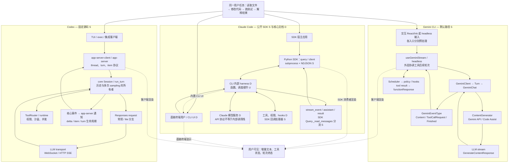
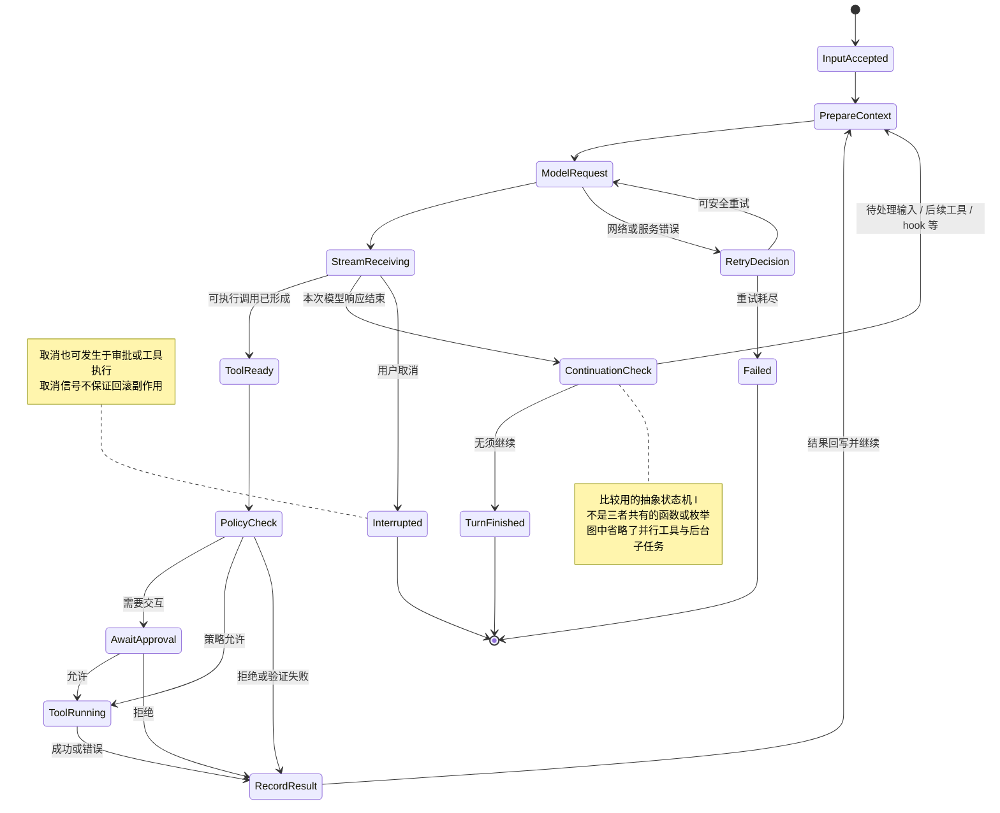

# 横向比较：相同的任务，为什么走不同的执行路径

最值得比较的不是三者都采用“模型 → 工具 → 模型”循环，而是 **循环由谁持有、状态放在哪里、协议在何处转换，以及哪些实现可以验证**。以下结论针对本次固定快照；实现证据分别详见 [Codex](01-codex.md)、[Gemini CLI](02-gemini-cli.md)、[Claude Code](03-claude-code.md)。

## 1. 关键结论

1. **Codex 的当前对话入口（TUI 与 exec）已经围绕 app-server 汇合。** TUI 和 `exec` 也使用 app-server 客户端；core 中的 Session/turn loop 持有模型与工具循环。输入、工具审批和输出经明确的会话协议连接。[S]
2. **Gemini CLI 的默认路径仍由界面或 headless 调用方协调工具续轮。** `GeminiClient → Turn → GeminiChat → ContentGenerator` 负责模型会话路径，Scheduler 执行工具。另有可选 AgentSession 路径，不能将它当作默认架构。[S]
3. **Claude Code 的可验证边界不同。** CLI 核心不在官方公开仓库中；公开 Python SDK 把输入通过子进程 NDJSON 交给 CLI，并双向处理权限、hooks、SDK MCP 等控制请求。内部 agent loop 的逻辑可以由官方文档说明，不能编造内部函数调用图。[S/D/U]
4. **流结束、块完成、消息完成、用户轮次完成和后台任务完成是不同事件。** 这直接影响 UI、取消、资源释放与 SDK 集成。不能统一成一个 `onToken` 加一个 `done`。[I，基于三篇实现追踪]

## 2. 统一架构视角

下图缩略展示主链路，具体入口分支、上下文来源、工具与返回事件见各自的详细架构图和时序图。`S/D/U` 对应源码、文档和未知；Claude 的直接终端入口不经过 Python SDK，图中的 SDK 路径用于展示可读源码边界。



## 3. 逐阶段对比

| 阶段 | Codex [S] | Gemini CLI [S] | Claude Code [S/D/U] |
|---|---|---|---|
| 用户入口 | Rust TUI、exec、外部 app-server 客户端 | React/Ink CLI、noninteractive 入口；可选新 AgentSession | CLI 产品入口 [D]；Python `query` / `ClaudeSDKClient` [S] |
| 本地输入分流 | TUI 命令、mentions、附件转成结构化输入；入口特有预处理 | slash command、shell mode、`@` 引用处理；再提交模型内容 | CLI 命令与引用行为 [D]；SDK 可用 verbatim 控制是否由 CLI 预处理 [S] |
| 客户端到核心 | app-server 协议；嵌入式实现不等于必须启动 TCP 服务 | 默认同进程 TypeScript 调用、异步生成器与事件 | SDK ↔ CLI 子进程 stdin/stdout NDJSON；stdout 同时承载数据和控制 [S] |
| 规则与上下文 | 基础指令、开发者/用户指令、项目规则、技能及环境按不同项和时机注入 | global/private memory 与 project/extension memory 分层；不全塞 systemInstruction | CLAUDE.md、规则、技能、自动记忆等行为 [D]；精确内部排序 [U] |
| 循环所有者 | core `run_turn` 管理多次 sampling 与工具后续 | 默认 useGeminiStream 或 noninteractive 外层协调；Core 管理模型/历史；可选 AgentSession | CLI 内部 [D]；Python SDK 是控制与传输包装层 [S] |
| 模型请求形状 | 常规 Responses `instructions + input + tools`；lite 分支改变布局 | GenerateContent 的 `contents` 与 config/systemInstruction/tools | Anthropic Messages 契约可说明 `messages/system/tools` [D]；CLI 实际加工与完整请求 [U] |
| 提供方差异 | Provider/认证/模型能力影响 Responses 传输与行为 | Gemini API 与 Code Assist 路径具有不同封装与请求适配 | Anthropic API、Bedrock、Vertex 等产品支持 [D]；不能由 Python SDK 反推出完整 provider 实现 |
| 模型流到核心事件 | ResponseEvent → 核心 item/turn 事件 → app-server 通知 | GenerateContentResponse → GeminiEventType → UI/headless 消费 | SDK 解析 CLI 消息；partial 开关暴露 stream_event，另有 assistant/result [S/D] |
| 工具执行 | Router/runtime 与 orchestrator 承担调用、权限、沙盒和调度 | Scheduler + PolicyEngine + hooks + ToolExecutor | CLI 内置工具逻辑 [D]；SDK permissions/hooks/MCP 控制回调 [S] |
| 工具回写 | call ID 关联的响应项进入历史，决定后续 sampling | functionResponse Parts 返回模型会话并续轮 | API 的 tool_use/tool_result 关联规则 [D]；CLI内部历史写入点 [U] |
| 并发 | 支持并行的工具与独占工具受到运行时锁/调度约束 | 连续可并行工具分批；edit/update_topic 串行，wait_for_previous 可形成屏障 | 有并行工具与子代理产品能力 [D]；准确内部批处理/锁规则 [U] |
| 压缩 | 在上下文边界触发 compaction，含不同远端/本地路径 | 历史压缩服务、预算与摘要验证；新 contextManagement 可选 | 清理较旧工具输出、需要时摘要等行为 [D]；具体实现 [U] |
| 结束 | sampling 完成后仍检查后续请求、输入队列、stop hooks 等 | 某次 Turn/流完成不排除外层工具续轮 | `result` 是当前用户请求或唤醒轮的结果边界；后台任务和双向控制可要求进程/管道继续 [S] |

这一表不代表三者功能完全不重叠。它刻画的是当前代码的责任划分；其他前端、实验开关、模型能力和插件会改变路径。

## 4. 输入不是直接拼成一条字符串

输入至少经过三类处理。[I]

**语法与控制处理。** `/help`、切换模型和本地命令可以直接改变客户端状态；有些 slash 命令会生成 prompt；`@文件` 可能解析成引用或读取内容。不能把所有输入原封不动当成用户消息，也不能假设所有入口都有相同预处理。

**上下文投影。** 磁盘上存在的文件、可访问的 MCP 工具、可加载的 skill 不必已经全部进入模型窗口。框架选择规则、技能描述、环境、历史和工具定义，并决定何时追加实际内容。系统角色、用户角色和工具结果的布局会影响模型看到的指令关系及缓存复用。

**请求物化。** 运行状态最后必须转换成某个提供方接受的 wire schema。下面只展示形状，不是可直接复制的完整请求，也不代表所有模型/提供方分支：

```text
Codex 普通 Responses 路径 [S]
  model
  instructions: 基础指令
  input: [结构化的历史、上下文、用户输入、调用与结果 ...]
  tools: [当前暴露的工具定义 ...]
  stream、reasoning 等选项

Codex Responses lite 分支 [S]
  input 前缀增加 AdditionalTools 与基础指令项
  顶层 instructions/tools 等字段相应调整
  因此不能拿普通分支的字段排列解释所有请求

Gemini API 概念形状 [S]
  contents: [{role, parts: [text / inlineData / functionCall / functionResponse ...]}, ...]
  config: {systemInstruction, tools, generation options, ...}
  Code Assist 封装在此之外还有适配，不能等同于原样直发 Gemini API

Claude Messages 公共 API 形状 [D]
  system: ...
  messages: [{role, content: [text / image / tool_use / tool_result ...]}, ...]
  tools: ...
  这是协议说明，不是已取得的 Claude Code 内部请求构建代码
```

Codex 的 lite 分支可直接查 [build_responses_request](https://github.com/openai/codex/blob/2c087a0cc2ef1d731086a1d0cb0081bdd792cc4d/codex-rs/core/src/client.rs#L881-L991)。其余字段的构建函数和证据见对应实现文档。

## 5. 一条“修复测试”的消息如何变成多次模型请求

取同一示例：“读取 `src/auth.ts` 和相关测试，修复失败用例，跑测试后说明修改。”下面是用于理解的示例轨迹，不是实测日志，也不承诺模型一定采用这个顺序。[I]

| 时间点 | 共同语义 | 各实现中的重要差别 |
|---|---|---|
| t0 | 输入进入运行时 | Codex 经 turn 协议；Gemini 默认先由 UI/headless 预处理；Claude SDK 经 NDJSON 交给 CLI |
| t1 | 请求 A 带规则、历史、用户目标和工具定义 | 三者 wire schema 不同；真实文件内容未必已被读取 |
| t2 | 模型说“先看代码”并请求读文件 | 文本已经可显示，但任务尚未完成；工具参数还可能在流中继续到达 |
| t3 | 读文件工具完成 | 把结果关联到调用 ID/函数响应；显示给人的结果与送回模型的结果可能不同 |
| t4 | 请求 B 带读取结果，模型产生修改调用 | 写入需要经过当前工具策略；规则文件中的文字不是 OS 沙盒 |
| t5 | 修改和测试完成 | 测试失败作为工具结果可触发新的修复请求；取消也不会自动撤销已发生的写入 |
| t6 | 请求 C 或更后续请求输出总结 | 是否结束须以运行时终态判断，不能只看文本内容是否像“总结” |

Codex 的核心循环可以在一次 turn 中进行这些采样；Gemini 默认外层在工具批次完成后组织函数响应并再次提交；Claude 的 CLI harness 执行循环，SDK 收到的是它的消息与控制协议，而不是自己每轮手工调用 Messages API。[S/D]

## 6. 流式输出有四个层次

| 层次 | 典型含义 | 常见误用 |
|---|---|---|
| 传输片段 | SSE/WebSocket/NDJSON 字节或事件 | 把一个 TCP chunk 当成一个完整 JSON 或 token |
| 内容增量 | 文本片段、思考摘要片段、工具 JSON 参数片段 | 尚未形成合法参数就执行工具；把所有流当纯文本 |
| 消息或内容块 | 模型输出 item/content block 已完成 | 将其当作整个用户任务结束；重复渲染增量与完整块 |
| 运行生命周期 | turn 完成、失败、取消；可能另有后台工作 | 收到第一条 result 就关闭仍需权限回复的管道 |

Codex 的模型传输协议和 app-server 协议不是一回事；“支持 WebSocket”必须说明是哪一段连接。Gemini 的 `ContentGenerator` 流也不等于直接推给界面的字符串，`Turn` 会转成框架事件。Claude 的 `stream-json` 是 CLI/SDK 边界，不是 Anthropic 服务端 SSE 的别名。[S]

**Claude 当前文档中特别容易忽略的细节：** `AssistantMessage` 可按每个非空内容块完成而产生，同一模型 message ID 可能对应多个这样的消息；开启 partial 后还会收到增量流。集成 UI 应按块/消息身份合并，而非把完整块再追加到已显示的增量尾部。这是当前官方文档描述，必须与使用的 CLI/SDK 版本一起核对。[官方流式输出说明](https://code.claude.com/docs/en/agent-sdk/streaming-output)。

## 7. 循环的停止条件比“没有工具调用”更复杂

下图是比较用的抽象状态机 [I]，不是三者共有的代码。工具在模型流中的实际启动时间、批处理与后台工作分别见各自时序图。



Codex 的 `needs_follow_up` 会结合模型后续状态和待处理输入；stop hook 还可能提供继续提示。因此一次 Responses 完成不必等于用户 turn 完成。[run_turn](https://github.com/openai/codex/blob/2c087a0cc2ef1d731086a1d0cb0081bdd792cc4d/codex-rs/core/src/session/turn.rs#L533-L680)。

Gemini 的新 AgentSession 路径展示了循环所有权正在演进，但本次快照中的 interactive/noninteractive 开关默认均为 `false`。仅看到新的类存在，就用它解释默认 CLI，会产生版本正确而路径错误的架构图。[settingsSchema.ts](https://github.com/google-gemini/gemini-cli/blob/d5b3e3accb26000d273abf16e0f1dd83aa5428a9/packages/cli/src/config/settingsSchema.ts#L2194-L2224)。

Claude SDK 的管道关闭逻辑则说明“轮次结束”与“进程可释放”不同：后台 agent 可能继续产生权限/hooks/MCP 控制请求。源码同时写明当前 one-shot 关闭机制对于多个异步输入消息的局限；这应作为集成时的已知边界，而不是推测 CLI 内部已具备某个完整任务调度器。[wait_for_result_and_end_input](https://github.com/anthropics/claude-agent-sdk-python/blob/f7547d7233527739ece8b12ed28c57be96c966b5/src/claude_agent_sdk/_internal/query.py#L844-L886)。

## 8. 工具、权限和并行必须分开讨论

工具定义出现在 prompt 中，只代表模型可以提出调用；工具实际执行还需要参数解析、注册表匹配、策略判断、必要的用户审批、执行环境和结果收集。MCP 是工具接入协议，不自动提供统一的安全策略。[I]

Codex 将工具路由、执行调度和审批/沙盒机制组织在 core 边界内；Gemini 的 Scheduler 通过工具状态、消息总线与策略组织执行；Claude SDK 源码展示了 CLI 请求宿主回调再等待响应的通路，但不能据此断言闭源调度器采用什么锁或数据结构。[S/U]

还必须区分两种并行：一次模型响应中多个工具并行，与多个子代理各自运行模型循环。前者影响同一历史中的工具结果与执行顺序，后者涉及上下文隔离、任务生命周期、取消和最终汇总。三者的能力不能归纳成一个“支持并发”的勾选框。[I]

Gemini 当前调度规则尤其不应被简化为“只有只读工具并行”。本次源码以可并行工具批次和屏障组织执行，具体规则包括 edit/update_topic 与 `wait_for_previous`；不能从工具名字猜测安全性。Codex 也应以工具实际声明和运行时规则为准，而不是由模型请求里的 `parallel_tool_calls` 一个字段推断最终并发。[S，详见两篇实现文档]

## 9. 状态、压缩、重试与取消的区别

**历史、模型窗口和磁盘记录不是同一个对象。** 完整对话可在持久化记录中保留，而当前请求只带经过投影、裁剪或摘要的上下文。恢复会话也不等于重放每个工具副作用。涉及文件回滚的 checkpoint 又是另一套状态。[I]

**压缩通常会改变后续模型看到的信息。** 三者都不能保证所有早期细节永久完整保留；持久规则应依照对应产品的配置方式加载。Gemini 的摘要验证与 Codex 的不同压缩分支属于源码可检查机制；Claude 的内部阈值、确切摘要提示词与私有算法在本报告中保持未知。[S/D/U]

**重试分模型传输和工具副作用两层。** 网络断线后重新建立模型请求，与重新执行一个写文件或外部 API 调用不是同一件事。报告没有证明三者对所有工具都提供 exactly-once 语义，因此不能作这种承诺。[I/U]

**取消是传播信号，不是回滚事务。** 可以停止继续生成、停止等待或要求工具终止，但已经成功写入的文件和外部动作需要单独恢复机制。异步取消、审批取消、进程退出以及线程会话终止，也需要分别处理。[I]

## 10. 对自建 agent 的工程启示

以下是根据实现差异提出的设计建议，不是未经测试的产品优劣排名。[I]

| 设计问题 | 可借鉴的机制 | 实际需要明确的契约 |
|---|---|---|
| 一个核心服务多个 UI | Codex 的 thread/turn/item 与 app-server 边界 | API 请求确认、事件流、审批响应、恢复与终态分别定义 |
| TS 应用中快速理解链路 | Gemini 的明确模型层、事件转换和工具 Scheduler | 明确谁负责工具后再次调模型，避免 UI 与 core 重复驱动循环 |
| 宿主复用现成执行系统 | Claude Agent SDK 的子进程和双向控制包装 | 管道关闭时机、请求 ID、权限回调、后台任务与取消 |
| 控制上下文增长 | 三者的项目规则、按需技能/工具与压缩 | 静态规则、动态证据、历史摘要应有来源与身份 |
| 稳定流式 UI | 增量/块/消息/轮次分层 | 重试去重、部分输出合并、工具状态、失败和取消应独立 |
| 可审计执行 | 工具调用 ID、结果关联、策略边界、会话记录 | 不把“模型建议允许”当权限决策，不把日志恢复当副作用重放 |

若要比较速度或成本，还需要控制同一任务、模型、上下文、认证/提供方、网络、工具输出体积、并发配置与缓存状态，并区分首段文本延迟、首个工具启动延迟和最终任务完成时间。本报告没有这些实测数据，因此不输出速度、费用或成功率排名。

## 11. 本次研究纠正的常见过时结论

| 容易照搬的说法 | 本快照的核实结果 |
|---|---|
| Codex TUI 直接调用 core/codex.rs | 当前入口通过 app-server-client；核心主路径已迁移至 session 模块 |
| Codex 输入的核心操作就是 Op::UserTurn | 当前源码使用 TurnInput 及相应请求/模式 |
| Codex 所有模型请求都是同一种 Responses 字段布局 | 有 Responses lite 分支，应按模型能力解释 |
| Gemini 新 AgentSession 是当前默认路径 | 对应实验开关默认 false，必须区分实际入口 |
| 所有 GEMINI.md 都直接拼进 system prompt | 当前存在不同层级的记忆/规则注入位置 |
| Gemini 只有只读工具可并发 | 当前 Scheduler 使用批次与屏障规则，不能作此概括 |
| Claude Code 的 GitHub 仓库就是核心开源实现 | 公开产品资料仓库与公开 SDK、闭源 CLI 核心是不同对象 |
| Claude SDK 字符串 prompt 作为命令行参数传入 | 当前 Python SDK 统一以 stream-json 输入协议写 stdin |
| Claude SDK 默认不读任何项目配置 | 当前源码区分 setting_sources=None 与空列表，需核对版本 |
| 任意流结束/ResultMessage 都可以关闭整个运行环境 | 需结合轮次、后台任务、控制协议和所用 API 的语义 |

这些纠正是本次追踪具体路径的结果；将来版本仍可能改变。需要长期引用时，应同时携带固定 SHA 与入口/配置条件。
