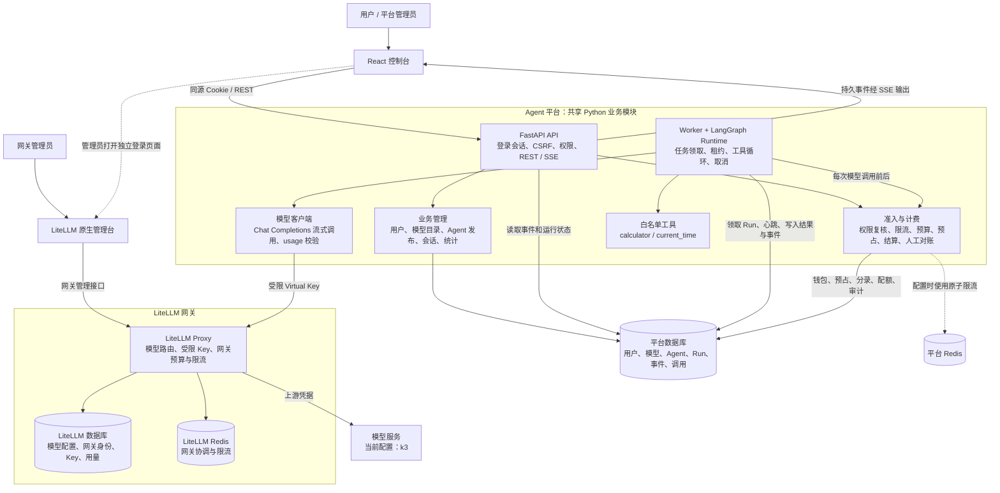
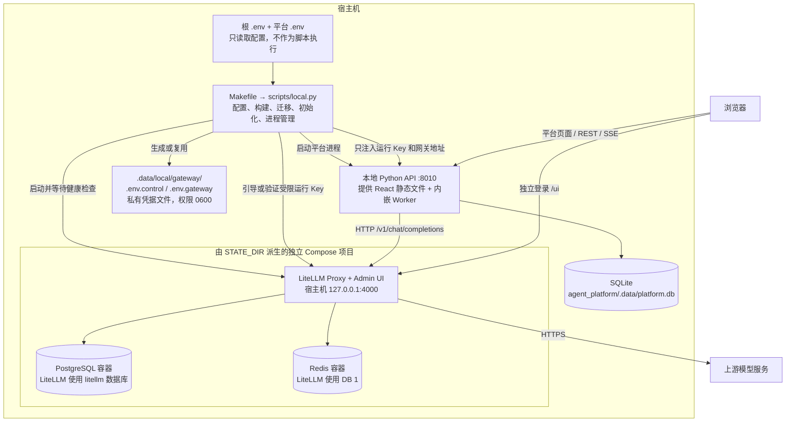
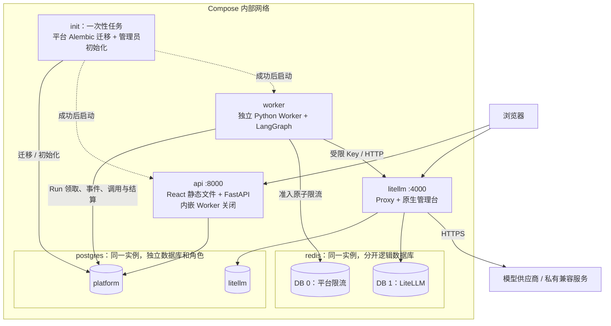
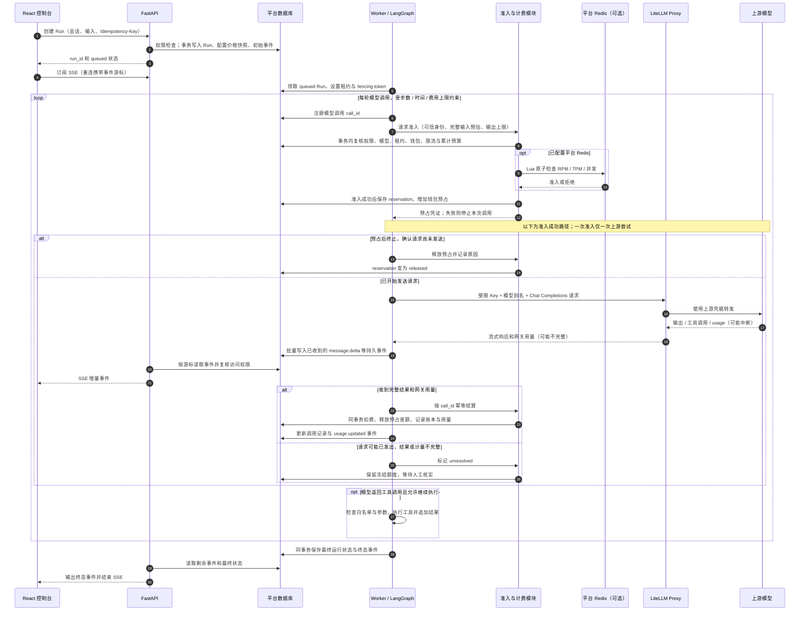
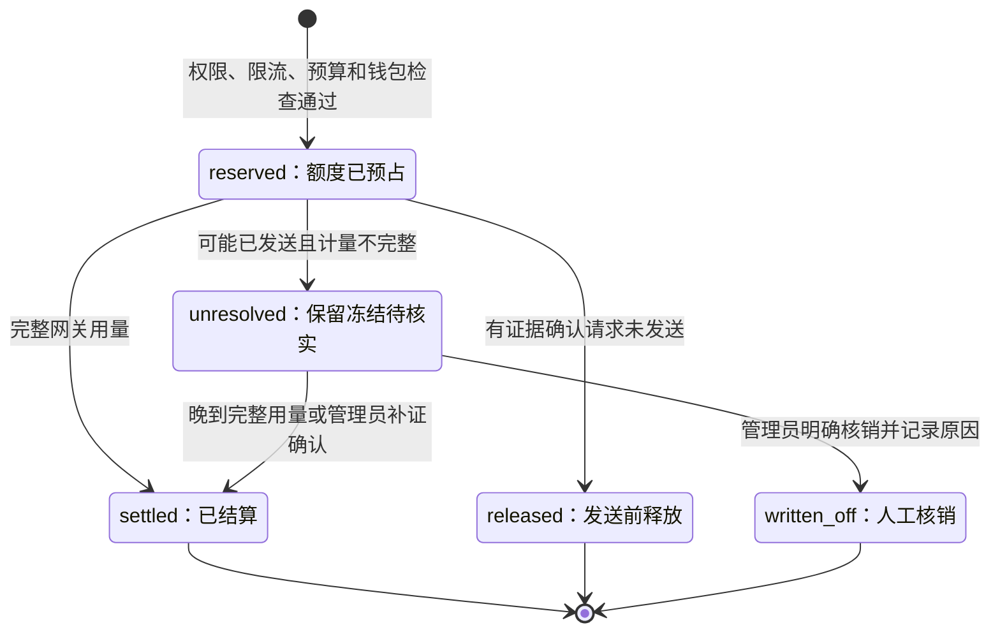

# Agent 平台架构图：当前实现

更新日期：2026-09-22。技术栈：React / TypeScript、Python / FastAPI、LangGraph、LiteLLM Proxy。

本文按当前代码绘制，包含系统组件、两种部署拓扑、调用时序和计费状态。图中的业务模块是代码职责，不代表独立微服务。长期设计与扩展方向见[架构设计方案](architecture.md)，启动命令见[部署说明](deployment.md)。

## 1. 系统组件与职责

平台采用模块化单体，API 接收业务请求，Worker 执行 Agent，LiteLLM 负责模型网关。Worker 可以内嵌于 API，也可以作为独立进程运行。

平台与 LiteLLM 的责任分工：

| 事项 | Agent 平台 | LiteLLM |
| --- | --- | --- |
| 用户与登录 | 业务账号、admin/member、租户隔离、平台 Cookie 会话 | 独立管理台登录、内部网关身份 |
| 模型管理 | 可用模型别名、启停、上下文限制、业务报价 | 别名对应的供应商、上游地址、凭据及路由 |
| Agent 执行 | 发布版本、多轮会话、工具、Run 生命周期 | 转发单次模型请求 |
| 限流与额度 | 租户/用户/模型 RPM、TPM、并发、累计预算、钱包 | 运行 Key 和模型部署的网关限制 |
| 用量与费用 | 调用归属、价格快照、客户扣费、账本、人工核实 | 返回网关 usage，保存网关侧用量与成本信息 |

两个控制台使用独立会话；平台侧栏入口只返回管理台地址，不交换登录凭据。模型目录、报价和网关模型配置没有自动同步：新增模型需要在两侧配置，并调整运行 Key 的模型白名单。网关 spend 不替代平台钱包账本。

## 2. 本地一键启动拓扑

对应 `make -C agent_platform start PORT=8010`。图中 8010 是本文示例端口，命令默认端口为 8000；LiteLLM 默认端口为 4000。此图表示默认 SQLite、内嵌 Worker、未配置平台 Redis 的情况，已有环境变量可覆盖这些选择。

- 容器 PostgreSQL 初始化时创建 `platform`、`litellm` 两个数据库；本地默认平台数据仍写入 SQLite，容器里的 `platform` 数据库不被该本地进程使用。
- 未配置 `PLATFORM_REDIS_URL` 时，平台根据数据库准入记录执行限流；启动了网关 Redis 容器不意味着本地平台已接入 Redis。
- 上游 Key、LiteLLM master key 和管理台密码用于网关启动/管理，不进入 managed 模式的平台 API/Worker 进程。浏览器不持有模型调用 Key。
- `make stop` 或 Ctrl+C 停止该实例的进程和网关容器，保留本地数据库、凭据和容器卷。重启验证并复用有效运行 Key，不自动延长有效期。
- 设置 `PLATFORM_EMBEDDED_WORKER=false` 后，本地启动器管理独立 Worker 进程；API 与 Worker 仍共享所配置的平台数据库。
- `GATEWAY=external` 不管理这些容器，使用显式网关 URL/Key，空值时兼容根 `OPENAI_*` 回退。因此“经本地 LiteLLM”是 managed 模式的保证，不能套用于所有外部配置。

## 3. 完整 Docker Compose 拓扑

在 `agent_platform` 目录执行 `make infra` → `make gateway-key` → `make up`。与本地模式相比，API、Worker、初始化任务都进入容器，平台改用 PostgreSQL 和 Redis。宿主机默认通过 `127.0.0.1:8000` 访问平台，通过 `127.0.0.1:4000/ui` 访问网关管理台。

图中虚线表示启动依赖。API 和 Worker 通过数据库中的 Run、事件和状态协作，没有另设消息队列。SSE 当前每 250ms 轮询持久事件并支持游标重放，没有 Redis Pub/Sub 唤醒链路。

PostgreSQL、Redis 不向宿主机发布端口；API 与 LiteLLM 默认只绑定本机回环地址。平台迁移与 LiteLLM 自身迁移分离。对外部署所需的 HTTPS 入口、备份调度和监控系统属于额外部署工作，当前 Compose 未包含这些服务。

## 4. 一次 Agent 运行的时序

调用报价在创建 Run 时随配置快照冻结；每轮模型调用分别准入、预占和结算。工具执行在 Worker 内进行，一个 Run 可以产生多次模型调用。

计费模块在结算/释放时也调整已启用的 Redis 限流记录，图中省略了这些收尾请求。数据库负责持久费用事实；Redis 与数据库之间不是分布式事务，准入失败时执行 Redis 回滚补偿。

浏览器断开不会自动取消 Run；显式取消、超时或 Worker 失联也不代表模型调用免费。当前 Worker 恢复逻辑终止失联运行并核实费用，不自动续跑 LangGraph Checkpoint，也不重放可能已发送的请求。

## 5. 预占与结算状态

以下是计费 reservation 的实际状态，与 Run 的成功、失败、取消状态独立。尚未通过准入的调用可以记录为 rejected，但不会创建 reservation。

- 正常费用按 Run 中的输入/输出价格快照计算，采用精确十进制；同一 call_id 重复结算不重复扣费。
- 计算费用超出预占时，最多扣除预占金额，记录由平台承担的差额并暂停钱包，等待管理员审阅。
- `unresolved` 不因超时自动释放；人工确认和核销都要求管理员权限、原因、幂等键及审计记录。
- 当前 `usage_source=litellm_gateway`。LiteLLM 可能补算供应商缺失的 usage，因此“已结算”表示平台按网关计量完成账务，不表示供应商账单已经确认。

## 6. 图与代码的对应关系

以下链接相对于本文，可用于核对或更新架构图。

| 图中组件 | 实现入口 |
| --- | --- |
| React 控制台、网关管理入口 | [App.tsx](../apps/web/src/App.tsx)、[pages.tsx](../apps/web/src/pages.tsx) |
| API、登录与 SSE | [apps/api/main.py](../apps/api/main.py) |
| 模型目录、Agent、会话、Run、统计 | [modules/platform.py](../modules/platform.py) |
| Worker 调度、调用准入、异常恢复 | [apps/worker/main.py](../apps/worker/main.py) |
| LangGraph 与工具循环 | [engine.py](../modules/runtime/engine.py)、[tools.py](../modules/runtime/tools.py) |
| 网关客户端与 usage 校验 | [gateway.py](../modules/runtime/gateway.py) |
| 钱包、账本、限流、人工对账 | [billing/service.py](../modules/billing/service.py) |
| 数据存储、事务及业务表 | [db.py](../infrastructure/db.py)、[tables.py](../infrastructure/tables.py) |
| 本地启动与网关生命周期 | [local.py](../scripts/local.py)、[scripts/gateway.py](../scripts/gateway.py) |
| 完整容器部署与受限 Key 引导 | [compose.yml](../deploy/compose.yml)、[bootstrap_gateway_key.py](../deploy/bootstrap_gateway_key.py) |

逐用户 Virtual Key、GatewayAdminAdapter / Outbox 同步、自动供应商账单对账、跨进程 Checkpoint 恢复、SSO、RLS 和完整遥测仍属于后续目标，未画入已实现组件。图使用 Mermaid 源码，GitHub 可直接渲染，后续变更可以随代码审查一起维护。
