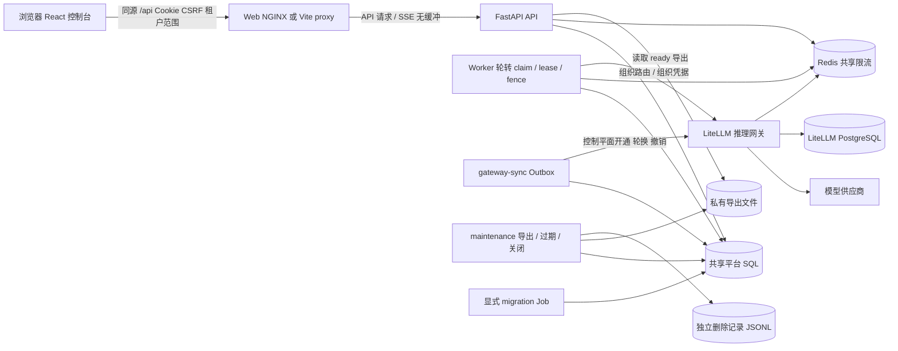

# 架构源码核查：边界、部署与待验证项

> 与 [前端功能规格](frontend-functional-spec.md)、[接口契约](frontend-api-contracts.md) 配套。源码基线 `master` @ `db1ab95367b53d84e68cb39f59c97715ccce37a0`，2026-10-02；本地HEAD、origin/master与只读GitHub master查询一致。没有运行服务/测试、读取.env或真实凭据。本文的源码事实和后续运行验收严格分开。

## 目录与模块地图

| 目录/文件 | 当前职责 | 边界证据 |
| --- | --- | --- |
| `apps/web` | React/TS/Vite SPA、hash导航、同源API helper、租户scope取消、SSE消费 | [App.tsx:14](../apps/web/src/App.tsx#L14)、[api.ts:27](../apps/web/src/api.ts#L27) |
| `apps/api` | FastAPI facade、schemas、auth/tenant别名、tenancy/operations/support route注册 | [main.py:103](../apps/api/main.py#L103)、[main.py:676](../apps/api/main.py#L676) |
| `apps/worker` | SQL队列、公平领取、lease/fence、每模型调用鉴权/预占/结算、运行收尾 | [main.py:78](../apps/worker/main.py#L78)、[main.py:941](../apps/worker/main.py#L941) |
| `apps/gateway_sync` / `apps/maintenance` | Outbox处理与导出/关闭的独立命令入口 | [gateway_sync/main.py:12](../apps/gateway_sync/main.py#L12)、[maintenance/main.py:20](../apps/maintenance/main.py#L20) |
| `modules/platform.py` | API共用身份/账务/网关facade、bootstrap、资源CRUD、enqueue、查询投影 | [platform.py:70](../modules/platform.py#L70)、[platform.py:656](../modules/platform.py#L656) |
| `modules/runtime` / `builtin_agents.py` | LangGraph model/tools循环、白名单工具、网关stream adapter、内置提示词模板 | [engine.py:188](../modules/runtime/engine.py#L188)、[tools.py:25](../modules/runtime/tools.py#L25) |
| `modules/identity` / `authorization` / `support` | 全局身份、成员/平台能力、专用支持授权与审计 | [identity.py:239](../modules/identity.py#L239)、[authorization.py:5](../modules/authorization.py#L5)、[support.py:201](../modules/support.py#L201) |
| `modules/gateway_control` | 部署/模型授权/价格版本、加密credential generations、outbox、读回核实 | [gateway_control.py:991](../modules/gateway_control.py#L991) |
| `modules/billing/service.py` / `operations.py` | 同文件表定义与账务领域服务；导出/关闭状态机 | [billing/service.py:66](../modules/billing/service.py#L66)、[operations.py:86](../modules/operations.py#L86) |
| `infrastructure` / `migrations` | 配置、SQLAlchemy Core schema/事务、ContextVar tenant scope、Alembic/RLS | [db.py:77](../infrastructure/db.py#L77)、[db.py:95](../infrastructure/db.py#L95) |
| `deploy` / `charts` / `scripts` | 独立镜像、Compose/Kubernetes、10独立Charts、local/runtime/Helm运维入口 | [Makefile:25](../Makefile#L25)、[Dockerfile:32](../deploy/Dockerfile#L32) |
| `tests` / `apps/web/tests` | 单元/集成/Chart/Playwright断言与历史夹具；本次未运行 | [test_api.py:129](../tests/test_api.py#L129)、[platform.spec.ts](../apps/web/tests/platform.spec.ts) |
| 根 `chat_models/factory.py` / `pyproject.toml` | 平台外部的共享模型工厂、全仓库uv依赖环境 | [factory.py:33](../../chat_models/factory.py#L33)、[pyproject.toml:6](../../pyproject.toml#L6) |

## 1. 核验快照与可靠结论

- 仓库：`https://github.com/GHjiejie/Z`。
- 本地分支：`master`；读取时 HEAD：`db1ab95367b53d84e68cb39f59c97715ccce37a0`。
- 读取时 `git status --short -- agent_platform` 为空；不代表全仓库无其他任务改动。主任务已只读对照 GitHub master，exact SHA 与基线一致。
- 当前部署是一个共享平台数据库上的模块化应用，分为独立 Web、API、Worker、gateway-sync、maintenance 进程；并非每领域独立数据库的微服务。各后台只构造所需服务上下文，领域库和平台 SQL 仍共享（[modules/service_contexts.py:1-5,16-47](../modules/service_contexts.py#L1)）。
- 默认 `make start` 已切换为独立 Helm 发布；旧 native supervisor 留在 `local-start`，Compose 留作后端集成入口（`Makefile:25-28,60-61,128-132`）。
- 配置只存在 `local` / `saas` 模式；没有代码定义的 `prod` 模式。生产目标应使用 `saas` 及外部依赖、HTTPS、持久存储，并完成额外验收（[infrastructure/config.py:47-79](../infrastructure/config.py#L47)）。
- 本地 Helm profile 明确是 SQLite、OrbStack 固定单节点、单副本、Recreate；通用 Chart 是外部 PostgreSQL/SaaS 契约，两者不能混称为已完成 SaaS 部署验收（[charts/api/values.local.yaml:1-25](../charts/api/values.local.yaml#L1)、[charts/api/values.yaml:29-68](../charts/api/values.yaml#L29)）。

## 2. 项目栈与进程边界

| 部分 | 实际代码 / 依赖 | UI 实施含义 | 证据 |
| --- | --- | --- | --- |
| Web | React 19、TypeScript、Vite、lucide-react；独立 `apps/web` | 可复用现有组件、api client、页面；Web 不应获取模型或 DB 凭据 | [apps/web/package.json:6-24](../apps/web/package.json#L6) |
| API | Python >=3.13，FastAPI，Uvicorn；SQLAlchemy Core | 保留已有 method/path 和同源 Cookie 协议，UI 不需要新应用服务 | 根 `pyproject.toml:6-27`；[apps/api/main.py:103-130](../apps/api/main.py#L103) |
| Worker | 独立持久 Run 调度与 Agent 执行；身份、网关、账务领域库 | 创建 Run 后异步观察状态；不要把 POST 完成解释为模型执行完成 | [modules/service_contexts.py:38-47](../modules/service_contexts.py#L38)；[apps/worker/main.py:78-157,941-976](../apps/worker/main.py#L78) |
| gateway-sync | 独立 Outbox 消费、网关开通/轮换/撤销 | 网关命令为异步状态流程，UI 应展示 pending/applying/核查状态 | [apps/gateway_sync/main.py:12-25](../apps/gateway_sync/main.py#L12)；[modules/gateway_control.py:1359-1471,1774-1849,1860-1889](../modules/gateway_control.py#L1359) |
| maintenance | 导出、过期文件回收、组织关闭与删除记录 | 导出不能即时返回全部数据；关闭不能假定立即删除完成 | [apps/maintenance/main.py:20-44](../apps/maintenance/main.py#L20)；[modules/operations.py:1369-1448](../modules/operations.py#L1369) |
| Migration | Alembic 单独角色；应用启动只校验 schema | UI 不得提供或暗含后台自动迁移能力 | `__main__.py:71-79`；[infrastructure/db.py:95-106](../infrastructure/db.py#L95)；[scripts/helm.py:417-455](../scripts/helm.py#L417) |
| 推理 | LangGraph / LangChain / ChatOpenAI，经 LiteLLM | 真模型请求依赖上游、组织授权与钱包；不允许配置不足时伪造回复 | 根 `pyproject.toml:15-21`；`README.md:31,79-90`（具体调用契约由运行链路规格核实） |

独立后台不是直接 import HTTP `Platform` facade：`maintenance_services` 仅组合 IdentityService/GatewayService；Worker 在此基础上增加 BillingService。API 创建 Platform facade。服务拆分目前只拆部署与进程边界，依然共享 schema、domain library、事务和发布兼容性。

## 3. 运行配置矩阵

| 环境 | 代码配置与启动入口 | 数据与直接依赖 | Web 入口 | 限制 / 未验证 |
| --- | --- | --- | --- | --- |
| Native 本地开发 | `PLATFORM_MODE=local`；`make dev`、`make worker`、`make gateway-sync`、`make maintenance`；先显式迁移/初始化 | 默认 SQLite；Redis可选，缺Redis时数据库限流；真实推理另需LiteLLM/组织配置 | `make web`，Vite 5173，`/api`代理到API 8000；或已有dist由API提供 | 不自动初始化或迁移；gateway-sync本地legacy允许无控制配置；没有live验证 |
| 旧 native supervisor | `make local-start`（默认managed gateway），或 `GATEWAY=external` | supervisor会准备依赖、构建dist、迁移、init并启动后台，可能写本机配置和数据 | API同源提供dist，默认8000（可指定PORT） | 此入口有副作用，仅文档说明；切库后不可随意启动历史数据副本；不是当前`make start` |
| 当前本地 Helm profile | `make start` / `deploy SERVICE=...`，`scripts/helm.py`始终叠加各`values.local.yaml`，CLI只支持orbstack | SQLite RWO平台卷；四应用固定同一节点、单副本；Redis、LiteLLM；PG本地profile用于LiteLLM | 独立Web NGINX；local profile公开8010；API内部8000；LiteLLM管理端口4000 | SQLite不允许多副本/滚动重叠；实际集群资源与业务状态未在本任务查询；README里的已运行状态属于历史记录 |
| Compose 后端集成 | `make compose-up`，`PLATFORM_MODE=saas`，init执行Alembic+bootstrap | PG17、Redis7.4、LiteLLM固定digest、API/Worker/gateway-sync/maintenance；导出与删除记录卷 | 只有API 8000和LiteLLM 4000；当前compose没有web service | 当前API镜像不含dist，不能承诺compose-up提供React控制台；需Vite/独立Web部署；真实PG隔离未验收 |
| 通用 SaaS / 生产目标 | 直接逐服务安装Chart；使用通用`values.yaml`与既有Secret/PVC；不是`PLATFORM_MODE=prod` | 外部PG非owner/non-SUPERUSER/non-BYPASSRLS角色、Redis、组织网关、共享导出与独立删除记录存储 | 独立Web同源反向代理；需部署者提供HTTPS入口 | 没有umbrella Chart；TLS/Ingress/证书配置不在所读Web Chart；生产容量、RLS、provider兼容性需独立验收 |

证据：`Makefile:83-117,128-132`；[scripts/runtime.py:13-38](../scripts/runtime.py#L13)；[scripts/local.py:252-405](../scripts/local.py#L252)；[apps/web/vite.config.ts:6-15](../apps/web/vite.config.ts#L6)；[scripts/helm.py:27-30,72-94](../scripts/helm.py#L27)；[scripts/kubernetes.py:70-74](../scripts/kubernetes.py#L70)；[deploy/compose.yml:34-164](../deploy/compose.yml#L34)；[deploy/Dockerfile:32-36](../deploy/Dockerfile#L32)。

SaaS启动的硬检查：

- database URL必须以PostgreSQL开头；API/Worker/init必须配置Redis；禁止内嵌Worker；API必须secure cookies；所有SaaS角色必须配置有效Fernet加密材料（[infrastructure/config.py:60-79](../infrastructure/config.py#L60)）。这里只记录变量名与条件，不记录值。
- `db.assert_schema`要求当前Alembic head；SaaS角色不得为SUPERUSER/BYPASSRLS或`platform_runs` owner，租户内容表必须FORCE RLS、且运行角色不是表owner（[infrastructure/db.py:95-156](../infrastructure/db.py#L95)）。
- API生命周期拒绝LiteLLM控制平面key（[apps/api/main.py:111-120](../apps/api/main.py#L111)）；运行CLI明确拒绝控制、上游与迁移身份凭据混入API/Worker/maintenance环境（`__main__.py:43-61`）。
- gateway-sync SaaS `serve` 会在启动时验证cipher/control配置，避免配置缺失却维持空闲健康心跳（[modules/gateway_control.py:1860-1866](../modules/gateway_control.py#L1860)）。

可记录的配置分类（不得把值输出至UI）：

| 类别 | 变量 / 配置 | UI影响 |
| --- | --- | --- |
| 模式与存储 | `PLATFORM_MODE`、`PLATFORM_DATABASE_URL`、`PLATFORM_REDIS_URL` | 连接不可用显示失败；local/saas差异需环境说明 |
| 推理与运营 | `PLATFORM_LITELLM_URL`、`PLATFORM_LITELLM_ADMIN_URL`、gateway control URL；组织credential DB记录 | 管理地址为空时禁用打开管理台；组织未同步就绪时运行受后端拒绝 |
| 运行限制 | `PLATFORM_WORKER_CONCURRENCY`、`PLATFORM_RUN_TIMEOUT`、`PLATFORM_MODEL_TIMEOUT`、`PLATFORM_MAX_RUN_COST` | queued/running/expired/failed等状态，不等同于请求超时或网页断线 |
| 维护 | maintenance interval/batch size/export TTL/deletion retention、export directory、tombstone path | 导出异步/过期，关闭进入保留与清理阶段 |
| 私密材料 | secret encryption key、DB身份、组织gateway密文、operator/bootstrap凭据 | 仅部署提供；前端不显示、传递、持久化这些材料 |

## 4. 数据存储模型与后台职责

| 存储领域 | SQL表 / 物理存储 | 核验要点 | 源码 |
| --- | --- | --- | --- |
| 全局身份 / 登录 | `platform_users`、`platform_auth_sessions`、`platform_login_attempts` | 密码hash、session token hash；身份控制表与租户内容表分开 | [infrastructure/tables.py:35-68](../infrastructure/tables.py#L35) |
| 租户权限与容量 | memberships/platform_roles/tenant_settings/entitlements/invitations/operation_audits/tenant_creation_requests | 全局平台角色与组织角色独立；settings、entitlements有版本 | [infrastructure/tenancy_tables.py:20-152](../infrastructure/tenancy_tables.py#L20) |
| Agent / 模型 / 内容 | models/agents/agent_versions/sessions/messages | agent_versions保存JSON spec；sessions/messages有tenant关联 | [infrastructure/tables.py:70-179](../infrastructure/tables.py#L70) |
| 执行与流式日志 | runs/run_events/calls/call_attempts/stream_leases/service_heartbeats | runs保存owner/lease/deadline/fence；events以(run_id,sequence)主键持久化；并非Redis消息队列 | [infrastructure/tables.py:135-225](../infrastructure/tables.py#L135)；[infrastructure/runtime_tables.py:15-55](../infrastructure/runtime_tables.py#L15) |
| 模型路由与网关 | model_deployments/tenant_model_bindings/model_price_versions/gateway_bindings/gateway_credential_versions/gateway_outbox/gateway_control_audits | 部署与组织授权分离；凭据加密、按generation轮换；Outbox有owner/fence/lease与attempt | [infrastructure/gateway_tables.py:29-170](../infrastructure/gateway_tables.py#L29) |
| 钱包与账务 | billing_wallets/billing_quotas/billing_reservations/billing_transactions/billing_entries/billing_audit/billing_reconciliations | 金额PG NUMERIC(30,12)，SQLite精确decimal字符串；预占/未核实保留额度；Redis不是账务真相 | [modules/billing/service.py:1-7,46-175](../modules/billing/service.py#L1) |
| 导出与生命周期 | export_jobs/export_artifacts/tenant_lifecycle_jobs | SQL保存job进度、hash与租约；文件另存私有目录；关闭保留financial evidence并记录删除 | [infrastructure/operations_tables.py:18-99](../infrastructure/operations_tables.py#L18)；[modules/operations.py:246-267,742-777](../modules/operations.py#L246) |
| 支持访问 | platform_support_grants | 包含审批membership/version、期限、是否允许content及撤销记录 | [infrastructure/support_tables.py:18-43](../infrastructure/support_tables.py#L18) |

数据库实现：SQLAlchemy Core引擎。SQLite启用foreign_keys/busy_timeout，`create_schema`开发入口会打开WAL；业务写事务使用`BEGIN IMMEDIATE`。PostgreSQL每scope用`pg_advisory_xact_lock`，tenant scope绑定事务local `app.tenant_id`（[infrastructure/db.py:20-56,58-75,77-93,158-194](../infrastructure/db.py#L20)）。运行入口不调用create_schema，而校验Alembic；当前head `0007_support_access`，依次经过model-independent agents、tenant identity、gateway、runtime/RLS、operations、support迁移（[migrations/versions/0007_support_access.py:6-7](../migrations/versions/0007_support_access.py#L6)）。

RLS事实：0005在PostgreSQL对模型/Agent/内容/运行/调用/账务/网关/stream lease等24个tenant表ENABLE+FORCE RLS，policy基于`app.tenant_id`；0006对exports/artifacts/lifecycle jobs加同样政策。身份控制表刻意保持全局，需要服务权限检查。这是代码已实现的数据库契约，未在本任务验证实际PG role或RLS执行效果（[migrations/versions/0005_tenant_runtime.py:17-42,126-136](../migrations/versions/0005_tenant_runtime.py#L17)；`0006_tenant_operations.py:121-138`；[infrastructure/db.py:130-144](../infrastructure/db.py#L130)）。

Redis是可选local/必须saas共享限流器：按租户+scope hash做requests/tokens/active集合，Lua原子准入，Redis不可用新预占返回`503 rate_limiter_unavailable`，限流返回429。SQL仍是最终准入和金额/concurrency约束；Redis清理失败仅过度限制并随TTL回收，不能释放未知费用（[modules/billing/service.py:252-262,1270-1327](../modules/billing/service.py#L252)）。

Worker租户轮转查询SQL queued Run，以tenant transaction claim，递增fence，20秒lease，deadline为run timeout；进程按并发上限execute并每10秒做恢复。SIGTERM停止claim、等待in-flight完成；异常中断会cancel tasks。恢复不会自动重放失联模型请求（[apps/worker/main.py:78-157,191-207,786-835,941-976](../apps/worker/main.py#L78)）。

Maintenance每批先扫描全局租户目录，轮转处理exports/closures、清理过期与孤儿文件。文件只能位于web dist之外、tenant目录不可symlink；仅create路径会mkdir/chmod，因此API只读下载兼容只读export挂载（[modules/operations.py:246-267,288-333,1369-1448](../modules/operations.py#L246)；[charts/api/values.yaml:61-68](../charts/api/values.yaml#L61)）。删除记录写JSONL并fsync文件和父目录，单独PVC/外部volume，不应随数据库备份回滚（[modules/operations.py:742-777](../modules/operations.py#L742)；[charts/storage/values.yaml:17-22](../charts/storage/values.yaml#L17)；[deploy/compose.yml:169-172](../deploy/compose.yml#L169)）。

## 5. 健康状态不能替代业务就绪

| 请求 / 探针 | 真实判定 | UI文案 / 处理建议 | 证据 |
| --- | --- | --- | --- |
| `GET /api/v1/health` | `{status:"ok", gateway_configured:boolean, rate_limit_storage:"redis+database"\|"database"}`；纯API存活；gateway_configured只看全局url+legacy key | 可报告API进程可达；不要据此判断租户凭据/授权/模型可运行 | [apps/api/main.py:247-255](../apps/api/main.py#L247) |
| `GET /api/v1/ready` | schema +（若配置）Redis ping；200 `{status:"ready",service:"api"}`，异常503 `{status:"unavailable"}` | API暂不可用，允许重试；不应借此禁用已加载静态Web全部导航 | [apps/api/main.py:257-267](../apps/api/main.py#L257)；[modules/health.py:80-105](../modules/health.py#L80) |
| `GET /api/v1/platform-status` | 登录且`platform.tenants.manage`；live background角色；local要求worker+maintenance，saas加gateway-sync；`ready\|degraded`、missing_services/live_services arrays | 只在平台运营可见；degraded解释后台缺失，不能承诺provider已测试 | [apps/api/main.py:269-275](../apps/api/main.py#L269)；[modules/health.py:108-127](../modules/health.py#L108) |
| Web `/healthz` | 固定200 `ok`，仅自身NGINX | Web可达不等于API正常 | [charts/web/templates/configmap.yaml:12-16](../charts/web/templates/configmap.yaml#L12) |
| 后台service_probe | schema + 自己Pod UID/instance heartbeat，30秒有效、5秒刷新 | 运维探针；无对应“启动服务”UI接口，勿创造功能 | [modules/health.py:16-20,23-77,80-92](../modules/health.py#L16)；[scripts/service_probe.py:16-36](../scripts/service_probe.py#L16) |

后台心跳证明supervised服务没有退出，不证明外部网关写入成功或provider可用；Worker循环会捕获storage异常后重试，gateway-sync会统计内部错误。业务状态必须由租户网关、model binding、钱包、Run/Call响应或事件确定。

## 6. Web交付、同源和SSE部署契约

- `Dockerfile.web`用Node24构建、NGINX提供dist，nonroot用户101；Python image用Python3.13+uv，独立api/worker/gateway-sync/maintenance/migration targets，默认api。API镜像明确不打包UI（[deploy/Dockerfile.web:1-15](../deploy/Dockerfile.web#L1)；[deploy/Dockerfile:1-36](../deploy/Dockerfile#L1)）。
- Web Chart对`/api/`代理到API，保留Host并转发X-Forwarded-*，禁buffering/request buffering/cache/gzip，默认stream timeout3600秒；SPA fallback index，assets immutable cache（[charts/web/templates/configmap.yaml:17-40](../charts/web/templates/configmap.yaml#L17)、`values.yaml:19-23`）。UI fetch/EventSource应采用相对API URL以维持Cookie/Origin和tenant上下文；不要直接访问LiteLLM推理URL。
- Vite proxy `/api`默认8000，`changeOrigin:false`保留浏览器Host支持Origin验证（[apps/web/vite.config.ts:6-15](../apps/web/vite.config.ts#L6)）。
- API保留native dist fallback，路径规范化防逃逸；不存在dist返回JSON构建提示（[apps/api/main.py:706-721](../apps/api/main.py#L706)）。这不等同于Python容器包含UI。
- 现有Web Chart没有Ingress/TLS资源；SaaS要求HTTPS secure cookie由部署提供。同源NGINX实际行为仍应在目标TLS入口验证，不能仅凭template检查断言可运行。

## 7. 源码已实现、文档历史意图与未验证项

| 类别 | 本次判断 |
| --- | --- |
| 代码已实现 | 独立10 Charts；9个常设release，其中8个常驻工作负载服务（6 Deployment、2 StatefulSet）及1个storage PVC release；migration为显式Job；SaaS配置校验、PG RLS migrations/role校验、SQLite约束、Web独立镜像与SSE转发、SQL任务与事件、后台lease/fence、private export、独立tombstones。Chart数量与角色来自目录/模板；实际release存活未查询 |
| 文档运行记录 | `README.md:13,45-49`和`docs/kubernetes-local.md:154-161`记录既有本地部署/验证；本任务未重现，不可转写成新验收结果 |
| 旧版文档 | `docs/deployment.md:3`明确为历史第一版；其中make start supervisor、API容器包含React、尚无RLS等陈述已与当前代码不同；需要读取当前Makefile/Charts与multi-tenant手册 |
| 未验证运行 | 本机或远端实际容器/Pod、PG grants/role/RLS隔离、真实gateway provision/revoke/rotation、模型provider usage/工具/取消计量、Redis故障、共享卷并发、容量/故障注入、SaaS安全cookie/TLS跨代理 |

特别提醒：Compose backend topology可以静态核验，但当前compose没有Web且API image不含dist；通用Chart的SaaS默认值只是配置契约，Helm默认工具采用local profile；部署集群不代表PG隔离已经通过。README本身已声明SaaS正式验收尚未完成（`README.md:13,94-100`）。

## 8. 主要耦合 / 不明确处

1. 所有应用共享平台SQL schema/domain library；账务、Run、模型路由的事务和migration版本耦合，独立发布仍要保证schema兼容。当前进程拆分并不允许任意领域独立升级。
2. Local SQLite卷被API/Worker/gateway-sync/maintenance共同挂载，固定节点+单副本；WAL和BEGIN IMMEDIATE可串行写，但不能证明横向扩展。Chart模板明确拒绝SQLite多副本、非Recreate或未pin node（[charts/api/templates/_helpers.tpl:16-37](../charts/api/templates/_helpers.tpl#L16)）。
3. API与maintenance共享export filesystem；通用storage RWX需实际StorageClass支持，源码不交付对象存储适配（[charts/storage/values.yaml:10-22](../charts/storage/values.yaml#L10)）。
4. Tombstone与gateway撤销、financial evidence保留、DB恢复顺序耦合；UI组织关闭只应调用已有后端流程并显示blocker/state，不允许暗含“立即清空/恢复备份”。maintenance CLI的replay-tombstones是operator action，不能创造前端恢复功能（[apps/maintenance/main.py:1-5,26-37](../apps/maintenance/main.py#L1)）。
5. 共享rate SQL与Redis是双重防线，Redis故障会拒绝新调用；未知计量继续占用wallet/concurrency，UI刷新或浏览器断线不能释放额度（[modules/billing/service.py:1-7](../modules/billing/service.py#L1)）。
6. 旧全局gateway_configured指标准确性范围有限；当前组织应根据管理API/模型授权/Run错误判断可运行，不应由health统一强制“网关未配置”。
7. `config.py`定义部分Settings字段（如worker_poll_seconds/web_directory/session_hours）没有全部映射到from_env；不要根据字段名编造环境变量或设置UI，部署配置以from_env/Chart实际生成值为准（[infrastructure/config.py:40-45,107-162](../infrastructure/config.py#L40)）。
8. 异步服务仅靠heartbeat探针不能验证业务处理成功；真正的unknown外部写入必须保持核查状态，不可由UI盲目重试推断失败。

## 9. 架构与部署边界图

图只表达源码已存在的角色/存储边界。精确endpoint、事件type/payload在接口规格中引用，不由本图补造。

## 10. 运行、权限与接口的主要耦合和明确缺口

1. **多进程共享领域与schema**：API的Platform同时构造Identity/Billing/Gateway；后台通过较小Services上下文复用相同领域。`MaintenanceServices.require_platform`调用Identity私有 `_platform_actor`。独立Chart拆开进程发布，不能据此推断跨版本领域/数据库可独立升级。[platform.py:70](../modules/platform.py#L70)、[service_contexts.py:16](../modules/service_contexts.py#L16)。
2. **运行与模型工厂边界**：平台Gateway依赖根包 `chat_models.factory`；`UsageAwareChatOpenAI`覆盖第三方私有chunk converter保存raw usage，第三方升级兼容性需验证。Gateway禁SDK重试，LangGraph内部v3流被平台消费；浏览器消费持久平台协议。[gateway.py:16](../modules/runtime/gateway.py#L16)、[factory.py:10](../../chat_models/factory.py#L10)、[engine.py:203](../modules/runtime/engine.py#L203)。
3. **消息记忆与恢复不同**：Worker读取DB user/assistant历史，执行图只在内存；没有checkpointer/vector memory。工具消息和中间assistant不会进入下一轮会话历史。恢复收敛失联Run与未知账务，不自动重放模型请求。[worker/main.py:716](../apps/worker/main.py#L716)、[engine.py:87](../modules/runtime/engine.py#L87)、[worker/main.py:786](../apps/worker/main.py#L786)。
4. **权限有多层和兼容映射**：API按URL首段推capability，具体membership/model-policy等还靠service检查；owner/admin映射为legacy admin，其他映射member。全局控制表不在租户RLS内，依赖正确projection与服务检查。UI必须分别处理全局身份和TenantContext。[main.py:201](../apps/api/main.py#L201)、[identity.py:324](../modules/identity.py#L324)、[db.py:130](../infrastructure/db.py#L130)。
5. **支持审批快照只存未用**：create存approver_membership_id/version，但_authorized只查staff角色、grant归属/撤销/到期、tenant active/suspended和content授权；未复核审批membership。旧文档声称每次复核审批成员关系，源码不保证owner转移/撤权使既有grant立即失效。支持GET还写访问审计，运行依赖写事务。[support.py:88](../modules/support.py#L88)、[support.py:201](../modules/support.py#L201)、[multi-tenant-implementation.md:73](multi-tenant-implementation.md#L73)。
6. **模型目录、策略和网关同步分离**：平台目录扫描租户授权，可能同alias多来源；model-policy只查active模型，模型授权/启停不自动enroll、不更新binding desired_version。sync_status是共享binding状态，无法证明每个route已在当前key allowlist。套餐修改也不自动同步网关limits。[tenancy.py:326](../apps/api/tenancy.py#L326)、[identity.py:1146](../modules/identity.py#L1146)、[gateway_control.py:665](../modules/gateway_control.py#L665)、[gateway_control.py:943](../modules/gateway_control.py#L943)。
7. **账务事实与调用展示不是一个事务**：人工resolve完成财务事务后调用Worker sync_call_receipt投影；第二步可能失败而金额已落账。calls查询用reservation事实覆盖旧投影，UI应同幂等键重试并reload。正常Worker传provider_cost=None，不能展示虚构供应商成本或毛利。[tenancy.py:296](../apps/api/tenancy.py#L296)、[platform.py:923](../modules/platform.py#L923)、[worker/main.py:597](../apps/worker/main.py#L597)。
8. **DTO与当前前端存在偏差**：后端大多dict/SQL row无response_model；Dashboard仅billing.read附钱包、provider_cost字段按权限省略、创建Run/查询Run/session.runs投影不同、support session仅id/created_at/messages/has_more。部分table join同名created_at有别名，closure还返回内部执行字段。手写TS不能替代真实后端契约。[platform.py:856](../modules/platform.py#L856)、[platform.py:1076](../modules/platform.py#L1076)、[support.py:278](../modules/support.py#L278)、[operations.py:728](../modules/operations.py#L728)。
9. **已有前端尚未完整利用接口**：sessions/runs/calls支持cursor，UI仍首批；EventSource命名监听遗漏run.cancelling；ApiError丢validation details/Retry-After/request ID；unblock禁用只看unresolved而后端还拒reserved。旧user/model写表单不是当前有效功能。[Playground.tsx:203](../apps/web/src/Playground.tsx#L203)、[api.ts:64](../apps/web/src/api.ts#L64)、[BillingReconciliation.tsx:71](../apps/web/src/BillingReconciliation.tsx#L71)、[billing/service.py:1146](../modules/billing/service.py#L1146)。
10. **测试与设计不能当当前验收**：历史test_api夹具仍POST旧models/users、依赖global login user.tenant_id；当前接口固定410及全局principal无tenant_id。长期文档提及BYOK/SSO/支付/项目/RAG等无当前公开接口；PG/RLS真实隔离、真实控制兼容性、故障注入、容量、TLS与备份恢复未在本次验证。[test_api.py:129](../tests/test_api.py#L129)、[main.py:334](../apps/api/main.py#L334)、[multi-tenant-implementation.md:144](multi-tenant-implementation.md#L144)。

后续运行验收和UI实施条件见 [前端规格第8节](frontend-functional-spec.md#8-后续验收条件)。本次交付检查文档和静态契约，不发布应用、不执行迁移、不声称live接口通过。
