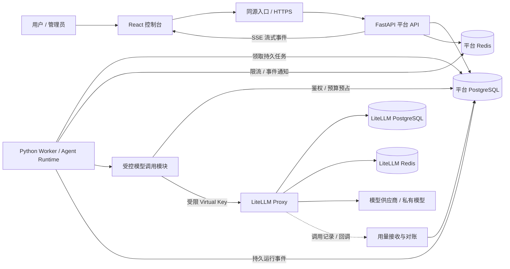
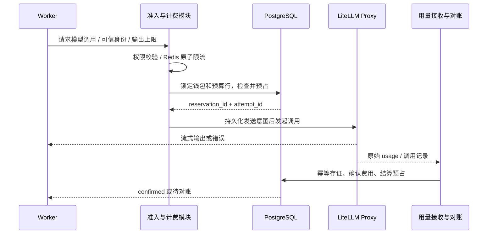

# Agent 平台架构设计

版本：v0.1（目标架构，已进入实施）

日期：2026-09-22

技术路线：Python / FastAPI + React / TypeScript + LiteLLM Proxy

第一版代码已落地；本篇保留完整目标，不代表下文所有扩展均已实现。当前功能、验证结果及与目标的差异见[实际完成范围](implementation-status.md)，运行步骤见[部署说明](deployment.md)。

## 1. 目标与默认范围

构建可自部署的 Agent 平台，让用户在统一控制台中配置 Agent、运行多轮会话，管理员能够管理账号、接入模型、查看调用统计、设置价格、分配额度和执行限流。

本方案默认面向企业内部或小规模 SaaS：从第一版建立租户隔离，界面可以先只显示一个组织。以下是设计假设，并非用户已经确认的产品要求。

| 主题 | 第一版默认方案 | 后续扩展 |
| --- | --- | --- |
| 用户体系 | 管理员创建账号、登录、停用、角色与会话管理 | 开放注册、企业 SSO、邀请加入 |
| 组织结构 | Tenant → Project；用户通过成员关系加入 | 部门、跨项目授权、套餐 |
| Agent | Prompt、模型、工具白名单、版本发布、多轮对话、运行记录 | 工作流画布、多 Agent 协作、知识库 |
| 模型 | 文本对话、流式输出、工具调用；能力按部署校验 | Embedding、图像、音频、批处理 |
| 计费 | 租户预付额度；管理员人工入账；用户/项目子预算 | 在线支付、套餐、真实发票、后付费 |
| 币种 | 单一结算币种，默认 USD；界面显示美元或明确标识的平台额度 | CNY 等币种与汇率快照 |
| 部署 | 单区域，Docker Compose 起步 | Kubernetes、多副本与独立分析存储 |

一期不引入任意代码执行、用户自定义 Python 工具、开放 MCP 服务或公共直连模型 API。这些能力需要单独的工具隔离、授权和产品契约。

## 2. 总体架构

采用**模块化单体后端 + 独立 Worker + 独立 LiteLLM 网关**。API 与 Worker 使用同一套业务模块，只按进程拆开交互请求和长时间 Agent 执行；先不拆成多个业务微服务。



两个 PostgreSQL 数据库在开发时可共用一个实例，但数据库、账号和迁移工具分开。Redis 开发时可以共用实例并隔离命名空间，生产建议独立部署以避免缓存逐出或故障互相影响。

**唯一模型出口是 LiteLLM Proxy；唯一业务授权与计费入口是平台受控调用模块。** 网络策略限制只有受控服务可以访问 Proxy；浏览器、工具进程均不持有上游密钥。

## 3. 技术选型与职责

| 层次 | 建议选型 | 职责与选择理由 |
| --- | --- | --- |
| 前端 | React + TypeScript + Vite | 管理台与交互式 Agent 会话，不需要 SSR |
| UI 与数据 | Ant Design、TanStack Query、React Router、ECharts | 表单/表格、服务端状态、路由、统计图表；版本实施时锁定 |
| API | Python 3.13+、FastAPI、Pydantic | 参数校验、认证授权、业务接口、SSE |
| 数据访问 | SQLAlchemy 2 + Alembic + PostgreSQL | 事务、并发控制、账本、持久任务和数据迁移 |
| Agent | LangGraph，经 Runtime Adapter 封装 | 多轮状态、工具循环、Checkpoint；限制框架类型向业务模块传播 |
| 模型网关 | 独立 LiteLLM Proxy | 供应商协议适配、模型路由、Virtual Key、网关用量和限流 |
| 短期协调 | Redis | 分布式限流、并发租约、SSE 唤醒；不是账本或唯一任务存储 |
| 异步工作 | Python Worker + PostgreSQL 持久任务表 | 先避免额外队列；任务通过租约、心跳与 fencing token 管理 |
| 可观测性 | 结构化日志、OpenTelemetry；后续接 Prometheus/Grafana | 关联 API、Run、模型调用、结算和异常 |

LiteLLM 官方提供 Proxy、Virtual Key、调用费用跟踪、预算与速率限制能力，适合作为中心化模型网关。[官方概览](https://docs.litellm.ai/)、[Virtual Keys](https://docs.litellm.ai/docs/proxy/virtual_keys)。

平台仍自行拥有业务用户、角色、价格、余额和账单。LiteLLM 的 spend 是网关侧成本观察值，不能直接替代商业结算账本。

### 3.1 仓库适配

- 新目录使用 `agent_platform/`，与已有 `deepAgentsProject/`、`fastapi_litellm_agent/` 独立。
- Python 依赖遵循根目录统一环境；本次不修改依赖或锁文件。现有 `uv.lock` 中 LiteLLM 是 `1.83.0`，不可把当前在线文档全部视为该版本能力。
- 既有 `chat_models.chat.chat_model` 是静态配置的共享实例。实施时在共享模型模块提供可注入的工厂，保留旧示例行为；新平台通过工厂创建指向 Proxy 的请求级客户端，禁止并发修改共享实例的 key、headers 或模型。
- 工厂必须允许按模型能力选择 Chat Completions / Responses 协议，不能无条件沿用当前共享实例的 Responses 与 reasoning 设置。
- 若采用 LangGraph 流式 API，按仓库约定使用 `version="v3"`，由适配器转成平台自己的事件协议。
- LiteLLM 部署固定经过兼容验证的镜像版本与 digest；升级单独验证，不使用浮动 `latest`。

## 4. 业务模块与责任边界

| 模块 | 平台负责 | LiteLLM 负责 |
| --- | --- | --- |
| Identity | 账号、密码、登录会话、租户成员、项目角色 | 内部网关身份和受限 Virtual Key |
| Agent | 草稿/发布版本、会话、工具授权、执行和取消 | 模型请求转发 |
| Model Catalog | 展示名称、可用范围、能力、报价、启停 | 模型部署、供应商配置、实际请求适配 |
| Admission | 业务权限、钱包预占、层级预算、每次调用准入 | 网关身份检查、供应商与部署容量限制 |
| Metering | 标准化用量、业务归属、质量状态、聚合报表 | 原始 usage、网关调用与成本信息 |
| Billing | 售价版本、预占、扣费、退款、账单、对账 | 提供可对账的调用成本证据 |
| Governance | 业务 RPM/TPM/并发、Run 步数/费用/超时 | 模型部署层 RPM/TPM 和网关防护 |

平台配置是业务事实来源，通过 `GatewayAdminAdapter` 调用 LiteLLM 管理 API 同步团队与密钥。禁止跨库直接写 LiteLLM 内部表，React 不使用 LiteLLM 管理接口。

配置同步使用持久 Outbox，状态为 `pending → applying → applied / failed`，带配置版本号。新配置未生效时不允许使用相应新授权；撤权先在平台即时阻断，再异步撤销网关 key。定时检查两边配置漂移。

## 5. 用户管理与权限

### 5.1 身份结构

一个 User 可加入多个 Tenant；Tenant 拥有 Project，Project 拥有 Agent、Session、Run。钱包归 Tenant，Project/User 预算是钱包之上的消费约束，不是重复扣费的多个钱包。

| 角色 | 权限 |
| --- | --- |
| 平台管理员 | 管理租户、供应商、全局模型；跨租户支持操作需显式选择范围并审计 |
| 租户管理员 | 成员、项目、预算分配、租户用量与账单 |
| 项目维护者 | 项目内 Agent 配置/发布、运行查看；不能修改租户钱包 |
| 项目成员 | 使用授权 Agent，管理自己的会话，查看自己的用量 |
| 财务查看者 | 只读费用、账单和导出，不默认获得对话正文权限 |

浏览器默认使用 HttpOnly + Secure + SameSite Cookie 的服务端会话，写接口校验 CSRF；密码使用 Argon2id。提供登录节流、会话撤销、账号停用和密码重置。

租户上下文由服务端验证成员关系后建立；客户端传入 tenant_id 只是选择参数。业务表包含 tenant_id，关键关联使用包含租户的外键；所有列表、导出、SSE 和详情均校验租户/项目权限。生产使用 PostgreSQL RLS 作为第二层保护，连接池通过事务级上下文设置租户，普通运行账号不得绕过 RLS。

### 5.2 密钥与归属

- MVP 使用「租户 + 项目 + 用户」作用域的内部 Virtual Key，模型白名单由平台同步，用户看不到明文。
- 平台若需持有可调用的 key，必须加密存储并由服务端解密；只存哈希无法完成代理调用。后续对外平台 API Key 则只保存哈希、首次展示明文。
- 管理 key 仅供配置同步组件使用；Runtime 使用受限 key；上游 provider key 只进入 Proxy 的密钥存储。
- 服务端生成 `tenant_id / project_id / actor_id / run_id / model_call_id / attempt_id / trace_id`；网关 metadata 中的业务归属不可采用客户端自报值。
- Worker 每次外部调用前重新检查当前账号状态和权限；运行开始时固定 Agent 版本并不意味着永久保留已撤销权限。

## 6. Agent 执行设计

Agent 草稿包括系统提示词、模型别名、生成参数、工具白名单、上下文策略、最大步数、运行时限和单次 Run 费用上限。发布生成不可变 `agent_version`；每个 Run 绑定该版本以及模型策略快照，便于回放和审计。

Run 状态：`queued → running → succeeded / failed / cancelled / expired`；取消中为 `cancelling`，需要人工决策时后续增加 `waiting_approval`。运行状态与费用状态独立：执行失败或取消后，费用仍可能等待上游确认。

1. API 校验身份与 Agent 权限，用 `Idempotency-Key` 在一个事务内创建 Run、任务和初始事件；同一用户/路由/key 的不同请求体返回冲突。
2. Worker 领取任务、获取租约，恢复或初始化 Checkpoint；同一会话默认串行执行，避免对话状态冲突。
3. 每个模型调用均经过权限、速率和余额检查；每个工具调用按版本白名单和参数 schema 检查。
4. 模型输出、工具状态与运行事件写入持久事件表，API 用 SSE 推送。增量文本按小批次写入，避免逐 token 数据库事务。
5. 浏览器断线不自动取消 Run；用户显式取消后 Worker 停止新步骤并尽力终止正在进行的上游请求。
6. Worker 崩溃由租约监督恢复；旧 Worker 不能提交新状态。已发送但结果未知的外部请求必须进入对账流程，不能盲目重放。

SSE 事件包括 `run.started`、`message.delta`、`tool.started`、`tool.finished`、`usage.updated`、`run.completed`、`run.failed`，统一包含 `event_id / sequence / run_id / timestamp`。支持 `Last-Event-ID`；Redis 仅做唤醒，断线重放从 PostgreSQL 读取。游标超出保留期时返回明确错误，并允许读取 Run 快照。

第一版工具仅开放平台预置的受控函数，禁止工具获得模型上游密钥。副作用工具需要幂等标识；任意代码与第三方工具执行后续进入独立沙箱。

## 7. 模型调用统计

区分三个统计粒度：一次 Agent Run、一条逻辑模型调用、一次实际供应商尝试。一个 Run 可以多次调用模型；重试会增加 attempt，但不能增加同一逻辑调用的客户收费次数。

每次实际尝试记录：

- 归属：tenant/project/user/agent_version/session/run/model_call/attempt。
- 模型：请求别名、实际供应商/模型/部署、端点协议、配置版本。
- 用量：原始 usage、规范化输入/输出 token、缓存读取/写入 token、reasoning token，以及这些字段是否包含在上层总量中。
- 性能：排队时长、开始/结束时间、首 token 延迟、总延迟、状态码、错误类别、终止原因。
- 金额：估算供应商成本、客户应收、成本价格版本、客户价格版本、币种。
- 证据：provider_request_id、gateway_request_id、来源、`estimated / confirmed / unresolved / adjusted` 状态。

**同一份 usage 不能从客户端、Worker 和网关各记一次费用。** Worker 记录调用意图和即时结果，网关提供计量证据；统一进入 Metering，依稳定的 attempt 标识去重，再由 Billing 结算。上游 request_id 可能缺失或重用，不能独自充当唯一主键。

报表按小时/天聚合请求数、成功率、输入/输出 token、供应商成本、客户费用和延迟，支持租户、项目、用户、Agent、模型筛选。以调用明细为事实来源，聚合表可重建；分位数由明细或可合并直方图计算，不能平均各批次 P95。

第一版目标为已确认用量在 60 秒内进入报表，这是待压测的产品目标。界面明确显示数据更新时间和待结算数量。时间存 UTC，展示默认 Asia/Shanghai；预算窗口按配置时区生成明确起止时间，不以“30 天”冒充自然月。

## 8. 计费与预算：平台持有独立账本

### 8.1 成本、售价与余额

供应商成本是平台付给上游的估算费用；客户费用按平台价目表计算。两者分别存储，供应商账单对账差异不自动改写客户历史订单。

用量先标准化为**互斥的计费分项**：未缓存输入、缓存读取、缓存写入、输出等。Reasoning 若已包含在输出 token 中就不重复收费；缓存 token 若包含在输入总量中就先拆分。无法确认语义的模型不能直接启用正式计费。

```text
客户费用 = Σ（各计费分项数量 × 对应分项单价）/ 单价单位
可用余额 = 已入账余额 - 已扣费用 - 有效预占
```

采用 PostgreSQL `NUMERIC` 与 Python `Decimal`，API 金额用十进制字符串，不用浮点数。单价记录计价单位（例如每百万 token），明细保留高精度，结算舍入规则固定并版本化。金额总是携带币种。

价格修改生成新版本，调用准入时固定价格快照。内部上下文压缩等隐藏模型调用也需被记录：默认平台承担成本、不向用户收费，仍受平台成本预算限制；对外收费项必须在价格策略中明确列出。

### 8.2 调用前预占，结果后结算



在单一数据库事务内按固定顺序锁定 Tenant 钱包、Project/User/Run 预算行，检查“已用 + 在途预占 + 本次预占”不超过各级限制，创建 reservation。多个并发请求因此不能同时花掉同一余额。

预占依据为完整输入（包含历史、工具 schema、工具结果）和输出上限，使用可验证的 tokenizer 与价格边界。未知分词规则时采用配置的保守上界；缺少可信上界、价格或生成上限的部署不开放预付模式。缓存优惠在最终 usage 确认后兑现，预占不得提前假设命中缓存。

客户余额与供应商成本预算分别预占；免费额度或零售价也不能绕过平台成本保护。MVP 一次准入只允许一次上游尝试，关闭 SDK、Proxy 和 Runtime 的隐式模型重试及自动 fallback。后续开启重试时，每次尝试重新预占上游成本，客户收费按逻辑调用最多结算一次；更换模型或价格前重新准入。

预占状态为 `reserved → in_flight → settled / released / unresolved`：

| 情况 | 处理 |
| --- | --- |
| 请求尚未发送就被明确拒绝 | 释放预占，保留拒绝原因 |
| 有完整 usage | 按确认金额扣费，释放差额；账本写入与 reservation 更新同事务 |
| 流中断或取消，但上游已产生用量 | 按确认的实际用量结算；不能把取消等同免费 |
| 超时、进程崩溃、缺少 usage | 标记 unresolved，保留预占并尝试补证；不靠 TTL 自动清零 |
| 重复回调或重复消息 | 唯一约束确保一个结算版本只影响余额一次 |
| 最终费用超过预占 | 记录异常、暂停后续调用；默认超额由平台承担并进入差异账，不静默透支客户余额 |
| 长期无法确认 | 财务按显式政策核销或人工调整，有原因和审计；不无限期隐瞒冻结金额 |

预占机制只在价格和用量上界可信时提供严格保护，不能保证供应商不会产生额外未知费用。发送意图落库与外部 HTTP 之间没有分布式事务，结果不明时必须承认不确定性，不能宣称外部调用 exactly-once。

### 8.3 账本与对账

使用追加式交易与分录记录充值、消费、退款和调整，每笔交易同币种借贷平衡；钱包余额是带锁更新的投影，可从账本重建。预占是独立占用记录，结算时才产生消费账务，不能将冻结也算一次支出。

`usage_receipts`、结算状态、账本分录、钱包投影和 Outbox 在同一事务提交；唯一键约束 `logical_call_id + charge_kind + settlement_revision`。修改历史费用采用冲正/调整交易，不覆盖原始记录。

后台定时比对平台调用、LiteLLM spend logs 与供应商可获得的账单。回调只是低延迟入口，不是可靠队列：接收端先持久化再确认；网关回调投递失败通过持久调用日志扫描补录。网关自身日志丢失且上游无查询能力时保留 unresolved 并走人工对账。

账单展示已结算明细、退款调整和期初/期末余额；待确认金额单列。人工入账需要财务权限、原因、外部凭证号与幂等键。在线支付留到后续实现验签、订单与回调状态机。

## 9. 多层限流与资源治理

| 维度 | 限制类型 | 执行位置 |
| --- | --- | --- |
| IP / 账号 | 登录频率、短期失败次数 | API + Redis |
| Tenant / Project / User | API 请求率、并发 Run 数 | 平台 Admission |
| Tenant / Project / User / Model | 模型 RPM、TPM、并发模型调用 | 平台 Admission + Redis |
| Run | 步数、累计费用、总 token、工具次数、运行时限 | Runtime + 持久预算 |
| Provider / Deployment | 供应商 RPM/TPM/并发容量 | LiteLLM 网关 |
| Tenant 钱包与子预算 | 余额、日/月费用 | PostgreSQL 事务 |

RPM 使用 Redis 原子令牌桶；TPM 先按完整输入与最大输出预留，完成后按实际 usage 调整原预留，跨窗口返回不能给新窗口错误退款。所有相关维度在一个原子脚本中判定，任一不满足则不占用其他维度。MVP 使用单主 Redis；迁移 Redis Cluster 时需重新设计跨 slot 原子性，不能直接照搬。

并发限制使用带 owner、心跳、过期时间的租约。租约回收不代表外部模型调用已经终止：不明调用继续占据预算/待核实容量，避免旧请求还在上游执行时放入新请求。若预算预占失败，应补偿释放并发槽和未发送的 token 预留；请求尝试的 RPM 可按既定策略计数。

各层限制同时满足才放行，不能用用户覆盖配置放大租户硬上限。租户钱包、层级预算统一由平台定义；LiteLLM 的 key/team 预算可作为第二道粗粒度保护，不作为强一致余额检查。官方文档列有预算、RPM/TPM 与并发限制，但具体层级语义和版本支持需实测。[Budgets, Rate Limits](https://docs.litellm.ai/docs/proxy/users)

超限返回 `429`、`Retry-After` 和可识别的业务错误码；余额不足使用 `402 insufficient_balance`，权限不足 `403`，依赖故障 `503`。交互调用快速拒绝；Run 排队有租户队列长度上限、排队超时和公平调度，避免一个租户占满 Worker。

Redis 不可用时拒绝新的付费模型调用，不降级为进程内无限制模式；账本库不可用时拒绝新预占；已发送的调用继续尝试收集证据，恢复后对账，期间不自动释放未知费用。

## 10. 关键数据模型

| 分组 | 表 | 核心关系或字段 |
| --- | --- | --- |
| 身份 | users、auth_sessions、tenants、tenant_members、projects、project_members | 账号状态、成员角色、会话版本、tenant_id |
| Agent | agents、agent_versions、sessions、messages | 发布版本不可变，Session 归属项目与用户 |
| 执行 | runs、run_attempts、run_events、jobs、checkpoints | 幂等键、租约/fencing、单调事件序号 |
| 模型 | model_catalog、model_deployments、gateway_bindings、gateway_sync_jobs | 模型能力、配置版本、密钥引用、同步状态 |
| 治理 | quota_policies、budget_windows、budget_reservations | 限制范围、窗口起止、已用与预占 |
| 用量 | model_calls、model_call_attempts、usage_receipts、usage_daily | 逻辑调用与真实尝试分开，证据来源与版本 |
| 计费 | price_versions、wallets、ledger_transactions、ledger_entries、billing_statements | 币种、价格快照、不可变交易与调整引用 |
| 基础设施 | outbox_events、audit_logs | 可靠内部事件、配置同步与管理操作审计 |

核心约束：`UNIQUE(run_id, sequence)`、`UNIQUE(tenant_id, actor_id, route, idempotency_key)`、`UNIQUE(attempt_id, source, source_event_id)`、唯一结算版本；相关表用租户复合外键防止跨租户关联。敏感写入与审计同事务。大用量表按时间分区，查询索引优先 `(tenant_id, created_at)` 与 `(run_id, created_at)`。

## 11. React 页面与 API 草案

| 页面 | 主要功能 | API 示例（均为设计草案） |
| --- | --- | --- |
| 登录/账号 | 登录、改密、查看及撤销会话 | `POST /api/v1/auth/login`、`GET /api/v1/me` |
| 总览 | 今日用量、费用、余额、失败率、活跃 Agent | `GET /api/v1/dashboard` |
| 用户与项目 | 成员、角色、启停、项目授权 | `/api/v1/users`、`/tenants/{id}/members`、`/projects` |
| Agent 管理 | 草稿、模型、Prompt、工具、发布 | `/api/v1/agents`、`POST /agents/{id}/versions` |
| Playground | 多轮对话、模型输出、工具状态、取消 | `POST /api/v1/sessions/{id}/runs` |
| 运行记录 | 状态、步骤、调用详情、费用 | `GET /api/v1/runs/{id}`、`GET /runs/{id}/events`、`POST /runs/{id}/cancel` |
| 模型管理 | 接入、能力、健康状态、可见范围 | `/api/v1/models`、`/model-deployments` |
| 用量统计 | 多维聚合、调用明细、导出 | `GET /api/v1/usage/summary`、`GET /usage/calls` |
| 费用中心 | 余额、价格、账单、调整、待确认费用 | `/api/v1/billing/wallet`、`/billing/ledger`、`/billing/statements` |
| 配额策略 | 用户/项目/模型限流与预算 | `/api/v1/quota-policies` |
| 审计 | 管理员操作、权限和价格变更 | `GET /api/v1/audit-logs` |

上表缩写路径统一位于 `/api/v1`。角色敏感操作由服务端授权，前端隐藏按钮不能作为权限控制。列表采用游标分页；错误统一包含 `code / message / request_id / details`。OpenAPI 生成 TypeScript 类型，SSE 单独定义版本化事件 schema。

## 12. 后续目录规划

以下除 README 与本文外均未创建：

```text
agent_platform/
├── README.md
├── docs/
│   └── architecture.md
├── apps/
│   ├── api/                     # FastAPI 装配、路由、SSE
│   ├── worker/                  # Run、对账、聚合、配置同步任务
│   └── web/                     # React、TypeScript、前端 package.json
├── modules/
│   ├── identity/                # 用户、租户、项目、RBAC
│   ├── agents/                  # Agent 定义与版本
│   ├── runtime/                 # Run 生命周期与 LangGraph 适配
│   ├── models/                  # 模型目录与网关管理适配
│   ├── admission/               # 统一模型调用准入
│   ├── metering/                # 用量归一化与对账
│   ├── billing/                 # 价格、预占、账本、账单
│   └── governance/              # 限流和预算策略
├── infrastructure/              # 数据库、Redis、密钥、遥测
├── migrations/                  # 平台库 Alembic 迁移
├── deploy/                      # Compose 与 LiteLLM 配置模板
└── tests/                       # 单元、契约、集成与浏览器测试
```

## 13. 部署、监控与数据管理

开发组合：Web / API / Worker / LiteLLM / PostgreSQL / Redis。Web 与 API 同源，开发服务器通过代理访问 API。只有 Web/API 对用户开放；数据库、Redis、LiteLLM 和内部用量回调走私网。

生产先使用相同组件边界扩容：API 无本地会话状态，Worker 根据排队量扩容，LiteLLM 多副本共享其数据库与 Redis。平台迁移与网关迁移分开执行；数据库定期备份、启用时间点恢复，并验证恢复后的余额与未结算预占。

需监控：队列等待、首 token 延迟、上游错误率、限流次数、活跃 Run、钱包预占、unresolved 金额、对账滞后、Outbox 积压、网关配置同步失败。告警配置只落到系统中，通知渠道后续按部署环境接入。

运营指标不包含用户 ID/Run ID 等高基数字段；这些维度进入权限控制的日志与明细表。默认不在日志与账单保存 Prompt 正文，运行历史单独按租户保留策略管理。首版建议运行事件保留 30 天、计量明细 180 天；财务账本保留期需按业务要求确定，不能随会话删除。以上保留期均为可调整建议。

## 14. 实施顺序与验收

| 阶段 | 交付范围 | 核心验收条件 |
| --- | --- | --- |
| P0：兼容验证 | 锁定 LiteLLM、模型协议、usage、回调与 key 能力 | 验证真实流式/工具调用、断流费用、Redis 限流；明确开源/付费功能边界 |
| P1：平台骨架 | API、React、数据库、登录、租户、项目 | 两租户交叉访问详情/列表/导出/SSE 均被拒绝；停用后会话失效 |
| P2：Agent 闭环 | 模型目录、发布、Session/Run、Worker、SSE | 一个 Agent 可多轮运行；重连不重新执行；取消和 Worker 恢复可验证 |
| P3：治理闭环 | 用量、价格、预占、账本、限流、报表 | 并发不重复花费额度；重复事件不重复扣费；未知费用可对账 |
| P4：上线准备 | 监控、备份、权限检查、压测、版本升级演练 | 灾备恢复与账本重建一致；故障下没有无记录调用或静默重复扣费 |

P2 在 P3 完成前仅用于有总额上限的内部开发验证，不作为正式计费产品开放。

关键测试必须覆盖：

1. 两个并发调用余额仅够一个时，只有一个得到准入；层级预算与钱包一致。
2. usage 重复、乱序或补录，不重复扣款；调整后账本仍平衡。
3. 上游在流中断前已消费、最终 usage 缺失、Worker 在发送边界崩溃，费用进入正确状态。
4. 缓存与 reasoning token 不重复计算；价格变化不改变历史收费。
5. 多 API/Worker 实例共享限流；Redis/数据库故障时按既定策略拒绝新调用。
6. SSE 重连、过期游标、浏览器关闭、取消、Worker 租约被抢占均不触发意外重复运行。
7. 用户无法通过替换 tenant_id、metadata、模型名或直接访问 Proxy 绕过策略。

性能目标在 P0 后结合模型延迟与硬件设定；初始压测可从 100 个在线会话、20 个并发 Run 开始，这只是测试起点，不是已验证的承载承诺。

## 15. 关键决策与待确认事项

推荐首先确定并保留以下架构决策：独立 LiteLLM Proxy；平台拥有身份与商业账本；每次调用预占；PostgreSQL 保证费用一致性；模型重试默认关闭；SSE 与运行状态持久化；从第一版建立租户隔离。

产品评审时需要确认：主要用于企业内部还是对外 SaaS；第一批供应商与模型；组织/项目结构；使用 USD、CNY 还是平台额度；是否要在线充值/后付费；工具与知识库是否进入一期。没有新增要求时，按照第 1 节的默认范围实施。

## 16. 官方参考与验证边界

以下资料于 2026-09-22 查阅，用于确认 LiteLLM 的能力类别；本文中账本、准入、恢复与业务 API 为平台设计建议，不是 LiteLLM 已提供的完整产品功能。

- [LiteLLM 官方文档](https://docs.litellm.ai/)：SDK 与 Proxy 的定位、协议适配。
- [Virtual Keys](https://docs.litellm.ai/docs/proxy/virtual_keys)：网关密钥、模型访问与数据库配置。
- [Budgets, Rate Limits](https://docs.litellm.ai/docs/proxy/users)：预算和速率限制；不假设所有租户层级自动具有相同继承语义。
- [Spend Tracking](https://docs.litellm.ai/docs/proxy/cost_tracking)：网关费用跟踪，作为平台计量与对账输入。

SSO、复杂 RBAC、审计、高级策略等是否受 LiteLLM 版本或商业许可限制，必须在 P0 针对实际使用功能逐项核对；本方案不默认购买 Enterprise，也不依赖其管理界面作为平台控制台。
