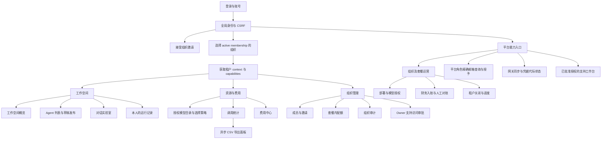
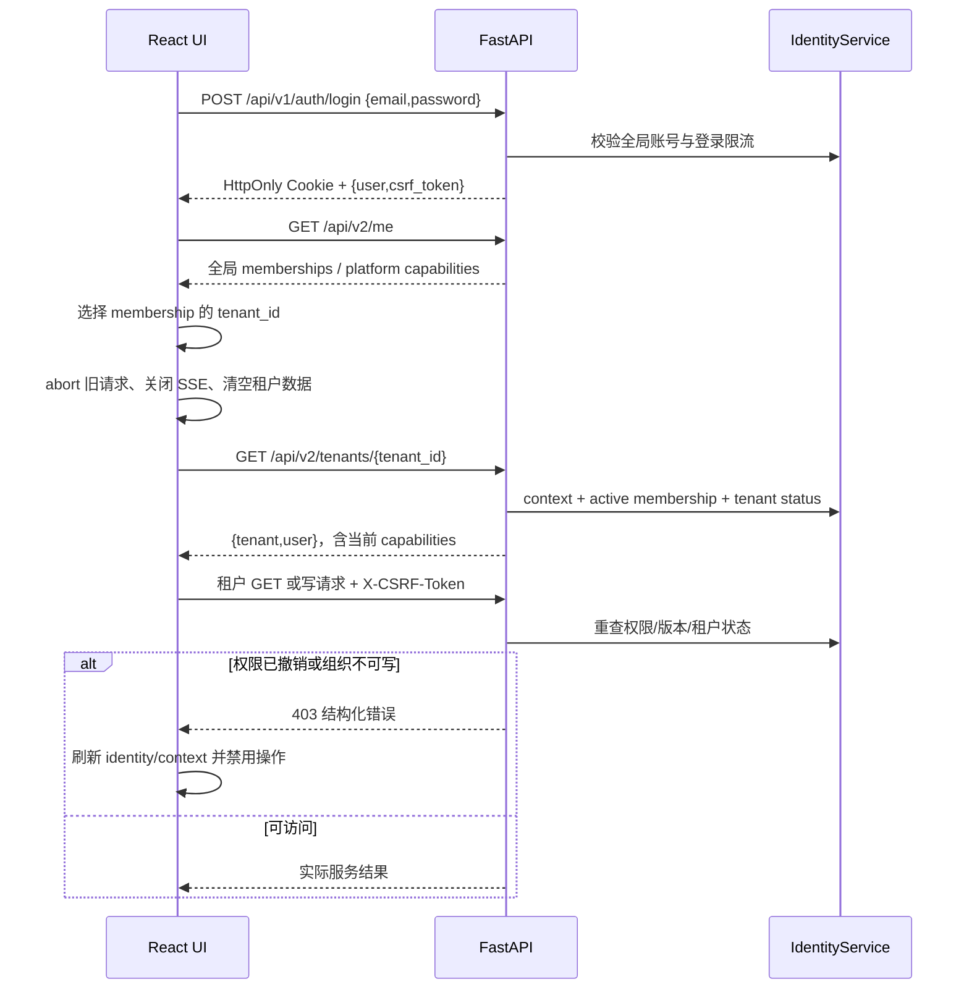
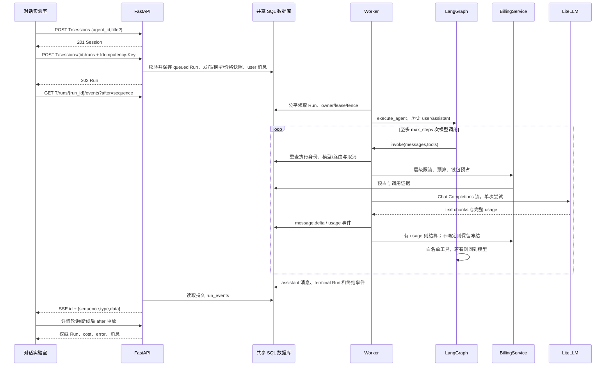
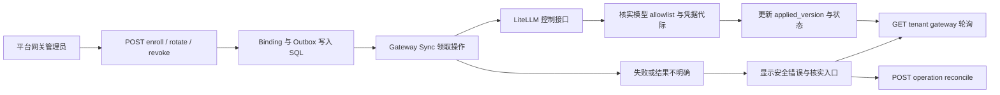
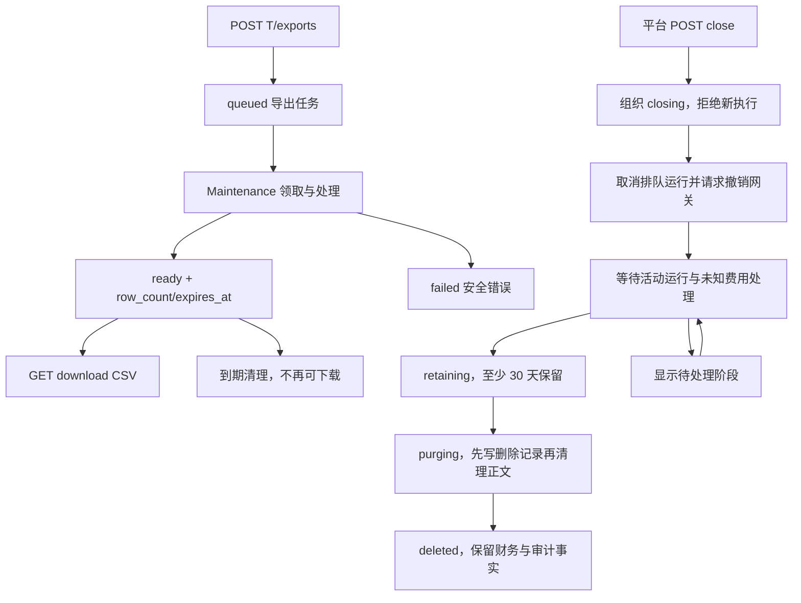

# 前端功能规格与实现交接

> 源码核查日期：2026-10-02。基线：`master`，`db1ab95367b53d84e68cb39f59c97715ccce37a0`。本文描述该提交的真实接口，不把历史设计当作已交付能力。文档提交本身不改变应用代码。

## 1. 交付目的与证据边界

本规格供 Codex 在现有 `agent_platform/apps/web` 中实现或完善可执行 UI。所有可操作功能必须对应 [接口契约与页面映射](frontend-api-contracts.md) 中已核实的后端服务；没有接口的功能只可明确标为尚未提供，不可用假数据伪装成功。

可靠的架构结论：这是共享领域代码和数据库的多进程平台。FastAPI 提供身份、租户和平台管理 API；Worker 从 SQL 领取 Run，使用 LangGraph 的 model/tools 循环执行，通过 LiteLLM 调用模型；持久事件通过 SSE 返回浏览器。Maintenance 处理 CSV 导出和租户关闭，Gateway Sync 处理网关控制 Outbox。Web 是 React/TypeScript/Vite SPA，既可由 API 静态托管，也有独立 NGINX 镜像及 Chart。进程和 Helm release 已拆开，领域与数据库仍紧密相连。

本次执行了源码阅读、Git 本地与 GitHub 分支对照、接口静态提取和文档检查。没有启动 API、Worker、网关、数据库或测试；没有读取 `.env`、运行凭证或真实租户数据。因此“代码存在”不等于“当前部署已验收”。测试文件和历史验证记录只能说明测试意图或当时记录，不能作为本次 live API 通过的证明。

初始工作区：`agent_platform` 无改动；根目录有未跟踪 `index.html`，与本交付无关。本地 HEAD、`origin/master` 和只读查询到的 GitHub `master` 均为上述基线。只提交本文及配套文档；不改应用代码、不部署。

## 2. 阅读顺序

1. 本文：页面范围、功能图、关键交互、实现规则和验收条件。
2. [frontend-api-contracts.md](frontend-api-contracts.md)：真实 method/path、请求与响应、角色、错误、分页和 SSE 契约。
3. [architecture-source-audit.md](architecture-source-audit.md)：目录、边界、存储、后台任务、部署、耦合和待验证项。

现有 [multi-tenant-implementation.md](multi-tenant-implementation.md) 可作背景；[architecture.md](architecture.md) 包含长期设计；[implementation-contract.md](implementation-contract.md)、[implementation-status.md](implementation-status.md) 和 [deployment.md](deployment.md) 已标历史。接口冲突时以本文核查基线的 route/schema/service 为准。

## 3. 功能与导航图

此图的页面名称对应当前 `App.tsx`，导出是调用统计页的内嵌面板，平台资源与关闭是平台运营子面板。不是新增浏览器路由。

能力决定是否显示页面和按钮，后端再次鉴权。平台角色不会自动产生组织 membership；组织选择列表来自全局身份，不能以任意 tenant ID 模拟权限。暂停/关闭中的组织应标为只读，导出和支持读取按各自专用接口规则处理。当前导航证据：[App.tsx:14](../apps/web/src/App.tsx#L14)、[App.tsx:142](../apps/web/src/App.tsx#L142)。

## 4. 页面与可执行范围

下表是实现范围，不是额外 API。`T` 表示 `/api/v2/tenants/{tenant_id}`，`P` 表示 `/api/v2/platform`；完整 URL、字段和错误见配套接口文档。

| 页面/入口 | 真实数据与操作 | 现有复用 | 关键限制 |
| --- | --- | --- | --- |
| 登录、账号、退出 | `/api/v1/auth/login`、`/auth/password`、`/auth/logout`；`/api/v2/me` | `App.tsx`、`api.ts` | Cookie + CSRF；没有公共注册、找回密码、MFA 或 OAuth 接口 |
| 组织选择/上下文 | `GET /api/v2/me` memberships；`GET T` | `App.tsx`、`types.ts` | 切换时取消请求、SSE、轮询，丢弃旧租户结果；平台身份没有默认组织 |
| 概览 `#overview` | `GET T/dashboard` | `DashboardPage` | 汇总范围由后端决定，非任意日期或用户筛选；网关配置布尔值不能证明真实可用 |
| Agent `#agents` | `GET/POST T/agents`、`PATCH T/agents/{id}`、`POST .../publish` | `AgentsPage`、内置 starter prompts | 成员只看到发布版；编辑只改草稿，发布生成版本；没有删除/复制/多 Agent 编排接口 |
| 对话 `#playground` | 模型/Agent 列表、会话创建/分页/详情、Run 创建/事件/详情/取消 | `Playground.tsx` | Run 202 为排队；同一会话串行；工具仅 calculator/current_time；没有文件附件、RAG、语音或图片接口 |
| 运行 `#runs` | `GET T/runs`、`GET .../{id}`、会话跳转 | `RunsPage` | 本人运行，不能因是管理员就查看别人的正文；没有 retry/restart 接口 |
| 模型 `#models` | `GET T/models`、`GET/PUT T/model-policy`、`PATCH T/models/{id}` 仅 active | `ModelsPage` 的非旧管理员分支、`TenantModelPolicy` | 注册/价格/部署在平台入口；模型策略 PUT 需发送完整状态 |
| 调用 `#usage` | `GET T/usage/calls`，cursor 分页 | `UsagePage` | member 本人；`usage.read_all` 可全组织；页面文本搜索只能搜索已加载行 |
| 费用 `#billing` | `GET T/billing/wallet`、`ledger`、`reservations` | `BillingPage` | USD 十进制字符串；未知供应商成本显示未知；充值不是在线支付 |
| 导出面板 | `POST/GET T/exports`、`GET .../{job_id}/download` | `TenantExportsPanel` | 202 后轮询；CSV 内容范围/到期由后端控制；只在 ready 时下载 |
| 成员 `#users` | memberships 读取/修改、邀请创建/读取、ownership-transfer | `MembersPage` | 编辑 membership，不修改全局账号；owner 不经普通角色下拉降级；邀请 token 不进入日志 |
| 配额 `#quotas` | `GET/PUT T/quotas`、`GET T/entitlements` | `QuotasPage` | 0 禁止，null 无该内部限制；仍受套餐上限；预算是累计上限，不是自然月预算 |
| 审计 `#audit` | `GET T/audit` | `AuditPage` | 最多 200；不是无限分页；组织审计与平台审计分开 |
| 支持审批 `#support-access` | `GET/POST/DELETE T/support-grants` | `OwnerSupportPanel` | owner、1–60 分钟；正文授权明确选择，metadata 为默认 |
| 邀请 `#invite` | `POST /api/v2/invitations/accept` | `InvitationPage` | 已登录全局账号接受，身份 email 必须匹配；无邮件发送接口 |
| 平台 `#platform` | P tenants、entitlements、models/deployments/model-grants、audit、财务、closure | `PlatformPage`、`PlatformResources`、`BillingReconciliation`、`OperationsPanel` | 各按钮按平台 capability；平台 admin 不自动有财务能力 |
| 网关 `#gateway` | `GET P/gateway`、tenant gateway 状态、enroll/rotate/revoke、operation reconcile | `PlatformGatewayPage` | POST 是后台同步请求；显示 desired/applied version、error 和待核实状态，不显示密钥 |
| 支持 `#support` | `/api/v2/support-grants`、grant usage、显式授权 session 内容 | `SupportPage` | 专用只读路径，不 impersonate；内容默认不授权；超时/撤销立即拒绝 |

### 4.1 已有代码但不可作为可执行功能的旧入口

`pages.tsx` 中旧 `UsersPage`、`GatewayPage` 没有被当前 App 挂载；`ModelsPage` 的旧管理员编辑路径不代表当前租户可注册/改价。当前后端旧 user POST/PATCH 返回 `410 use_invitations/use_memberships`，旧 model POST 返回 `410 use_platform_models`，model PATCH 除只含 active 外返回 `403 use_platform_models`。详见 [main.py:330](../apps/api/main.py#L330)、[main.py:360](../apps/api/main.py#L360)。

实现时复用 `MembersPage`、平台资源入口及模型策略组件；不要重新激活旧表单。注册了 route 但固定拒绝的 endpoint 在附录中标为退役，不计入可操作能力。

### 4.2 不允许凭空增加的能力

当前 `agent_platform` 未提供公共注册/找回密码、文件上传/知识库、向量检索、任意 MCP/代码沙箱、定时 Agent、Webhook、语音/图像消息、会话/Agent 删除、任意模型价格编辑、真实支付/发票/自然月账单、Run 重启/Checkpoint 续跑或 WebSocket 接口。若未来要实现这些功能，先增加并验收后端契约，再扩展 UI。

## 5. 关键执行流程图

### 5.1 登录、组织切换和权限变化

### 5.2 对话、模型调用、费用和 SSE

浏览器 SSE 与 LangGraph v3 内部事件协议不同；UI 只消费平台持久事件。图中 `T` 仅为 URL 前缀缩写。取消、失败或断线不能显示为“零费用”；不确定 usage 必须保留 pending 财务状态。源码：[main.py:449](../apps/api/main.py#L449)、[engine.py:188](../modules/runtime/engine.py#L188)、[gateway.py:146](../modules/runtime/gateway.py#L146)。

### 5.3 网关控制异步完成

此图不保证每个 LiteLLM 部署支持全部控制能力。API、Worker、Maintenance 不接收 control-plane key；浏览器只显示脱敏状态。模型目录、租户授权、binding applied 状态与真实推理服务必须同时成立。

### 5.4 导出与租户关闭

UI 只能轮询接口返回的 status/error_code，不能把“close 已请求”当作已清理，也不能实现“恢复 deleted”按钮。暂停组织与最终关闭不同，resume 接口不恢复 closing/deleted。导出只是调用/运行元数据，不包含会话正文。ready 响应不含 filename；下载名在 Content-Disposition 中。

## 6. UI 通用状态与操作规则

| 状态 | 必须表现 | 操作映射 |
| --- | --- | --- |
| 初始化/加载 | 明确 loading，避免展示上一账号/租户数据 | 使用 AbortController 和 scope revision；作用域变化丢弃响应 |
| empty | 按真实空数组/无 membership/无已发布 Agent/无授权模型显示原因 | 仅向有权限用户提供创建/邀请/授权入口 |
| submitting | 仅禁用当前提交与重复点击，保留输入 | 金融、Run、租户创建、导出保持同一幂等键重试同一内容 |
| 401 | 清空身份/租户/CSRF/SSE，返回登录 | 不继续自动发送旧业务请求 |
| 403 | 显示安全 error.message；刷新当前权限/上下文 | 禁用失效动作，scope_changed 作为取消处理 |
| 409 | 展示冲突，刷新版本/状态 | 不盲目重试 expected_version；相同幂等键不能换 payload |
| 410 | 显示退役/过期原因 | 不保留旧 user/model 写表单或已过期下载按钮 |
| 422 | 表单字段提示，使用 error.details 的 field/message | 不输出密码、token 或整个提交 payload |
| 429 | 显示限流，尊重 Retry-After | 不以密集轮询或自动写重试绕过准入 |
| 503/network | 可读错误和重试入口 | 保留已确认数据及输入；异步任务通过详情接口恢复 |
| 组织非 active | 只读标记与受支持的读取/导出 | 运行、Agent/成员/模型策略写入禁用，具体错误以后端为准 |
| queued/running/cancelling | 明确阶段，不伪造完成/费用 | 运行取消根据状态；SSE断线显示恢复状态并读详情 |
| 财务 unresolved/blocked | 区分未知费用、冻结和已确认金额 | 只有平台财务显示 resolve/unblock；必须提交原因 |
| 网关未应用/待核实 | desired/applied、安全 error、operation 状态 | 平台网关角色可请求控制或核实；不能显示密钥或宣称可运行 |

金额必须保存为 decimal 字符串并以 USD 标识；显示层可格式化，提交不能用浮点运算改价。`provider_cost=null` 显示“未知”，不能填客户 cost。`0`、`null` 和空字符串的预算/配额语义不能混淆。

当前 `api.ts` 会隐藏 validation details、`Retry-After`、`X-Request-ID`，`write()` 每次生成新幂等键；这些是后续前端实现可改进点，不代表后端已有额外接口。证据：[api.ts:39](../apps/web/src/api.ts#L39)、[api.ts:80](../apps/web/src/api.ts#L80)。

## 7. Codex 实施指令与范围

在现有 React 19 + TypeScript + Vite 项目内复用组件、CSS、Lucide 图标、API helper 和已有页面。保留同源 Cookie、CSRF、hash route、显式租户 context；保留手机导航和 scope cancellation。按本规格补交互、表单约束、分页、SSE恢复及错误状态，不新建一个脱离后端的演示应用。

每个按钮建立 `功能 → method/path → 请求类型 → 成功响应 → 错误 → capability` 映射。平台与租户操作必须调用各自命名空间；不能把前端 role 字符串或 hide 按钮作为唯一鉴权。优先使用 context/identity 返回的 capabilities。

推荐实施顺序：登录/组织作用域与错误 → Agent/模型目录 → 会话/运行/SSE → 调用和账务只读 → 成员与配额 → 平台模型/网关/财务 → 导出/关闭/支持。任何源码与规格不一致的部分先复核基线，不把历史文档中的功能补成假接口。

本次交付仅文档；上述实现是后续任务的范围，不宣称已重写 UI。依赖安装、迁移、引导账号和启动服务都有副作用，须在隔离验收环境执行，不属于本次只读调研。

## 8. 后续验收条件

| 层级 | 可检查条件 | 本次结果 |
| --- | --- | --- |
| 静态契约 | 页面每项动作都有本基线真实接口；路径/请求/角色/响应与源码一致 | 文档核对，不是 live 请求 |
| 文档 | Mermaid fence、相对路径、关键源码行号、接口覆盖可检查 | 交付时报告具体检查 |
| 前端构建 | 在 `apps/web` 执行 `npm ci`、`npm run build`，TypeScript/Vite 无错误 | 未执行；不改依赖/锁文件 |
| API 集成 | 隔离数据库，完整迁移；逐角色登录与403/CSRF/版本冲突用例 | 未执行 |
| 运行流 | queued→running→终结、工具、SSE重连、取消、会话串行、租户切换无数据串扰 | 未执行 |
| 财务 | 预占/结算/未知费用、金额字符串、平台财务与组织管理分离 | 未执行 |
| 异步任务 | Maintenance 导出/到期与关闭阶段；Gateway Sync desired/applied 与核实 | 未执行 |
| 真实部署 | PostgreSQL非owner/FORCE RLS、Redis、LiteLLM控制与推理、容量/备份恢复 | 未执行；不能从Chart或测试文件推断通过 |

后续 API/浏览器验收必须使用隔离数据与明确的网关测试环境；报告实际运行命令、配置类型、角色场景及失败项。不得把历史 `test_api.py` 等测试的存在或旧文档中的通过数字直接复制为当前结果。
