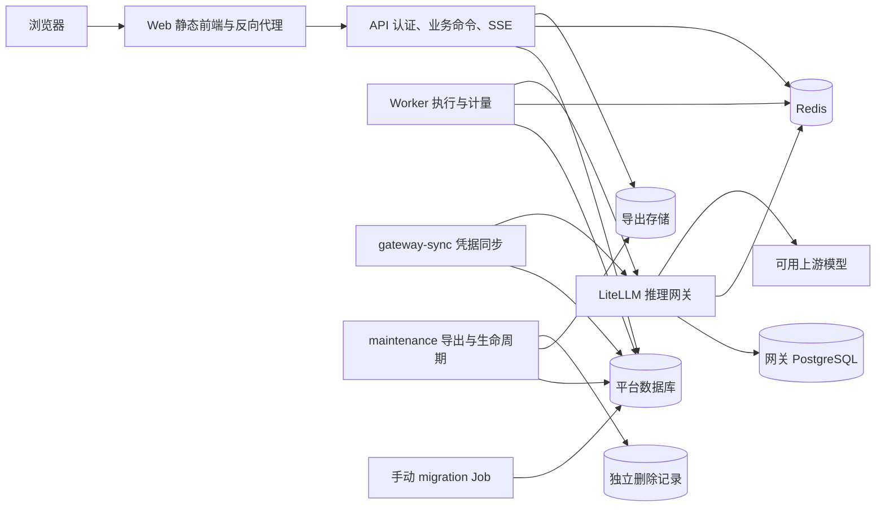

# 独立服务与 Helm 部署

更新：2026-10-01。当前默认部署使用已有 `orbstack` 集群的 `agent-platform` 命名空间。Web 控制台继续为 <http://127.0.0.1:8010>，LiteLLM 管理页为 <http://127.0.0.1:4000/ui>。

## 服务边界



| 服务 / Chart | 职责 | 直接依赖 |
| --- | --- | --- |
| `charts/web` | React 静态文件、同源 API/SSE 转发 | API Service；没有模型密钥、数据库或 PVC |
| `charts/api` | 认证、组织上下文、业务命令、SSE、下载 | 平台数据库、Redis、运行密钥、只读导出文件 |
| `charts/worker` | 调度、Agent 执行、模型调用、计量结算 | 平台数据库、Redis、推理网关与组织凭据 |
| `charts/gateway-sync` | Outbox、网关开通、轮换、撤销 | 平台数据库、独立网关控制凭据 |
| `charts/maintenance` | 导出、过期回收、组织关闭 | 平台数据库、加密密钥、导出/删除记录存储 |
| `charts/migration` | 显式 Alembic schema 迁移 | 独立迁移身份与平台数据库 |
| `charts/litellm` | 推理路由、供应商接入、管理页面 | 自己的 PostgreSQL、Redis、专用 Secret |
| `charts/postgres` | 可选自托管网关数据库 | 自己的持久卷、初始化 Secret |
| `charts/redis` | 可选自托管缓存与准入服务 | 自己的持久卷，可配置认证 Secret |
| `charts/storage` | 独立管理导出/删除记录 PVC | StorageClass；本地兼容时还管理 SQLite PVC |

每个 Chart 都可以单独安装、升级和回滚。没有 umbrella Chart 或 `dependencies` 自动安装其他服务。九个常驻 release 名为 `platform-<service>`；migration 是按版本显式运行的独立 Job release。每个应用有自己的 ConfigMap、资源限制、镜像、探针与配置校验。

后台进程按角色构建最小服务上下文，不加载 HTTP `Platform` facade。公共运行记录写入函数独立复用；Worker 仍使用身份、计量和网关领域库，maintenance 使用身份和撤销库。当前仍共享平台数据库和核心领域代码，账务与运行状态保持同一事务边界。此轮没有将每个业务领域改为独立数据库服务。

API 镜像不编译或打包前端。`deploy/Dockerfile` 提供 api、worker、gateway-sync、maintenance、migration targets；`deploy/Dockerfile.web` 独立构建 Web。前端通过 `/api/` 同源转发保留 Cookie、Host、CSRF Origin 和组织参数，SSE 禁用缓存/缓冲。默认最终后端 target 是 api；旧 native 开发仍可用 Vite 或已有 dist。

## 健康与独立发布

- Web `/healthz` 只检查自己的 HTTP 进程；API 不可用时静态前端仍能被提供。
- API `/api/v1/health` 是进程存活检查，`/api/v1/ready` 检查 schema 和 Redis，不要求其他角色心跳。
- 后台使用 `python -m agent_platform.scripts.service_probe <role>`，检查 schema 和自己的 Pod UID 心跳。另一副本不能替坏副本通过探针。
- `/api/v1/platform-status` 保留聚合后台状态，需要平台组织管理权限，不参与 API readiness。
- Worker 收到 SIGTERM 后停止领取新任务，等待已领取运行完成。Chart 要求宽限期至少为 `runTimeout + 30` 秒。

单个服务更新不会执行全栈 drain、发布其他 Chart 或隐式迁移数据库。当前 SQLite 服务一个副本并使用 Recreate，更新仍会有短暂中断；Web、网关或数据库升级也可能影响各自的直接调用方。

## 本地常用命令

依赖 `uv`、`make`、Docker、`kubectl`、Helm。本机实际使用 Helm 4.0.4；工具兼容具有 `--take-ownership` 的 Helm 3。CLI 仅操作 `orbstack`；其他集群直接使用各 Chart。

```sh
make -C agent_platform start                   # 逐个更新常驻 release，不运行迁移
make -C agent_platform deploy SERVICE=worker   # 仅构建并更新 Worker
make -C agent_platform deploy SERVICE=web      # 仅构建并更新 Web
make -C agent_platform deploy SERVICE=api KUBE_ARGS=--skip-build
make -C agent_platform stop SERVICE=worker     # 只停止 Worker，保留 release/数据
make -C agent_platform resume SERVICE=worker   # 保留已发布镜像和 values 恢复 Worker
make -C agent_platform status
make -C agent_platform k8s-logs SERVICE=gateway-sync
make -C agent_platform charts-validate         # 离线 lint/template
make -C agent_platform stop                    # 关闭准入，等运行收尾，再停所有工作负载
make -C agent_platform resume                  # 按依赖顺序恢复原 release
```

支持 `SERVICE=storage|postgres|redis|litellm|api|worker|gateway-sync|maintenance|web|all`。`storage` 只有持久卷，不能 stop。`KUBE_CONTEXT`、`KUBE_NAMESPACE`、`KUBE_IMAGE` 默认分别为 `orbstack`、`agent-platform`、`agent-platform:0.3.0-helm`。镜像名派生为 `agent-platform-<role>:0.3.0-helm`；生产交付应使用独立版本 tag。

部署使用该服务的 `values.local.yaml`，保留之前 release 中未显式覆盖的 values。额外配置通过 `KUBE_ARGS='--values /absolute/path/worker.yaml'` 传入，只允许一个 `SERVICE`。`resume` 只将 replicaCount 恢复为 1，不重设镜像或 values。构建发布通过独立 build annotation 创建新 Pod；只引用已存在的集群 Secret，不读取旧 `.env` 的凭据。

## 显式数据库迁移

```sh
make -C agent_platform migrate
make -C agent_platform resume
```

本地迁移先构建迁移镜像、检查配置、关闭 API 准入并等待现有运行收尾，再停止四个应用写入者，安装独立版本 Job。失败时应用保持停止，诊断见 `.data/kubernetes/last-error.log`；修复后再迁移/恢复。普通 `deploy`、`start`、`resume` 不运行 Job。迁移不是任意服务 Chart 的 hook，也不携带运行 Key 或网关 master key。

当前 schema 为 `0007_support_access`，本轮服务拆分没有新增 schema。数据库变更须按兼容性顺序显式发布；回滚 API 镜像不会自动回滚数据库或已产生账务。

## 通用 Chart 与本地 profile

默认应用 Chart 使用外部 PostgreSQL Secret `platform-database-secret/PLATFORM_DATABASE_URL`；migration 使用独立的 `platform-migrator-secret`。没有默认 SQLite 卷或固定节点。API/maintenance 引用共同的 `platform-exports` PVC，API 只读、maintenance 可写；仅维护服务挂载独立的 `tenant-tombstones`。worker/gateway-sync 默认没有文件卷。

部署者需提前准备迁移/运行连接身份、持久加密 Key、网关控制凭据及存储。引用现有依赖的示例：

```sh
helm upgrade --install platform-worker ./agent_platform/charts/worker \
  --namespace agent-platform --create-namespace \
  --set image.repository=registry.example/team/platform-worker \
  --set image.tag=YOUR_RELEASE \
  --set database.existingSecret=platform-database-secret \
  --set config.redisUrl=redis://redis.example:6379/0 \
  --set config.litellmUrl=https://gateway.example/v1 --wait
```

外部 PostgreSQL、Redis、LiteLLM 可分别替代自托管 Chart。包含密码的 URL 必须放 Secret，不能放 Helm values。网关 Chart 的 `DATABASE_URL` 与平台数据库连接分别管理；`postgres` Chart 只初始化可选网关角色，不创建平台迁移/RLS角色。应用启动验证平台 schema 与 SaaS 运行角色，迁移只由 migrator 完成。

通用 storage Chart 默认请求 RWX 导出/删除记录存储；应使用支持 RWX 的 StorageClass 或预先准备 PVC。SaaS API 需要 HTTPS/secure Cookie。迁入平台 PostgreSQL、RLS 与共享存储并完成验收后，才能按服务分别扩副本。

`values.local.yaml` 精确保留当前实例：

- 平台 SQLite 位于 `platform-data`，四个应用固定 OrbStack 单节点、单副本、Recreate；Chart 拒绝多副本或滚动重叠。
- 导出目录仍位于 `platform-data/exports`；只有 maintenance 另挂 `tenant-tombstones`。
- PostgreSQL 当前仅保存 LiteLLM 数据；Redis 和网关各自一个副本。
- Web LoadBalancer 暴露 8010，API ClusterIP 只暴露内部 8000；LiteLLM LoadBalancer 继续暴露 4000。

当前本地 SQLite 共享卷仍是耦合边界。Charts 的 PostgreSQL 默认值提供目标部署契约，不会自行迁移原有数据。

## 首次接管与导入

现有 Kubernetes 资源首次切换使用：

```sh
make -C agent_platform helm-adopt
```

先 lint/渲染、核对 Secret/PVC、Helm 所有权、selector、StatefulSet 持久卷模板和 PVC 容量/模式，并保存非敏感资源快照。构建镜像后，再核对资源所有权并接管，拒绝抢占其他 release。没有强制替换 StatefulSet/PVC；原 UID 与绑定卷保留。Helm 4 显式分别执行 install/upgrade，使用客户端补丁避免旧 SSA 字段所有权冲突；首次 API Service 端口变更单独替换端口列表并保留 ClusterIP。

接管完成后的入口为 `scripts/helm.py`。旧 `scripts/kubernetes.py deploy/status/stop/logs` 转发到 Helm；单体 `deploy/kubernetes/stack.yaml` 仅供历史的一次性导入，不参与日常发布。`platform-config` 与旧资源快照留作导入记录，当前应用只引用各自 ConfigMap。

尚未从旧本机 supervisor/Compose 导入的实例可执行 `make k8s-import`：先运行原数据导入工具，再建立 Helm releases。当前本机已经导入并接管，不要重复导入。导入拒绝覆盖已有目标 PVC；原备份保留在 `.data/kubernetes/backup-<UTC>/`，包括平台 SQLite、导出、删除记录、Redis、LiteLLM dump 和校验清单。

## Secret、存储与恢复

Chart 不创建含凭据的 Secret，只投射必要键：

| 已有 Secret | 使用者 |
| --- | --- |
| `platform-runtime-secret` | 四个应用的加密 Key；本地兼容受限运行 Key按需投射 |
| `platform-database-secret` | 通用 PostgreSQL 应用运行身份 |
| `platform-migrator-secret` | 仅迁移 Job |
| `gateway-control-secret` | 仅 gateway-sync 的控制 URL/Key |
| `litellm-secret` | 仅 LiteLLM 的上游、管理凭据、数据库连接 |
| `postgres-secret` | 仅 PostgreSQL 初始化 |

后续发布不重生成或覆盖 Secret。数据密码轮换需要先更新数据库用户，再同步相关 Secret 和 Pod。镜像排除 `.env`、`.data`、数据库、日志与依赖缓存。

本地四个 PVC 为 `platform-data`、`tenant-tombstones`、`data-postgres-0`、`data-redis-0`。storage 资源有 Helm keep 注解；StatefulSet 删除/缩容均保留 PVC；绑定 PV 回收策略为 Retain。单服务发布只检查其引用的卷。日常停启不卸载 release、不删除 namespace、PVC 或 Secret。

可以单独 `helm history platform-worker` / `helm rollback platform-worker <revision> --wait`，前提是旧镜像与当前 schema 兼容。清理 migration Job release 只针对已完成任务，不卸载持久存储 release。数据库、导出文件、删除记录、网关数据库和加密 Key 要分别备份；Helm history 不备份卷内容。

本轮部署前在线备份位于 PVC 内 `/app/agent_platform/.data/backups/helm-service-split-20261001.db`，非敏感资源快照保存在本机 `.data/kubernetes/helm-adoption-*.json`。旧本机数据库是冻结副本；新写入发生后，恢复需要先停止集群写入、备份当前卷、核对网关状态并重放独立删除记录，不能直接启动旧 supervisor 或旧 Compose 数据。

## 本次落地记录

- 10 个独立 Charts，9 个常驻 Helm releases；6 个 Deployment、2 个 StatefulSet 均就绪，migration 仅显式运行。
- 四个原 PVC 及其绑定 PV 保留；9 个 Agent、3 个会话、4 个历史运行及用户、组织、账务、路由内容与切换前备份一致。
- SQLite 完整性为 ok，外键错误为 0；业务表行数无变化。
- Web `/healthz` 和通过 8010 转发的 API `/ready` 可用；单独 Web 发布未重启其他服务。
- 10 个 Chart 的本地配置 lint/template 通过；角色依赖、凭据范围、不可变资源、SQLite 约束及 Web/SSE 转发有专项检查。
- 未发送付费模型请求；PostgreSQL 隔离与容量正式验收仍按多租户运行手册完成。

依据：[Helm 升级与接管](https://docs.helm.sh/docs/helm/helm_upgrade/)、[NGINX 代理缓冲](https://nginx.org/en/docs/http/ngx_http_proxy_module.html)、[OrbStack Kubernetes](https://docs.orbstack.dev/kubernetes/)。
