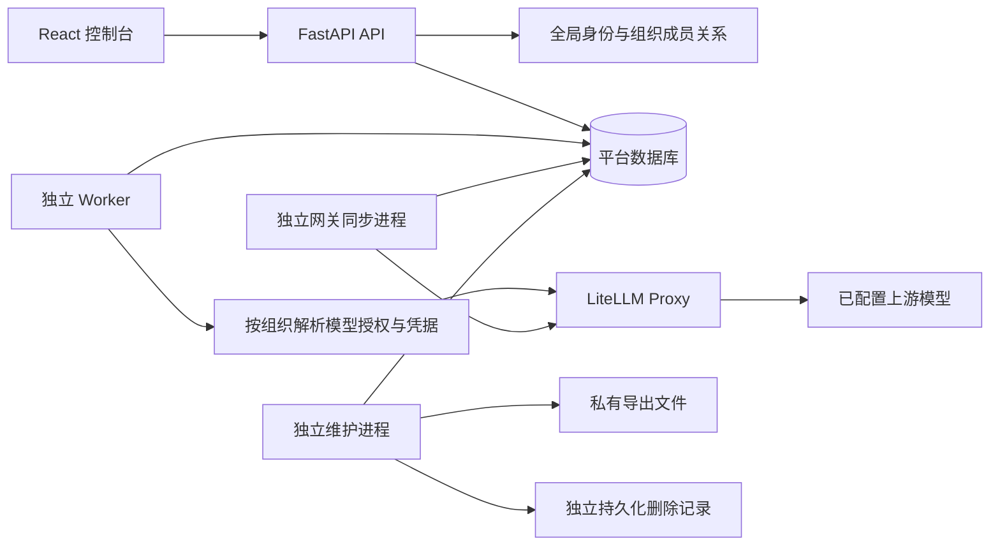

# 多租户实现说明

更新：2026-09-30。代码实现基于《多租户迭代设计方案》，数据库最新迁移为 `0007_support_access`。

本机部署已迁入 OrbStack Kubernetes，当前资源、持久化与管理命令见 [Kubernetes 本地部署](kubernetes-local.md)。下述首次迁移记录保留历史过程。

**当前状态：功能实现与本地迁移已落地；I5 的 PostgreSQL 隔离、故障注入、真实网关兼容性及容量验收尚未执行。不得将旧版本的测试数量作为本版本的验收结果。**

## 1. 系统组成

- API：认证、CSRF、组织上下文、业务命令、平台运营、持久事件读取。
- Worker：按组织轮转领取任务；执行 LangGraph、调用模型、结算及恢复失联任务。
- gateway-sync：消费持久 Outbox，执行网关用户和受限 Key 的创建、核查、轮换与撤销。
- maintenance：分页生成导出文件、回收过期文件、推进组织关闭和内容清理。
- PostgreSQL 是 SaaS 运行目标；SQLite 保留本地开发模式。Redis 参与速率准入，数据库是钱包和并发预占的最终依据。

四种运行进程均只检查数据库版本，不运行建表或初始化。`init` 是独立运营命令。Compose 使用迁移角色 `platform_migrator` 和无表所有权、无 `BYPASSRLS` 的 `platform_runtime`；SaaS 启动拒绝超级用户或表所有者。

## 2. 身份和访问规则

### 全局用户、组织成员关系

`platform_users` 是全局账号，保留旧 `tenant_id/role` 列以迁移历史数据。**授权只读 Membership，旧列不再授予组织权限。**

新增成员关系具有 `tenant_id、user_id、role、status、authz_version`。一个用户可以加入多个组织；撤销成员不会删除用户或账务。

| 角色 | 范围 |
| --- | --- |
| owner | 组织管理、所有权转移和支持访问审批 |
| tenant_admin | 成员、Agent、模型选择策略及套餐以内的内部配额 |
| member | 本人的运行、对话及调用明细 |
| finance_viewer | 组织用量和账务元数据，无对话正文及运行权限 |
| platform_admin | 平台组织、套餐、部署、价格、网关及平台角色管理 |
| platform_finance | 平台入账、对账、核销、解冻及供应商成本字段 |
| platform_support | 只能使用组织明确批准且未到期的专用支持授权 |

`PLATFORM_OPERATOR_EMAILS` 仅在显式初始化时引导指定账号的平台管理员和财务角色。普通组织管理员不会自动成为平台运营人员；已撤销的平台角色不会在重启时恢复。

### 显式组织上下文

- 全局账号及成员目录：`GET /api/v2/me`，同时返回 CSRF Token。
- 组织资源：`/api/v2/tenants/{tenant_id}/...`。
- 当前标签页使用独立的 `sessionStorage` 和 URL 组织标识；切换立即终止旧请求和 SSE，迟到响应不能填进新组织。
- v1 兼容业务路径只在账号具有唯一有效成员关系时解析组织；多个组织必须使用 v2。
- 认证、改密及退出属于全局身份，不依赖当前组织。

平台角色不构造虚假的组织成员。平台运营端点明确指定目标组织，并在写入事务中重新检查相应能力。

### 正文隐私和支持访问

会话和运行正文始终属于本人；组织管理员和财务查看者无默认正文权限。支持访问使用独立 SupportGrant：指定支持人员、原因、期限，默认 15 分钟，默认仅用量元数据；正文需要 owner 明确勾选批准。

支持人员走 `/api/v2/support-grants/...` 专用端点；每次访问复核账号、平台角色、授权期限/撤销、审批成员关系及组织状态，并记录真实操作者和授权 ID。不允许借支持授权调用普通组织管理或运行接口。

## 3. 数据库迁移

| 迁移 | 内容 |
| --- | --- |
| 0003 | 全局身份字段、成员、平台角色、组织设置、套餐、邀请、运营审计；Session 改为关联成员关系；事件补租户字段 |
| 0004 | 部署、组织模型授权、价格版本、网关绑定、凭据代际、Outbox 和网关审计 |
| 0005_tenant_runtime | 调用尝试证据、SSE 租约、服务心跳、复合外键和索引；业务/账务/网关表 FORCE RLS |
| 0006_tenant_operations | 导出任务、文件块、组织关闭任务与对应 RLS |
| 0007_support_access | 支持访问授权及审批依据 |

历史活跃管理员回填为组织管理员，每个组织按稳定顺序选一个 owner；这是保留原自部署控制权，不是授予平台角色。迁移清除旧认证会话，需要重新登录。

PostgreSQL 每个租户事务执行事务级 `set_config('app.tenant_id', ..., true)`；连接归还后不保留组织变量。RLS 同时限制读写；没有上下文看不到租户内容，不能写入其他租户。身份、组织目录和平台控制元数据供认证/调度使用，另有应用层权限限制。

运行时没有“系统 GUC 绕过 RLS”。Worker、同步器和维护进程只从全局目录获取组织 ID，然后进入具体组织的短事务。平台运营跨组织读取也逐一建立已授权的目标范围。

迁移不自动降级；回滚必须停写、核对财务和外部网关状态后恢复。离线 SQLite → PostgreSQL 工具及操作顺序见[运行手册](multi-tenant-operations.md)。

## 4. 模型、价格和网关

### 解析与快照

模型部署的内部路由与组织目录的展示别名分离。组织管理员只能启停已授权模型、指定默认模型与候选顺序；不能修改供应商路由或平台报价。

新运行按以下顺序解析：

1. 本次明确选择的模型。
2. 已发布 Agent 的模型偏好。
3. 组织默认模型、候选顺序、其余已启用模型。

前两项不可用时明确失败；自动候选仅在**发送模型请求前**选择已授权且凭据就绪的模型，不在产生消费后重试或静默切换。

Run 保存快照版本、Agent 发布版本、模型 ID、价格版本、部署 ID、路由、部署配置版本和成员 ID。每次调用写入不含密钥的 `platform_call_attempts`，记录实际使用的凭据代际。Worker 每次调用重新解析最新可用凭据，并检查冻结部署及路由未变化。

### 网关同步

平台注册的是运营人员已在 LiteLLM 配置的路由；不会虚构一个不存在的供应商模型。随后向组织授权模型、同步组织 Key。

- Key 明文只在内存和受保护配置中使用，库中为 Fernet 密文与指纹。
- 同步器先持久化预生成的 Key 和外部标识，再发外部创建命令。
- 结果不明时进入 `reconciling`，按外部标识读回，不盲目重复创建。
- 新 Key 核实权限后才能切换为 active；旧代际继续执行撤销。
- 控制面的 master key 只进入独立同步进程；API、Worker 和维护进程不持有它。
- 第一个历史本地组织可显式采用已有受限运行 Key。新增/已纳管组织及 SaaS **不回退**全局 Key；创建第二个组织前，应先将历史组织纳管。

适配器依据仓库固定 LiteLLM 1.83.0 实现，但当前未进行真实 Key 创建/轮换/撤销的兼容验收。异常资源和权限不符合预期会阻断就绪。

## 5. 财务和调度

入账、核销、人工补证、解冻和供应商成本只对平台财务角色开放。浏览器隐藏按钮之外，服务事务中再次校验权限。租户 DTO 和导出移除供应商成本及任意原始响应内容。

套餐 RPM、TPM、并发、累计预算独立于租户内部配额强制检查；内部配额为空不移除套餐限制，超过套餐的设置被拒绝。成员数、Agent 数、排队数、运行数、SSE 和导出任务均有组织上限。

钱包仍遵守 `available = balance - reserved`。调用可能已发送但无法确认费用时，预占和并发仍保持；撤销成员或暂停组织不阻止已发生费用结算。失败不等于免费，超额或不明费用不能通过重试销账。

Worker 按组织游标轮转，在租户锁内检查并发后领取最早任务。恢复每次处理有限组织和有限记录，不扫描全部历史运行；运行租约与 fence 阻止旧 Worker 写入结果。准入的活动/时间窗/累计金额在数据库聚合，避免把租户完整历史加载到 Python。

默认 `PLATFORM_WORKER_CONCURRENCY=4`，每个 Worker 可单独调整。模型调用、网关 HTTP 和文件流不在长租户数据库锁内等待。

## 6. 导出、关闭和可观测性

导出是持久异步作业，仅包含固定用量/运行元数据列。组织级导出要求用量查看能力；普通成员只能导出本人数据。生成和下载重新检查成员权限版本，下载逐块检查。CSV 防公式注入；文件块为不可变私有文件，目录 `0700`、文件 `0600`，不会通过前端静态目录开放。

关闭组织立即进入 `closing`，取消排队、要求执行中任务停止。维护作业等待运行、未结费用、所有网关代际撤销完成，再遵循至少 30 天保留期清理正文和导出。删除之前向独立持久卷追加并 `fsync` 删除记录；此步骤失败则不能继续清理。财务金额、账本和审计留存。数据库恢复后必须先重放外部删除记录。

`/api/v1/health` 表示进程和数据库可达；`/api/v1/ready` 检查迁移版本、运行角色、Redis 与后台服务心跳。每次 API 返回 `X-Request-ID`，日志只记录请求 ID、路由模板、状态和耗时，不记录请求正文和密钥。

当前没有自动灾备调度、完整 Prometheus/OTel 平台或自动供应商账单对账。服务心跳说明进程存活，不能代替业务吞吐和外部网关的兼容验证。

## 7. 本地交付记录与剩余验收

本次对现有本地数据库完成：停止旧进程 → 确认无活跃/排队任务 → SQLite 在线备份文件 → 执行 0003–0007 → 显式初始化 → 独立启动四种进程。

- 原有模型配置、Agent、会话、历史财务数据保留；无重置钱包和上游模型。
- 新版地址为 `http://127.0.0.1:8010`；启动器已收到 `/ready` 成功响应。
- 执行 Python 静态检查/编译、TypeScript 和 Vite 生产构建。
- **本次没有新增或执行自动化测试，没有发起付费模型调用。**

进入外部 SaaS 灰度前，仍需执行原设计第 15 节的验收矩阵：真实 PostgreSQL 运行角色/RLS、并发账务、停用与撤权竞态、网关未知写入/密钥轮换、恢复演练及容量/持续负载。现有单组织测试夹具尚未全部迁移到新身份与套餐契约，不能据旧测试通过记录判断新版本可上线。

I6 的 BYOK、订阅支付、账期预算、SSO、项目层级、多 Agent 编排和任意代码执行保持后续范围。
