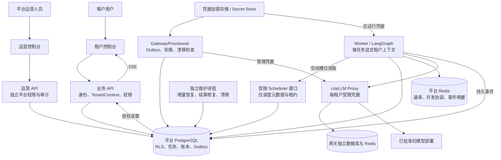
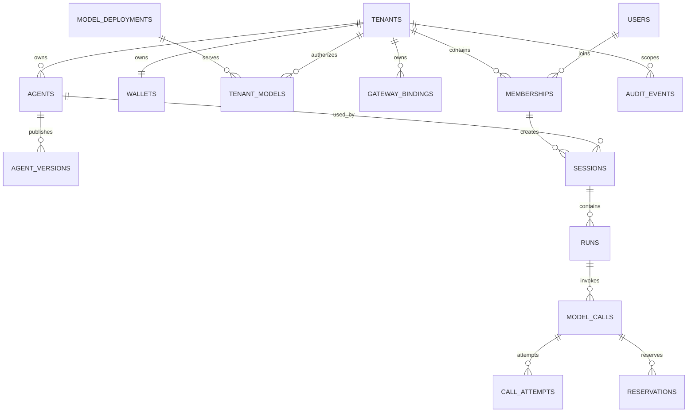
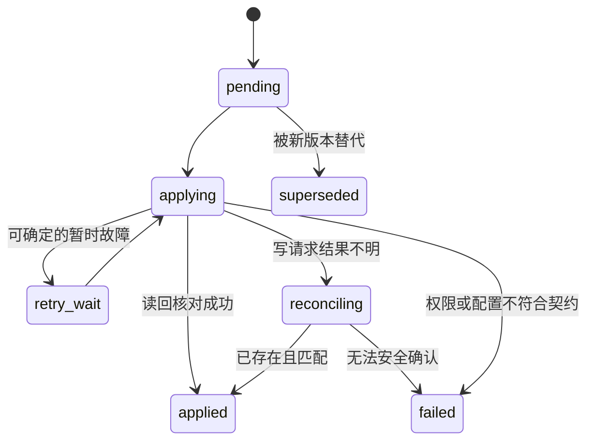
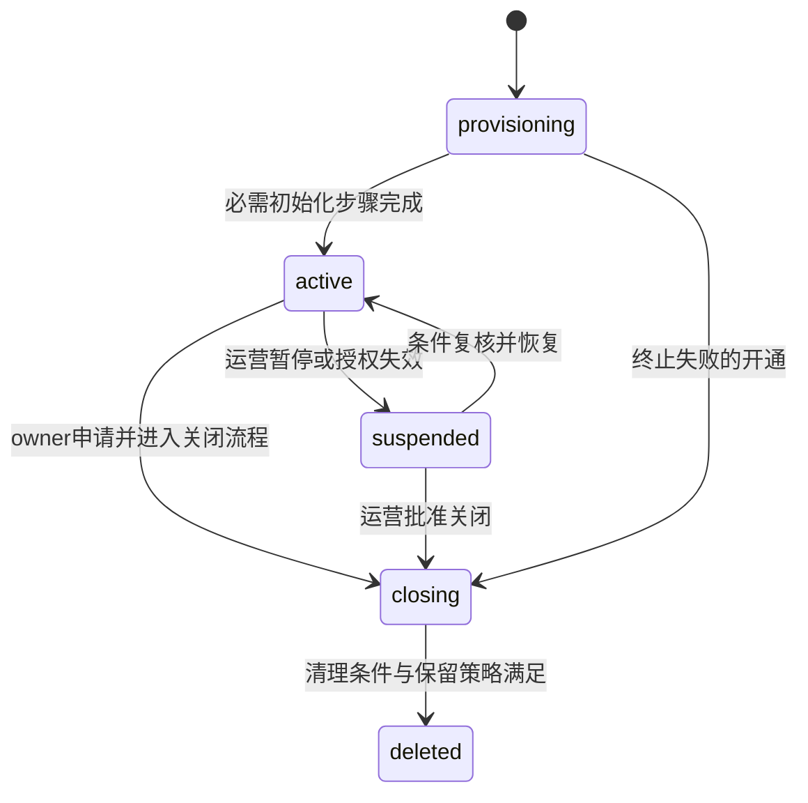

# Agent Platform 多租户迭代设计方案

| 项目 | 内容 |
| --- | --- |
| 文档版本 | v1.0 |
| 日期 | 2026-09-30 |
| 状态 | 设计基线；实现进展与验收界限见 [多租户实现说明](multi-tenant-implementation.md) |
| 适用对象 | 在一套部署中服务多个企业或团队的 Agent SaaS；同时保留单组织自部署能力 |
| 代码基线 | 当前工作区 `agent_platform/`，含 `0002` 模型解耦迁移与 8 个内置 Agent；不以 Git HEAD 代表全部已落地功能 |
| 关联文档 | [当前架构图](architecture-diagrams.md)、[原始目标架构](architecture.md)、[现有 API 契约](implementation-contract.md)、[部署说明](deployment.md) |

> 本文的“现状”保留设计时的 0002 基线，不代表当前代码。最新功能、迁移与尚未执行的验收以实现说明为准。

## 阅读导航

1. [决策摘要与范围](#1-决策摘要与范围)
2. [现状与差距](#2-现状与差距)
3. [目标与验收基线](#3-目标与验收基线)
4. [目标架构与信任边界](#4-目标架构与信任边界)
5. [身份权限与租户上下文](#5-身份权限与租户上下文)
6. [数据模型与数据库隔离](#6-数据模型与数据库隔离)
7. [模型接入网关与凭据](#7-模型接入网关与凭据)
8. [Agent运行与资源调度](#8-agent运行与资源调度)
9. [计费套餐与预算](#9-计费套餐与预算)
10. [租户生命周期与控制台](#10-租户生命周期与控制台)
11. [API与兼容契约](#11-api与兼容契约)
12. [可观测性备份与数据管理](#12-可观测性备份与数据管理)
13. [分阶段迭代与交付门槛](#13-分阶段迭代与交付门槛)
14. [迁移灰度与回滚](#14-迁移灰度与回滚)
15. [验收矩阵](#15-验收矩阵)
16. [代码改造地图](#16-代码改造地图)
17. [风险决策与后续范围](#17-风险决策与后续范围)

## 1. 决策摘要与范围

### 1.1 本轮建议

继续使用模块化 Python 后端，以独立 API、Worker、网关配置同步进程部署。多租户生产数据使用 PostgreSQL，平台 Redis 用于限流和短期协调；数据库继续持有任务、事件、账本和配置事实。

关键决策如下。它们是本方案的建议默认值，实施前可按产品要求调整。

| 编号 | 决策 | 原因与代价 |
| --- | --- | --- |
| D01 | 一个 User 可通过 Membership 加入多个 Tenant | 支持顾问、外包及同一员工加入多个团队；需改造登录响应、资源归属和组织切换 |
| D02 | 平台权限与租户权限分别授予 | 平台控制资金入账、售价、套餐与网关；客户控制组织内部资源，避免自行增加额度或降低售价 |
| D03 | 请求 URL 显式包含租户，服务端验证成员关系 | 支持多个标签页使用不同组织；客户端提供的租户 ID 只是选择参数 |
| D04 | 首批采用共享 PostgreSQL 表、联合约束和 RLS | 便于迁移与统一运维；高隔离租户后续可放到专用部署单元 |
| D05 | 每租户使用独立受限网关凭据，凭据保存在服务端 | 隔离允许的模型和网关额度；初期无需按每个用户创建网关身份 |
| D06 | Agent 角色、模型授权、实际部署三层分开 | 内置及自建 Agent 均可更换模型，模型选择不能超出租户授权 |
| D07 | 首批继续禁用透明重试及自动故障切换 | 保留现有“一次准入、一次上游尝试”的费用语义；重试需单独设计尝试账务 |
| D08 | 首批只提供平台托管模型、人工确认入账、USD 预付钱包 | 控制上线范围；客户自带密钥、在线支付、周期订阅另列后续迭代 |
| D09 | 首批会话正文仅所有者访问，支持排障使用单独内容授权 | 管理和财务角色只获得必要元数据；组织内会话共享另行设计 ACL 后交付 |
| D10 | 数据结构采用增加、回填、切换、收缩四步迁移 | 保留原有 ID、发布版本和账本；涉及新写入后不能只恢复旧数据库来回滚 |

### 1.2 首批发布范围

包含组织创建与停用、多组织成员、固定角色、租户上下文、数据库隔离、内置 Agent 安装、租户模型授权、独立网关 Key、受控入账和报价、配额、公平调度、审计、数据导出与恢复演练。

首批暂不提供项目/部门层级、自定义角色、组织内会话共享、公开注册、企业 SSO、在线支付、后付费、多币种、跨区域部署、任意代码工具、外部 MCP、知识库和多 Agent 协作。数据结构预留扩展入口，第一轮界面和执行路径不承载这些功能。

单组织本地模式继续可使用 SQLite。面向外部租户的 SaaS 模式必须满足本方案的 PostgreSQL、权限和凭据要求，不能通过关闭隔离开关将本地模式直接公开。

## 2. 现状与差距

以下“已有”根据当前代码判断；旧架构文档中的蓝图不作为已实现能力。

| 主题 | 当前实现 | 本次需补齐 |
| --- | --- | --- |
| 组织 | 有 tenants 表；首次引导创建一个组织 | 创建、初始化、状态流转、停用与注销 API |
| 身份 | users 直接包含 tenant_id、role、active；邮箱全局唯一 | 全局登录身份与组织成员关系分离 |
| 权限 | admin/member；admin 能管理组织、报价、入账、核销、解冻和配额 | 平台运营、组织管理、财务及内容访问能力分离 |
| 数据隔离 | `owned`、`list_resources` 等按租户过滤；部分联合外键 | 全路径 TenantContext、完整关系约束、PostgreSQL RLS |
| 事件与历史 | Run、消息、事件持久化；run_events 无直接 tenant_id | 回填 tenant_id；SSE、历史、导出使用同一权限策略 |
| 模型 | 模型目录按租户隔离，别名原样发送到网关 | 展示别名与部署标识分离；租户授权与独立默认策略 |
| 凭据 | 一个服务器端 LiteLLM 运行 Key；引导只授权一个别名，Key 有有效期 | 每租户凭据、轮换、撤销、状态同步与漂移检查 |
| Agent | 8 个内置角色；model_id 可空；Run 固定版本和价格 | 创建租户时安装模板；模板升级不覆盖租户修改 |
| 执行 | 内嵌或独立 Worker；租约、心跳、fencing、取消和超时 | 独立调度身份、成员/租户撤权检查、公平队列和容量配置 |
| 调度 | 单 Worker 最多 4 个 Run；全局最旧 128 条候选内择租户；每租户最多 32 个活动任务 | 按租户选队列头；跨 Worker 的资源上限和公平性保证 |
| 恢复 | 周期扫描运行与预占，并重建调用投影 | 有界增量扫描、独立恢复任务、避免每个 Worker 重扫全部历史 |
| 计费 | 租户钱包、预占、精确小数、幂等结算、未知费用冻结 | 平台级资金与报价控制、套餐上限、成本字段授权 |
| 报表 | 最多 200 条列表；CSV 在浏览器导出当前已加载数据 | 游标分页、后台完整导出、租户范围与下载权限检查 |
| 运维 | 当前本地为 SQLite + 内嵌 Worker；Compose 已支持 PostgreSQL/Redis/独立服务 | 生产部署模式、独立数据库角色、租户级观测、备份与恢复 |

主要实现依据：

- [数据表](../infrastructure/tables.py)、[数据库访问](../infrastructure/db.py)。
- [API 与权限入口](../apps/api/main.py)、[平台业务](../modules/platform.py)。
- [Worker](../apps/worker/main.py)、[计费服务](../modules/billing/service.py)。
- [网关客户端](../modules/runtime/gateway.py)、[本地网关引导](../deploy/bootstrap_gateway_key.py)。

### 2.1 对外开放前必须修复的边界

1. 租户 admin 不能继续直接人工入账、修改平台售价、核销或解除平台风控冻结。
2. 模型别名在平台按租户唯一，但进入共享网关后属于网关命名空间；相同字符串不能代表可靠的部署隔离。
3. 不能把统一运行 Key 作为所有新租户的隐式回退凭据。
4. 当前调用 DTO 和 CSV 包含 provider_cost 字段；未来供应商成本属于平台运营数据，需要服务端字段授权。
5. 租户状态和 Membership 撤权必须进入每次模型调用前的复核；固定 Run 配置不保留已撤销权限。

## 3. 目标与验收基线

### 3.1 必须成立的业务不变量

- 每个租户资源有明确归属；全局资源明确标记全局，不用空 tenant_id 充当通用授权。
- 一次运行的 Tenant、User、Membership、AgentVersion、ModelBinding、价格版本都可追踪。
- 租户管理员不能提高平台授予的权限、套餐上限或钱包余额。
- Agent 配置、Run 快照、日志、事件和导出中不出现调用密钥。
- 资金结算以持久账本为准；重复请求和进程重启不产生重复资金动作。
- 成员或租户被停用后不发起新的模型调用；已有费用按证据完成收尾。
- 不跨租户复用对话、缓存、模型默认值、下载链接或工具凭据。
- 网关未完成授权同步时，新授权不可用；撤权在平台立即阻断。

### 3.2 初始容量与服务目标

下表是用于实施与验收的设计基线，尚未压测，不是已具备能力或对客户的承诺。应在 I0 记录硬件、模型响应时长、请求大小与数据规模后确认。

| 项目 | 初始验证目标 | 测量边界 |
| --- | --- | --- |
| 租户与用户 | 100 个租户、1,000 个用户 | 含历史数据的真实索引与权限检查 |
| 同时活跃 | 20 个活跃租户、40 个运行中任务、100 条 SSE | Worker 数量和上游容量必须同时满足 |
| 管理接口 | 50 RPS 下 P95 ≤ 300ms | 排除模型等待、文件导出及外部网关管理调用 |
| 调度公平性 | 有配额的空闲租户在两个调度轮次内获得调度机会 | 有可用 Worker/模型容量时；单轮目标 ≤ 1 秒 |
| 撤权 | 新请求和下次外部调用前生效；SSE ≤ 5 秒关闭 | 已被供应商接收的调用只能尽力取消 |
| 网关配置同步 | 正常情况下 ≤ 60 秒；超时显示失败或处理中 | 未完成同步绝不展示“已可用” |
| 故障恢复 | 租约过期后 ≤ 60 秒进入可解释终态或待核实状态 | 不自动重放已发送或发送状态不明的请求 |
| 灾备 | 首批目标 RPO ≤ 15 分钟、RTO ≤ 2 小时 | 必须用实际备份、密钥和部署包完成恢复演练 |

## 4. 目标架构与信任边界



图中业务 API 与运营 API 可以在同一代码库、同一应用中实现，但使用独立路由、能力检查与数据库访问入口。Provisioner 持有网关管理凭据；普通 API、Worker 和浏览器不持有这些凭据。

| 边界 | 允许 | 禁止或需另行授权 |
| --- | --- | --- |
| 浏览器 → API | 选择租户、提交业务输入、Cookie + CSRF | 自报角色、报价、结算用量、网关凭据或可信归属元数据 |
| API → 数据库 | 经验证的租户上下文，字段白名单，短事务 | 无租户上下文的租户表查询；直接接受模型生成的 SQL |
| Worker → 模型 | 已授权部署、受限 Key、固定费用与参数契约 | 全局 Key 回退、客户端任意 base_url、跨租户 fallback |
| 工具 → 外部资源 | 受控工具白名单；未来凭据按调用主体授权 | 默认继承 Worker 的平台管理权限或所有租户密钥 |
| 运营人员 → 租户 | 按职责管理生命周期和财务；支持访问限定范围和期限 | 因拥有平台角色就默认读取所有对话正文 |
| 网关返回数据 → 账本 | 规范化并校验的 usage 与关联证据 | 直接用网关 spend 覆盖客户账本 |

## 5. 身份权限与租户上下文

### 5.1 身份模型

- User 表达一个登录身份：邮箱、密码哈希、全局状态、认证版本。
- Membership 表达加入组织的事实：tenant_id、user_id、角色、状态、权限版本。
- PlatformRoleBinding 独立表达平台管理权限，不挂在 Membership 上。
- 一个 User 可在 A 组织是 owner，在 B 组织是 member。全局停用 User 会影响所有组织；移除一个 Membership 仅影响对应组织。
- 首批允许运营开通组织、组织管理员发出邀请。邀请链接为一次性随机令牌，只保存哈希，绑定租户、邮箱、角色、有效期；接受者需证明拥有被邀请邮箱或使用已验证身份。
- 无邮件服务时采用运营人工交付邀请链接，不伪称邮件已发送。不能通过已登录用户提交任意邮箱直接加入组织。

### 5.2 首批角色与权限矩阵

角色映射为服务端 capability，业务服务检查能力而不是在每个接口堆叠角色字符串。

| 操作 | 平台管理员 | 平台财务 | 支持人员 | 租户 owner/admin | 租户财务查看者 | 成员 |
| --- | --- | --- | --- | --- | --- | --- |
| 创建/停用租户、设置套餐上限 | 是 | 否 | 否 | 否 | 否 | 否 |
| 授予平台角色 | 是；显式操作并审计 | 否 | 否 | 否 | 否 | 否 |
| 维护供应商、平台模型与售价 | 是 | 仅售价能力可单独授予 | 否 | 否 | 否 | 否 |
| 入账、调整、核销、费用解冻 | 显式财务能力 | 是 | 否 | 否 | 否 | 否 |
| 查看平台供应商成本 | 显式财务能力 | 是 | 否 | 否 | 否 | 否 |
| 管理组织成员和内部额度 | 通过有范围的支持流程 | 否 | 授权范围内 | 是；不超过平台上限 | 否 | 否 |
| 转移所有权/申请注销 | 恢复流程 | 否 | 否 | 仅 owner | 否 | 否 |
| 编辑、发布组织 Agent | 默认否 | 否 | 默认否 | 是 | 否 | 否 |
| 使用授权 Agent 和模型 | 有有效 Membership 时 | 有有效 Membership 时 | 默认否 | 是 | 默认否，可另授运行能力 | 是 |
| 查看组织账单与消费元数据 | 显式运营范围 | 是 | 授权范围内的元数据 | 是 | 是 | 仅自己的调用费用 |
| 查看会话正文、工具输入输出、SSE | 内容授权后 | 否 | 单独内容授权后 | 仅本人 | 否 | 仅本人 |
| 打开全局 LiteLLM 管理台 | 显式网关管理能力，独立登录 | 否 | 否 | 否 | 否 | 否 |

正常服务的租户至少有一名有效 owner；有效性同时要求 User 和 Membership 可用。最后一名 owner 的移除、降级和退出必须在事务内拒绝；普通全局停用/删除用户前也检查其所有组织并先交接。安全紧急停用允许立即阻断账号，但要将失去有效 owner 的组织置为 suspended，暂停原因设为 owner_unavailable，并建立人工身份核实与所有权恢复待办，不能自动授权给其他成员。owner_unavailable 是暂停原因，不是新增租户状态。迁移时无有效 owner 的组织保持 suspended，完成恢复后再启用。

owner 转移需接受方为有效成员，所有权交接单独审计。owner 和 admin 的差异体现在所有权、注销及高权限成员管理。首批不实现组织内共享会话；后续必须补齐 session_access_grants、授权/撤销接口以及 SSE/导出继承规则后才能开放。

平台支持使用 SupportGrant：tenant_id、actor_id、允许的能力、原因、审批主体、开始/到期时间。默认仅元数据，默认期限建议 15 分钟；读取正文需单独的明确授权。前端显示支持访问横幅，审计同时记录真实操作者和目标租户，不伪装成客户用户。

### 5.3 请求上下文与组织切换

建议引入不可变 `TenantContext`：

```text
tenant_id, tenant_status, actor_user_id, membership_id,
capabilities, identity_version, membership_version,
tenant_policy_version, request_id, support_grant_id?
```

建立顺序：认证 Cookie → 从 URL 取得 tenant_id → 查有效 Membership 或 SupportGrant → 检查租户状态和操作能力 → 建立上下文 → 进入租户数据库事务。

组织切换只改变前端路由和按租户划分的缓存，不把可变 active_tenant_id 作为所有标签页共享的服务端授权依据。建议路径为 `/t/{tenant_id}/agents`、`/t/{tenant_id}/playground`。

- API、后台导出、定时任务、Worker 显式传入上下文，不依赖可变进程全局变量。
- 前端缓存键包含 tenant_id；切换时中止旧请求、断开旧 SSE、清理旧组织表单和错误提示，延迟返回的数据不得覆盖新组织页面。
- SSE URL 固定租户和 Run，连接期间复查身份、Membership、正文权限和租户策略。
- 权限撤销增加版本并撤销对应租户的运行授权；全局改密/停用可撤销全部登录会话。
- 财务结算属于已有调用的系统收尾，不依赖调用者仍为有效成员；只能依据已登记的租户和 call_id 处理，不能借此发起新调用。

## 6. 数据模型与数据库隔离

### 6.1 目标数据关系



图展示业务关系；旧表名及 ID 在扩展期保留，不能据此直接删除原表或重建账本。

### 6.2 身份与组织表

| 表/变化 | 关键字段与约束 | 设计说明 |
| --- | --- | --- |
| `platform_users` 改造 | 原 id/email/password_hash/name 保留；新增 global_status、auth_version、email_verified_at | email 继续全局规范化唯一；tenant_id/role/active 先保留为兼容字段，收缩期才移除 |
| `platform_memberships` 新增 | id、tenant_id、user_id、role、status、authz_version、joined_at；唯一 `(tenant_id,user_id)`、`(tenant_id,id)` 和 `(tenant_id,id,user_id)` | 移除采用状态变化；恢复沿用同一关系记录，历史主体不重新指向另一人 |
| `platform_tenants` 扩展 | status、plan_version_id、timezone、policy_version、created_by、suspension_reason_code | 时间存 UTC，账期使用明确时区；私密原因不直接展示给普通成员 |
| `platform_roles` 新增 | user_id、role、granted_by、granted_at、revoked_at | 仅平台授权入口可写；禁止从租户成员编辑接口修改 |
| `platform_invitations` 新增 | tenant_id、email、role、token_hash、expires_at、accepted_at、revoked_at | 接受时加锁并校验有效期、邮箱与成员名额；重复接受返回同一结果 |
| `platform_auth_sessions` 扩展 | 原 user_id 保留；identity_version、issued_at | Cookie 只定位全局身份；不靠 Cookie 中的租户/角色自报授权 |
| `platform_support_grants` 新增 | tenant_id、actor_id、capabilities、reason、approved_by、expires_at、revoked_at | 支持读写均需留痕；到期后新操作立即拒绝 |

### 6.3 执行、模型与运营表

| 表/变化 | 关键字段与约束 | 设计说明 |
| --- | --- | --- |
| 租户业务表补强 | `(tenant_id,id)` 唯一；所有租户内引用尽量使用含 tenant_id 的联合外键 | 补齐消息、调用、Run、事件等关系；不能只靠资源 ID 难猜 |
| `platform_run_events` 扩展 | tenant_id、run_id、sequence；联合外键指向 Run；唯一 `(tenant_id,run_id,sequence)` | 从所属 Run 回填；查不到父记录的历史行先隔离处理 |
| sessions/runs/calls 扩展 | 新增 membership_id、授权版本；保留原 user_id，actor_user_id 仅作 DTO 别名 | 历史回填原成员关系；成员退出不删除历史记录 |
| `model_deployments` 新增 | id、owner_scope、owner_tenant_id?、gateway_id、internal_route、protocol、capability_version、status、config_version | 平台部署可授权多个租户；租户自有部署只能授权所有者；internal_route 在网关内唯一 |
| `platform_models` 演进为租户模型绑定 | 原 id 保留；tenant_id、deployment_id、display_alias、status、price_version_id、policy_version | 复用原 model_id 以兼容 Agent 和历史；售价只由平台定价权限生成 |
| `tenant_model_policies` 新增 | tenant_id 主键、default_model_id?、ordered_model_ids、version | 引用必须属于本租户；所有候选都需有效授权和已应用的网关配置 |
| `gateway_bindings` 新增 | id、tenant_id、gateway_id、purpose、active_credential_version_id、desired_version、applied_version、status | 当前有效代际单独指针；未同步或已撤销不能用于新准入 |
| `gateway_credential_versions` 新增 | id、tenant_id、binding_id、generation、external_key_id、credential_ref、fingerprint、status、created_at、expires_at、retired_at、revoked_at | 唯一 `(binding_id,generation)`；保存 pending/active/retiring/revoked 元数据，撤销后按策略销毁 secret，保留历史引用 |
| `gateway_outbox` 新增 | tenant_id、aggregate_id、config_version、operation_id、action、status、attempt_count、next_attempt_at、owner、fence、lease_until、external_resource_id、error_code | 唯一 `(aggregate_id,config_version,action)`；未知外部写入进入 reconciling；状态不含明文密钥 |
| `model_call_attempts` 新增 | tenant_id、run_id、call_id、attempt_id、deployment_id、credential_version_id、send_state、usage_state、provider_request_id? | 联合外键保证凭据代际属于本租户绑定；首批一个逻辑调用只有一次尝试 |
| `plan_versions` / `tenant_entitlements` 新增 | 套餐版本、成员/并发/速率/存储等上限；生效区间、授予主体 | 平台授予上限与租户内部配额分开存储 |
| `price_versions` 新增或拆分 | id、tenant_id、tenant_model_id、version、currency、unit、输入/输出费率、valid_from、created_by | 唯一 `(tenant_id,tenant_model_id,version)`；归属租户但仅平台定价权限可写；Run 保存版本 ID 和数值快照 |
| `tenant_provisioning_steps` 新增 | tenant_id、step_key、version、state、operation_id；唯一 `(tenant_id,step_key,version)` | 钱包、模板、网关配置可分别重试，避免部分失败后重复安装 |
| `agent_template_installs` 新增 | tenant_id、template_key、installed_version、agent_id、customized；唯一 `(tenant_id,template_key)` | 全局模板发布版本；已有租户 Agent 采用显式升级，不覆盖草稿或已发布版本 |
| `export_jobs` / `export_artifacts` 新增 | tenant_id、requester_id、query_snapshot、status、object_key、expires_at、authz_version | 下载时再鉴权；失去权限后不可下载已经生成的文件 |
| `platform_audits` 扩展；新增 `platform_operation_audits` | actor_user_id、actor_type、target、action、reason、request_id、support_grant_id?；租户审计保持非空 tenant_id | 全局运营事件单独表及受限读取入口；影响具体租户时关联目标租户和相同 operation_id；不记录密钥或正文 |

### 6.4 完整性与索引

1. 保留现有字符串 ID，不在身份拆分中强行改 UUID 格式。回填建立一对一映射，所有旧引用保持稳定。
2. 移除 Session 原 `(tenant_id,user_id) → users(tenant_id,id)` 外键，改为 `(tenant_id,membership_id,user_id) → memberships(tenant_id,id,user_id)`，否则一个用户不能在第二组织创建会话。原 user_id 是真实行为人唯一来源；过渡 DTO 中 actor_user_id 必须等于 user_id，不新增可独立写入的重复身份列。Run 通过 Session 的 `(tenant_id,id,membership_id,user_id)` 唯一键约束所属会话和行为人；正常新建会话/运行仍由应用检查 Membership 当前有效性。
3. 模型部署 owner_scope 与 owner_tenant_id 使用 CHECK 保证一致；租户自有部署授权关系通过受限写入口校验所有权，不能只依赖前端选项。
4. 关键索引至少包含：Membership `(user_id,status)`，Run `(tenant_id,status,created_at,id)`，租约 `(status,lease_until)`，Event `(tenant_id,run_id,sequence)`，Call `(tenant_id,created_at,id)`，Outbox `(status,next_attempt_at,id)`。
5. 现有财务表已经使用 ExactMoney：PostgreSQL 为 `NUMERIC(30,12)`，SQLite 为无损十进制字符串。沿用该精度；新增价格表采用相同约定，原模型价格字符串经检查后转换。应用使用 Decimal，API 返回十进制字符串。导入发现超精度或溢出时停止，不自动四舍五入历史账本。
6. 财务、调用和审计历史不用级联删除。正文清理和身份匿名化采用显式作业，保留必要的主体与资金关联。
7. Run 建立 `(tenant_id,id,session_id)` 唯一键，Message 的 `(tenant_id,run_id,session_id)` 使用联合外键，防止同租户内错误连接另一个会话；Call、Event 的父 Run 关系也必须包含 tenant_id。完成事实回填后再启用非空和外键约束。

### 6.5 RLS 与数据库访问契约

普通业务访问统一为 `tenant_read(ctx)` / `tenant_transaction(ctx, scope)`；读操作也建立短事务。事务开始后使用参数化的 `set_config('app.tenant_id', value, true)` 设置本事务上下文，事务结束自动清除。不得在会话级设置租户并寄希望于手工清理连接池。

以下仅示意 tenant_id 策略，不是可直接覆盖现有迁移的 SQL：

```sql
ALTER TABLE platform_agents ENABLE ROW LEVEL SECURITY;
ALTER TABLE platform_agents FORCE ROW LEVEL SECURITY;
CREATE POLICY tenant_scope ON platform_agents
  USING (tenant_id = current_setting('app.tenant_id', true))
  WITH CHECK (tenant_id = current_setting('app.tenant_id', true));
```

- 缺少上下文时无行可读、租户写入被拒；应用入口另外返回明确的上下文错误。
- 运行数据库角色不是超级用户、表 owner，也没有 BYPASSRLS；迁移使用独立角色。
- RLS 保护遗漏租户条件的查询，不能替代成员鉴权、字段权限，也不能防止已控制服务端数据库角色的攻击者任意设置上下文。
- 全局用户认证走受限 IdentityRepository；Membership 属于租户数据，其“列出本人组织”查询走明确的身份查询入口，禁止给所有租户表添加宽泛跨租户策略。
- Scheduler 仅通过受控队列接口读取 tenant/run/lease 等调度字段。Worker 得到租约后建立相应租户上下文读取任务正文。
- 恢复和结算服务以系统主体运行，只处理已有调用与收据；跨租户选择通过窄接口取得待处理 ID，逐租户执行，不授予普通 Worker 全库绕过能力。
- 若使用 SECURITY DEFINER 函数实现调度等窄接口，固定 search_path、撤销 PUBLIC EXECUTE、只授予特定角色，并限制参数、返回字段和审计范围。
- 不在等待上游响应或维持 SSE 时持有数据库事务。`asyncio.to_thread` 中显式传递 ctx，数据库操作在执行线程内开启事务。

## 7. 模型接入网关与凭据

### 7.1 模型解析流程

```text
Agent 发布版本（角色、工具、生成参数、可选模型偏好）
  → 本次请求覆盖 / Agent 偏好 / 租户默认策略
  → TenantModelBinding（本租户已授权、启用、价格生效）
  → ModelDeployment（协议、能力、内部路由、部署版本）
  → GatewayBinding（本租户已应用的受限凭据版本）
  → 本次 Run / Call 快照
```

首次选择可优先租户默认模型，再按管理员配置的候选顺序查找；候选无可用授权时返回 `no_available_model`。这里的“可用”表示配置和权限可用，不能据此保证外部供应商一定返回成功。首批不在调用失败后自动换模型。

手动指定模型须满足相同检查。Agent 默认仍不绑定供应商；纯文本 Agent 不要求工具协议，启用工具的 Agent 必须匹配部署能力。temperature、输出上限等以能力配置验证，不把所有模型假设成接受相同参数。校验不通过要明确说明，不能静默去掉工具改变任务含义。

Run 固定模型绑定、部署版本、售价和有效输出上限；每次 Call 再检查当前授权是否仍有效。密钥轮换允许同一已授权部署选择新的有效凭据代际，实际使用的代际记录在 Attempt 中；不能借轮换改变费用或跳到未授权部署。

### 7.2 网关配置同步

平台在同一事务内写期望配置与 Outbox。Provisioner 按实体顺序处理，获取当前版本，调用经过验证的网关适配器，读回核对权限后记录 applied_version。



- **开通先同步后放行，撤权先阻断后同步。** 不能只等网关撤销操作最终完成。
- 管理操作的幂等性由本地 operation_id、稳定资源标识、读取核对共同保证；网关创建 Key 超时后不能盲目重复创建。无法核对时进入人工处理，残留凭据进入撤销清单。
- 防止旧 Outbox 覆盖新配置：每实体顺序执行，提交 applied_version 前 CAS 检查；漂移任务检查网关实际权限是否超出当前期望。
- 本地 CAS 和租约不能撤销已经发出的外部管理请求。同一外部实体存在未知写结果或旧 Provisioner 失租时，先阻断其后续变更并核查，不因租约过期立即并行重放。网关不支持条件版本更新时，使用独立代际资源，核对后切换绑定指针，再撤销旧资源，避免旧更新晚到重新扩大新 Key 权限。
- 无法确认外部写入最终状态时保持 reconciling/degraded，对受影响的新准入采取拒绝；迟到创建的资源必须可追踪并撤销。外部 Key 已创建但明文未可靠保存时不能置为 ready，需核查并撤销孤儿资源后生成新代际。
- 新增授权未应用时只拒绝该新增能力；原有且仍被期望配置允许的部署可继续使用。任何撤权都立即进入平台拒绝集合。
- 网关服务故障不得启用全局 Key 或绕过平台预算作为降级路径。
- 固定部署的 LiteLLM 版本和镜像；只将现有脚本用过的接口视为当前基础。团队映射、按部署授权、Key 轮换/撤销、日志关联、创建幂等能力必须在 I3 用固定版本逐项验证。能力不足时使用适配器补偿或专用网关；不把未验证的 API 写入上线承诺。

### 7.3 凭据生命周期

1. 每租户按网关及用途建立受限凭据，限制模型内部路由、请求路径、速率、并发、预算和有效期；平台另设全局供应商容量上限。
2. 可调用凭据需加密保存，记录 key_version、fingerprint、credential_ref；不能只保存哈希后期望再次调用。解密主密钥由部署的 Secret Store 或等效机制管理，与业务数据库备份分开保护。
3. 日常 API 响应只返回脱敏指纹、有效期和状态。`.env` 仅放部署级配置与秘密引用，不能累积所有租户明文 API Key。
4. 轮换流程为创建新代际 → 核对最小权限 → 切换新调用 → 等待旧调用结束/宽限到期 → 撤销旧代际 → 读回确认。紧急撤销可跳过宽限，记录受影响调用。
5. Worker 对运行凭据的缓存有期限，绑定 tenant/gateway/generation。授权状态每次调用仍查当前策略；服务重启、撤销和轮换不得复用其他租户缓存。
6. 供应商凭据仅由网关接入链路使用；模型请求、浏览器和工具环境都不能得到平台主密钥。

客户自带密钥（BYOK）放在后续 I6：为该租户建立专属部署及授权，显示计费方式，入口限制目标地址和网络访问。不能允许任意 URL 访问内网、元数据服务或携带凭据重定向到其他主机。

## 8. Agent运行与资源调度

### 8.1 Agent 模板和发布版本

- 8 个内置 Agent 作为全局只读模板发布版本，创建租户时安装为本租户可编辑的 Agent。
- 保留 builtin_key，并记录 installed_template_version。模板升级显示差异，由租户管理员选择采用；不在重启时覆盖租户草稿或已发布版本。
- Agent 发布版本、对话与运行全部归租户。跨租户复用通过显式导出/导入模板或平台发布模板实现，清除模型绑定、会话、凭据和内部资源引用。
- Agent 模型偏好和会话运行模型可更换；选择结果只能来自当前租户模型授权。

### 8.2 执行前后检查

创建 Run 时检查租户状态、成员能力、Agent 发布权限、模型授权、队列上限和请求幂等；Worker 领取后复核，每次外部调用前再次复核。

Run 中增加 membership_id、policy_version 和资源引用，避免只记录用户 ID 后丢失所属组织关系。新增工具时沿用同一 TenantContext，不能接受模型生成的 tenant_id、user_id 或 credential_ref 作为授权依据。

```text
登记 Call / Attempt → 校验当前授权 → 原子准入与预占
→ 再检查取消/租约 → 标记发送边界 → 调用指定网关部署
→ 持久输出与证据 → 幂等结算 / 释放 / 标记未知费用
```

发送边界需保守定义：外部请求可能已发送但进程未记录结果时按未知处理。API 超时、网络超时、取消或租约丢失都不能证明供应商没有计费。

### 8.3 调度与容量

现有“全局最旧 128 条候选”存在租户未进入候选窗口的饥饿风险。改为先选有资格的租户，再从该租户取最早任务：

1. 维护可索引的租户队列头及最近调度位置；使用按套餐权重的轮转，每轮保证符合条件的租户有调度机会。
2. 领取事务先锁定租户调度状态，再以行锁/`SKIP LOCKED` 领取任务，检查跨 Worker 的 Run 并发和租户队列上限。
3. 每个 Worker 的并发和处理类型可配置；全局容量、模型部署容量、租户运行容量和单次模型请求并发分别控制。
4. Run 已运行但等待模型准入时使用明确的有界等待和超时；不能无限占住 Worker。首批未获模型准入可明确失败并提示稍后重试，排队策略升级需单独记录状态。
5. SQL 任务状态和租约为持久事实；Redis 协助限流与短期并发控制，Redis 故障时拒绝新准入，已有调用结果仍写数据库并结算。
6. 默认每租户 32 个活动 Run、Worker 4 并发可作为本地初始配置，SaaS 从套餐与容量配置读取，不硬编码在逻辑里。

首批 Scheduler 是 Worker 空闲槽位调用的受限数据库领取接口；领取成功的事务直接指定该 Worker 的 owner/fence，不额外增加未定义的任务消息投递。维护进程负责恢复与清理，不重复执行同一个 Run。后续如拆成独立调度服务，必须增加持久投递与接收确认契约。

将 queue_timeout 与 execution_timeout 分开；排队过期且无调用的任务费用为零。多机租约判断、续约和截止时间使用数据库时钟并监控系统时钟偏差，不能依赖各 Worker 本地 time.time() 恰好一致。`SKIP LOCKED` 只减少锁等待，公平性由租户轮转保证。

### 8.4 恢复与锁竞争

- 将过期队列、过期租约、待结算收据、待修复投影分别建索引，按批次与游标处理；恢复任务有独立租约，多个 Worker 不重复全量扫描。
- 当前 reserve 会读取租户历史预占计算限制；首批改为活动预占、速率时间窗查询和累计消费聚合。I6 再增加账期预算窗口及其分配关系。聚合与账本在同一事务更新，可从账本重建。
- 保留金额一致性所需的短锁；禁止在钱包/租户事务锁内等待模型或网关管理 API。先测锁等待，再按钱包、累计预算主体细化锁粒度；账期窗口锁随 I6 引入。
- 新 Worker fencing token 使旧 Worker 不能继续写运行状态；晚到的有效用量交给结算服务按 Attempt 幂等处理。
- 首批 Worker 失联后终止运行并保留不确定费用；跨进程图恢复、工具副作用补偿和自动续跑不在本期实现。

## 9. 计费套餐与预算

### 9.1 三种金额分别管理

| 概念 | 事实来源 | 谁可以改变规则 | 展示范围 |
| --- | --- | --- | --- |
| 租户消费金额 | 冻结的平台售价 × 已接受的用量证据 | 平台定价权限；修改只影响新价格版本 | 租户财务、管理员及本人消费视图 |
| 供应商成本 | 供应商或网关的成本证据，带来源和可信程度 | 对账导入与平台财务调整 | 平台财务；默认不进入租户 DTO/CSV |
| 内部预算 | 套餐上限和租户自设限制 | 平台授予上限；租户只可收紧或分配 | 对应组织管理者及用户自己的额度 |

当前正常模型通路并未获取可信的供应商成本，不能把按平台报价算出的金额复制到 provider_cost。LiteLLM 的 usage 可作为当前计量来源，必须继续标记来源；不能把“平台已结算”写成“供应商账单已确认”。

### 9.2 准入与钱包不变量

保留当前预付钱包的含义：balance 已扣除完成结算的消费，reserved 是有效冻结金额，因此：

```text
available = balance - reserved
reserved = Σ reserved/unresolved 预占的尚未释放金额
```

不能再次从 balance 扣减历史消费计算 available。一次调用的所有限制都满足才准入：

1. 用户、Membership、租户、Agent、模型授权和凭据有效。
2. 平台全局容量、套餐、租户内部配额、成员/模型配额都满足。
3. 单次 Run 费用上限和钱包可用余额足以覆盖保守预占。
4. 创建 reservation、预算占用、准入记录等数据库变更原子提交。

Redis 准入与 PostgreSQL 不具备跨系统原子事务。沿用可补偿流程：Redis 占用失败不创建资金预占；数据库失败补偿 Redis；补偿失败记录待修复项并通过租约过期/修复作业收敛。数据库账本始终决定资金事实。

### 9.3 平台财务操作

- 人工入账、调整、核销、解冻迁入平台运营接口和业务服务能力检查；旧 v1 租户接口同样收紧，不能成为绕过入口。
- 入账要求目标租户、金额、币种、原因、外部凭证引用及幂等键。外部凭证引用不能包含支付密码或完整支付凭据。
- 初期保持人工确认入账，不提供未经支付验证的“充值成功”按钮。租户可提交入账/对账申请，申请不直接改变余额。
- 财务审计与分录在同一事务提交。修正使用补偿记录，不删除原始流水或直接改钱包字段。
- 继续保留“实际费用超预占时按现有策略限制客户扣费、记录平台承担差额并冻结钱包”的行为；商业规则变更须单独审批、版本化和迁移。
- 解冻钱包必须明确是哪类冻结；支付欠费、租户暂停、平台风控、未知费用等不能被一个租户可写的布尔值统一解除。

### 9.4 套餐与内部配额

`tenant_entitlements` 表达平台硬上限，`tenant_budget_policies` 表达组织自设限制，成员/模型配额是进一步约束。有效上限取所有适用限制的最严格结果。

- `0` 表示禁止；租户自设字段的 `null` 表示继承上级约束，不能消除平台上限。
- 建议分别定义 max_members、max_agents、max_queued_runs、max_running_runs、max_outstanding_calls、RPM、TPM、max_sse_connections、max_export_jobs、retained_bytes。
- 队列中任务、运行中任务、已发送但未完成的模型调用是不同维度。未知调用仍保留当前财务及保守容量占用，超时告警交由对账处理，不能为腾出容量直接清空。
- 套餐降级不删除数据；超过新上限时禁止新增相应资源，已有调用收尾，并明确哪些读取/导出继续可用。
- 成员预算属于使用限制，不为每位成员创建一份重复的组织资金。

### 9.5 账期与后续周期预算

首批沿用累计消费预算，界面继续明确“累计”，不把它显示为月额度。I6 可引入 `budget_windows` 和 `reservation_allocations`：

- 窗口记录 UTC 起止时间、时区、策略版本；自然月按租户时区计算，不使用固定 30 天替代。
- 预占绑定具体窗口，跨期结算回到原窗口；未确认费用在换月后仍冻结钱包。
- 新窗口聚合可以重置，但旧窗口预占、分录和证据不能重置。
- 窗口已用/预占聚合在同一事务更新，并可由账本与分配记录重建。
- 新旧计算先做只读比对，切换后只有一条资金写入路径，不能双重扣款。

### 9.6 用量证据与重试边界

为 Attempt 增加不可变或追加修订的 `usage_receipts`：tenant_id、attempt_id、source、source_event_id、receipt_version、raw_receipt_ref、规范化用量、received_at、integrity_fingerprint。以可信来源事件与 Attempt 关联去重；相互矛盾的回执进入对账，不直接覆盖已结算事实。

| 情况 | 处理 |
| --- | --- |
| 明确未发送上游请求 | 释放预占，并记录可核实原因 |
| 已发送或可能发送，但 usage 不完整 | 标记 unresolved，保留冻结，进入运营待办 |
| 收到有效完整 usage | 按 call/attempt 幂等结算，释放差额 |
| 晚到重复回执 | 返回已有结算结果，不新增扣费 |
| 晚到矛盾证据 | 建立差异记录，由有权限人员补证或调整 |
| 待核实超出处理时限 | 告警、明确负责人和用户状态；不自动免费、不无声搁置 |

后续开放重试前，每次真实尝试必须有独立 ID、费用上限和证据。前一次 unknown 不能被新尝试覆盖；新尝试仍需额度。API 幂等保证同一业务请求不重复创建任务，不能保证外部供应商 exactly-once。对客户如何计费失败重试必须另立明确策略，不能由 SDK 默认行为决定。

## 10. 租户生命周期与控制台

### 10.1 状态与操作规则



开通步骤的 failed/retry 状态单独保存，不混入租户业务状态。状态变更有版本、操作者、原因和时间，采用乐观锁防止两个运营操作相互覆盖。

| 状态 | 新建/执行任务 | 数据与费用访问 | 收尾行为 |
| --- | --- | --- | --- |
| provisioning | 禁止 | owner 可查看进度和失败原因 | 可幂等重试初始化；未完成不显示可运行 |
| active | 按权限和预算允许 | 按普通权限 | 正常结算和维护 |
| suspended | 禁止新 Run、新模型和工具步骤 | 默认允许账单与必要只读操作；安全事件可进一步限制 | queued 取消；在途请求尽力取消或接收结果，按证据结算 |
| closing | 禁止 | 在关闭窗口内提供被授权导出与账单 | 处理未终态任务、未知费用、网关撤销和清理计划 |
| deleted | 禁止，不能直接恢复为 active | 普通产品不可访问；必要财务记录受限保留 | 保留 tombstone，防止旧任务或备份恢复重新开通 |

恢复 suspended 租户前检查 Membership、套餐、模型授权、Key 状态和钱包阻断；不自动重放暂停前的任务。

### 10.2 幂等开通流程

1. 平台操作员提交创建请求，幂等键覆盖组织资料、owner 身份和初始套餐。
2. 数据库事务创建 Tenant、owner Membership、零余额钱包、套餐授权和初始化记录。
3. 安装 8 个内置 Agent 及不可变首个发布版本，使用 `(tenant_id,template_key)` 防重。
4. 创建模型授权、默认策略和 GatewayBinding，并写 Outbox。
5. Provisioner 核实网关配置后，将必需步骤置为完成；Tenant 才进入 active。
6. 任一步骤失败显示可恢复状态，重复执行继续未完成步骤。不会因重试再创建钱包、重复 Agent 或静默生成多把有效 Key。

不在每个 API/Worker 启动时扫描全部租户并执行开户副作用。生产启动只检查 schema 版本，迁移、开通和模板升级是独立任务。

### 10.3 控制台迭代

| 界面 | 本轮变化 |
| --- | --- |
| 登录与组织选择 | 登录后返回可访问组织；单组织直接进入，多组织选择；邀请接受流程明确身份 |
| 工作空间切换 | 显示组织名称和角色；URL 固定 tenant；切换后不残留旧组织数据 |
| 成员管理 | 邀请、角色调整、移除、所有权转移；不再把“移出组织”等同“全局禁用账号” |
| Agent 列表/编辑 | 现有内置/自建列表保留；新增模板版本提示，模型只列授权集合 |
| 对话页 | 模型选择显示租户默认和本次使用模型；同步中/停用/无额度分别给出原因 |
| 模型目录 | 租户可启停已获授权模型、选择默认；平台配置部署与价格 |
| 费用中心 | 租户查看消费与待核实费用、提交申请；人工入账/核销移到运营侧 |
| 配额页 | 显示平台上限、内部限制和剩余额度；不能提交超出套餐的值 |
| 运营控制台 | 租户开通/暂停、平台角色、部署和网关同步、财务待办、支持授权 |
| 导出中心 | 任务范围、进度、有效期、下载；失权后阻止下载 |

界面隐藏不是权限控制；每项变更都必须有对应服务端能力检查。价格、冻结原因和供应商成本使用不同 DTO，不能先把敏感字段送到浏览器再隐藏。

## 11. API与兼容契约

### 11.1 新 API 结构

本方案选择 `/api/v2` 承载身份及权限语义变化；现有 `/api/v1` 只在受限兼容期保留。以下为待实施契约。

| 方法与路径 | 权限/作用 | 关键契约 |
| --- | --- | --- |
| `GET /api/v2/me` | 已认证身份 | 返回全局用户、可访问组织、平台能力；不暴露其他组织成员 |
| `GET /api/v2/tenants/{tid}` | 有效成员/明确支持授权 | 返回本组织概要、状态和本人角色 |
| `POST /api/v2/tenants/{tid}/invitations` | 成员管理能力 | 固定组织、角色、邮箱；邀请令牌不进日志 |
| `POST /api/v2/invitations/accept` | 被邀请身份 | 一次性 token 在请求体中；锁定邀请并幂等接受 |
| `PATCH /api/v2/tenants/{tid}/memberships/{id}` | 对应成员管理能力 | `If-Match` 版本；禁止最后 owner 被撤销 |
| `POST /api/v2/tenants/{tid}/ownership-transfer` | owner | 单独交接流程、明确接受方、并发保护 |
| `GET /api/v2/tenants/{tid}/models` | 模型查看能力 | 仅授权集合、客户售价、能力和同步状态 |
| `PATCH /api/v2/tenants/{tid}/model-policy` | 组织模型管理能力 | 默认模型和排序均引用本租户授权模型 |
| `GET/POST /api/v2/tenants/{tid}/agents` | 查看/管理 Agent | 沿用草稿与发布语义；模型偏好可空 |
| `POST /api/v2/tenants/{tid}/sessions/{sid}/runs` | 本人会话及运行能力 | `message, model_id?`；强制幂等键；不接收价格或凭据 |
| `GET /api/v2/tenants/{tid}/runs/{rid}/events` | 会话正文权限 | 固定 tid/rid；支持游标；持续复查权限 |
| `GET /api/v2/tenants/{tid}/billing/wallet` | 对应财务查看能力 | 客户钱包及冻结摘要；不含供应商成本 |
| `PUT /api/v2/tenants/{tid}/quotas/{scope}/{id}` | 内部配额管理 | 服务端校验上级硬上限和资源归属 |
| `POST /api/v2/tenants/{tid}/exports` | 对应数据导出能力 | 保存过滤条件与申请人；202 返回 job_id |
| `GET /api/v2/tenants/{tid}/exports/{id}/download` | 当前仍有导出权限 | 再鉴权后短时下载；不能跨租户使用对象路径 |
| `POST /api/v2/platform/tenants` | 租户开通能力 | 创建操作返回 tenant_id、operation_id 和进度 |
| `POST /api/v2/platform/tenants/{tid}/suspend` | 平台暂停能力 | 原因、版本；先拒绝新执行再同步网关 |
| `POST /api/v2/platform/tenants/{tid}/resume` | 平台恢复能力 | 核对状态及所有准入依赖，不直接改布尔开关 |
| `POST /api/v2/platform/tenants/{tid}/credits` | 平台入账能力 | 金额字符串、币种、凭证、原因、幂等键 |
| `POST /api/v2/platform/tenants/{tid}/reconciliations` | 平台对账能力 | 指定 Call、证据和动作，不允许覆盖原流水 |
| `PUT /api/v2/platform/tenants/{tid}/entitlements` | 套餐授予能力 | 版本化硬上限与生效范围 |
| `POST /api/v2/platform/tenants/{tid}/model-grants` | 模型授权能力 | 引用平台批准部署与价目版本，触发 Outbox |
| `POST /api/v2/platform/support-grants` | 支持授权管理能力 | 明确租户、能力、原因、期限、批准人 |

取消、Agent 发布、会话详情、调用记录等接口按相同显式租户结构迁移。暂不列出的接口不能继续绕过统一授权服务。

### 11.2 公共协议

- Cookie 仍是服务端登录会话；生产使用 HTTPS、Secure/HttpOnly/SameSite 及 CSRF 检查。
- 新列表返回 `{items,next_cursor,has_more}`，游标固定租户、排序和过滤条件；采用稳定 `(created_at,id)` 排序，不允许篡改游标改变范围。
- 版本化配置变更使用 `If-Match` / expected_version，冲突返回 409，不做最后写入者静默覆盖。
- 写入幂等作用域为 `(tenant_id,actor_id,operation,idempotency_key)`；全局创建租户操作使用平台主体作用域。相同键不同 payload 返回冲突。
- 错误包含稳定 code 和 request_id。未授权资源使用统一 404，避免泄露其他组织对象存在性；已知本组织状态错误使用 403/409/429/503 等明确码。
- 新增错误建议：`tenant_selection_required`、`membership_revoked`、`tenant_suspended`、`entitlement_exceeded`、`gateway_sync_pending`、`model_grant_revoked`、`configuration_conflict`。
- SSE 中的游标属于固定 Run；跨租户/跨 Run 的 Last-Event-ID 不能被当成独立授权。

### 11.3 v1 兼容边界

1. 所有入口先切换到统一权限服务；保留旧 URL 不保留旧 admin 的财务越权能力。
2. 无显式租户的 v1 请求只在用户恰有一个有效 Membership 时映射；多个组织返回 `tenant_selection_required`，不选择第一条记录。
3. 迁移期间旧 user.tenant_id/role 只作兼容投影，权限事实来自 Membership 和平台角色表。
4. 旧模型 ID 保留，映射到新 TenantModelBinding；历史 run.spec 和价格快照原样可读。
5. v2 切换时撤销旧登录会话并要求重新登录，密码哈希保持有效。多标签页切换和权限更新使用新契约。
6. v1 废弃至少经历一个完整发布观察窗口，统计实际调用者后关闭；多租户对外入口必须完成 v2 切换。

## 12. 可观测性备份与数据管理

### 12.1 指标、日志与健康

| 类别 | 最小观测项 | 处理动作 |
| --- | --- | --- |
| API | P95/P99、错误码、权限拒绝、连接池等待 | 区分应用故障、正常限额拒绝和攻击性请求 |
| 租户队列 | 深度、最老任务年龄、调度等待、各类容量使用 | 检查公平性和上游容量，不只加 Worker |
| Worker | 心跳年龄、槽位、租约丢失、fence 拒绝 | 停止异常实例领取新任务，检查数据库与锁等待 |
| 网关同步 | pending/failed/reconciling 积压、配置漂移、Key 到期 | 明确重试或人工处理负责人，撤权任务优先 |
| 模型调用 | 部署成功率、429/5xx、首字和总耗时 | 区分供应商问题与平台排队问题 |
| 财务 | unresolved 金额/年龄、账本差异、超预占、恢复积压 | 停止有风险的新准入，保留可信结算路径 |
| 数据库 | 锁等待、慢查询、事务时长、磁盘、备份年龄 | 调整索引和批处理，执行恢复预案 |
| 安全与生命周期 | 支持访问、跨租户拒绝、停用后调用、删除作业 | 审计并核实权限传播与残留资源 |

日志关联 request_id、tenant_id、actor_id、run_id、call_id、attempt_id。默认不记录全文提示词、模型输出或密钥；错误中去掉上游回显的敏感字段。用户和 Run ID 不作为高基数指标标签，按租户的明细分析使用受控日志/报表。

拆分 liveness 与 readiness：liveness 判断进程存活；API readiness 检查可服务的数据库和 schema，Worker readiness 检查可领取任务及准入依赖，Provisioner 独立报告管理连接状态。当前 health 的“gateway_configured”只表示已配置，不能作为网关或 Worker 正常工作的证据。

### 12.2 故障处理原则

| 故障 | 新请求/新调用 | 已在途调用与恢复 |
| --- | --- | --- |
| API 重启 | 流量切到健康实例 | 独立 Worker 继续；SSE 从持久游标重连 |
| Redis 不可用 | 拒绝新的模型准入 | 以 PostgreSQL 完成可信结算；恢复后核对限流状态 |
| PostgreSQL 不可用 | 停止业务写入与新调用 | 不确认无法持久化的结算；恢复后按预占和外部证据核实 |
| Worker 崩溃 | 其他 Worker 可领取新任务 | 过期租约进入恢复；已发送或发送不明请求不自动重放 |
| LiteLLM/上游故障 | 未发送可拒绝或释放 | 已发送的失败依据证据结算或 unresolved |
| Provisioner 故障 | 未同步授权不可用 | 已授权且未撤销的路径可继续；撤权由平台先阻断 |
| 凭据疑似泄漏 | 平台立即拒绝受影响凭据的新调用 | 高优先级撤销并保留调用证据，不静默换全局 Key |

数据库故障可能造成已接收结果无法持久化；首批按未知费用处理并依赖恢复后对账，不声称所有流式字节都能保存。如要求更强证据耐久性，另设计受控加密收据缓冲及其故障模型。

### 12.3 备份、恢复与保留

- 平台 PostgreSQL 做全量备份与 WAL 恢复；网关数据库、配置版本、Secret Store 引用和解密材料具有配套恢复方案。Redis 不是账本备份。
- 恢复环境与生产隔离，默认禁止外部模型调用。恢复后先核对恢复点之后发生的外部调用，确认旧进程不会继续写入，再开放准入。
- 单租户恢复先暂停该租户新准入，从隔离的完整恢复库提取数据，核对成员、模型映射、外部在途请求和删除 tombstone。内容恢复与财务恢复分别执行；既不能覆盖其他租户的新数据，也不能用旧快照覆盖本租户恢复点后的入账、消费、预占和幂等记录。原生产账本保留，核对缺失事实后按稳定 ID 去重补入，必要时作补偿分录并重建钱包/报表投影，禁止直接用旧钱包余额覆盖当前余额。
- 对话正文、运行事件、导出文件、审计和财务记录分别定义保留周期。初始产品默认值在 I0 确认；财务保留按实际业务要求设置，本文不假定统一法定期限。
- 导出文件设置短期有效期并自动清理；普通下载需再鉴权，不能长期暴露公共对象地址。
- 租户删除作业分批幂等执行，记录完成进度和残留外部资源；备份恢复后重新应用删除记录，避免数据重新可见。
- 如果以后加入文件/向量检索，上传、对象路径、检索过滤、缓存与删除均绑定可信 tenant_id，纳入同一隔离验收。

## 13. 分阶段迭代与交付门槛

### 13.1 依赖与发布原则

```text
I0 基线与迁移准备
 → I1 身份和权限
 → I2 PostgreSQL隔离与生命周期
 → I3 租户模型、凭据与网关同步
 → I4 账务边界、调度与运维
 → I5 灰度和正式验收
 → I6 后续商业与企业能力
```

前端可以在后端契约确定后并行开发；I3 的固定网关版本能力验证可在 I0 提前开展。I0–I5 全部完成后才开放首批外部租户，不能把隔离、财务收尾或恢复能力移到“上线后再补”。

以下迭代按可交付结果划分。建议每个迭代在启动时按实际团队容量拆成 1–2 周的工作包；I2/I3 涉及权限和外部状态，需要依据验证结果重新估算，不在缺少人员与硬件信息时承诺日期。

### I0：建立事实基线和迁移准备

**交付：** 数据字典、权限清单、资源归属矩阵、兼容矩阵、迁移/恢复操作手册、代表性脱敏数据集、固定 LiteLLM 能力验证清单。

**任务：**

1. 标记所有 admin 入口，分类为平台操作、租户操作、内容访问、系统结算。
2. 清点孤立数据、租户成员、模型别名、活动任务、冻结金额和精度；记录基线摘要。
3. 明确现有管理员到 tenant_admin/owner 的映射，以及初始平台运营身份；不能自动将全部 admin 提升为平台管理员。
4. 建立 SQLite → PostgreSQL 显式数据搬迁方案和演练环境，准备部署配置与凭据引用备份。
5. 确认第 3 节容量基线、内容隐私默认值、套餐上限和暂停规则。

**退出条件：** 数据映射无歧义；财务基线可重算；迁移和回滚路径可复述且有演练记录；第三方能力风险有负责人。

### I1：身份与权限分离

**交付：** Membership、平台角色、邀请、统一 capability 服务、v2 身份契约、前端组织切换和菜单权限。

**任务：** 扩表回填、保留旧字段；将 Session 的旧用户租户外键替换为成员关系外键，完成 M3 中身份关联部分；所有敏感写入口使用新能力；重构用户停用与成员移除；实现最后 owner 保护；对 provider_cost 等字段实施服务端投影；组织切换隔离缓存和 SSE。

**退出条件：** 同一用户在 A/B 组织具有不同角色且不串权限；租户无法入账、核销、提高套餐或改平台售价；旧接口无法绕过；旧数据仍可查看。

**本阶段发布方式：** 先在现有组织启用新权限和前端，保持数据库扩展兼容，不向外部租户开放。

### I2：数据库隔离、开户与停用

**交付：** PostgreSQL RLS、受限数据库角色、租户事务入口、联合外键、幂等开通、暂停/恢复、独立迁移任务。

**任务：** 补齐事件/消息/调用租户关系；改造 Scheduler 与系统结算的访问入口；迁移生产运行数据库；移除 API/Worker 启动 DDL；开户安装模板；停用时阻止排队和下一次模型/工具调用。

**退出条件：** 使用真实生产权限数据库角色完成 RLS 和连接池隔离验证；创建重试不重复数据；停用后不发新调用且已有调用可正确收尾；SQLite 搬迁账务一致。

### I3：租户模型与网关凭据

**交付：** 部署/租户绑定/默认策略、每租户受限 Key、Outbox、Provisioner、轮换/撤销、同步状态 UI。

**任务：** 将旧 model_id 映射到新绑定；网关路由内部命名；受限凭据按租户解析；增加 CallAttempt 关联元数据；验证网关管理接口的超时、读回、撤销和权限语义；处理孤儿凭据。

**退出条件：** 同名显示模型可对应不同授权部署；A 的 Key 无法调用 B 的私有部署；重复/乱序 Outbox 不扩大权限；同步失败没有全局 Key 回退；轮换中途失败仍可解释并收尾。

**发布方式：** 对一个内部租户启用新绑定，扩大到全部试点；进入新绑定的租户不再使用 legacy 凭据。所有租户迁移并确认旧调用结束后撤销旧共享运行 Key。

### I4：账务、容量与运维完善

**交付：** 平台财务控制台、套餐硬上限、租户内部预算、用量证据、增量恢复、租户公平调度、后台导出、监控与备份。

**任务：** 将当前累计预算改为有界查询/聚合；复用原有账本和结算逻辑；拆 queued/running/outstanding 上限；配置 Worker 槽位；恢复扫描分页；SSE 连接限额与按需事件唤醒；readiness、告警和数据保留作业。

**退出条件：** 并发预占不透支；重复回执不重复收费；未知费用有负责人；噪声租户不使其他租户饿死；备份可恢复；报表和导出权限一致。

### I5：灰度、演练与首批上线

**交付：** 完整验收报告、迁移报告、部署与值班手册、灰度租户名单、已知限制、发布回滚记录。

**任务：** 用代表性数据运行隔离矩阵、故障注入、容量和两小时持续负载验证；对固定上游模型做受控兼容验收；演练数据库恢复、网关控制面失败、Worker 中断、暂停租户和 Key 轮换。

**退出条件：** 第 15 节 P0 项全部通过；无未解释账本差异、跨租户访问或重复外部发送；容量与恢复目标有实测结果；失败项通过收缩范围或修复关闭，不能只记录为已知风险后对外放行。

**灰度顺序：** 内部组织 → 少量明确选定租户 → 分批扩大。每批检查错误、排队、冻结费用、权限拒绝与配置漂移，再扩大；灰度名单使用服务端配置。

### I6：后续增量能力

按需求独立立项：周期预算与订阅、支付回调和退款、BYOK、企业 SSO、项目层级、自定义角色、自动供应商对账、经过成本策略定义的重试/故障切换、专用租户部署单元。

任意代码、外部 MCP、知识库和多 Agent 协作各自需要工具凭据、数据访问、沙箱及副作用设计，不随本次多租户开关自动开放。

## 14. 迁移灰度与回滚

### 14.1 结构迁移顺序

迁移从当前 `0002` 之后新增版本。下表名称是设计工作包，不预先占用 Alembic revision ID，避免与并行开发冲突。

| 顺序 | 结构与数据变化 | 兼容条件 |
| --- | --- | --- |
| M1 Expand Identity | 加 Membership、平台角色、租户状态、初始化记录；旧 users 列保留 | 原 ID 与密码哈希不变 |
| M2 Backfill Identity | 按原 tenant/user 建成员关系；按显式映射设置 owner 和平台身份 | 原 admin 默认映射 tenant_admin；暂停/停用身份保守处理 |
| M3 Expand Isolation | 回填 run_events.tenant_id、membership 引用；将 Session 的旧 users 租户外键替换为 Membership 联合外键，补齐其他约束和索引 | 孤立行或归属冲突先报告并处理，不猜测删除 |
| M4 Switch Context | 上线新权限、v2 路径、租户事务与受限服务账号；启用并强制 RLS | 所有读写路径、调度和结算例外已改造 |
| M5 Expand Gateway | 建部署、租户模型、价格版本、绑定及凭据代际和 Outbox；保留旧 model_id | 同名 alias 的真实部署映射经人工确认；旧整数价格版本有明确映射 |
| M6 Switch Gateway | 分租户切换新 Key；记录迁移状态和实际凭据代际 | 新路径不隐式回落旧共享 Key |
| M7 Contract | 关闭 v1 隐式租户接口，移除旧 users 归属字段及旧 Key 使用路径 | 完整观察窗口结束、无旧调用方、回退版本明确兼容 |

身份回填到新权限来源切换之间，首批采用短维护窗口：冻结用户创建、角色/状态修改和成员变更，完成 M2 及 M3 身份关联部分的回填和一致性检查后部署统一身份服务，再恢复这些写入。身份关联约束在 I1 完成，其余数据隔离约束及 RLS 在 I2 完成；整体权限切换不必等待全部运维迭代，但不能恢复仍只写旧 users 列的旧接口。切换后只有新身份服务是写入入口，旧列按需更新为兼容投影。若后续需要在线回填，应另实现具有明确权威来源的双写和增量校验，不能由各接口各写一套。

旧 `active=false` 同时有账号停用与组织禁用的歧义，默认先保持全局禁用并使原 Membership 不可用，运营确认后再分离状态；不能迁移时意外恢复被禁用账号。owner 映射必须同时检查全局身份与 Membership 状态，缺少有效 owner 的租户先挂起处理。

旧 Agent 发布版本、历史 run.spec、消息、Event sequence、幂等键、调用与财务记录保留。当前默认模型配置转换为现有租户默认策略；新租户不从进程级 MODEL 自动继承授权。

新增 `(tenant_id,old_model_id,old_price_version) → price_version_id` 映射；旧整数版本只在模型范围内有意义，不能直接成为新全局 ID。费率证据优先取历史 Run/reservation 快照，同一旧版本发现矛盾先进入迁移差异报告。缺少证据时保留历史快照读取，不使用当前售价猜测补齐。

新 Run 增加 snapshot_schema_version，兼容解析器只读取旧快照用于历史展示与结算。首批在模型绑定切换时受控取消旧 queued Run，记录“配置迁移取消、未调用、未收费”，由用户在新配置下显式重新提交；已 running 的任务先收尾，unknown 预占保持待核实。迁移器不会重发旧请求或重写旧 spec。MIG-01 须覆盖历史调价、unknown 与当前新报价同时存在的情况。

### 14.2 SQLite → PostgreSQL 切换操作

Alembic 负责结构升级，不会搬运另一个数据库中的业务数据。必须单独实现并演练数据搬迁器。

1. 记录源 schema、部署版本和数据摘要，准备目标 PostgreSQL 及最低权限角色；在隔离环境演练。
2. 进入维护窗口，停止新 Run 和业务写入，等待或受控结束活动任务。unknown 费用按原状态保留；停止旧 Worker、恢复任务和本地 supervisor 的自动重启。
3. 备份 SQLite、部署配置及秘密引用。秘密不得写入迁移日志或报告。
4. 目标库执行结构迁移；按依赖顺序导入租户、用户、成员映射、模型、Agent/版本、会话、Run、消息、事件、调用和全部账务表。
5. JSON、布尔、时间戳、金额分别按真实类型转换；保留 ID、价格版本、事件序号、幂等键及待核实状态。必要映射写入独立迁移报告。
6. 核对逐表行数、关键内容摘要、联合外键、每租户钱包 balance/reserved、分录平衡、活动预占合计、调用与 Run/Event 引用。失败立即停止切换。
7. 在开放新写入前完成执行器隔离：确认旧 Worker/维护任务已停止且 supervisor 不会重启，旧库只读，撤销或轮换旧执行凭据并核实失效，为新进程设置部署 epoch。新 epoch 只约束认识它且连接相应数据库的新版本进程，不能单独约束仍连接旧 SQLite 的旧版本 Worker。
8. 撤销旧认证会话，使用新身份契约重新登录。先开放目标库只读检查，再开放 API 写入，最后放行 Worker 准入。目标环境先用新生成的最小权限迁移运行凭据；I3 切换为每租户凭据，不能重新使用已撤销的旧凭据。
9. 旧 SQLite 以只读归档保留到约定回退窗口结束，不允许新旧库同时接受业务写入。

首批采用可控维护窗口，不承诺跨引擎无停机双写。若以后需要在线迁移，另行设计变更捕获、顺序、一致性与切流协议。

### 14.3 回滚边界

| 时点/故障 | 可用动作 | 不可采取的动作 |
| --- | --- | --- |
| 扩表完成，尚未切读写 | 回退兼容应用，保留新增表列 | 删除尚未核实的回填数据或账本 |
| PostgreSQL 尚未接收新写入 | 停止目标服务，确认旧环境完整后回源库 | 两套 Worker 同时发模型请求 |
| PostgreSQL 已接收新写入 | 回退兼容应用或前向修复，保留新库事实 | 直接切回旧 SQLite 丢掉新消费和消息 |
| 一个用户已加入多个租户 | 保留新身份读取能力，临时关闭相关写功能 | 用旧 users.tenant_id 强行表示多成员关系 |
| RLS/权限异常 | 停止相关写入或功能，修复策略后恢复 | 通过关闭 RLS 或提升普通运行角色权限恢复流量 |
| 凭据迁移异常 | 暂停受影响租户的新调用，修复绑定或新建受限代际 | 回退为所有租户共用高权限 Key |
| 计费或对账异常 | 停止新准入，继续可信证据收尾，用补偿分录修正 | 删除真实资金流水、释放所有 unknown 冻结 |

任何破坏性 downgrade 必须检查是否存在新语义数据；不能安全逆转时明确拒绝。回滚脚本、兼容应用版本与数据恢复脚本是不同交付物。

## 15. 验收矩阵

本节是实施后必须执行的计划，本次文档交付未运行这些验收，也不引用既有单组织测试数量证明多租户已通过。

| 编号 | 级别 | 场景 | 通过标准 |
| --- | --- | --- | --- |
| AUTH-01 | P0 | 同用户在 A 为 admin、B 为 member | 权限随已验证的组织变化；任何 B 的管理请求被拒绝 |
| AUTH-02 | P0 | A/B 双标签页并发、切换、延迟响应、SSE | 组织选择互不覆盖，旧响应不污染新组织页面 |
| AUTH-03 | P0 | 修改 URL tenant/resource、游标、导出 ID | 列表、详情、写入、取消、SSE、CSV、异步导出全路径拒绝跨租户访问 |
| AUTH-04 | P0 | 租户管理员入账、改平台售价、核销、提升套餐 | 新旧 API 和业务服务均拒绝；审计包含尝试主体 |
| AUTH-05 | P0 | 最后 owner 并发移除/退出/全局停用，支持授权过期 | 普通操作不能留下无有效 owner 组织；紧急停用进入可追踪恢复流程；到期支持权限失效 |
| AUTH-06 | P0 | provider_cost、凭据、私密正文和错误回显 | 未授权 DTO、CSV、事件、日志、导出均不泄露 |
| DB-01 | P0 | 使用普通数据库账号遗漏租户 WHERE | RLS 只返回当前组织；缺少上下文不读取或写入租户数据 |
| DB-02 | P0 | 连接池交替 A/B，异常、回滚、任务取消 | 上下文不残留；WITH CHECK 阻止跨组织写入 |
| DB-03 | P0 | 构造不一致 tenant/run/session/model 外键 | 数据库或受限关系写入口拒绝，不能形成跨租户关联 |
| LIFE-01 | P0 | 开户重复请求、步骤中断、重启 | 一个钱包、一份模板安装、可识别的网关资源，状态可继续推进 |
| LIFE-02 | P0 | 退出组织、停用用户、暂停租户 | 下一次准入拒绝；SSE 在目标时间关闭；在途费用仍正确处理 |
| MODEL-01 | P0 | 两租户同显示别名、不同部署 | 请求分别命中正确内部路由，无法引用对方私有部署 |
| MODEL-02 | P0 | 授权未同步、撤销、Key 过期或轮换 | 不使用全局 Key 回退；新授权未应用不放行；旧调用可收尾 |
| MODEL-03 | P0 | Outbox 重复/乱序、外部成功本地失败、创建超时、失租后旧请求晚到 | 不扩大权限，不留下未追踪的有效 Key，未知结果有处置记录，后续变更不会越过未解决的写入 |
| MODEL-04 | P0 | 文本 Agent 切模型、工具能力不匹配 | 角色无需重建；能力校验明确拒绝不兼容调用 |
| BILL-01 | P0 | 并发预占、重复入账、重复结算、晚到回执 | 无重复资金变动、无超额放行，账本与钱包一致 |
| BILL-02 | P0 | 发送前失败、发送后断流、Worker 崩溃 | 仅可证明未发送时释放；未知费用保留，SDK/Proxy 无隐式重试 |
| BILL-03 | P0 | 租户停用后结算、核销、解冻 | 专用系统/财务权限完成收尾，不能恢复模型运行权限 |
| BILL-04 | 后续门槛 | 周期预算跨月、降级、时区变化 | 原窗口预占不丢失，切换只读比对无差异，只有一条扣款路径 |
| QUEUE-01 | P0 | 单租户持续填满队列，其他租户有可用额度 | 有空闲容量时两个调度轮次内获得机会；无无限饥饿 |
| QUEUE-02 | P0 | 多 Worker 并发领取、租约到期、旧 Worker 返回 | 同一 Run 无并发执行权；fence 拒绝旧状态写入；不重复外部发送 |
| OPS-01 | P0 | API/Worker/Redis/PG/网关分别故障 | 按第 12 节语义处理，健康与告警真实，账务不会被静默释放 |
| OPS-02 | P0 | 代表性负载持续两小时 | 第 3 节基线或经确认的替代基线达标，无跨租户访问及未解释账本差异 |
| OPS-03 | P0 | 全库恢复、单租户恢复、删除后恢复备份；恢复点后有入账/消费/unknown | RPO/RTO 有实测结果，不覆盖任一租户的新财务事实，不复活已删除租户 |
| MIG-01 | P0 | 含历史 Agent/会话/冻结费用的迁移重跑 | 行数/摘要/金额/外键匹配，密码仍有效，旧会话按方案失效 |
| MIG-02 | P0 | 新库开始写入后模拟发布故障 | 按兼容回滚或前向修复处理，不回旧库造成漏账 |

隔离和账务验证必须使用 PostgreSQL 的实际角色与策略。模型流量可先由可控测试供应商承担，用于可重复的平台容量和故障验证；这不能代表真实上游的吞吐或兼容性。真实上游验收的模型、调用量和费用应另有明确预算。

## 16. 代码改造地图

以下路径是实施建议，允许在保持模块契约的前提下调整；本次不创建这些模块或修改运行逻辑。

| 当前文件/模块 | 拟议改造 |
| --- | --- |
| `infrastructure/tables.py` | 身份拆分、租户状态、关系约束；按域拆表声明可后续进行 |
| `infrastructure/db.py` | tenant_read/tenant_transaction、受限身份入口、数据库角色与 RLS 上下文 |
| `infrastructure/config.py` | 明确 local/saas 模式、Worker 槽位、队列/执行超时、控制面秘密引用 |
| 新 `modules/identity/` | User、Membership、邀请、认证版本、owner 交接 |
| 新 `modules/authorization/` | capability、TenantContext、SupportGrant、字段投影与撤权 |
| 新 `modules/tenancy/` | 生命周期、幂等开通、模板安装、套餐授予 |
| `modules/platform.py` | 移出身份/运营职责；Agent、Session、Run 接收显式上下文，模型解析委托独立模块 |
| 新 `modules/model_catalog/` | 部署、租户模型、默认策略、能力与价格版本 |
| 新 `modules/gateway_control/` | Outbox、GatewayAdminAdapter、同步/轮换/撤销、漂移检查 |
| `modules/runtime/gateway.py` | 每次调用接收已解析的租户绑定与凭据；透传服务端关联 ID；禁止全局隐式回退 |
| `apps/worker/main.py` | 运行和调用授权复核、租户轮转、可配置并发、短事务、Attempt 证据 |
| 新 `apps/maintenance/` | 增量恢复、对账投影、过期清理、备份状态/删除作业 |
| 新 `apps/gateway_sync/` | 独立 Provisioner 进程，只此进程持有网关管理凭据 |
| `modules/billing/service.py` | 保留账本契约；新增平台财务能力、套餐约束、有界查询/聚合、证据处理 |
| `apps/api/main.py` / `schemas.py` | v2 路由、平台/租户接口分组、兼容适配、DTO/字段授权 |
| `apps/web/src/api.ts` / `App.tsx` | 租户路由、请求作用域、组织切换、缓存与 SSE 生命周期 |
| `apps/web/src/pages.tsx` / `Playground.tsx` | 管理/财务界面拆分、模型授权状态、导出任务、正文权限 |
| `scripts/local.py` / `__main__.py` | 本地引导保留；SaaS 启动不建表、不扫描开户，检查迁移头与部署 epoch |
| `deploy/compose.yml` | 独立 API/Worker/维护/同步任务，数据库角色、健康和秘密挂载 |
| `migrations/versions/` | Expand/Backfill/Constraint/RLS/Contract 分批迁移，禁止破坏性隐式回退 |
| `tests/` 与前端验收 | 按第 15 节新建覆盖；既有单组织和模型解耦行为作为兼容回归 |

## 17. 风险决策与后续范围

### 17.1 风险登记

| 风险 | 早期信号 | 应对与责任方向 |
| --- | --- | --- |
| 历史 admin 语义过宽 | v1 操作仍可增加资金/降价 | I1 所有入口共用能力服务；后端负责人逐入口核对 |
| 网关版本能力不满足租户授权 | Key 读回权限与期望不符、无法可靠撤销 | I0/I3 能力验证；适配补偿或专用网关；未满足则不开放该路径 |
| RLS 被运维角色或任务绕过 | 普通服务账号能无范围查询 | 角色最小化、受限调度接口、真实账号验收；数据库负责人 |
| 迁移后财务精度/状态变化 | reserved 与预占合计不符 | 停止切换，保留源数据，修复映射后重跑；财务与后端共同确认 |
| 模型凭据跨租户复用 | 日志中租户与绑定归属不一致 | 解析器联合校验、缓存键含租户/代际、禁止 legacy 回退 |
| 历史量增长拖慢准入和心跳 | 预占扫描、recover 全表读、锁等待增加 | 有界扫描、聚合和索引；I4 容量门槛前解决 |
| 撤权与在途结算相冲突 | 停用后调用继续，或历史费用无法收尾 | 授权执行与系统结算路径分离，逐调用复核 |
| 共享基础设施故障影响全部租户 | 同一 PG/Redis/网关故障导致普遍失败 | 记录共享故障域；备份/恢复；按需求将高等级租户迁到独立部署单元 |

### 17.2 实施前需确认的产品决策

下面给出可直接推进设计的默认值。它们需要在 I0 固化为产品配置或书面决策；无需为了完成本设计文档等待确认。

| 决策 | 建议默认值 | 改变后的影响 |
| --- | --- | --- |
| 是否允许一人加入多个组织 | 允许 | 若关闭仍保留 Membership 模型，减少前端流程即可 |
| 组织开通方式 | 平台运营开通，成员邀请加入 | 开放注册需增加邮箱验证、滥用控制和套餐分配 |
| 对话隐私 | 首批本人私有；支持访问另行授权 | 组织内共享需 ACL 与撤销设计；管理员默认可读需改变权限矩阵、提示与审计范围 |
| 模型供应方式 | 平台托管模型优先 | BYOK 需私有部署、秘密录入和独立收费说明 |
| 资金方式 | USD 预付、人工确认入账 | 在线支付需支付事件、对账、退款、重复回调设计 |
| 内部预算 | 累计上限 | 周期预算按 I6 窗口设计落地，不能仅改标签 |
| 数据隔离等级 | 共享 PostgreSQL + RLS | 专属库/网关需要部署路由、容量、恢复和迁移操作 |
| 内容与审计保留 | 在试点前逐类确认 | 影响存储额度、导出、清理及恢复要求 |
| 首批规模和硬件 | 按第 3 节基线演练 | 调整 Worker 数、上游授权容量和成本，不直接外推性能 |

### 17.3 设计完成与实施完成的界限

本文交付了目标结构、关键契约、迭代依赖、迁移回滚和验收计划。现有应用仍按当前实现运行；多组织身份、RLS、租户独立凭据、运营控制台等能力，只有对应迭代实现并通过验收后才可标记完成。

每个迭代结束需更新本文件的决策记录，并同步 [实现契约](implementation-contract.md)、[实际完成范围](implementation-status.md) 与 [部署说明](deployment.md)，将“设计目标”与“已发布能力”保持一致。
