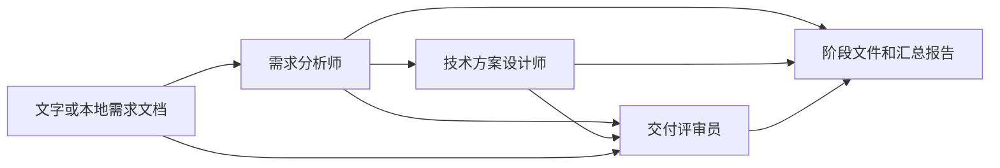

# CrewAI 需求分析助手

输入一段需求或一个本地文档，三个 CrewAI Agent 依次完成需求拆解、技术方案和独立评审，生成可以阅读和修改的 Markdown 报告。原来的通用单 Agent 入口仍可使用。

本目录使用独立的 Python 3.13 环境、依赖和锁文件。

## 快速开始

首次使用时准备环境和配置：

```bash
cd /Users/zhengjie/Github/Z/crewai_agent
make setup
```

在本目录 `.env` 填写 `OPENAI_API_KEY` 和 `MODEL`，根据模型服务设置 `OPENAI_BASE_URL` 和 `OPENAI_API`。已有配置不会被 `make setup` 覆盖。

运行内置的「团队任务管理」示例：

```bash
make analyze
```

分析自己的需求文件：

```bash
make analyze INPUT=examples/task_manager.md
```

或者直接输入需求：

```bash
make analyze TASK='做一个团队任务管理工具，支持分配负责人、筛选状态和逾期提示'
```

也可以在仓库根目录执行：

```bash
make -C crewai_agent analyze INPUT=/绝对路径/需求.md
```

每次启动自动按锁文件同步本目录的 `.venv`，无需手动激活环境。

## 三个角色如何协作

| 角色 | 输入 | 输出 |
| --- | --- | --- |
| 产品需求分析师 | 原始需求 | 目标和范围、FR 编号的功能需求、验收条件、流程、CL 编号的待澄清问题 |
| 技术方案设计师 | 需求分析结果 | 模块与需求映射、数据模型、流程与接口建议、异常和权限处理、实施依赖 |
| 交付评审员 | 原始需求、需求分析、技术方案 | 覆盖矩阵、P0/P1/P2 问题、修订建议、开发任务和测试清单 |



三个角色通过顺序任务和显式上下文传递结果。方案评审完成后流程结束，目前不包含自动返工循环。提示词要求区分已确认事实、假设、建议和待澄清问题；评审结果仍是模型建议，不表示用户已经批准。

## 查看分析结果

每次分析会创建独立目录，保留历史结果。终端显示阶段进度和最终报告路径：

```text
outputs/20260922-163000-xxxxxxxx/
├── 00-input.md          # 原始需求
├── 01-requirements.md   # 需求分析与验收条件
├── 02-design.md         # 技术方案
├── 03-review.md         # 评审、开发任务和测试清单
└── report.md            # 汇总报告，建议从这里开始阅读
```

默认 `outputs/` 已加入 Git 忽略规则。需要其他位置时：

```bash
make analyze INPUT=examples/task_manager.md OUTPUT_DIR=./my-reports
```

阶段结果会在各阶段完成时保存。中途失败时命令返回非零状态，原始输入及已完成阶段仍保留，但不生成完整的 `report.md`。重新运行会创建新目录；当前不支持断点续跑。

## 命令说明

| 命令 | 用途 |
| --- | --- |
| `make` / `make help` | 查看命令说明 |
| `make setup` | 安装依赖并创建本地配置文件 |
| `make install` | 按锁文件同步独立环境 |
| `make analyze` | 三角色分析，未指定输入时使用内置示例 |
| `make check-analyze` | 验证输入、模型配置和三角色构造，不调用模型、不创建报告 |
| `make run` / `make start` | 原来的通用单 Agent，回答后退出 |
| `make check` | 检查通用单 Agent 配置 |
| `make test` | 运行离线测试，模型请求由本地 HTTP 模拟服务处理，无需真实密钥 |

通用 Agent 的用法保持一致：

```bash
make run TASK='请解释 Agent、Task 和 Crew 的关系'
```

也可直接使用命令行入口：

```bash
uv run --locked python main.py --help
uv run --locked python main.py --mode requirements --input-file examples/task_manager.md
uv run --locked python main.py --mode requirements --task '设计一个团队任务管理工具'
uv run --locked python main.py --mode requirements --check
```

`TASK` 与 `INPUT` 二选一；显式 `--task` 或 `--input-file` 优先于这两个环境变量。相对文件路径按运行时目录解析，`make -C crewai_agent` 下相对于 `crewai_agent/`。输入文本中的美元符号在 shell 中需用单引号保护；Makefile 会原样传递变量值。

## 模型配置

| 变量 | 说明 |
| --- | --- |
| `OPENAI_API_KEY` | 必填，模型服务密钥 |
| `MODEL` | 必填，服务支持的实际模型名称 |
| `OPENAI_BASE_URL` | 默认 `https://api.openai.com/v1`，可设置为 OpenAI 兼容网关 |
| `OPENAI_API` | `completions`（默认，Chat Completions）或 `responses`（Responses API） |
| `no_proxy` / `NO_PROXY` | 可选，模型网关的代理绕过列表；显式进程环境变量优先 |

仅加载本目录 `.env`，进程环境变量优先；不会自动加载父目录的配置。文件中的值按字面读取，不进行变量插值。CrewAI 会去除模型名称的 `openai/` 前缀。

`make check` 和 `make check-analyze` 不验证真实密钥、模型权限或网络连通性；运行任务时才请求模型服务。三角色分析会分别调用模型，不是一次请求完成全部工作。

## 当前能力范围

- 本地文件输入支持 UTF-8 编码的 Markdown 和纯文本（`.md`、`.txt`），每份输入最多 64 KiB。
- 文件由程序在启动时读取并传给模型；Agent 不会自行遍历其他文件。
- 可分析功能范围、用户流程、数据及接口建议、异常场景、实施依赖和验收条件。
- 尚未接入网络搜索、代码仓库检索、数据库、任务系统或代码执行工具。
- 输出质量取决于需求信息和所选模型；未知的接口、技术栈和业务规则应保留为建议或待确认项。
- 运行方式是命令行批处理，不包含 Web 页面、HTTP 服务或跨运行对话记忆。

## 项目结构

```text
crewai_agent/
├── AGENTS.md
├── Makefile
├── main.py                 # 命令行、输入选择与流程执行
├── config.py               # 独立模型配置
├── crew.py                 # 单 Agent 与三角色流程、提示词和上下文
├── reports.py              # 文件读取与报告保存
├── examples/task_manager.md
├── tests/                  # 输入边界及真实 CrewAI 编排的离线测试
├── README.md
├── .env.example
├── .env                    # 本地配置，不提交
├── .gitignore
├── .python-version
├── pyproject.toml
├── uv.lock
├── outputs/                # 分析结果，不提交
└── .venv/                  # 独立环境，不提交
```

扩展角色和业务要求时修改 `crew.py`；接入新输入格式时修改 `reports.py`。依赖在本目录通过 `uv add` 管理，不加入根项目的 uv workspace，也不导入根环境的模型实例。

参考：[CrewAI Tasks](https://docs.crewai.com/en/concepts/tasks)、[顺序执行](https://docs.crewai.com/en/learn/sequential-process)、[模型配置](https://docs.crewai.com/en/concepts/llms)。
