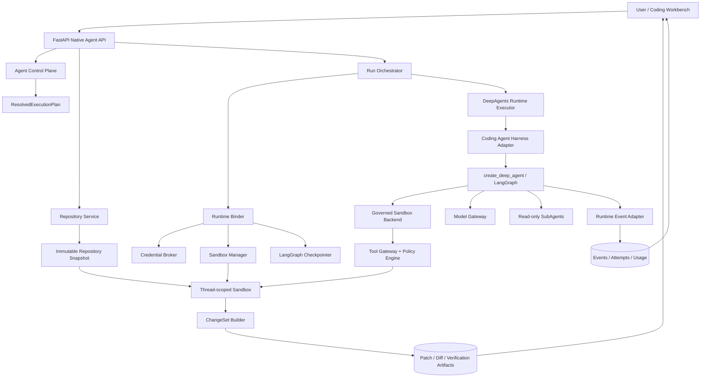
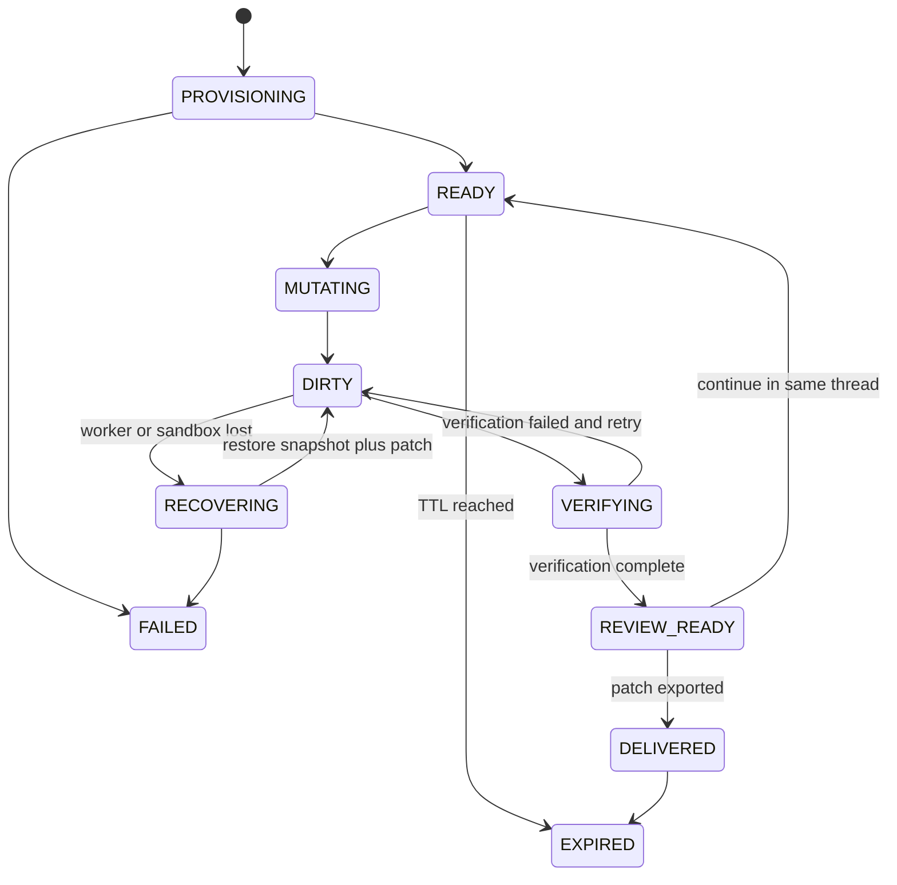

# DeepAgent Platform Coding Agent 架构设计方案

> 状态：Approved v1.0；Docker `patch_only` MVP 已实现
> 日期：2026-08-29
> 范围：在现有 `deepAgentsProject` 中增加一个可以读取代码、修改代码、运行构建与测试、输出可审阅变更集的 Coding Agent
> 当前阶段：Phase A–C 的本地/CI 实现已落地；Kubernetes 与受控 Git 交付按原方案后续实施

## 1. 结论与推荐方案

Coding Agent 不应被实现成一套独立于现有平台的新服务，也不应直接把 Shell 接到当前 `ReferenceRuntimeExecutor` 上。

推荐将它实现为现有 Agent 生命周期中的一个受治理 Profile：

```text
harness_type = deepagents
harness_profile_revision_id = coding-agent-v1
```

它继续复用现有的：

- Agent Draft / Revision / ResolvedExecutionPlan / Deployment；
- Thread / Run / RunAttempt / Lease / RuntimeEvent；
- HITL、Checkpoint、Usage Ledger、Artifact 和租户隔离；
- Model Gateway、Plugin / Skill Registry 和控制台。

新增的核心能力是：

- 真实 `create_deep_agent()` Agent Loop；
- Repository 与不可变源码快照；
- Thread-scoped Coding Workspace；
- 隔离 Sandbox 及受治理的文件、Shell、Git 能力；
- ChangeSet、Diff 和 Verification Report；
- Coding Workbench 前端；
- Coding Agent 专用策略、Skills 和只读 SubAgent。

默认交付模式为 `patch_only`：Agent 在隔离工作区内完成修改和测试，平台输出 Patch、Diff、验证报告和总结，不直接修改宿主工作区、不自动 Commit、不自动 Push。

## 2. 目标与非目标

### 2.1 目标

第一版 Coding Agent 必须能够：

1. 从确定的 Repository 和 Base Commit 创建隔离工作区；
2. 搜索、读取和理解代码；
3. 制定并持续更新任务计划；
4. 编辑、新增和删除允许范围内的文件；
5. 在 Sandbox 内运行格式化、类型检查、构建和测试；
6. 根据失败结果继续修改，直到成功或达到预算；
7. 生成可审阅的 Diff、Patch、验证报告和最终总结；
8. 支持取消、超时、审批、Worker 重试和断线续传；
9. 保证模型无法直接访问宿主机、平台密钥和其他租户数据；
10. 锁定 Agent、模型、Skill、工具、Sandbox 镜像和源码基线，保证运行可追溯。

### 2.2 第一版非目标

- 不自动 Push、创建 PR、合并或部署；
- 不直接在用户宿主目录中编辑文件；
- 不允许多个写入型 SubAgent 并发修改同一个工作区；
- 不支持无约束公网访问；
- 不执行 Docker-in-Docker、Privileged、HostPath 或宿主 Socket 挂载；
- 不把模型生成的命令交给 API 进程或 Runtime Worker 的 `subprocess`；
- 不以模拟事件代替真实工具调用或 SubAgent 执行。

## 3. 当前实现评估

现有代码已经具备适合作为基础的平台控制面，但执行面仍是 Reference 实现。

| 当前模块 | 可以复用 | 必须补齐 |
| --- | --- | --- |
| Agent 发布链路 | Revision、Plan Hash、Deployment | Coding Profile、Sandbox/Repository/Tool 快照 |
| Runtime Orchestrator | Queue、RunAttempt、Lease、失败事件 | Executor Registry、心跳、真实 Checkpoint 恢复 |
| DeepAgents Adapter | Skill Hash 校验和稳定边界 | 调用 `create_deep_agent()`、Backend/Tool/Event 映射 |
| Runtime Binder | Tenant/Project/Thread Namespace | Repository Snapshot、Sandbox、Checkpointer、短期 Git 凭据 |
| Reference Executor | 事件、审批、Usage、Artifact 范例 | 拆出通用执行协议，Coding Agent 使用真实 Agent Loop |
| Tool 配置 | Tool Binding 基础结构 | 真实 Tool Registry/Gateway、Schema、策略与调用实现 |
| Filesystem 配置 | `filesystem_enabled` 声明 | 真实隔离文件系统和路径权限 |
| SubAgent | Binding 和事件模型 | 真实只读 Reviewer/Explorer SubAgent |
| 前端 | Playground、Runs、Events、Artifacts | 文件树、代码查看、Diff、命令和测试报告 |

当前 `DeepAgentsHarnessAdapter` 只返回一个配置字典，没有创建 LangGraph Runnable；当前 `researcher` 也只产生演示事件。因此 Coding Agent 的实现入口不是继续扩展演示分支，而是建立真实 Harness Executor。

## 4. 总体架构



关键边界：

1. Control Plane 只发布并锁定配置，不创建 Sandbox；
2. Runtime Binder 在 Run 开始时解析源码快照、Sandbox、Credential 和 Checkpointer；
3. 模型只能看到经过 Tool Gateway 暴露的能力；
4. 所有写文件和命令都发生在 Sandbox 内；
5. LangGraph Checkpoint 保存 Agent 执行状态，Coding Workspace 保存代码状态，两者不能混为一体；
6. ChangeSet 是代码交付事实来源，RuntimeEvent 是审计和流式展示事实来源。

## 5. Coding Agent 的运行协议

Coding Agent 使用一个 Coordinator Agent，并遵循固定的工作协议：

```text
Resolve source
    ↓
Provision / resume workspace
    ↓
Inspect repository and local instructions
    ↓
Create plan
    ↓
Implement in small changes
    ↓
Run targeted verification
    ↓
Failure? ── yes ──> Diagnose and revise ──┐
    │                                     │
    no                                    │
    ↓                                     │
Run broader verification <───────────────┘
    ↓
Build ChangeSet
    ↓
Policy / human review when required
    ↓
Produce patch, report and final response
```

### 5.1 Agent Loop

`CodingAgentHarnessAdapter` 使用锁定版本的 Deep Agents SDK 构建真实 Runnable：

```python
agent = create_deep_agent(
    model=bound_model,
    system_prompt=resolved_coding_prompt,
    backend=governed_sandbox_backend,
    tools=governed_extra_tools,
    skills=materialized_skill_paths,
    subagents=resolved_read_only_subagents,
    middleware=platform_middleware,
)
```

实际参数以锁定版本的兼容性 Profile 为准，平台业务模块不能直接依赖 Deep Agents 的内部 Middleware 类型。

模型必须支持 Tool Calling；发布校验必须拒绝不支持 Tool Calling、流式事件或所需上下文长度的模型部署。

### 5.2 固定行为约束

Coding Agent 的系统指令和 `coding-workflow` Skill 至少包含：

- 修改前先读取 Repository 根目录及相关子目录的 `AGENTS.md`；
- 先搜索和理解现有实现，不猜测文件位置；
- 保留用户已有修改，不覆盖无关变更；
- 采用满足任务的最小变更范围；
- 不伪造命令、测试和构建结果；
- 修改后运行与风险相匹配的验证；
- 未经授权不 Commit、Push、建 PR 或部署；
- 最终报告修改内容、验证结果、失败项和剩余风险。

## 6. Repository、Workspace 与 ChangeSet

### 6.1 新增领域对象

```text
RepositoryDefinition
  ├── tenant_id / project_id
  ├── provider: local_snapshot | github | gitlab | generic_git
  ├── canonical_uri
  ├── default_branch
  ├── credential_ref
  └── access_policy_revision_id

RepositorySnapshot
  ├── repository_id
  ├── requested_ref
  ├── resolved_commit_sha
  ├── source_manifest_hash
  ├── archive_uri
  └── created_at

CodingWorkspace
  ├── thread_id
  ├── repository_snapshot_id
  ├── sandbox_instance_id
  ├── lifecycle: thread_scoped
  ├── workspace_generation
  ├── status
  ├── expires_at
  └── last_checkpoint_id

ChangeSet
  ├── run_id / workspace_id
  ├── base_commit_sha
  ├── workspace_generation
  ├── patch_artifact_id
  ├── diff_stat
  ├── changed_file_hashes
  ├── verification_report_id
  ├── status
  └── content_hash
```

### 6.2 源码输入

创建 Coding Thread 时必须显式选择源码：

```json
{
  "agent_deployment_id": "deploy_xxx",
  "title": "Fix authentication timeout",
  "workspace": {
    "repository_id": "repo_xxx",
    "base_ref": "main",
    "source_mode": "committed_ref"
  }
}
```

`base_ref` 在 Workspace 创建前解析为不可变 Commit SHA。历史 Run 始终显示实际 SHA，不能只保存可移动的分支名。

本地仓库开发模式额外支持 `working_tree_snapshot`，但必须先形成内容寻址的源码归档与 Manifest，再送入 Sandbox；不能把宿主目录以读写方式直接挂载给模型。

### 6.3 Workspace 生命周期

默认采用 `thread_scoped`：同一 Thread 的后续 Run 继续使用相同 Coding Workspace，适合连续编码会话。



Sandbox 存活时优先原地恢复。Sandbox 已过期时，使用以下数据重建：

```text
RepositorySnapshot + latest durable ChangeSet patch + LangGraph Checkpoint
```

恢复前必须校验 `plan_hash`、`base_commit_sha`、`workspace_generation` 和 Patch Hash。

## 7. Sandbox 架构

### 7.1 Provider 模型

```python
class SandboxProvider(Protocol):
    async def provision(self, request: SandboxProvisionRequest) -> SandboxHandle: ...
    async def resume(self, sandbox_instance_id: str) -> SandboxHandle: ...
    async def snapshot(self, sandbox_instance_id: str) -> SandboxSnapshot: ...
    async def destroy(self, sandbox_instance_id: str) -> None: ...


class SandboxHandle(Protocol):
    async def execute(self, request: CommandRequest) -> CommandResult: ...
    async def read_file(self, path: str) -> FileResult: ...
    async def write_file(self, path: str, content: bytes) -> FileResult: ...
    async def list_files(self, request: FileQuery) -> FileListResult: ...
```

Provider 实现：

| 环境 | 实现 | 要求 |
| --- | --- | --- |
| 本地开发 / CI | Docker Sandbox Provider | 独立容器、非 root、无宿主写挂载、默认禁网 |
| Production | Kubernetes Sandbox Provider | 独立 Namespace/ServiceAccount、NetworkPolicy、Quota、TTL |
| 测试 | In-memory Fake Provider | 只用于协议测试，不能声称执行过真实命令 |

如果本地 Docker 不可用，Coding Run 应明确失败为 `SANDBOX_UNAVAILABLE`，不得静默降级为宿主 Shell。

### 7.2 Sandbox Profile

Sandbox Profile 作为不可变 Revision 锁入 `ResolvedExecutionPlan`：

```json
{
  "provider": "docker",
  "image_digest": "coding-runtime@sha256:...",
  "user": "10001:10001",
  "cpu_limit": 2,
  "memory_mb": 4096,
  "disk_mb": 10240,
  "pids_limit": 256,
  "command_timeout_seconds": 300,
  "run_timeout_seconds": 1800,
  "network_mode": "deny_by_default",
  "workspace_root": "/workspace/repo",
  "read_only_rootfs": true,
  "lifecycle": "thread_scoped",
  "ttl_seconds": 86400
}
```

运行镜像预装 Git、`rg`、Patch、Python、Node.js 及平台 Sandbox Agent。其他语言工具链通过不同的镜像 Revision 提供，不允许运行时使用不受控的 `latest` 镜像。

### 7.3 两层工作区访问

Deep Agents 的 Sandbox Backend 不能直接绕过平台策略。平台提供 `GovernedSandboxBackend`：

```text
Deep Agents filesystem / execute tool
                ↓
GovernedSandboxBackend
                ↓
Tool Gateway / Policy Engine / Audit / Redaction
                ↓
Sandbox Provider
```

该 Backend 实现 Deep Agents 所需的 Sandbox Backend Protocol，但每次调用都携带 Tenant、Project、Run、Workspace、Policy Revision 和 Idempotency Key。

## 8. 工具集合与策略

### 8.1 MVP 工具

| Tool | 用途 | 默认风险 | 默认行为 |
| --- | --- | --- | --- |
| `ls` / `glob` / `grep` | 浏览和搜索代码 | low | 自动允许 |
| `read_file` | 读取源码 | low | 自动允许，路径受限 |
| `write_file` / `edit_file` | 修改 Sandbox 文件 | medium | Sandbox 内允许并审计 |
| `execute` | 构建、测试、格式化和 Git 只读命令 | medium/high | 经过命令策略和资源限制 |
| `git_status` | 结构化工作区状态 | low | 自动允许 |
| `git_diff` | 结构化 Diff | low | 自动允许 |
| `verification_report` | 记录验证结果 | low | 自动允许 |
| `knowledge_search` | 查询项目知识库 | low | 继续复用现有能力 |

`git_status` 和 `git_diff` 建议做成受约束的结构化工具，而不是要求模型反复拼接 Shell 命令。

### 8.2 默认动作矩阵

| 动作 | 默认策略 |
| --- | --- |
| 读源码、搜索、查看 Diff | 允许 |
| 修改普通源码和测试文件 | Sandbox 内允许，完整审计 |
| 删除文件、大规模重命名 | 达到阈值后需要审批 |
| 修改密钥、CI/CD、部署、权限、锁文件 | 按路径与语义规则提升风险 |
| 运行本地测试、Lint、Build | Sandbox 内允许，限制时间与资源 |
| 安装依赖或访问公网 | 默认拒绝；显式允许时需要审批和域名白名单 |
| `git commit` | MVP 禁用；后续可配置审批 |
| `git push`、创建 PR、Merge、Deploy | 始终需要显式审批和独立 Credential |
| 读取平台环境变量、宿主路径、其他工作区 | 拒绝 |

### 8.3 命令执行约束

`execute` 不能只依赖字符串黑名单。必须同时具备：

- Sandbox 隔离；
- 固定工作目录 `/workspace/repo`；
- 非 root 用户；
- 命令超时、输出上限、进程数和磁盘配额；
- 默认无网络，按域名和端口临时放行；
- 清洗环境变量，仅注入本次调用需要的短期 Credential；
- 禁止访问容器 Runtime Socket、宿主设备和控制面网络；
- stdout/stderr 流式事件与敏感信息 Redaction；
- 相同副作用调用使用 Idempotency Key；
- 命令结束后记录 exit code、耗时和资源用量。

## 9. Agent、Skills 与 SubAgents

### 9.1 Main Agent

Main Agent 是唯一默认写入者，负责：

- 理解任务和约束；
- 调用文件与 Shell 工具；
- 维护 Todo；
- 实现修改；
- 选择验证范围；
- 判断是否需要用户输入或审批；
- 产出最终 ChangeSet。

### 9.2 内置 Skills

新增 `deepagent-coding` 内置插件：

```text
builtin_plugins/deepagent-coding/
├── plugin.json
└── skills/
    ├── coding-workflow/SKILL.md
    ├── repository-safety/SKILL.md
    ├── test-and-verification/SKILL.md
    └── change-delivery/SKILL.md
```

Skill 继续使用现有版本锁定和 SHA-256 Hash 校验机制。

### 9.3 SubAgents

MVP 只提供只读或无工作区写权限的 SubAgent：

| SubAgent | 权限 | 用途 |
| --- | --- | --- |
| `codebase-explorer` | read-only | 查找实现、调用关系和约束 |
| `code-reviewer` | read-only | 审查当前 Diff 的正确性和风险 |
| `test-diagnostician` | read-only + approved test execute | 分析失败测试并给出建议 |

SubAgent 结果返回 Main Agent，由 Main Agent 统一写入，避免并发编辑冲突。多写入者、动态 SubAgent 和跨 Run 异步 SubAgent 推迟到后续阶段。

## 10. Execution Plan 与运行时绑定

### 10.1 Agent Draft 扩展

建议保留 `harness_type="deepagents"`，扩展 Profile 和 Coding 配置：

```python
class CodingProfileSpec(BaseModel):
    enabled: bool = False
    sandbox_profile_revision_id: str
    repository_policy_revision_id: str
    delivery_mode: Literal["patch_only", "commit", "pull_request"] = "patch_only"
    verification_policy: VerificationPolicy
    protected_paths: list[str] = []
    max_changed_files: int = 50
    max_diff_lines: int = 5000
```

### 10.2 ResolvedExecutionPlan 新增快照

发布阶段锁定：

- `coding_profile`；
- `sandbox_profile_revision` 和镜像 Digest；
- 文件与命令 Tool Schema Hash；
- Repository Access Policy Revision；
- Verification Policy；
- Protected Path Rules；
- Coding Skill Versions 和 Artifact Hash；
- SubAgent Revision 与权限；
- Deep Agents、LangChain、LangGraph 的精确版本；
- Event Adapter 版本。

不能继续使用当前的 `0.x-compatible` / `1.x-compatible` 作为生产可复现版本；实现时必须锁定精确版本或 lockfile hash。

### 10.3 Runtime Binder 新增绑定

运行阶段解析：

```text
ResolvedExecutionPlan
  + Thread Repository Binding
  + resolved_commit_sha
        ↓
RuntimeBinder
  ├── Sandbox Handle
  ├── Coding Workspace Handle
  ├── Checkpointer Namespace
  ├── Store Namespace
  ├── Model Endpoint
  ├── short-lived Repository Credential
  ├── Tool Gateway Context
  └── Feature Flags
```

Credential 只能由 Sandbox Manager 在具体 Git 操作前兑换，不能进入 Prompt、Checkpoint、Event、Artifact 或持久 Workspace Manifest。

## 11. Runtime Executor 重构

当前 Orchestrator 固定持有 `ReferenceRuntimeExecutor`。建议改为：

```python
class RuntimeExecutor(Protocol):
    async def execute(self, run_id: str) -> None: ...


class ExecutorRegistry:
    def resolve(self, plan: dict) -> RuntimeExecutor:
        # reference-v1 -> ReferenceRuntimeExecutor
        # coding-agent-v1 -> DeepAgentsRuntimeExecutor
        ...
```

`DeepAgentsRuntimeExecutor` 的职责：

1. 获取 Run Lease 并定期 Heartbeat；
2. 调用 Runtime Binder；
3. 通过 Harness Adapter 构建 Runnable；
4. 使用 `thread_id` 和 Checkpointer 执行或恢复 Graph；
5. 将 LangGraph / Deep Agents Stream 映射为平台 RuntimeEvent；
6. 处理 Interrupt、取消、超时和预算；
7. 在安全边界处生成 Workspace Snapshot 和 ChangeSet；
8. 汇总 Usage，关闭或保留 Sandbox。

不要把 Coding Agent 的固定步骤继续硬编码进 `ReferenceRuntimeExecutor`。执行循环和 Tool Call 必须来自真实 Graph。

## 12. Checkpoint、恢复与幂等

需要分别管理三种状态：

| 状态 | 事实来源 |
| --- | --- |
| Agent 消息、Todo、Graph 节点、Interrupt | LangGraph Checkpointer |
| 文件、依赖安装和 Git Working Tree | Coding Workspace / Sandbox Snapshot |
| 审计、流式 UI、Usage | RuntimeEvent / Usage Ledger |

持久化策略：

- 每次模型步骤由 LangGraph Checkpointer 保存；
- 每次文件变更记录路径、变更前后 Hash 和 `workspace_generation`；
- 每次验证阶段结束生成不可变 Patch Artifact；
- 进入 HITL、Worker 释放 Lease、Sandbox TTL 回收前必须生成 Durable Workspace Snapshot；
- 恢复时先恢复 Workspace，再恢复 Graph，避免 Agent 状态指向不存在的文件版本；
- 外部写操作在 Interrupt 前后都必须幂等，不能因为 Graph Replay 重复 Push、建 PR 或部署。

## 13. 事件与 Artifact

### 13.1 新增事件

```text
repository.snapshot.resolved
workspace.provisioning
workspace.ready
workspace.snapshot.created
workspace.recovering
workspace.expired
file.read
file.changed
file.deleted
sandbox.command.requested
sandbox.command.started
sandbox.command.delta
sandbox.command.completed
sandbox.command.failed
git.diff.updated
verification.started
verification.check.completed
verification.completed
changeset.created
changeset.review_required
changeset.delivered
```

高频 stdout/stderr 事件需要分块、限流和截断。完整日志放入对象存储，事件只保留安全摘要和 Artifact 引用。

### 13.2 标准 Artifact

每个成功或部分成功的 Coding Run 至少生成：

```text
changes.patch
diff.json
verification-report.json
command-log.txt
coding-agent-summary.md
```

Artifact 必须包含 Hash、Base Commit、Workspace Generation、Plan Hash 和创建时间。即使测试失败，只要产生了变更，也应保存可诊断的部分 ChangeSet，除非策略要求销毁。

## 14. API 设计

### 14.1 Repository

```text
POST   /api/v1/repositories
GET    /api/v1/repositories
GET    /api/v1/repositories/{repository_id}
POST   /api/v1/repositories/{repository_id}:probe
POST   /api/v1/repositories/{repository_id}/snapshots
GET    /api/v1/repository-snapshots/{snapshot_id}
```

### 14.2 Coding Workspace

```text
GET    /api/v1/threads/{thread_id}/workspace
GET    /api/v1/runs/{run_id}/workspace/tree
GET    /api/v1/runs/{run_id}/workspace/file?path=...
GET    /api/v1/runs/{run_id}/diff
GET    /api/v1/runs/{run_id}/verification
GET    /api/v1/runs/{run_id}/changesets
POST   /api/v1/runs/{run_id}/changesets/{changeset_id}:approve
POST   /api/v1/runs/{run_id}/changesets/{changeset_id}:reject
```

现有 `/threads/{thread_id}/runs`、Run SSE、Interrupt 决策和 Artifact API 继续复用。文件读取 API 必须复用 Tenant/Project 授权，并限制路径、大小和二进制类型。

## 15. 前端设计

新增 Coding Workbench，而不是把所有信息塞进现有聊天气泡：

```text
┌──────────────┬──────────────────────────────┬────────────────────┐
│ Repository   │ Code / Diff / Test Output    │ Agent Conversation │
│ File Tree    │                              │ Plan / Approvals   │
│ Changes      │                              │ Live Events        │
└──────────────┴──────────────────────────────┴────────────────────┘
```

最小功能：

- 创建 Thread 时选择 Repository 和 Base Ref；
- 文件树、只读代码查看器；
- Unified / Split Diff；
- 变更文件计数和 Diff Stat；
- 命令、测试、构建状态；
- 审批卡片；
- Patch 下载；
- Workspace、Base Commit、Plan Hash 和 Sandbox 状态；
- Run 结束后的验证总结。

Agent Builder 中增加 `Coding Agent starter`，自动绑定 Coding Profile、Skills、Sandbox Profile 和默认策略。

## 16. 安全模型

### 16.1 主要威胁

- Repository 中的 Prompt Injection；
- 恶意测试脚本或依赖安装；
- 通过 Shell 访问平台元数据、密钥或其他租户；
- 路径穿越和软链接逃逸；
- 超大输出、无限进程、磁盘耗尽和资源攻击；
- 伪造测试成功、隐藏 Diff 或污染 Artifact；
- Checkpoint Replay 导致重复外部副作用；
- Git Credential 泄漏到日志、文件或模型上下文。

### 16.2 防护原则

- Repository 内容一律视为不可信数据，不得覆盖平台系统策略；
- Tool Gateway 在模型之外执行 Visibility、Authorization、Approval 和 Isolation；
- Sandbox 无宿主挂载、无平台 ServiceAccount、默认无网；
- 路径使用规范化后的 Sandbox 内绝对路径，拒绝越界和危险软链接；
- Git Credential 短期、最小权限、按调用注入并立即撤销；
- Diff 由平台从文件系统重新计算，不能相信模型总结；
- Verification 结果由 Sandbox Command Result 生成，不能由模型自行声明；
- Artifact 与事件在持久化前统一 Redaction；
- Push、PR、Merge、Deploy 作为不同的高风险 Tool，不能隐藏在通用 Shell 中。

## 17. 可观测性与预算

除现有 Token、Tool 和 SubAgent 统计外，新增：

```text
sandbox_cpu_seconds
sandbox_memory_peak_bytes
sandbox_disk_peak_bytes
command_count
command_duration_seconds
files_read
files_changed
diff_lines_added
diff_lines_deleted
verification_passed_total
verification_failed_total
workspace_restore_total
```

预算达到阈值时：

1. 停止新的模型或工具调用；
2. 保存当前 Workspace Snapshot 和 Patch；
3. 生成部分 Verification Report；
4. 将 Run 标记为 `PAUSED_BUDGET` 或 `FAILED_BUDGET`；
5. 允许用户提高预算后从同一 Checkpoint 恢复。

## 18. 代码模块规划

```text
packages/
├── coding/
│   ├── models.py                 Repository/Workspace/ChangeSet 模型
│   ├── service.py                Coding Workspace 用例
│   ├── changeset.py              Diff、Patch、Hash 和验证报告
│   └── policies.py               路径、命令和交付策略
├── repositories/
│   ├── ports.py
│   ├── local_snapshot.py
│   └── git_provider.py
├── sandbox/
│   ├── ports.py
│   ├── manager.py
│   ├── docker_provider.py
│   ├── kubernetes_provider.py
│   └── fake_provider.py
├── tools/
│   ├── gateway.py
│   ├── policy.py
│   └── sandbox_tools.py
├── adapters/harness/deepagents/
│   ├── adapter.py
│   ├── coding_factory.py
│   ├── governed_backend.py
│   └── event_adapter.py
└── runtime/
    ├── executor_registry.py
    ├── deepagents_executor.py
    └── orchestrator.py

builtin_plugins/
└── deepagent-coding/

apps/platform_api/native_api/
├── repository_routes.py
└── coding_routes.py

apps/web/src/pages/
└── CodingWorkbenchPage.tsx
```

模块名在实施时可以按现有仓库风格微调，但 Repository、Sandbox、Harness 和 Runtime 四个边界不应合并成一个巨型 Executor。

## 19. 分阶段实施

### Phase A：真实 Agent Runtime 基础

- 锁定 Deep Agents、LangChain、LangGraph 精确版本；
- 引入 `RuntimeExecutor` / `ExecutorRegistry`；
- 实现真实 `create_deep_agent()` Harness Factory；
- 建立 Stream Event Adapter 和持久 Checkpointer；
- 保留 Reference Executor 作为平台契约测试夹具。

验收：真实模型能够完成一次只读 Agent Tool Loop，事件不是硬编码模拟。

### Phase B：安全 Coding MVP

- RepositoryDefinition / Snapshot / CodingWorkspace / ChangeSet；
- Docker Sandbox Provider；
- Governed Sandbox Backend；
- 文件工具、`execute`、`git_status`、`git_diff`；
- Coding Skills；
- `patch_only` 交付；
- 基础 Coding Workbench。

验收：Agent 能在隔离副本中修改一个真实仓库、运行测试并输出 Patch，宿主源码和 Git Remote 不被修改。

### Phase C：治理与可靠性

- 完整 Tool Gateway、命令/路径策略和审批；
- Workspace Snapshot 与过期重建；
- Worker Lease Heartbeat、取消与预算恢复；
- 完整 Artifact、Redaction、Usage 和审计；
- 故障注入及租户隔离测试。

验收：Worker 或 Sandbox 中断后可从最后 Durable Snapshot 恢复，外部副作用不重复。

### Phase D：受控 Git 交付

- Repository Provider 和短期 Git Credential；
- Commit / Push / PR 独立高风险 Tool；
- Branch Policy、Protected Branch、审批和幂等；
- PR 链接与状态同步。

验收：只有通过显式审批的 ChangeSet 才能使用最小权限 Token 创建分支和 PR。

### Phase E：高级协作

- 只读 Explorer / Reviewer / Test Diagnostician；
- 更细粒度上下文压缩和代码索引；
- 多语言 Sandbox 镜像；
- 在明确冲突控制方案后评估并行写入 SubAgent。

## 20. 测试策略与验收标准

### 20.1 必测场景

- Repository Ref 被正确解析并锁定为 Commit SHA；
- 不同 Tenant/Project 无法读取彼此 Repository、Workspace 和 Artifact；
- `../`、绝对宿主路径和危险软链接无法逃逸；
- Sandbox 看不到平台环境变量、Docker Socket 和宿主文件；
- 网络默认拒绝，临时放行会过期；
- 取消 Run 会终止模型流和 Sandbox 命令；
- 命令超时、输出截断、磁盘与进程限制生效；
- Worker 崩溃后 Graph 与 Workspace 一致恢复；
- Replay 不会重复 Commit、Push 或 PR；
- Agent 无法伪造 Verification Report；
- Patch Hash、Base Commit 和 Changed File Hash 可重复校验；
- 已存在的用户修改不会被无关覆盖；
- 未配置 Sandbox 时不会回退到宿主 Shell。

### 20.2 MVP 完成定义

MVP 只有同时满足以下条件才算完成：

1. 在隔离 Sandbox 中运行；
2. 使用真实 Agent Tool Loop；
3. 能读取、编辑、搜索和执行测试；
4. 能输出平台重新计算的 Diff 和 Patch；
5. 能展示真实命令 exit code 和验证结果；
6. 可取消、超时并生成审计事件；
7. 宿主工作区、Git Remote 和平台密钥没有被 Agent 直接访问；
8. 自动化测试覆盖权限、逃逸、恢复和交付边界。

## 21. 明确拒绝的实现方式

以下方式虽然开发快，但不进入实现：

- 在 FastAPI 或 Runtime Worker 中直接 `subprocess.run(model_command)`；
- 将 `/Users/.../repository` 以读写 HostPath 挂进 Agent 容器；
- 让模型直接读取长期 Git Token；
- 仅在 Prompt 中要求“不要做危险操作”，没有外部策略执行；
- 继续用固定 `sleep + event.append` 模拟 Tool、SubAgent 和 Graph；
- 将代码全文、命令完整输出和 Patch 全部塞进 Checkpoint；
- 让多个 SubAgent 无锁地写同一个 Git Working Tree；
- 将 Push、PR、Merge 和 Deploy 作为通用 `execute` 的普通命令。

## 22. 等待评审的架构决策

推荐先按以下默认值实施：

| 决策 | 推荐默认值 |
| --- | --- |
| Coding Agent 定位 | 现有 `deepagents` Harness 的 `coding-agent-v1` Profile |
| 本地执行环境 | Docker Sandbox；不可用时明确失败 |
| 生产执行环境 | Kubernetes Sandbox |
| Workspace Scope | Thread-scoped，TTL 24 小时 |
| 源码交付 | 内容寻址 Snapshot，不读写挂载宿主目录 |
| MVP 输出 | Patch + Diff + Verification Report |
| Commit / Push / PR | MVP 禁用 |
| 网络 | 默认拒绝 |
| 写入者 | Main Agent 单写 |
| SubAgent | MVP 后半段加入，只读 |
| SDK 集成 | 真实 `create_deep_agent()` + LangGraph Checkpointer |

评审通过后，建议严格按 Phase A → Phase B 实施，不同时展开 PR 自动化、Kubernetes 和并行 SubAgent。

## 23. 上游依据

本方案依据当前 Deep Agents / LangGraph 官方能力边界设计：

- Deep Agents 是基于 LangChain、使用 LangGraph Runtime 的 Agent Harness，并提供规划、文件系统、SubAgent 和 Sandbox 能力：<https://docs.langchain.com/oss/python/deepagents/overview>
- Sandbox Backend 会向 Agent 暴露文件工具和 `execute`，适合测试、构建和 Git 操作：<https://docs.langchain.com/oss/python/deepagents/sandboxes>
- Backend 可替换或组合，适合在平台侧实现受治理的 Sandbox Backend：<https://docs.langchain.com/oss/python/deepagents/backends>
- LangGraph Checkpoint 支持 HITL、线程记忆、故障恢复和状态回放：<https://docs.langchain.com/oss/python/langgraph/persistence>
- Interrupt 恢复依赖持久 Checkpointer，且 Interrupt 前的副作用必须幂等：<https://docs.langchain.com/oss/python/langgraph/interrupts>
