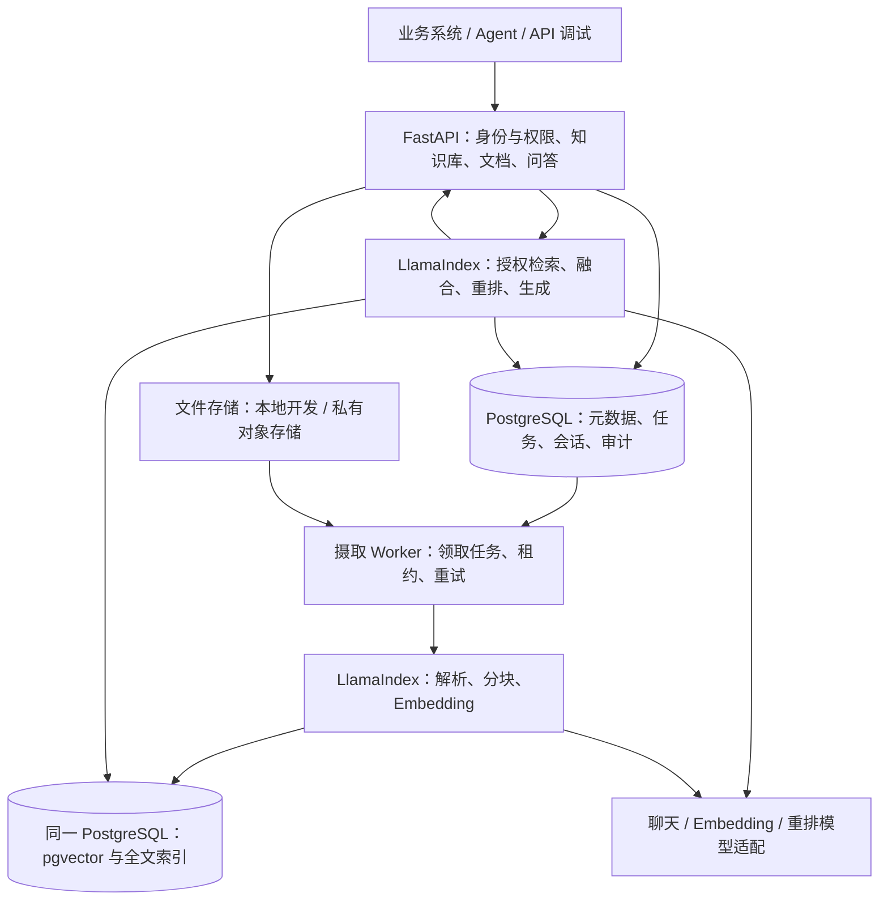
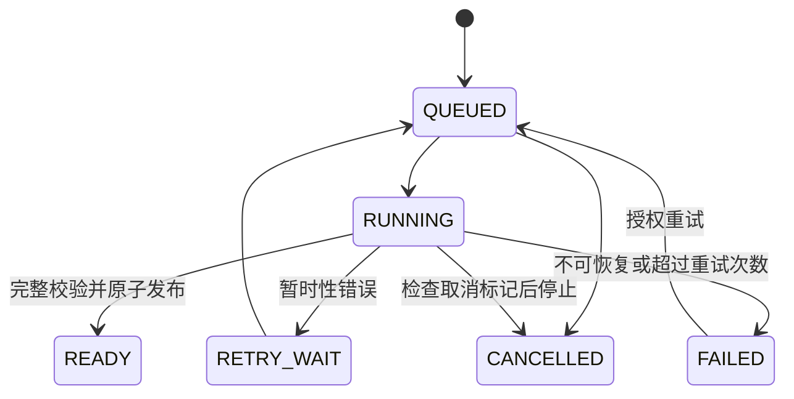
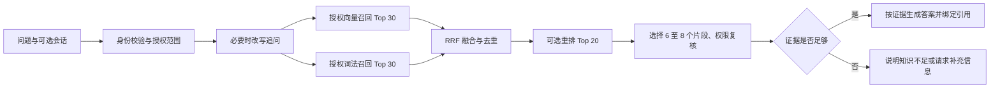

# LlamaIndex 企业知识库与 RAG 服务方案

状态：待 review · 日期：2026-09-22 · 本轮仅设计，不实现、不部署

## 1. 目标与推荐决策

在仓库根目录新增 `llamaindex_service/`，建设可独立启动、通过 API 接入业务系统的知识服务。LlamaIndex 负责文档转换、分块、检索编排和答案生成；服务自己负责权限、文档版本、任务恢复、数据持久化与审计。

推荐采用 **FastAPI + LlamaIndex + PostgreSQL/pgvector + 独立 Worker**。一期交付后端闭环，使用 OpenAPI 文档和请求样例完成体验与验收，管理前端作为后续阶段。

默认面向企业内部使用，数据模型从第一版保留租户、项目与访问权限。初始容量假设为 1 万份文档、100 万个片段、10 个并发问答；这些是设计与压测输入，不是已验证容量或性能承诺。

## 2. 一期范围

| 能力 | 一期包含 | 后续扩展 |
| --- | --- | --- |
| 知识库 | 创建、查询、更新、停用；项目内多个知识库 | 分类管理、审批发布、完整管理前端 |
| 文档 | 上传 TXT、Markdown、文本型 PDF、DOCX；处理进度、重试、替换、删除 | 扫描 PDF/OCR、复杂表格、图片与音视频 |
| 检索 | 向量与关键词召回、融合排序、可选重排、元数据过滤 | 查询扩展、复杂路由、独立搜索集群 |
| 问答 | 指定知识库/文档提问、多轮追问、SSE、引用、证据不足反馈 | 跨库智能选择、GraphRAG、Agentic RAG |
| 权限 | 验证调用身份、租户/项目隔离、知识库角色、文档可见范围 | 企业 SSO 管理、目录同步、复杂组织继承 |
| 数据来源 | 手动上传 | 飞书、Confluence、对象存储批量同步 |
| 运维 | 持久任务、故障恢复、健康检查、日志、基础指标、离线评估 | 多区域容灾与弹性调度 |

文档问答与知识库问答共用检索管线，前者增加已授权的 `document_ids` 过滤。第一版回答限定于提供的知识证据；证据不足时明确提示，不自动切换成无依据的通用回答。

## 3. 仓库适配与已有模块关系

- 根目录要求 Python 3.13+，统一使用 `uv`、根目录依赖清单、锁文件和 `.venv`。不在新目录创建第二套环境。
- 现有 `deepAgentsProject/packages/knowledge/` 已有文档版本、摄取、ACL 与引用实现。借鉴其业务边界和用例，新服务不直接依赖其内部数据库或运行时对象；本轮不迁移旧数据。
- `agent_platform/` 当前处于架构阶段，新服务保持独立。后续通过 HTTP 客户端或 `knowledge_search` 工具接入，由平台传递可验证的用户委托身份；双方不跨库读写。
- 生成模型通过 `LangChainLLM` 适配仓库已有的 `chat_models.chat.chat_model`。该对象当前使用 Responses API，需在 P0 验证 LlamaIndex 适配后的异步调用、流式输出、文本提取与 usage。
- Embedding 单独配置模型、维度、最大输入及网关地址，不能从聊天模型推断。重排模型独立配置；LLM、Embedding、Reranker 均只允许服务端管理员配置地址。
- 本服务的 RAG 编排采用 LlamaIndex，不强制引入 LangGraph。未来接入仓库 LangGraph 消费者时，其流式 API 遵循仓库的 `version="v3"` 约定；LlamaIndex 自身不套用该参数。

官方提供 `LangChainLLM` 集成，但文档示例不代表仓库当前模型组合已通过验证。[LlamaIndex LangChain 集成](https://developers.llamaindex.ai/python/framework/integrations/llm/langchain/)

## 4. 架构与技术选型



API 与 Worker 分进程，业务模块共用；优先模块化单体，不提前拆成多个微服务。

| 层次 | 推荐 | 选择理由与限制 |
| --- | --- | --- |
| API | FastAPI + Pydantic | 仓库已有依赖，支持异步、OpenAPI、SSE |
| RAG | `llama-index-core` + 按需集成包 | 明确注入模型和存储，避免隐式默认模型调用 |
| 数据 | PostgreSQL + pgvector | 同时承载业务与向量，降低一期组件数量 |
| 词法检索 | PostgreSQL 全文检索 + 应用层中文分词 | 中文和专业词必须单独验证；不把英文配置直接用于中文 |
| 任务 | PostgreSQL 持久任务表 + Worker | 与业务变更同事务落库，初期无需 Redis/Celery |
| 文件 | 本地适配用于开发；生产私有对象存储 | 元数据只保存 object key、哈希、大小和存储类型 |
| 数据访问 | SQLAlchemy + Alembic | 业务表与适配器索引表分开迁移、显式版本管理 |
| 模型 | 现有聊天模型 + 独立 Embedding/Reranker 适配 | 接入已有网关；本服务不重复建设网关与商业计费 |

LlamaIndex 提供 PostgreSQL 向量存储、混合检索与检索器组合。具体授权 SQL、中文词法处理和版本发布由本服务实现，不能仅靠打开 `hybrid_search` 完成。[Postgres Vector Store](https://developers.llamaindex.ai/python/framework/integrations/vector_stores/postgres/)

Qdrant 作为后续可替换选项：当实际压测表明数据库向量负载需要独立扩容，再评估迁移。第一版不同时维护两种生产向量存储。

## 5. LlamaIndex 的具体职责

| 阶段 | 计划使用的组件 | 服务补充的能力 |
| --- | --- | --- |
| 读取 | 文件 Reader、`Document` | 文件校验、限额、解析器选择、来源元数据 |
| 分块 | `IngestionPipeline`、结构解析器、`SentenceSplitter`、`TextNode` | 中文与章节策略、稳定 ID、来源位置 |
| 向量化 | Embedding 集成、`VectorStoreIndex` | 批量与限流、模型版本、维度校验、缓存隔离 |
| 召回 | `PGVectorStore`、自定义授权 Retriever | SQL 权限约束、活动文档版本、中文词法召回 |
| 排序 | `QueryFusionRetriever` 或等价可控 RRF、Node Postprocessor | 候选数、重排超时、片段去重与文档多样性 |
| 生成 | `RetrieverQueryEngine` / Response Synthesizer | 提示词、上下文预算、证据不足策略、流式事件 |
| 引用 | `CitationQueryEngine` 的引用组织方式与来源节点 | 稳定引用映射、权限复核、页码与版本定位 |

IngestionPipeline 支持转换、缓存及基于文档 ID/哈希的变更检测；它不替代业务任务队列与发布事务。本方案按文档版本命名 docstore/cache，增量上传不采用“本批次未出现即删除”的全量同步语义。[Ingestion Pipeline](https://developers.llamaindex.ai/python/framework/module_guides/loading/ingestion_pipeline/)

所有模型、向量存储和解析参数通过构造注入；不在请求中改写全局 `Settings`，防止不同租户或模型配置互相影响。

## 6. 文档摄取、更新与删除

### 6.1 上传与处理

1. 用户上传到指定知识库，API 先检查写权限、文件类型与大小，流式保存文件并计算 SHA-256。
2. 默认单文件上限 20 MiB，PDF/DOCX 上限 500 页；可由管理员配置。校验 MIME 与文件签名，DOCX 设置解压大小、压缩比和条目数限制。
3. 完整文件写入不可变对象路径后，在一个数据库事务中创建 `DocumentVersion` 和 `IngestionJob`，返回 `202 + document_id + version_id + job_id`。数据库提交失败产生的孤立对象由清理任务回收。
4. Worker 以 `FOR UPDATE SKIP LOCKED` 领取任务，设置租约、心跳和领取代次；执行解析 → 分块 → 向量化 → 暂存索引 → 校验 → 发布。
5. 解析保留标题层级、PDF 物理页号、段落或表格标识。DOCX 没有稳定页码时返回章节与段落，不制造页码。扫描件或空文本返回明确的“需要 OCR”状态。
6. 初始分块目标 600 token，重叠 80 token，优先遵循章节/段落边界；长表格保持表头关联。参数按评估结果调整，原文定位不因重叠丢失。



`RUNNING` 另有 `phase=VALIDATING/PARSING/CHUNKING/EMBEDDING/INDEXING/PUBLISHING` 和已完成数量，状态查询返回阶段与可解释错误，不伪造百分比。

### 6.2 幂等与故障恢复

- 同一文档内以内容哈希、parser/chunker 版本、Embedding 配置生成处理指纹。相同配置重试使用确定性的 chunk/node ID，不重复插入。
- 缓存键包含 tenant、文档版本、内容哈希和处理配置，第一版不跨租户共享内容缓存。
- Worker 租约到期可被重新领取；写入和发布都校验领取代次，旧 Worker 不能在新 Worker 接管后发布结果。
- 暂时性网络错误采用有上限的退避重试；格式错误、无权限、超限不会无限重试。重复 Embedding 请求仍可能发生，记录实际调用次数和 usage，不承诺外部调用 exactly-once。
- API 不使用进程内 BackgroundTasks 承担持久摄取，进程退出后任务必须可恢复。

### 6.3 版本发布与可见性

`Document` 保存当前活动版本。新版本的片段、全文数据和向量先以不可见状态完整写入，最后由业务事务切换 `active_version_id`。查询 SQL 必须关联活动版本与未删除状态；适配器独立提交的暂存向量不能直接被查询看到。

更新期间旧版继续可查，新版失败不会破坏旧版。并发替换使用文档更新序号与 compare-and-set，较旧任务晚完成时不能覆盖较新版本。一次问答记录实际使用的 document_version_ids 和 retrieval_profile_id，生成过程中固定证据集合。

Embedding 模型或维度变化创建新的 `IndexGeneration`，完整重建并校验后切换活动索引代次。查询向量与文档向量使用同一模型配置；不得混用不同维度或模型的向量。

### 6.4 删除

删除请求事务内设置不可见标记并创建清理任务，从该事务提交后的新请求开始不再召回该文档。物理删除原文、片段、向量、缓存由 Worker 重试执行，接口可查询清理结果。

下载、引用解析、向模型发送上下文前重新检查文档状态与权限；已经发送给模型或用户的内容无法撤回。在途流式请求在检查到删除或撤权时停止后续输出，不能承诺收回已输出的 token。历史引用保留文档标识，但不能再读取已删正文。备份按保留周期过期，物理删除完成不等于备份即时清除。

## 7. 检索与问答链路



- 词法召回：中英文混合文本先经固定版本分词器处理，原文与索引文本分开保存；产品代码、接口路径等额外保留精确匹配字段。中英文测试集通过后才确定分词方案，PostgreSQL FTS 不称作 BM25。
- 权限条件在两路召回 SQL 中均生效，融合、重排和发送模型前再次校验。不允许先从全库取正文，再在应用层删除越权结果。
- 为 PGVectorStore 编写受控适配层，让 tenant/project、知识库 ACL、文档 ACL、active_version、index_generation 条件进入查询。P0 检查生成 SQL 和查询计划，默认元数据过滤能力不等于完整授权。
- ANN 在过滤条件下可能返回不足数量；在固定检索预算内增加扫描或回退至授权集合的精确检索，禁止去掉权限条件补足数量。pgvector 官方说明了近似索引过滤与 iterative scan 行为。[pgvector 官方说明](https://github.com/pgvector/pgvector)
- 向量召回和词法召回初值各 30，融合后最多 20 个进入重排，最终 6–8 个进入上下文。数量与上下文 token 上限由检索配置统一管理。
- 重排默认可关闭，超时可退回融合结果并记录降级；Embedding 或生成模型故障返回可重试错误，不把系统故障伪装成“知识库无答案”。
- 追问改写仅使用有权限的会话内容，每轮重新检索；历史助手回答不能作为知识事实依据。历史内容及摘要记录来源版本，相关来源撤权后该部分不再进入模型。
- 空召回或校准后的相关性不足时不生成事实答案；不能跨模型套用固定相似度阈值。存在冲突证据时展示差异及版本，不自行决定哪个事实正确。

### 7.1 引用与流式返回

引用结构包含 `citation_id / document_id / version_id / chunk_id / title / page_or_section / excerpt`。服务端只接受本次授权证据中存在的 citation ID，来源链接由鉴权下载接口生成，不接受模型编造 URL。

LlamaIndex 的 CitationQueryEngine 可作为引用编排基础，但引用编号存在不代表语义受到原文支持，仍需评估和人工抽检。[CitationQueryEngine](https://developers.llamaindex.ai/python/examples/query_engine/citation_query_engine/)

SSE 事件建议为 `retrieval → citations → delta → done`，异常以 `error` 结束；返回 `request_id`、事件序号、实际索引代次与最终 usage。先冻结并返回可用证据映射，流式正文视为生成中的草稿，`done` 才表示完整答案。若最终引用检查失败，明确标记答案无效，不能承诺已流出的草稿全部有效。

客户端断开时取消上游请求并记录 interrupted 状态；一期不承诺 SSE 断点续传，不自动重新生成造成重复费用。读取保存结果会重新检查会话和来源权限。

## 8. 权限与企业数据边界

身份接口抽象为 `AuthContext(tenant_id, project_id, user_id, roles)`。生产接入经过签名、issuer、audience 和有效期验证的 JWT；租户、项目成员关系由可信服务端记录确认。开发可提供仅 localhost 生效的固定身份模式，生产启动必须关闭。

知识库角色采用 Owner / Editor / Reader，文档可继承知识库权限或进一步收窄至指定成员/角色；文档授权不能扩大知识库授权。客户端传入 tenant 或 user ID 不能改变身份。

授权覆盖列表、检索、上传、下载、引用、任务状态、会话、反馈和审计。存储查询统一带租户/项目边界，复合外键阻止跨租户关联；核心业务表启用 RLS 作为第二层保护，生产连接不使用表 owner 或 BYPASSRLS，连接池使用事务局部身份上下文。

文档和用户输入是非可信内容。检索文本只作为证据，不允许其中指令改变系统策略、触发工具或外部请求。一期不执行文档中的代码、宏或链接，解析在受限 Worker 子进程中执行并限制 CPU、内存与超时。

模型调用会发送检索片段到配置的模型端点。企业资料是否允许离开内网需在部署前确定；默认开发样例使用无敏感信息数据，生产端点由管理员白名单管理。日志默认不记录正文、问题、回答或密钥，会话内容按租户保留策略单独保存。

## 9. 数据模型

所有业务实体带 tenant_id、project_id、created_at；对外 ID 不替代权限检查。

| 实体 | 关键字段与用途 |
| --- | --- |
| KnowledgeBase | 名称、状态、权限配置、当前检索配置、active_index_generation_id |
| Document | kb_id、逻辑名称、active_version_id、update_sequence、deleted_at、ACL |
| DocumentVersion | document_id、内容哈希、object_key、大小、解析/分块配置、处理状态 |
| IndexGeneration | kb_id、Embedding 模型/修订/维度、构建状态、激活时间 |
| Chunk / Vector | version_id、generation_id、稳定 node_id、正文、来源位置、哈希、向量 |
| IngestionJob | version_id、状态、阶段、领取代次、租约、重试次数、错误码 |
| RetrievalProfile | 召回数量、融合与重排参数、上下文上限、提示词版本 |
| Conversation / Message | 会话所有者、知识库范围、内容、来源依赖、保留期限 |
| QueryRun / Citation | request_id、配置快照、来源版本、引用、状态、分阶段耗时、usage |
| Feedback / AuditEvent | 评价、问题分类；操作者、动作、目标、结果、时间 |

LlamaIndex 的内部序列化结构不是对外 API。业务表作为事实来源，向量和词法索引可依据原文与配置重建。内部 Node ID 与业务 chunk ID 显式映射。

## 10. API 草案

前缀 `/api/v1`，知识库与文档列表均分页，错误统一为 `code/message/request_id/details`。资源不存在或调用者不可见时统一返回 404；已知可见资源的操作权限不足返回 403。

| 方法与路径 | 作用 |
| --- | --- |
| `POST /knowledge-bases` | 创建知识库 |
| `GET /knowledge-bases` | 查询有权访问的知识库 |
| `GET/PATCH /knowledge-bases/{kb_id}` | 查看、修改名称/配置/状态 |
| `GET/PUT /knowledge-bases/{kb_id}/permissions` | 查看、修改知识库成员权限 |
| `POST /knowledge-bases/{kb_id}/documents` | multipart 上传，返回 202 与任务信息 |
| `GET /knowledge-bases/{kb_id}/documents` | 查看文档与处理状态 |
| `POST /documents/{document_id}/versions` | 上传替换版本，原版本持续可查 |
| `PATCH /documents/{document_id}/permissions` | 收窄文档访问范围 |
| `DELETE /documents/{document_id}` | 立即逻辑删除并异步清理，返回 202 |
| `GET /documents/{document_id}/versions/{version_id}/content` | 权限校验后下载 |
| `GET /jobs/{job_id}` | 查看处理阶段、错误或清理结果 |
| `POST /jobs/{job_id}/retry` | 授权重试失败任务 |
| `POST /retrieval/search` | 纯检索，供业务系统或 Agent 使用 |
| `POST /answers` | 单轮或多轮问答，JSON/SSE |
| `POST /conversations` | 创建用户会话，绑定知识库范围 |
| `GET/DELETE /conversations/{conversation_id}` | 获取授权历史或删除会话 |
| `POST /answers/{request_id}/feedback` | 提交效果反馈 |
| `GET /health/live`、`GET /health/ready` | 进程与依赖就绪检查 |

检索请求核心字段：`knowledge_base_ids`、可选 `document_ids`、`query`、受限 `top_k`、白名单元数据过滤。问答增加 `conversation_id` 和 `stream`。tenant/user、模型地址、原始 SQL 与任意系统提示词不属于客户端可覆盖参数。

上传、重试、问答支持带作用域的 `Idempotency-Key`；同 key 不同请求体返回 409。问答重试查询已有执行状态或结果，不重新触发生成；中断结果明确返回 interrupted。服务端限制问题长度、文件大小、上传速率和租户/用户并发，限流返回 429。

## 11. 后续目录规划

以下仅为实现规划；当前仅 README 和本文已创建。

```text
llamaindex_service/
├── README.md
├── docs/
│   ├── architecture.md
│   └── api-examples.md
├── app.py                    # FastAPI 入口
├── config.py                 # 配置、模型和存储依赖注入
├── api/                      # 路由、请求响应模型、SSE
├── auth/                     # 身份、权限、数据库访问范围
├── domain/                   # 知识库、文档、任务、问答服务
├── ingestion/                # Reader、分块、摄取、版本发布
├── retrieval/                # 授权召回、融合、重排
├── generation/               # 模型适配、上下文、引用
├── persistence/              # 业务 Repository、pgvector 适配
├── storage/                  # 本地与对象存储接口
├── workers/                  # 领取、租约、重试、清理
├── migrations/               # 本服务 schema 迁移
├── evaluation/               # 无敏感数据的评测集与评测入口
├── tests/                    # 单元、权限、恢复、集成测试
└── deploy/                   # 容器、Compose、配置样例
```

依赖候选：`llama-index-core`、`llama-index-readers-file`、`llama-index-vector-stores-postgres`、`llama-index-llms-langchain`、选定 Embedding 适配包，以及必要的文件解析/分词依赖。P0 使用根目录 `uv lock` 验证 Python 3.13 与现有 LangChain/OpenAI 依赖组合后锁定版本，不提前写死未经验证的“最新版”。

## 12. 部署与可观测性

开发部署：API + Worker + PostgreSQL/pgvector，本地文件目录作为共享 volume，使用已有模型网关；不依赖 Redis 或新建模型平台。部署构建从仓库根目录使用统一锁文件，包含本服务与需要的共享聊天模型模块。

生产部署：API 无状态多副本、Worker 独立扩容、托管 PostgreSQL 或自管备份、私有对象存储。模型网关按现有环境接入，数据库和对象存储不给终端用户直连权限。迁移作为单独步骤执行，API readiness 检查 schema 和活动索引兼容性。

观测项：摄取排队/阶段耗时、失败率、租约恢复、片段数、查询各阶段耗时、首 token 延迟、空召回率、证据不足率、引用检查失败、模型 usage、清理积压。使用 request_id/job_id 串联日志，不写敏感正文。

PostgreSQL 与原文对象均需备份，恢复演练校验对象、活动版本及索引一致性。向量可以重建，原文和业务元数据不能仅依赖缓存。管理端配置保留期限，并提供过期数据清理任务。

## 13. 实施阶段与验收

| 阶段 | 交付 | 通过条件 |
| --- | --- | --- |
| P0：兼容与效果探针 | 根环境依赖验证、模型适配、pgvector、中文样例、权限 SQL | 真实异步/流式调用与 usage 可用；SQL 包含授权及版本约束；分词与候选模型完成小样本比较 |
| P1：文档闭环 | 知识库、权限、上传、Worker、版本、删除、纯检索 API | 上传后可查；重启恢复；重复处理无重复数据；旧 Worker 无法发布；更新失败不影响旧版 |
| P2：问答闭环 | 混合检索、可选重排、引用、SSE、多轮问答、反馈 | 引用可定位；无证据不编造；越权与删除不泄漏；断流和上游故障状态明确 |
| P3：部署与质量 | Compose、运行文档、评估报告、备份恢复与压测 | 冻结样本达标；容量和延迟报告可复现；故障恢复与数据清理通过 |

评估集建议至少 100 条中英文真实业务问题的脱敏版本，人工标注相关文档/片段及参考答案，覆盖专业编号、同义表达、多文档综合、无答案、冲突版本与追问；划分调参集和保留测试集。

初始质量门槛建议：保留集 Recall@10 ≥ 85%；答案事实支持率 ≥ 90%；引用对应正确率 ≥ 95%；无答案问题正确拒答率 ≥ 90%。事实支持率按可核验事实声明统计，引用正确率按引用确实支持其关联声明统计；模型评委只辅助，最终人工抽检。这些阈值待 review 后冻结，不代表框架默认效果。

硬性正确性门槛：租户/项目/文档越权测试零泄漏；删除提交后的新请求零召回；更新发布不出现半成品；同一版本重试零重复片段；索引模型错配明确拒绝。

性能目标先作为试运行目标：10 并发、最多 100 万片段、预热且相同硬件条件下，检索链路 P95 ≤ 2 秒、首 token P95 ≤ 5 秒。检索计时包含查询 Embedding 和开启的重排，首 token 包含生成模型等待；记录硬件、模型部署、网络和冷启动差异，在 P0/P3 实测后修订。大文件摄取采用吞吐量与排队时长衡量，不保证固定完成秒数。

## 14. Review 决策表

| 事项 | 本方案建议 | 对实施的影响 |
| --- | --- | --- |
| 服务形态 | 独立后端；一期无管理前端 | 优先交付可被多个业务系统复用的 API |
| 数据库 | PostgreSQL + pgvector | 一套数据库承载元数据与检索，后续按压测决定是否拆分 |
| 文档来源 | 手动上传 TXT/MD/文本 PDF/DOCX | 飞书同步、OCR、复杂表格单独排期 |
| 模型 | 复用现有聊天配置；Embedding/重排另选 | 开发前确认可用端点、Embedding 模型与企业数据外发边界 |
| 权限 | 租户/项目/知识库/文档四层约束 | 独立身份适配，后续对接 Agent 平台 |
| 部署 | 本地 Compose 开发；生产对象存储 | 生产云厂商、认证 issuer 和存储参数在部署阶段确定 |
| 与已有项目关系 | 独立新服务，后续 API 集成 | 一期不承担旧知识库迁移或 Agent 平台改造 |

优先 review：一期是否只做后端、是否接受 PostgreSQL/pgvector、首批文档是否必须包含飞书同步或扫描 PDF，以及模型是否必须完全内网运行。以上建议尚未视为用户已批准的实现范围。

## 15. 参考与验证边界

官方资料于 2026-09-22 查阅，用于确认组件职责与可集成方向；任务队列、权限、版本发布、API 和验收标准属于本方案设计，不是 LlamaIndex 自动提供的产品能力。文中组件和接口以 P0 锁定版本及验证结果为准，本轮没有安装依赖、运行模型或进行性能测试。

- [LlamaIndex Ingestion Pipeline](https://developers.llamaindex.ai/python/framework/module_guides/loading/ingestion_pipeline/)
- [LlamaIndex PostgreSQL Vector Store](https://developers.llamaindex.ai/python/framework/integrations/vector_stores/postgres/)
- [LlamaIndex CitationQueryEngine](https://developers.llamaindex.ai/python/examples/query_engine/citation_query_engine/)
- [LlamaIndex LangChain LLM](https://developers.llamaindex.ai/python/framework/integrations/llm/langchain/)
- [pgvector 官方仓库与过滤说明](https://github.com/pgvector/pgvector)
