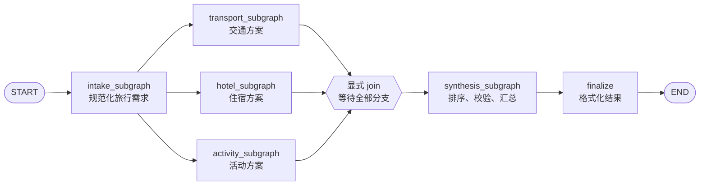
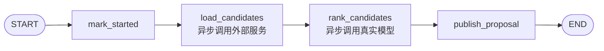
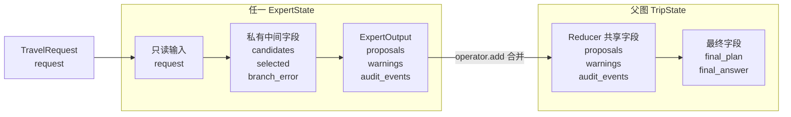
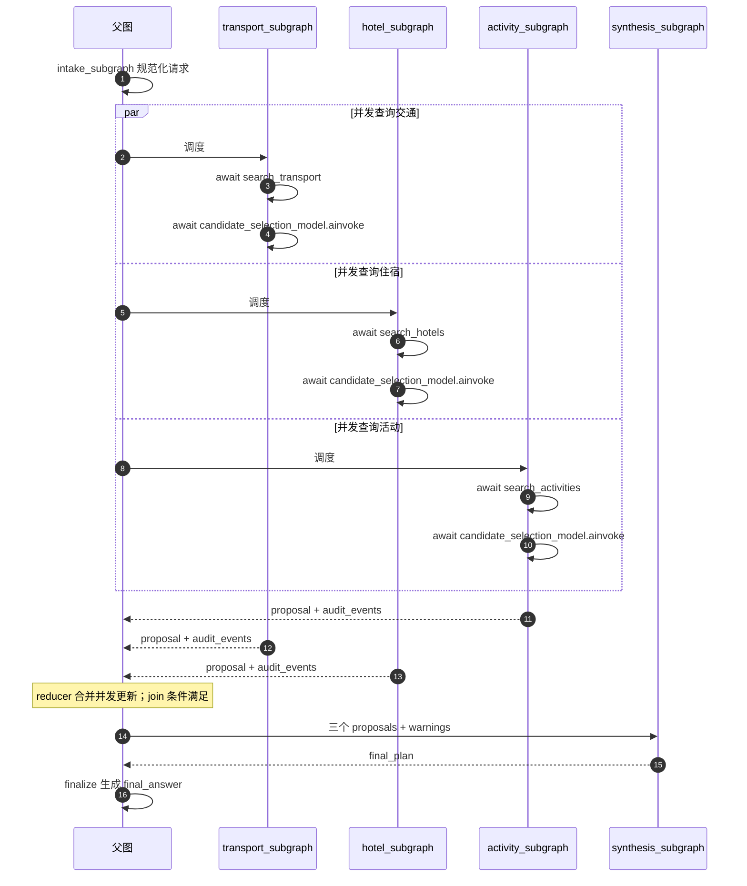
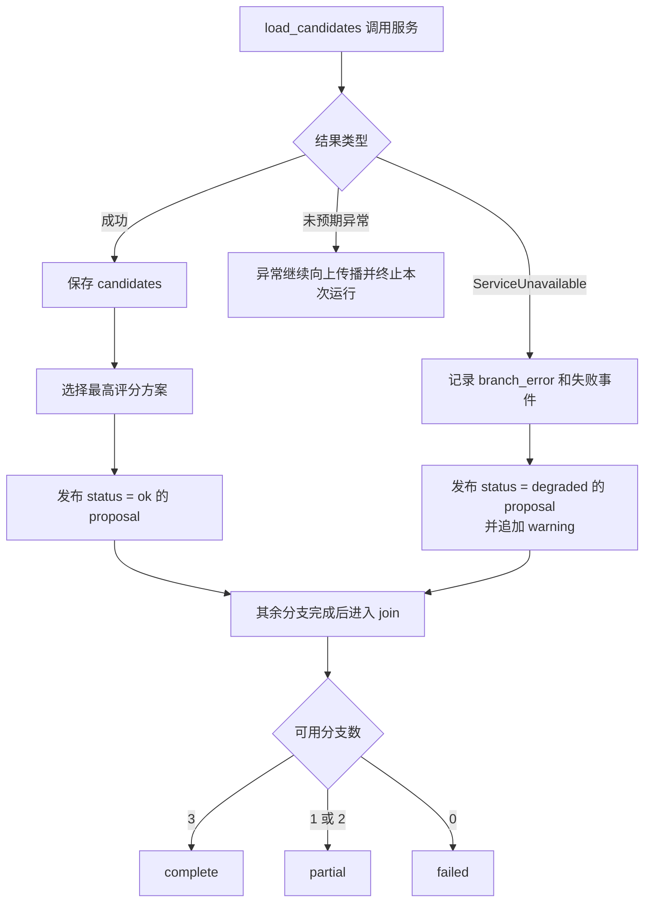

# 并发 Subgraph 旅行规划 Demo：设计文档

## 1. 背景

`subgraph_demo2` 中的父图通过普通包装节点调用 `subgraph.invoke()`，并且需求解析、菜单规划和格式化之间是线性依赖。它能说明父子状态映射，但不能完整展示编译子图作为一等节点时的并发调度、共享状态归并和 join 行为。

本 demo 新建独立模块，不修改原示例。它使用具有可控延迟的异步服务模拟交通、住宿和活动三个远程系统；每个专家获得候选项后，通过项目现有的 `chat_model` 配置真实调用模型选择方案。

## 2. 目标

- 父图直接挂载编译后的子图，不在包装节点中再次调用 `.invoke()`。
- 在一次运行中并发执行三个互不依赖的专家子图。
- 展示只读共享输入、reducer 共享输出和子图私有状态三种状态边界。
- 等待所有并发分支完成后只执行一次汇总子图。
- 展示子图事件流及真实交错的完成顺序。
- 单个外部服务失败时局部降级，不终止其他并发分支。
- 通过离线测试确定性地证明并发，而不是只依赖耗时推断。

## 3. 非目标

- 不连接真实交通、酒店或票务 API；候选数据仍由可控的模拟服务提供。
- 不演示跨进程消息队列或分布式任务调度。
- 不演示 checkpoint、人工审批和跨运行持久化；这些能力可以作为后续扩展。

## 4. 场景和拓扑

输入是一份结构化旅行需求。`intake_subgraph` 先规范化城市和兴趣字段，然后父图同时调度三个专家子图：



每个专家子图内部仍然是有依赖关系的串行步骤：



因此，该拓扑同时展示了“父图分支之间并发”和“单个子图内部按依赖串行”两种执行关系。

父图使用列表形式的边：

```python
builder.add_edge(
    ["transport", "hotel", "activity"],
    "synthesis",
)
```

它表示显式 join：三个上游节点全部完成后，才允许执行一次 `synthesis`。

## 5. 子图必须是一等节点

父图直接注册已经编译的子图：

```python
builder.add_node("transport", transport_subgraph)
builder.add_node("hotel", hotel_subgraph)
builder.add_node("activity", activity_subgraph)
```

不存在以下包装调用：

```python
def run_transport(state):
    return transport_subgraph.invoke(...)
```

这样 LangGraph 可以统一负责并发调度、namespace、嵌套事件和异常传播。

## 6. 状态模型

### 6.1 只读共享输入

`TravelRequest` 是三个专家共同读取的业务上下文。专家子图的 `input_schema` 只包含 `request`，而其 `output_schema` 不包含 `request`。

这项限制很重要：编译子图作为节点执行时会返回其输出状态。如果多个并发子图都把未改变的 `request` 写回父图，普通的 last-value channel 会在同一个 superstep 收到多个值并触发 `INVALID_CONCURRENT_GRAPH_UPDATE`。

### 6.2 reducer 共享输出

三个专家都可以写入：

```python
proposals: Annotated[list[Proposal], operator.add]
warnings: Annotated[list[str], operator.add]
audit_events: Annotated[list[AuditEvent], operator.add]
```

这些字段在父状态和专家输出 schema 中使用相同 reducer。并发更新在 superstep 结束时合并，不发生相互覆盖。

### 6.3 子图私有状态

专家内部字段包括：

- `candidates`
- `selected`
- `branch_error`

它们存在于 `ExpertState`，但不在 `ExpertOutput` 和 `TripState` 中，因此不会泄漏到父图。

`intake_subgraph` 的 `normalized_request`、`synthesis_subgraph` 的 `ordered_proposals` 和 `derived_warnings` 同样属于私有状态。

下面的状态边界图展示了字段在哪一层可见，以及专家子图只把公共输出写回父状态：



`request` 只通过 `ExpertInput` 进入专家子图；`candidates`、`selected` 和 `branch_error` 不属于 `ExpertOutput`，因此不会进入父图。三个分支对 reducer 字段的更新在同一 superstep 结束时合并。

## 7. 异步并发与事件流

三个模拟服务都提供异步查询方法并具有不同延迟。候选项加载完成后，三个 `rank_candidates` 节点分别通过 `candidate_selection_model.ainvoke(...)` 调用真实模型。入口使用 `graph.astream(..., subgraphs=True, stream_mode="updates")`，输出 namespace、节点和更新字段。

可观测事件只是展示手段，不作为并发正确性的唯一证据。测试中的 `BarrierServices` 在三个查询都到达同一个 `asyncio.Barrier` 后才允许任何一个继续；如果父图串行调用子图，测试会超时失败。



上图中的返回顺序对应默认模拟延迟（活动 0.25 秒、交通 0.45 秒、住宿 0.70 秒）；业务汇总仍按固定的交通、住宿、活动顺序进行，不依赖实际完成先后。

## 8. 汇总和确定性

Reducer 负责保证所有结果都被保留，但业务结果不依赖并发完成顺序。`synthesis_subgraph` 按固定顺序 `transport -> hotel -> activity` 排列提案，然后计算：

- 可用模块数量
- 预计总费用
- 剩余预算
- 超预算提示
- 完整、部分或失败状态

最终文本只读取 `TravelPlan`，因此不同的服务完成顺序不会改变输出结构。

## 9. 故障策略

每个专家只捕获预期的 `ServiceUnavailable`：

- 失败分支发布一个 `degraded` 提案和 warning。
- 其他两个分支继续执行。
- 汇总阶段根据可用分支数量产生 `complete`、`partial` 或 `failed` 状态。
- 未预期的编程错误不被吞掉，仍然使图运行失败，便于排查。



## 10. 文件结构

```text
subgraph_concurrent_demo/
├── __init__.py
├── design.md       # 本文档
├── graph.mmd       # 完整 Mermaid 拓扑
├── main.py         # 子图、父图、事件流和 CLI
├── models.py       # Pydantic 模型及 TypedDict 状态契约
├── services.py     # 可控延迟和故障的异步模拟服务
└── test_demo.py    # 并发、reducer、隔离、join 和降级测试
```

## 11. 验收标准

- 源码中不存在对子图的手动 `.invoke()` / `.ainvoke()` 包装调用。
- 正常运行产生交通、住宿、活动三个提案。
- Barrier 测试可以在超时前完成，证明三个服务调用确实重叠。
- 父图最终状态不包含任何子图私有字段。
- 一个服务失败时最终状态为 `partial`，另外两个结果仍然存在。
- 所有分支完成后才进入汇总阶段，最终提案顺序固定。
- 默认命令行运行时，三个专家分支分别通过 `chat_model` 执行一次真实模型调用。
- 单元测试通过依赖注入使用确定性选择器，避免测试请求真实接口。
