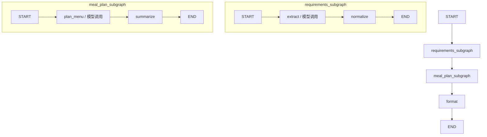

# 家庭晚餐计划助手：LangGraph Subgraph 学习 Demo

用户输入人数、现有食材和限制条件，程序通过项目已有的 `from chat_models.chat import chat_model` 解析需求、规划菜单，输出食材、做法、预计耗时和提示。无前端。

## 工作流

```text
主图: START -> requirements_subgraph -> meal_plan_subgraph -> format -> END
需求子图: START -> extract（模型调用）-> normalize（去重）-> END
菜谱子图: START -> plan_menu（模型调用）-> summarize（计算）-> END
```

一次运行调用模型两次。两个子图顺序执行，因为规划菜单依赖解析后的需求。模型通过 `with_structured_output` 返回 Pydantic 对象。保留每个子图两个节点，控制学习规模。

## 图可视化



主图通过包装节点调用两个子图；子图内部的模型节点分别是 `extract` 和 `plan_menu`。

## 状态与职责

- 主图：`user_input`、`requirements`、`meal_plan`、`final_answer`。
- 需求子图：`extracted` 是内部中间结果；归一化后的 `requirements` 返回主图。未提供的人数和时限为 `None`。
- 菜谱子图：`menu` 是模型生成的内部结果；Python 汇总耗时、比较食材，生成 `meal_plan` 返回主图。
- 父子状态不同：主图包装节点调用编译后的子图 `.invoke()`，显式映射输入输出，不将内部状态整体透传。
- `format` 用 Python 格式化最终结果，无额外模型调用。

## 运行

复用仓库依赖和 `chat_models/chat.py` 配置，在 `.env` 设置 `OPENAI_API_KEY`、`OPENAI_BASE_URL` 和 `MODEL`。模型服务需支持当前配置的 Responses API 和 JSON Schema 结构化输出。

```bash
uv run python -m subgraph_demo2.main
uv run python -m subgraph_demo2.main "三位大人，有豆腐、青菜和盐，不吃辣，25分钟内完成"
```

运行需要访问真实模型服务；调用或结构化校验失败时直接报错，不回退到固定菜谱。可在 Python 中通过 `build_graph().invoke({"user_input": "..."})` 查看包含需求、方案和最终文本的完整状态。

## 边界

总耗时按一个人顺序制作累加，属于估算。超过用户时限会明确提示；不会无限重新规划。缺少食材按统一中文名称集合比较，不核算库存数量。菜谱、食材别名及饮食适配依赖模型输出，Pydantic 校验结构，不能证明业务内容正确。

参考：[LangGraph 子图的不同状态映射](https://docs.langchain.com/oss/python/langgraph/use-subgraphs#different-state-schemas)。
