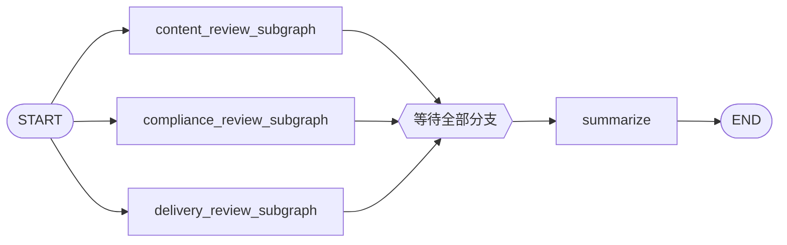
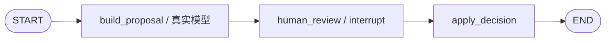

# 三个并发子图中的 Interrupt：设计方案

## 1. 目标

本示例演示父图并发调度三个一等子图，并在每个子图内部使用动态 `interrupt()` 请求
人工审核。三个决定全部返回后，父图通过显式 join 进入一次性汇总。

示例重点是三个子图并发调用真实模型、子图级 checkpoint namespace、多个并行
interrupt 的识别与恢复，以及人工决定进入业务状态的完整路径；不执行外部发布副作用。

## 2. 拓扑



三个子图分别处理内容、合规和发布设置，但内部拓扑一致：



父图直接把三个已编译子图注册为节点。子图之间没有 `.invoke()` 包装，因此 LangGraph
可以建立独立 checkpoint namespace，并在同一 superstep 中并发调度它们。

每个 `build_proposal` 节点分别调用项目 `chat_models.chat.chat_model`，并通过
`with_structured_output(GeneratedProposal)` 获得模型生成的标题、待审方案和人工关注点。
内容、合规和发布三个分支使用不同角色提示，但不提供写死的业务结果或静态 fallback。
单元测试通过 `ProposalBuilder` 依赖注入使用确定性替身，避免测试消耗真实接口。

## 3. Interrupt 协议

每个 `human_review` 节点发送 JSON 可序列化 payload：

```json
{
  "kind": "human_review",
  "branch": "content",
  "title": "内容审核",
  "proposal": {},
  "allowed_decisions": ["approve", "edit", "reject"]
}
```

第一次运行结束时应得到三个具有唯一 ID 的 interrupt。客户端不能依赖它们的到达顺序，
而是收集所有回答后按 ID 恢复：

```python
Command(
    resume={
        content_interrupt_id: {"type": "edit", "replacement": "..."},
        compliance_interrupt_id: {"type": "approve"},
        delivery_interrupt_id: {"type": "reject", "reason": "..."},
    }
)
```

支持三种决定：

- `approve`：原方案成为最终值；
- `edit`：人工 replacement 成为最终值；
- `reject`：该分支没有最终值，且父图阻止发布。

CLI 在提交 `Command` 前用 Pydantic 校验人工输入，避免用无效决定恢复 checkpoint。

## 4. 持久化与重放安全

父图使用 SQLite checkpointer，并通过 `thread_id` 定位会话。子图编译时不指定自己的
checkpointer，从父图继承持久化能力。进程退出后，用相同数据库和 thread ID 调用
`graph.invoke(None, version="v2")` 可重新取得相同的待处理 interrupt。

Checkpoint serializer 只允许反序列化本示例明确列出的 Pydantic 类型，不使用默认的
宽松任意类型反序列化设置。

LangGraph 恢复 interrupt 时会从 `human_review` 节点开头重新执行。因此该节点在
`interrupt()` 之前只读取状态和构造 payload，不发送网络请求、不写文件，也不产生其他
非幂等副作用。方案生成位于前一个已经 checkpoint 的节点中。

## 5. 状态边界

父图只保存：

- 不可变请求 `request`；
- reducer 合并的 `review_results`；
- reducer 合并的 `audit_events`；
- join 后产生的 `final_summary`。

子图内部的 `proposal` 和 `decision` 不属于输出 schema，因此不会泄漏到父状态。并发
子图不会返回 `request`，避免普通 last-value channel 在同一 superstep 被写入三次。

## 6. 汇总规则

汇总节点按固定顺序 `content -> compliance -> delivery` 排列结果，避免并发完成顺序影响
输出。只有三个结果齐全且没有 `rejected` 时，`ready_to_publish` 才为 `true`；`edit` 被视为
人工审核通过，但保留 `edited` 状态以便审计。

## 7. 验收标准

- 父图恰好包含三个并发的一等子图；
- 默认运行时三个子图各自完成一次真实结构化模型调用；
- Barrier 测试通过注入替身证明三个方案生成任务确实重叠；
- 初次运行返回三个唯一 interrupt，汇总尚未执行；
- 回答顺序变化时，决定仍按 interrupt ID 进入正确分支；
- approve、edit、reject 产生预期业务结果；
- 三个分支恢复完成后汇总只执行一次；
- SQLite 中的待处理会话可在进程重启后恢复；
- 父状态不包含子图私有字段；
- interrupt 前没有非幂等副作用；
- 离线单元测试全部通过。
